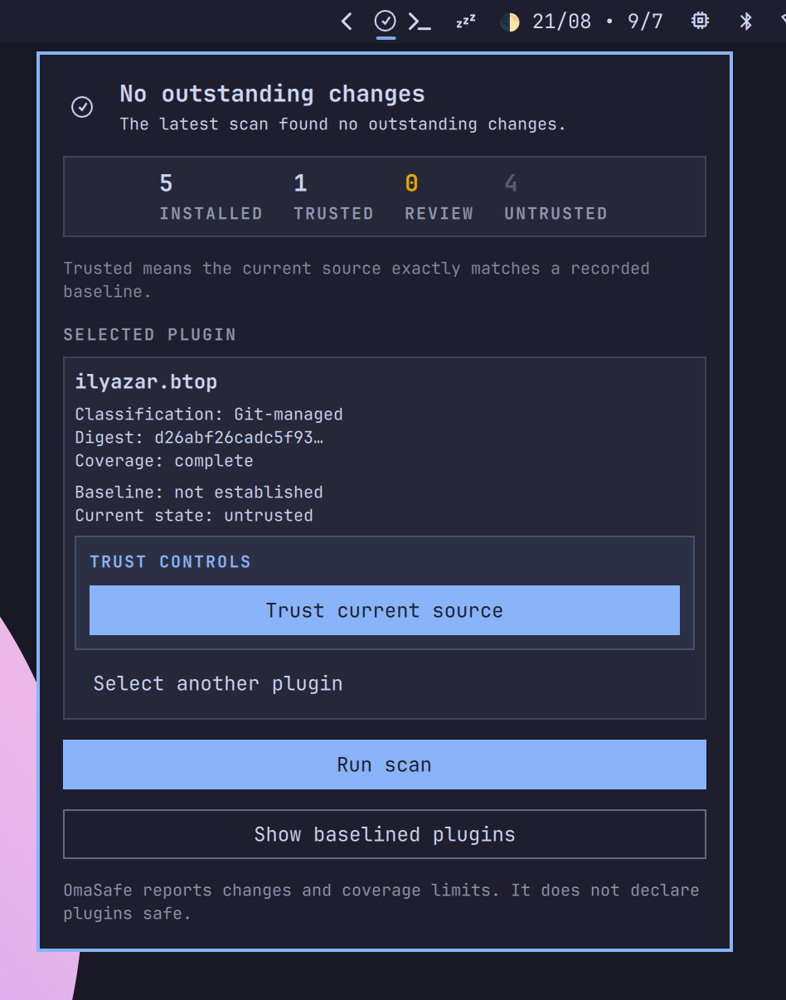
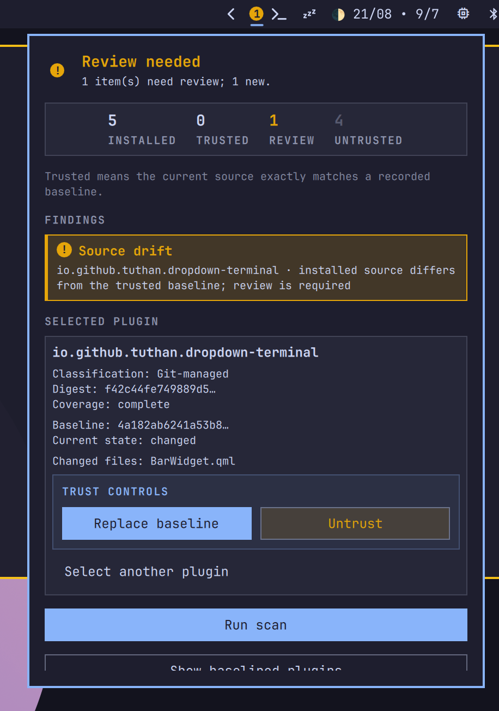
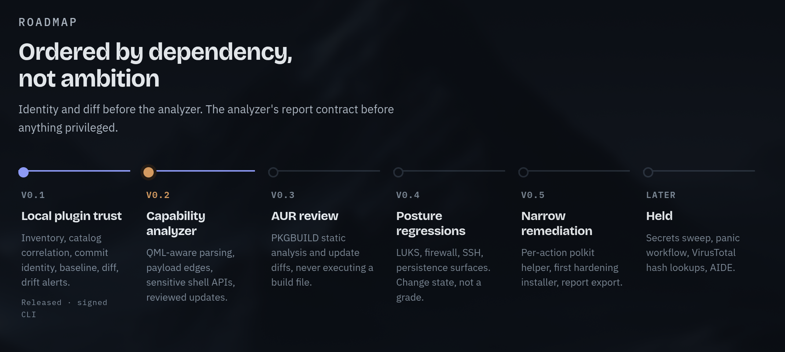

# OmaSafe Omarchy plugin

OmaSafe is an Omarchy bar widget and review panel. It displays scan state and
opens the review panel; the scanning engine is the separate `omasafe-cli`
binary maintained in the main OmaSafe repository.

The plugin runs as unsandboxed QML inside `omarchy-shell`. Review the source
before enabling it. The plugin does not download, install, or execute a release
asset at runtime. Installing the plugin and installing the CLI are intentionally
separate operations.

The plugin id is `io.github.tuthan.omasafe`.

Visit the [OmaSafe landing page](https://tuthan.github.io/omasafe/) for the
project overview and roadmap.

## Screenshots and demo

<table>
  <tr>
    <td align="center"><strong>Clean scan state</strong><br></td>
    <td align="center"><strong>Review-needed state</strong><br></td>
  </tr>
</table>

<p align="center">
  
</p>

<p align="center"><strong>Demo video</strong></p>

<video src="media/video.mp4" controls width="720">
  <a href="media/video.mp4">Watch the OmaSafe demo video</a>
</video>

## Requirements

- Omarchy with shell plugin support
- `omasafe-cli` installed and available on the `omarchy-shell` session `PATH`

It is valid to install this plugin before the CLI. Until the CLI is available,
the widget shows `CLI` and does not imply that the system is clean.

## Install the CLI

Download the matching `omasafe-cli-<version>-x86_64-unknown-linux-gnu.tar.gz`
archive and its `.sha256` file from the [OmaSafe GitHub releases](https://github.com/tuthan/omasafe/releases).
Verify the checksum, extract the archive, and install the binary in a location
visible to the graphical Omarchy session. For a per-user install:

```sh
tar -xzf omasafe-cli-<version>-x86_64-unknown-linux-gnu.tar.gz
install -Dm755 omasafe-cli-<version>-x86_64-unknown-linux-gnu/omasafe-cli \
  "$HOME/.local/bin/omasafe-cli"
```

The plugin checks `~/.local/bin/omasafe-cli`, `/usr/local/bin/omasafe-cli`,
`/usr/bin/omasafe-cli`, and finally the `omarchy-shell` session `PATH`. If you
install elsewhere, move the binary to one of those locations or update the
session environment and restart the shell. Verify the dependency before
expecting scan results:

```sh
command -v omasafe-cli
omasafe-cli --version
omasafe-cli scan --format json
```

Periodic scanning is disabled by default. Enable `Enable periodic scans` in the
plugin's bar-widget settings if desired, then choose `Periodic scan interval
(minutes)` (1–1440 minutes). Manual scans remain available by clicking the
widget.

The scan may exit with status `0` (quiet) or `3` (findings); both statuses are
successful JSON-producing results. The CLI creates its XDG configuration, state,
and cache directories automatically on first use:

```text
${XDG_CONFIG_HOME:-~/.config}/omasafe
${XDG_STATE_HOME:-~/.local/state}/omasafe
${XDG_CACHE_HOME:-~/.cache}/omasafe
```

## Install

Install from the published git repository or the Omarchy plugin marketplace.
The marketplace/plugin installation does not install `omasafe-cli` for you.
Replace the URL below with the repository URL if it changes:

```sh
omarchy plugin add https://github.com/tuthan/omasafe-plugin.git --enable
```

The command clones the repository into:

```text
~/.config/omarchy/plugins/io.github.tuthan.omasafe/
```

Without `--enable`, install first, review the checkout, then enable it:

```sh
omarchy plugin enable io.github.tuthan.omasafe --section right
```

The `right` placement matches this plugin's manifest default. Use
`omarchy plugin list` to confirm the installed id and enabled state.

After installing the CLI, refresh the running shell:

```sh
omarchy-shell shell rescanPlugins
omarchy plugin enable io.github.tuthan.omasafe --section right
```

If the plugin was already enabled, disable and re-enable it after installing
the CLI if a shell restart did not reload the environment. The widget shows
`CLI` while the dependency is missing and displays the CLI error in its panel;
it never treats a missing or failed CLI as a clean scan.

The add, update, and remove commands are interactive when run without
`--yes`. Use `--yes` for scripted or unattended use.

## Disable or remove

Disable the widget but keep its files installed:

```sh
omarchy plugin disable io.github.tuthan.omasafe
```

Remove the installed plugin checkout:

```sh
omarchy plugin remove io.github.tuthan.omasafe
```

Removing this plugin does not remove `omasafe-cli`; the CLI is an independent
dependency. Removing the CLI does not remove the plugin checkout.

## Update an installed copy

For a plugin installed with `omarchy plugin add`, update the checkout with:

```sh
omarchy plugin update io.github.tuthan.omasafe
```

Omarchy fetches the git changes, shows the diff, and fast-forwards the local
checkout after confirmation. To update every git-managed plugin, run:

```sh
omarchy plugin update
```

Updating the plugin does not update `omasafe-cli`. Update the CLI separately
using the release or Arch package from the main OmaSafe project. Likewise,
updating the CLI does not change the installed plugin revision.

## Local development

Omarchy expects a real plugin directory, so local development uses `rsync`
instead of a symlink. Run this from the repository root:

```bash
plugin_dir="$HOME/.config/omarchy/plugins/io.github.tuthan.omasafe"
mkdir -p "$(dirname "$plugin_dir")"
if [ -L "$plugin_dir" ]; then unlink "$plugin_dir"; fi
mkdir -p "$plugin_dir"
rsync -a --delete --exclude='.git/' "$PWD"/ "$plugin_dir"/
omarchy-shell shell rescanPlugins
omarchy plugin enable io.github.tuthan.omasafe --section right
```

Validate the source before enabling it:

```bash
omarchy plugin validate .
qmllint BarWidget.qml Panel.qml
```

After changing `BarWidget.qml`, `Panel.qml`, or `manifest.json`, refresh the
installed copy:

```bash
rsync -a --delete --exclude='.git/' "$PWD"/ \
  "$HOME/.config/omarchy/plugins/io.github.tuthan.omasafe"/
omarchy-shell shell rescanPlugins
```

The `.git` directory stays in the source checkout and is not copied into the
runtime plugin directory. Do not use `omarchy plugin update` for this local
copy; update the source checkout with git, then run the `rsync` command above.

To stop using the local copy:

```bash
omarchy plugin disable io.github.tuthan.omasafe
omarchy plugin remove io.github.tuthan.omasafe
```

## Validate locally

Run these checks before committing or publishing:

```bash
omarchy plugin validate .
qmllint BarWidget.qml Panel.qml
```

The plugin is described by the root [`manifest.json`](manifest.json). The CLI
release and Arch package are published from the main OmaSafe repository.
