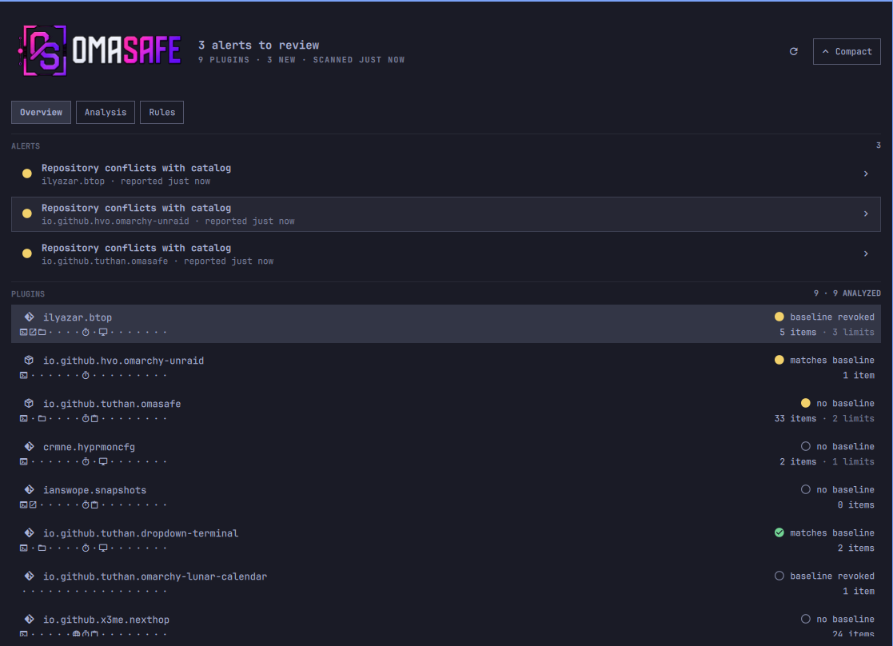
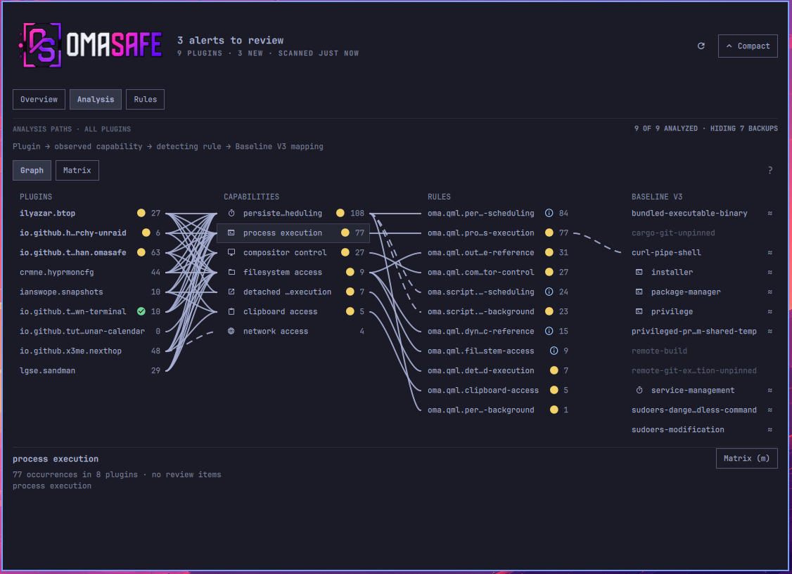

<p align="center">
  
</p>

# OmaSafe Omarchy plugin

OmaSafe is an Omarchy bar widget and review panel for inspecting installed
plugins. It surfaces source drift, detected capabilities, rule coverage, scan
alerts, trust baselines, and marketplace metadata. The separate `omasafe-cli`
binary does the scanning; this plugin renders its reports and does not declare
plugins safe.

The plugin runs as unsandboxed QML inside `omarchy-shell`, so review the source
before enabling it. Installing the plugin and installing the CLI are separate
operations.

- Plugin ID: `io.github.tuthan.omasafe`
- [Omarchy plugin marketplace](https://plugins.omarchy.org/index.html)
- [OmaSafe CLI repository](https://github.com/tuthan/omasafe)





### Analysis graph



## What the panel shows

The panel has three views:

| View | Purpose |
| --- | --- |
| **Overview** | Plugin inventory, trust baseline state, scan alerts, and marketplace claims. |
| **Analysis** | Matrix, graph, trace, detected capabilities, linked rules, and Baseline V3 coverage. |
| **Rules** | Rule catalog, local hits, and Baseline V3 coverage relations. |

Analysis counts are evidence, not permissions or scores. A capability “use” is
one source-level reference emitted by the analyzer; the file count is the number
of distinct files containing those references.

Status markers are shared across the views:

- Green check: a current scan has no active alerts, or a fully analyzed rule has no local hits.
- Yellow: medium or warning severity.
- Amber: high severity.
- Red: critical, error, or blocked.
- Gray: stale, unavailable, or incomplete data.

Markers always retain the corresponding word or glyph and never represent a
safety verdict. Cached results are explicitly labeled stale.

## Keyboard shortcuts

| Key | Action |
| --- | --- |
| `↑` `↓` / `j` `k` | Move within a list or graph column. |
| `←` `→` / `h` `l` | Move across view chips or graph columns. |
| `Enter` | Open a plugin, pin a graph node, or follow a link. |
| `Esc` | Go back, close a confirmation sheet, or close the panel. |
| `r` | Run a scan. |
| `a` / `A` | Analyze the selected plugin / all plugins. |
| `m` | Toggle the Analysis lens between Matrix and Graph. |
| `t` | Trace a plugin and capability class. |
| `g` | Expand or compact the panel. |
| `x` | Unpin a graph node or cancel a running analysis sweep. |
| `?` | Show the Analysis legend. |

## Requirements

- Omarchy with shell plugin support.
- `omasafe-cli` 0.2.1 or newer on the graphical session `PATH`.

The widget can be installed before the CLI. Until the CLI is available, it
shows an unavailable state and never implies that the system is clean.

## Install the CLI

Download the matching release archive and checksum from the
[OmaSafe releases page](https://github.com/tuthan/omasafe/releases), verify it,
and install the binary somewhere visible to the graphical session:

```sh
sha256sum --check omasafe-cli-VERSION-x86_64-linux.tar.gz.sha256
tar -xzf omasafe-cli-VERSION-x86_64-linux.tar.gz
install -Dm755 omasafe-cli-VERSION-x86_64-linux/omasafe-cli \
  "$HOME/.local/bin/omasafe-cli"
```

Verify the dependency:

```sh
command -v omasafe-cli
omasafe-cli --version
omasafe-cli scan --format json
```

Before running scans or trust actions, the plugin checks that the CLI exits
successfully and reports a compatible version. The minimum version and an
optional identity check can be configured in the plugin settings.

## Install the plugin

Install from the marketplace or the published repository:

```sh
omarchy plugin add https://github.com/tuthan/omasafe-plugin.git --enable
```

The marketplace does not install `omasafe-cli`. After installing the CLI,
refresh the running shell if needed:

```sh
omarchy-shell shell rescanPlugins
omarchy plugin enable io.github.tuthan.omasafe --section right
```

## Scan behavior and cache

Periodic scanning is disabled by default. Enable it in the widget settings and
choose an interval from 1 to 1440 minutes, or run scans manually.

After a successful scan, the plugin stores a small parsed snapshot at:

```text
${XDG_CACHE_HOME:-$HOME/.cache}/omasafe/last-scan.json
```

The snapshot contains alert and scan metadata only; it excludes raw stdout,
stderr, and full analysis payloads. After a shell restart, matching cached data
is shown as stale until a fresh scan replaces it.

## Marketplace data

For listed plugins, the panel displays marketplace claims separately from local
trust state. It can show snapshot integrity, listing verification, installed
commit comparison, and upstream movement. “Verified” is always attributed to
the marketplace snapshot and is never an OmaSafe safety judgment.

## Local development

Omarchy expects a real plugin directory, so use `rsync` instead of a symlink:

```bash
plugin_dir="$HOME/.config/omarchy/plugins/io.github.tuthan.omasafe"
mkdir -p "$(dirname "$plugin_dir")"
mkdir -p "$plugin_dir"
rsync -a --delete --exclude='.git/' ./ "$plugin_dir"/
omarchy-shell shell rescanPlugins
omarchy plugin enable io.github.tuthan.omasafe --section right
```

After changing `BarWidget.qml`, `Panel.qml`, or `manifest.json`, run the same
`rsync` command and rescan the shell. Do not use `omarchy plugin update` for
this local copy.

## Disable or remove

```sh
omarchy plugin disable io.github.tuthan.omasafe
omarchy plugin remove io.github.tuthan.omasafe
```

Removing the plugin does not remove the independently installed CLI.

## Validate locally

```sh
omarchy plugin validate .
qmllint -I /usr/share/omarchy/shell -I /usr/lib/qt6/qml \
  BarWidget.qml Panel.qml components/*.qml views/*.qml graph/*.qml
node scripts/flow-test.js
```
