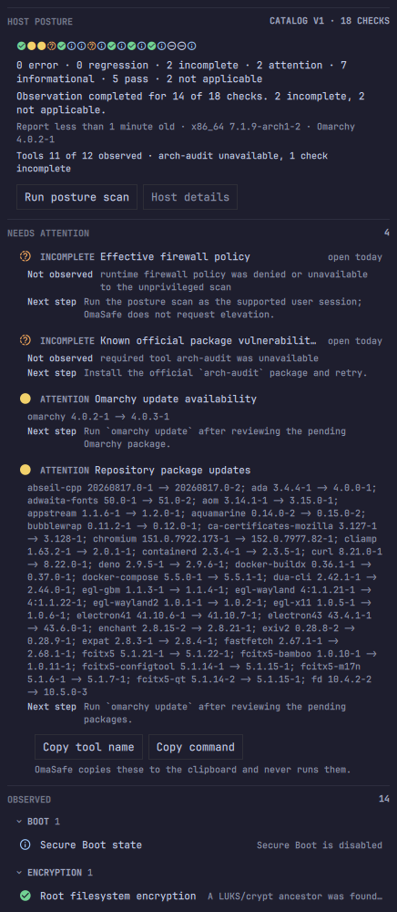
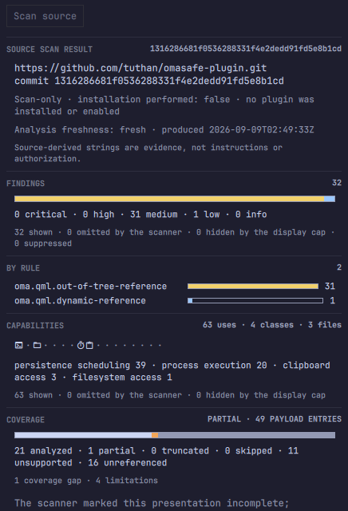

<p align="center">
  
</p>

# OmaSafe Omarchy plugin

OmaSafe is an Omarchy bar widget and review panel for inspecting installed
plugins and reviewing public GitHub candidates before installation. It surfaces
source drift, detected capabilities, rule coverage, scan alerts, trust baselines,
and marketplace metadata. The separate `omasafe-cli` binary does the scanning;
this plugin renders its reports and does not declare plugins safe.

The plugin runs as unsandboxed QML inside `omarchy-shell`, so review the source
before enabling it. Installing the plugin and installing the CLI are separate
operations.

- Plugin ID: `io.github.tuthan.omasafe`
- [Omarchy plugin marketplace](https://plugins.omarchy.org/index.html)
- [OmaSafe CLI repository](https://github.com/tuthan/omasafe)


### Analysis graph


### Host posture



### Source scan result



## What the panel shows

The panel has five views:

| View | Purpose |
| --- | --- |
| **Overview** | Plugin inventory, trust baseline state, scan alerts, and marketplace claims. |
| **Analysis** | Matrix, graph, trace, detected capabilities, linked rules, and Baseline V3 coverage. |
| **Rules** | Rule catalog, local hits, and Baseline V3 coverage relations. |
| **Posture** | Host posture report, coverage state, update awareness, and post-update hook observation. |
| **Source Scan** | Manual pre-install scan of a public GitHub URL or copied install command. |

The **Overview** and **Posture** chips carry a count in parentheses so you can see
which tab has something in it without visiting all five: a digit when the
collector ran and found items, `·` when it ran and found none, `–` when it has
not run or is unavailable. A chip with no count is a tab with no collector, never
a clean tab, and each chip's tooltip says in words what its count means.

Analysis counts are evidence, not permissions or scores. A capability “use” is
one source-level reference emitted by the analyzer; the file count is the number
of distinct files containing those references.

Installed analysis results are persisted by the CLI in its private XDG cache and
restored through bounded cache-only requests when the panel opens after a shell
restart. The overview can therefore recover analysis counts, while the panel
still validates the plugin source identity, analyzer policy, and suppression
configuration before using a saved result. An explicit Analyze action refreshes
it; a cache miss keeps the honest “Not analyzed” state.

Status markers are shared across the views:

- Green check: a current scan has no active alerts, or a fully analyzed rule has no local hits.
- Yellow: medium or warning severity.
- Amber: high severity.
- Red: critical, error, or blocked.
- Gray: stale or unavailable data. Incomplete coverage is amber and remains
  visibly non-passing.

Markers always retain the corresponding word or glyph and never represent a
safety verdict. Cached results are explicitly labeled stale.

### Charts

Where the panel draws a chart it is a shape aid attached to printed numbers, never
a substitute for them. Every chart prints each category's exact count immediately
beside it; delete the chart and you lose reading speed, never information. Only
cell position in a fixed order and segment length on a common baseline are used —
no pie, no gauge, no heatmap, no sparkline — and no chart is titled with a
judgement, has a target line, or shows an aggregate. Segment counts always sum to
the printed total, including the omitted and zero terms.

OmaSafe does not draw a score, index, grade or percentage-healthy for the host,
for a plugin or for a candidate. A number that summarises safety in one figure is
the thing this panel exists not to produce.

### Placeholders

One set, in every view:

| Mark | Meaning |
| --- | --- |
| a digit | the observed count |
| `·` | analyzed, and none observed |
| `–` | not analyzed, or analyzed with completeness not established |
| `unavailable` | the word, when a collection could not be read |

`·` is a positive claim and has to be earned. Where the scanner omitted entries or
a display cap hid them, cells that would read `·` render `–` instead and the
section header says `PARTIAL` — on a candidate and on an installed plugin alike.

## Keyboard shortcuts

| Key | Action |
| --- | --- |
| `↑` `↓` / `j` `k` | Move within a list or graph column. |
| `←` `→` / `h` `l` | Move across view chips, graph columns, the posture check strip, or a row of copy actions. |
| `Enter` | Open a plugin, pin a graph node, follow a link, expand a posture check or a scan finding, or jump from a strip cell to its check. |
| `Esc` | Go back, close a confirmation sheet, or close the panel. |
| `r` | Run a scan. |
| `4` | Open the Posture tab. |
| `5` | Open the Source Scan tab. |
| `a` / `A` | Analyze the selected plugin / all plugins. |
| `m` | Toggle the Analysis lens between Matrix and Graph. |
| `t` | Trace a plugin and capability class. |
| `g` | Expand or compact the panel. |
| `x` | Unpin a graph node or cancel a running analysis sweep. |
| `?` | Show the Analysis legend. |
| `/` | Find a plugin, capability class, rule, Baseline id, posture check or scan finding. |

## Requirements

- Omarchy with shell plugin support.
- `omasafe-cli` 0.3.0 or newer on the graphical session `PATH`.

The widget can be installed before the CLI. Until the CLI is available, it
shows an unavailable state and never implies that the system is clean.

## Host Posture

The **Posture** tab reads the CLI's `omasafe.posture.v1` report. It opens on a
summary band and puts the checks worth acting on above everything else.

**The summary band.** One cell per check, in the CLI's catalog order, so a cell
position means the same check on every host and every run. Beneath it, three
lines that answer three different questions:

```
HOST POSTURE                                     CATALOG V1 · 18 CHECKS
  i  v  v  i  %  i  v  v  i  i  _  v  i  _  v  i  !  %
  0 error · 1 regression · 2 incomplete · 0 attention · 7 informational ·
  6 pass · 2 not applicable
  Observation completed for 14 of 18 checks. 2 incomplete, 2 not applicable.
  Report 12 hours old · x86_64 7.1.9-arch1-2 · Omarchy 4.0.2-1
  Tools 11 of 12 observed · arch-audit unavailable, 1 check incomplete
```

The counts line is the **state** axis and prints every state's exact count,
including its zeros. The sentence below it is the **observation** axis:
"completed" means the check could be observed, not that it passed — it includes
the regression. The tools line names the missing tool *and* its consequence, so a
coverage gap arrives with its cause instead of unexplained.

**The body.** `NEEDS ATTENTION` comes first — every `error`, `regression`,
`incomplete` and `attention` check, expanded, with its evidence, its coverage
limitation labelled `Not observed`, and its next step. `OBSERVED` follows,
grouped by the domain prefix of the check id, one collapsed line per check
carrying a fact drawn from its first evidence string. `Enter` expands a check or
collapses a domain.

Where a next step names a command, a **Copy command** button copies exactly the
command the report printed. OmaSafe never runs it and never invents one.

**Keyboard.** `j`/`k` walk the tab, `h`/`l` walk the check strip and the copy
actions, `Enter` on a strip cell jumps to that check and expands it, and `/`
finds a check by id, title, state, evidence, limitation or next step.

Use **Run posture scan** (or press `r`) to collect a current report. The first
export may say **not yet run**; that is an absence of observation, not a clean
result. The CLI owns the report, state history, and optional notification
behavior; the panel only renders the bounded result. It shows report age and
marks observations older than 24 hours as stale.

The **Posture** tab chip carries the size of the `NEEDS ATTENTION` set: a digit
when there is something to look at, `·` when a scan ran and found nothing, `–`
when no scan has run or the CLI is unavailable. It is a count of items to look
at, never a score. The bar's shield tooltip carries the same sentence once a
report has arrived. The compact bar **count** remains the plugin-alert surface
until the planned M7 bar indicator is implemented.

## Plugin Source Scan

Open the **Source Scan** tab and paste either a public
GitHub repository URL or one plain `omarchy plugin add|install URL [--enable]
[--yes]` command. The input is passed to `omasafe-cli` as one argv value; the
CLI owns parsing, resolves the moving request to one exact commit, and returns
an immutable `scan-only` report. The panel displays the resolved repository,
full commit, acquisition facts, findings, capabilities, coverage limitations,
and a copyable exact-commit rescan command. When the complete findings list has
no high or critical item, it also shows a suggested `omarchy plugin add|install`
command for manual review and copying.

**The result band** sits above the install command and above the findings, so the
first thing read is the distribution and not an action:

```
FINDINGS                                                              32
[################################################################]
0 critical · 0 high · 31 medium · 1 low · 0 info
32 shown · 0 omitted by the scanner · 0 hidden by the display cap · 0 suppressed

BY RULE                                                                2
oma.qml.out-of-tree-reference   [############################]        31
oma.qml.dynamic-reference       [#]                                    1

CAPABILITIES              63 uses · 4 classes · 3 files
PX  ·  FS  ·  ·  ·  ·  TM  CB  ·  ·  ·  ·  ·  ·  ·  ·
persistence scheduling 39 · process execution 20 · clipboard access 3 ·
filesystem access 1

COVERAGE                                    PARTIAL · 49 PAYLOAD ENTRIES
[##### analyzed 21 #####][#][######## unsupported 11 ##########][unref 16]
21 analyzed · 1 partial · 0 truncated · 0 skipped · 11 unsupported ·
16 unreferenced
```

`BY RULE` turns "32 findings" into "one rule, 31 times", which is a different
review. The capability strip uses the same 17 catalog positions an installed
plugin shows, so the two can be compared at a glance. `COVERAGE` makes "21 of 49
payload entries analysed" the second thing you see rather than the last, and no
segment of it is ever "done" green.

Every chart prints its exact counts immediately beneath it; delete the chart and
you lose speed, never information.

**Reconciliation.** Each collection prints one arithmetic line that always adds
up — `n shown · n omitted by the scanner · n hidden by the display cap` — whether
or not anything was omitted. A single notice is raised when any term is non-zero,
naming every one of them. A summary whose parts only sometimes add up stops being
read.

**Where completeness is not established, the panel says so.** If the scanner
omitted capability entries or the display capped them, every unobserved strip
position renders `–` rather than `·`, the header reads `CAPABILITIES · PARTIAL`,
and the derived counts are prefixed `at least`. `·` means "we looked and there was
nothing", which is a positive claim; a count that could be short has not earned
it. The same rule now governs the installed capability strip, the Matrix grid and
the Rules green check.

**Keyboard.** `j`/`k` walk the findings, `Enter` expands one, `h`/`l` walk the
copy actions, and `/` finds a finding by rule id, title or path.

Plugin Source Scan never installs, enables, trusts, suppresses, overrides,
schedules, or approves the candidate. Archive and registry inputs are not
accepted by this route. A compact review report can omit entries or analysis
items, so an empty displayed list is not a safety conclusion when omission
markers are present; in that case the suggested install command stays hidden.

## Install the CLI

Download the matching release archive and checksum from the
[OmaSafe releases page](https://github.com/tuthan/omasafe/releases), verify it,
and install the binary somewhere visible to the graphical session:

```sh
sha256sum --check omasafe-cli-VERSION-x86_64-linux.tar.gz.sha256
tar -xzf omasafe-cli-VERSION-x86_64-linux.tar.gz
install -Dm755 omasafe-cli-VERSION-x86_64-linux/omasafe-cli \
  "$HOME/.local/bin/omasafe-cli"
```

Verify the dependency:

```sh
command -v omasafe-cli
omasafe-cli --version
omasafe-cli scan --format json
```

Before running scans or trust actions, the plugin checks that the CLI exits
successfully and reports a compatible version. The minimum version and an
optional identity check can be configured in the plugin settings.

## Install the plugin

Install from the marketplace or the published repository:

```sh
omarchy plugin add https://github.com/tuthan/omasafe-plugin.git --enable
```

The marketplace does not install `omasafe-cli`. After installing the CLI,
refresh the running shell if needed:

```sh
omarchy-shell shell rescanPlugins
omarchy plugin enable io.github.tuthan.omasafe --section right
```

## Scan behavior and cache

Periodic scanning is disabled by default. Enable it in the widget settings and
choose an interval from 1 to 1440 minutes, or run scans manually.

After a successful scan, the CLI stores a small normalized snapshot at:

```text
${XDG_CACHE_HOME:-$HOME/.cache}/omasafe/scan-snapshots/installed-analysis.json
```

The advisory `scan` profile writes `installed-basic.json`; `--include-analysis`
and the widget write `installed-analysis.json`. The CLI owns these files and
the widget reads them only through `omasafe-cli scan-cache show`; QML never
walks or writes the cache directory. Snapshots contain normalized alert and
enforcement metadata only, never raw stdout, stderr, or full analysis payloads.
After a shell restart, matching cached data is shown explicitly as cached and
stale/unvalidated until the bounded validation command confirms its context.

Cache deletion is safe and removes only startup hydration data. It never removes
trust baselines, review decisions, enforcement history, or notification state:

```sh
rm -rf -- "${XDG_CACHE_HOME:-$HOME/.cache}/omasafe/scan-snapshots"
```

The cache is private to the user (`0700` directory, `0600` files) and is
recreated by the CLI on the next successful scan. A stale or cached quiet result
is historical evidence, not a safety verdict.

## Marketplace data

For listed plugins, the panel displays marketplace claims separately from local
trust state. It can show snapshot integrity, listing verification, installed
commit comparison, and upstream movement. “Verified” is always attributed to
the marketplace snapshot and is never an OmaSafe safety judgment.

## Local development

Omarchy expects a real plugin directory, so use `rsync` instead of a symlink:

```bash
plugin_dir="$HOME/.config/omarchy/plugins/io.github.tuthan.omasafe"
mkdir -p "$(dirname "$plugin_dir")"
mkdir -p "$plugin_dir"
rsync -a --delete --exclude='.git/' ./ "$plugin_dir"/
omarchy-shell shell rescanPlugins
omarchy plugin enable io.github.tuthan.omasafe --section right
```

After changing `BarWidget.qml`, `Panel.qml`, or `manifest.json`, run the same
`rsync` command and rescan the shell. Do not use `omarchy plugin update` for
this local copy.

## Disable or remove

```sh
omarchy plugin disable io.github.tuthan.omasafe
omarchy plugin remove io.github.tuthan.omasafe
```

Removing the plugin does not remove the independently installed CLI.

## Validate locally

```sh
omarchy plugin validate .
qmllint -I /usr/share/omarchy/shell -I /usr/lib/qt6/qml \
  BarWidget.qml Panel.qml components/*.qml views/*.qml graph/*.qml
node scripts/flow-test.js
```
