# 01 — Research and audit

This document is the evidence trail behind the OmaSafe overhaul. It consolidates six research reports (heuristic UX audit, visual kit audit, Quattro ethos study, external UX pattern research, CLI data model, QML feasibility) into one reference: what the plugin renders today and where it fails, what the Omarchy Quattro kit offers instead, which external patterns the design adopts, what the CLI actually returns, and which rendering and surface options are viable. Every `Panel.qml` line, kit component, token, CLI field and enum named here was re-read in the installed files on 2026-09-02 (omasafe-cli 0.2.1, plugin 0.2.1, Omarchy 4.0.2 Quattro, Quickshell 0.3.1, Qt 6.11.2). Decisions themselves live in [02 Design principles](02-design-principles.md), [03 UI overhaul proposal](03-ui-overhaul-proposal.md), [04 Trust graph spec](04-trust-graph-spec.md) and [05 Implementation roadmap](05-implementation-roadmap.md), bound by the [06 decision record](06-decision-record.md) (its `G<n>` / `R<n>` ids are cited below; its §14 errata lists where 01–05 supersede it); this document only supplies the facts they rest on.

Line references: `Panel.qml:<n>` is written as a bare number, `BW:<n>` is `BarWidget.qml`, `Icon:<n>` is `OmaSafeStatusIcon.qml`, kit files are `Ui/<File>.qml:<n>`, `Style.qml:<n>`, `Color.qml:<n>`, `shell.qml:<n>` under `/usr/share/omarchy/shell`. Rust references are relative to `/home/hvo/Projects/omasafe/crates`. JSON samples are the real captures in the scouting scratchpad (`cli-samples/`), summarised in §8.

## Contents

1. [Scope and method](#1-scope-and-method)
2. [Current-state information architecture](#2-current-state-information-architecture)
3. [Heuristic audit findings](#3-heuristic-audit-findings)
4. [Visual kit gap table](#4-visual-kit-gap-table)
5. [Token misuse list](#5-token-misuse-list)
6. [Quattro ethos principles](#6-quattro-ethos-principles)
7. [External pattern library](#7-external-pattern-library)
8. [Data model summary](#8-data-model-summary)
9. [Rendering and surface feasibility](#9-rendering-and-surface-feasibility)
10. [What each downstream document takes from here](#10-what-each-downstream-document-takes-from-here)
11. [Sources and references](#11-sources-and-references)

---

## 1 Scope and method

| Input | What was read | How it was used |
|---|---|---|
| Plugin source | `Panel.qml` (5174 lines), `BarWidget.qml` (541), `OmaSafeStatusIcon.qml` (51), `manifest.json`, `docs/cli-v0.2-plan.md`, `docs/cli-v0.2.1-plan.md`, `media/clear.png`, `media/warning.png` | IA map (§2), audit (§3), kit gap and token misuse (§4, §5) |
| Host kit | `Commons/{Style,Color,Util,Border}.qml`; all 32 `Ui/*.qml` files exported by `Ui/qmldir`; `shell.qml`; `plugins/panels/{tailscale,network,bluetooth,power,monitor,weather,clock,wifiqr,speedtest,dropbox}/Panel.qml`; `plugins/dev-gallery/GalleryPanel.qml`; `plugins/menu/manifest.json`; theme `shell.toml` files for `ame-quattro`, `lumon`, `oxocarbon` and light `colors.toml` for `catppuccin-latte`, `flexoki-light`, `white` | Kit API surface (§4), token facts (§5), ethos (§6), feasibility (§9) |
| CLI contracts | `omasafe-report/src/{analysis,enforcement}.rs`, `omasafe-analyzer/src/{payload,fingerprint}.rs`, `omasafe-marketplace/src/lib.rs`, `omasafe-cli/src/main.rs`, `omasafe-core/src/bounds.rs` | Closed enums, nullability, bounds (§8) |
| Real data | `cli-samples/`: inventory, scan, schedule, override list, rules list, rules coverage, one `rules explain`, and `analyze` / `status` / `enforcement-status` for four plugins | Cardinalities and worked numbers (§8) |
| External research | Primary documentation and papers listed in §11 | Adopted patterns and anti-patterns (§7) |
| Validation | `qmllint -I /usr/share/omarchy/shell -I /usr/lib/qt6/qml`, `fontTools` cmap check of `JetBrainsMonoNerdFont-Regular.ttf`, `python3` over the JSON samples | Feasibility claims (§9); nothing was runtime-tested in the live shell |

The audit persona throughout: an Omarchy user who installed a few marketplace plugins, is not a security engineer, and opens the panel with one question — "am I okay, and what should I do?"

---

## 2 Current-state information architecture

### 2.1 Surface tree

```
BarWidget.qml
 ├─ BarIconButton (BW:516)            left click = runScan() + open(); middle click = runScan()
 │   └─ OmaSafeStatusIcon             circle + text glyph: ✓ … ⟳ ? N/9+ !   (Icon:24–28)
 │                                    levels: normal · checking · ready · unknown · warning · critical (BW:117–122)
 ├─ scanProcess (BW:302)              omasafe-cli scan --include-analysis --format json, periodic timer opt-in
 └─ versionCheck                      omasafe-cli --version, retains 256 chars (BW:407–408); gates cliVerified (BW:60)

Panel.qml  Panel > KeyboardPanel (1300)   contentWidth fittedContentWidth(Style.space(420))
                                           contentHeight fittedContentHeight(tabShell.implicitHeight, Style.space(600))
 ├─ Flickable panelFlick { visible: false } (1310) > Component legacyContent (1322–2258)   never instantiated
 └─ PanelKeyCatcher keyCatcher (2260–2281)
     └─ Column tabShell (2283)
         ├─ Row tab strip (2288): Overview | Findings (N) | Plugins | Catalog + filled accent "Scan" Button (2333–2346)
         ├─ Row statusIdentity (2354): 14 px OmaSafeStatusIcon + statusTitle() (195) + statusMessage() (208)
         └─ Flickable activeFlick (2392, height ≤ Style.space(480)) > Loader activeLoader (2404)
              → one of four Components: overview 2584 · findings 2772 · plugins 3186 · catalog 3592
     Rectangle z:20 (2421) confirmation overlay, Util.alpha(Color.background, 0.94) scrim (2425), border warningColor
 Connections hostWidget (3784–3813)       onCliVerifiedChanged 3788 · onCliVersionChanged 3796 · onAlertsChanged 3808
 15 Process items + 31 Timers (3815–5173)
```

From `qs.Ui` the plugin instantiates `Panel`, `KeyboardPanel`, `PanelKeyCatcher` and `Button` (plus `BarWidget`, `BarIconButton` in `BarWidget.qml`). Everything else — tabs, hero row, stat tiles, cards, section labels, rows, pills, key:value blocks, confirm overlay — is hand-rolled from `Rectangle`, `Text`, `MouseArea`. File-wide counts: 126 `Text`, 25 `Rectangle`, 6 `MouseArea`, 0 `Behavior`/`Animation`, 28 `focusable: true` (19 in the live shell 2260–3815), 154 reads of `Style.font.family`, 112 `Style.space()`, 110 `Style.font.caption`, 83 `Util.alpha()`.

### 2.2 Global header — every state (outside the Loader, always visible)

| Host `scanState` / `statusLevel` | Icon | `statusTitle()` 195 | `statusMessage()` 208 |
|---|---|---|---|
| resolver or scan running (`checking`) | `…` muted outline | "Scanning" | "Reading installed plugin state…" |
| CLI verified, no scan yet (`ready`) | `⟳` muted | "Ready to scan" | "Click Run scan to inspect the installed plugin state." |
| `missing-cli` (`unknown`) | `?` muted | "omasafe-cli not found" | "Install omasafe-cli, then restart Omarchy Shell." |
| `incompatible-cli` (`unknown`) | `?` | "omasafe-cli incompatible" | `cliError` verbatim ("omasafe-cli 0.1.9 is older than the required 0.2.1") |
| scan failed / timeout / cap (`unavailable`) | `?` | "Scan unavailable" | `cliError` verbatim ("CLI scan timed out after 30 seconds") |
| `quiet` (`normal`) | `✓` outline | "No outstanding changes" | "The latest scan found no outstanding changes." |
| attention, highest ≠ critical (`warning`) | filled `#e5a50a`, count or `!` | "Review needed" | "3 item(s) need review; 3 new." |
| attention, highest critical/error (`critical`) | filled `Color.urgent`, `!` | "Critical finding" | "A confirmed critical finding needs immediate review." |
| `hostWidget` null | — | "Scan status unavailable" | "Waiting for the OmaSafe widget." |

The header never names the kind of alert or the plugin; `scanResultsStale` is shown only inside Findings (2791) and only when alerts exist.

### 2.3 The four tabs

| Tab (lines) | Content order, top to bottom | Actions | Notable states |
|---|---|---|---|
| Overview 2584–2770 | Stat strip card `INSTALLED / TRUSTED / REVIEW / UNTRUSTED` (2591; REVIEW always `warningColor`, even at 0) · loading/unavailable line (2634) · `panelError` in urgent (2645) · full-bar warning (2656) · "PROTECTION STATUS" card: one 8-line `Text` (2693–2704: Last scan ISO, CLI, Analysis freshness, Scheduled scan, Schedule unit, Last scheduled execution, Hardened gate, Last decision) · enforcement_summary unavailable line (2706) · policy explainer (2719) · "Install/Reinstall advisory schedule" / "…hardened schedule" Buttons (2727, 2737) · result line (2748) · disclaimer footer (2761) | Scan; two schedule installs (confirmed) | On CLI unavailable the stat strip briefly shows `0 / … / 0 / …` and the Protection Status block turns `warningColor` wholesale (2705). No list of what needs review, no link to it. The legacy definition "Trusted means the current source exactly matches a recorded baseline." (legacy 1482) was not carried over. Inventory-level `coverage.limitations[]` is never rendered. |
| Findings 2772–3184 | empty/unavailable line (2779) · stale banner (2791) · scan alert cards (2798–2844: `alertLabel · SEVERITY`, `plugin_id · message`; click selects, triggers `plugins diff` only for `source-drift`) · "Select an installed plugin…" (2848) · "ANALYSIS · <id>" block (2856): loading (2872), `analysisError` (2879), coverage line (2889), lexical-mode warning (2900), raw limitation bullets (2910), "Observed capabilities: …" undeduplicated join (2921–2923), "Invocation edges: N" (2933), finding cards (2948–3016) with "Explain rule" and raw `evidence`, "Show provenance" → `JSON.stringify` (3019–3031) · "BASELINE V3 COVERAGE" card (3047–3149, up to 64 relation cards) · "Open plugin controls" (3173) | select alert, Explain rule, Show provenance, Show coverage relations, Open plugin controls (none mutate) | Up to three loaders at once. "Quiet" still shows finding cards because all four real analyses carry 1–5 `low` findings. |
| Plugins 3186–3590 | empty/unavailable (3193) · plugin rows (3202–3239: bold id + `pluginStatusLabel`; selected row tinted by `pluginStatusLevel`) · system-wide "ENFORCEMENT OVERRIDES" card (3244) placed before the selected plugin · "SELECTED PLUGIN · <id>" (3358): Classification / Digest / `Coverage: <limitations or "complete">` (3372–3376), baseline digest + `Current state: <enum>` (3383), "ENFORCEMENT DECISION" card (3395–3485), "Changed files" (3504), `selectedError` (3513) · action row (3522): `Trust source` \| `Replace baseline` (accent fill 3529), `Untrust` (bordered warning), `Enable inactive plugin` (3557), `Review update` / `Reviewed update unavailable` (3569–3570) · result line (3580) | trust, replace, untrust, enable, review update (all confirmed) | Per-row "Checking baseline…" sweeps one `plugins status` process per plugin (622). `panelError` is not shown on this tab. Override card renders an empty caps title when the CLI is unavailable. |
| Catalog 3592–3790 | "MARKETPLACE SNAPSHOT" label (3600) · unavailable sentence · `panelError` in `warningColor` (3620) · snapshot card tinted by integrity level: "Verified against pinned catalog commit" / "Unverified cached snapshot" / "Local catalog file (not cache-verified)" / "Marketplace snapshot unavailable"; "Catalog commit: 65b63854…" + "Age: 935 seconds" · disclaimer (3657) · "Update catalog" (3663, no confirmation, 60 s) · "Show plugin backups (N)" (3689–3695) · listing cards (3722–3779): plugin id + 9 key:value lines + per-entry CLI `disclaimer`; whole block turns `warningColor` if any sub-label is at warning level (3762) | Update catalog, show backups, select (no visible effect on this tab) | Listing colour scale is the same one used for local trust state. |

### 2.4 Mutating actions and their confirmations (overlay 2421–2581)

This table audits the current 0.2.1 UI; a visible identity block is not itself authorization. The target contract is action-specific: the CLI must compare the displayed expected value while holding the same lock as the mutation. Record/Replace already have expected identity arguments; Review update has an expected target commit. Enable has no expected-identity arguments, and the untrust branch parses but does not enforce expected identity, so those two current paths do not satisfy GR6 and must remain unavailable in the redesigned surface until the CLI adds the required contracts.

| Action | Trigger | Title (2437) | Body (2451) | Identity block (2470) | Policy | Confirm label (2559) | After success |
|---|---|---|---|---|---|---|---|
| Trust / Replace | Plugins 3526 / 3529 | "TRUST CURRENT IDENTITY?" / "REPLACE TRUST BASELINE?" | "Record the exact current source identity for <id>." | Commit / Tree / Digest, full, `WrapAnywhere` | — | "Trust identity" | reselect → `setActive(1)` if the plugin has an alert (855); status sweep; `runScan()`; `trustOutput` never rendered |
| Untrust | 3540–3554 | "REMOVE TRUST BASELINE?" | "Remove the active trust baseline for <id>." | "Baseline digest: <64 hex>" or "Baseline identity unavailable" | — | "Untrust plugin" | same as trust; **current CLI does not compare the displayed digest and is not target-safe** |
| Review update | 3569 | "REVIEW UPDATE?" | "Update <id> at the verified commit below and trust the result.\nPolicy: advisory" (2455) | "Expected commit: <40 hex>\nCurrent digest: <64 hex>" | ✓ Advisory / Hardened (2506–2537) | "Review update" | clear analysis cache, reload inventory, `runScan()` |
| Enable | 3557 | "ENABLE PLUGIN?" | "Enable <id> through the CLI-owned advisory gate. Hardened policy may refuse the transition." | Commit / Tree / Digest | ✓ Advisory / Hardened | "Enable plugin" | reload inventory, `runScan()`; **current CLI cannot compare the displayed identity and is not target-safe** |
| Schedule install | Overview 2727 / 2737 | "INSTALL SCHEDULE?" | "Install or replace the CLI-owned daily scan timer with advisory policy. …" | unit names + exact effective scan argv (missing today) | chosen before opening | "Install schedule" | reload schedule status |
| Update catalog | Catalog 3663 | none | — | — | — | — | inventory reload |
| Scan | header Scan, `r`/`R` (2277), bar click | none | — | — | — | — | alerts change → analysis cache cleared |

CLI argv shapes behind these: `plugins trust <id> --yes --note "trusted from OmaSafe panel" [--expected-head H] [--expected-tree T] [--expected-digest D]` (571–574), `plugins review <id> --action untrust --reason "untrusted from OmaSafe panel" --yes` (593–597; `untrustSelectedPlugin` starts at 585), `plugins enable <id> --policy <advisory|hardened> --format json` (1260–1263), `plugins review-update <id> --expected-commit <sha> --policy <advisory|hardened> --yes` (1291–1295), `schedule install --policy <p>` (910), `marketplace refresh --latest` (3927); [05 §10](05-implementation-roadmap.md) carries the current and target matrices with process ids and timeouts. The QML `targetStillExact` checks for enable (1246) and review update (1273) reduce accidental stale selection but are not an atomic authorization boundary: enable compares only id/eligibility, and filesystem state can change after either QML check. The target UI always supplies an expected digest for Record/Replace; the target CLI must require and atomically validate expected digest (plus present head/tree) for Enable and an expected recorded-baseline digest for Remove. Selection change cancels a pending enable/review confirmation (808–816). `navigationLocked` (144–146) blocks tab switching while any `*Confirming` flag or `operationRunning` is true.

### 2.5 Keyboard model today

Source of truth is `Ui/PanelKeyCatcher.qml` (`Keys.priority: Keys.BeforeItem`; it swallows Esc, Tab/Shift-Tab, arrows and `hjkl`, Enter, Space, `x`, and forwards other single characters as `textKey`) plus the handlers at 2264–2280.

| Key | Signal | Handler | Effect today |
|---|---|---|---|
| Esc | `closeRequested` | `root.close()` 2267 | Closes the panel even mid-confirmation; `close()` (947) does not reset `*Confirming`, so the overlay is still up on reopen with tabs locked |
| Tab / Shift-Tab | `tabRequested` | `bar.switchPanelFrom()` 2268–2270 | Switches to the neighbouring bar panel; no `Button` ever receives focus, so all 19 live `focusable: true` buttons are unreachable |
| ← → h l | `moveRequested(dx, 0)` | `switchTabBy(±1)` 2265 | Cycles tabs |
| ↑ ↓ j k | `moveRequested(0, dy)` | ignored | Consumed; the Flickable never scrolls from the keyboard |
| Enter / Space | `returnRequested` + `activateRequested` / `activateRequested` | not connected | Nothing |
| x | `deleteRequested` | not connected | Nothing |
| 1 2 3 4 | `textKey` | `setActive(0..3)` 2273–2276 | Jump to tab (blocked while `navigationLocked`) |
| r / R | `textKey` | `hostWidget.runScan()` 2277–2278 | Runs a scan; not gated by `navigationLocked` |

There is no row cursor. Selection, Explain rule, provenance, catalog refresh, every trust action and both confirm buttons are mouse-only. The kit's `ConfirmDialog.handleKey` contract (Left/Right/Tab toggle, Enter fires the selected button, Esc cancels) is not followed.

### 2.6 Panel.qml range map

| Range | Content | Verified anchors |
|---|---|---|
| 1–160 | root state (~120 properties), `tabs` model (134–139), `operationRunning` (142), `navigationLocked` (144), `warningColor` (153) | 132–147, 153 |
| 161–186 | `cliCommand()` gate returning `/usr/bin/false` until `cliVerified` (164–167), `terminateBoundedProcess` (174) | 164–167 |
| 187–450 | label helpers: `statusColor` (188–193, `Color.muted` for unknown), `statusTitle`/`statusMessage` (195, 208), `enforcementEnum` (240), `coverageRelation` (320), `overrideStatus` (338), `analysisSeverityLevel` (389–395), `analysisFreshnessLabel` (435) | 240, 320, 338, 389 |
| 451–800 | `visiblePlugins()` (457), `selectedPlugin()` (522), `setActive` (526), `switchTabBy` (536), `pluginStatusLabel` (541), `pluginStatusLevel` (551–556), trust argv (571–595), status sweep (622), schema check (638) | 457, 522, 551, 571, 622, 638 |
| 808–1300 | `selectPlugin` with forced `setActive(1)` (855), `open` (858), `loadInventory` (872), schedule install (910), `close` (947), `applyInventory` (962), analysis cache key (1092–1099), `findingKey` (1161, dead), `explainRule` (1166–1169), `updateEligible` (1183), `enableEligible` (1196), `runEnable` (1244, `targetStillExact` 1246), `runReviewUpdate` (1269, 1273), `KeyboardPanel` (1300–1308) | all listed |
| 1310–2258 | `panelFlick { visible: false }` + `Component legacyContent` — dead pre-tab UI, ≈ 950 lines | 1310, 1322, 2258 |
| 2260–2281 | `PanelKeyCatcher` handlers | 2264–2280 |
| 2283–2581 | tab strip (2288–2331), Scan button (2333–2346, `background: Color.accent` 2341), status row (2354), `activeFlick` (2392, cap 2394), `Loader` (2404), confirm overlay (2421–2581) | 2341, 2394, 2421, 2425, 2437, 2455, 2571 |
| 2584–3790 | Overview, Findings, Plugins, Catalog components | 2923, 3376, 3570 |
| 3784–3813 | `Connections` to `hostWidget`: `onCliVerifiedChanged` 3788 (loads inventory / schedule / overrides and `ensureCoverage` once the CLI verifies while open), `onCliVersionChanged` 3796 (wholesale analysis-cache and rule-explanation clear), `onAlertsChanged` 3808 (clears the analysis cache) | 3784, 3788, 3796, 3808 |
| 3815–5173 | 15 `Process` items: 10 read-only collectors (`inventoryProcess` 3816, `statusProcess` 3993, `diffProcess` 4060, `listStatusProcess` 4167, `enforcementStatusProcess` 4241, `scheduleStatusProcess` 4347, `coverageProcess` 4511, `overrideProcess` 4594, `analysisProcess` 4692, `ruleExplanationProcess` 4810) and 5 mutators (`marketplaceRefreshProcess` 3925, `scheduleInstallProcess` 4430, `enableProcess` 4919, `reviewUpdateProcess` 5010, `trustProcess` 5095); `enforcementRefreshTimer` (4681); `rules explain` without `--format json` (4830) | all listed |

The roadmap's range → fate table in [05](05-implementation-roadmap.md) is built on this map.

### 2.7 What is sound and must be preserved

1. **Fail-closed data path.** `cliCommand()` returns `["/usr/bin/false"]` until the bar-side version gate passes (164–167); every `apply*` checks `schema === "omasafe.report.v1"` (638, 965, 1002) and the sub-schemas (`omasafe.analysis.v1`, `omasafe.enforcement.v1`, `omasafe.schedule.v1`); `enforcementEnum` (240), `coverageRelation` (320), `overrideStatus` (338) render unknown values as "unsupported".
2. **Bounded processes.** Chunked `SplitParser { splitMarker: "" }` reads with a 2 MiB per-stream cap (`v02OutputCharCap`), 15/30/60 s timeouts, SIGTERM → SIGKILL escalation (`terminateBoundedProcess` 174; BW `scanKill` 3 s), first-terminal-event latches, `requestId`/generation guards so a late result for plugin A never lands under plugin B. The bar-side version probe retains 256 characters (BW:407–408).
3. **Confirmation interaction, with a contract gap.** One overlay names the subject and visible identity; `targetStillExact` re-validation (1246, 1273) and selection-change cancellation (808–816) are worth preserving. They do not make Enable or Remove atomic. Phase 0 must gate those actions until the CLI enforces the action-specific expected values in §2.4.
4. **Marketplace attribution.** Every marketplace string is attributed; the CLI `disclaimer` is passed through verbatim (3752); snapshot integrity is separate from listing verification; the status headline never blends catalog state.
5. **Analysis honesty.** `coverage_limitations` rendered when non-empty (2910); `parser === null` surfaced (2900); per-file coverage states summarised (407); cache keyed on content digest + CLI version + policy identity (1092–1099). The key is what is preserved; the clearing policy is not. Today `clearAnalysisCache()` (1147) runs in `close()` (947–948), in `onAlertsChanged` (3808–3809, i.e. after every scan — and the bar left-click runs `runScan()` before `open()`, BW:532–535), in `onCliVersionChanged` (3796–3799), on an installed-set signature change (974), after review update (5055) and after trust/untrust (5138). Under that policy every reopen starts cold: eight hollow Flow nodes, "–" counts, `A` pressed again per open (8 bounded processes). The warm-cache states the design depends on (03 §4.1 `PLUGINS | 8 · 4 ANALYZED` on open, 04 analyzed-first ordering and Rules LOCAL HITS) therefore require the lifetime change recorded in §8.7.
6. **Badge is count/state only.** Glyph set (Icon:24–28) and tooltips (BW:124–135) encode outstanding count and availability, never a grade.
7. **Copy that already works.** "No outstanding changes", "Source changed", "No trust baseline", "OmaSafe reports changes and coverage limits. It does not declare plugins safe." (2763).

---

## 3 Heuristic audit findings

Severity: **H** blocks or misleads the persona or violates a ground rule; **M** costs comprehension or effort; **L** polish. The last column names where the fix lands in the decision record's vocabulary (see [02](02-design-principles.md), [03](03-ui-overhaul-proposal.md), [05](05-implementation-roadmap.md)).

| # | Sev | Heuristic | Where | Problem | Fix |
|---|---|---|---|---|---|
| A1 | H | Visibility of status / user control | 855, `applyInventory` 962, `trustProcess.onExited` | `selectPlugin(id, alert)` calls `setActive(1)` whenever the plugin has an alert: opening with alerts lands on Findings; a successful trust yanks the user out of Plugins, clears the analysis cache and starts a scan with no success message | Data arrival never changes view, depth or cursor; `setActive(1)` and the post-trust re-selection go; success line rendered from `trustOutput` (Phase 0) |
| A2 | H | Error prevention | 2421–2425; buttons 3663, 2994, 3019, 2727, 2737, 3106 | Scrim is a bare `Rectangle` without `MouseArea`; wheel scrolls and every action `Button` stays clickable through the 0.94 scrim, none of them gated on the confirmation: schedule installs (2727, 2737) gate on `!operationRunning` only, Update catalog (3663) only on its own `marketplaceRefreshProcess.running` (3666) so it is reachable even mid-mutation, and Explain rule (2994, CLI process at 3002) plus the provenance and coverage expanders (3019, 3106) have no `enabled` binding at all. A second `*Confirming` flag can then be set and the overlay resolves by `if` order (title 2437, action 2571), so "Install advisory schedule" clicked during a trust confirmation relabels the dialog and its confirm button runs `runScheduleInstall()` | Swallowing `MouseArea` on the scrim; one `pendingAction` enum; `navigationLocked` disables every action `Button`, the view/lens controls and the finder; `Flickable.interactive: false` while a sheet is open (G7) |
| A3 | H | User control and freedom | 947, 2267 | Esc closes the whole panel during a confirmation; `close()` never resets `*Confirming`; on reopen the dialog is back and tabs are locked | Sheet open ⇒ Esc → `canceled()`; `close()` and `onOpenedChanged(false)` reset `pendingAction` (G7, G14) |
| A4 | H | Error prevention | 2277–2278 | `r`/`R` runs a scan regardless of `navigationLocked`; `onAlertsChanged` (3808) then clears the analysis cache and re-fetches enforcement under the open dialog | `r` gated on `cliVerified && !checking && !navigationLocked`; in Phase 0, before `checking` exists, spelled `root.statusLevel !== "checking"` (05 §3 item 0.6) |
| A5 | H | Flexibility / accessibility | 2264–2266, `Ui/PanelKeyCatcher.qml` | No keyboard cursor: `dy` ignored, Enter/Space unbound, Tab switches bar panels; every focusable `Button` (19 live) and both confirm buttons are mouse-only; content cannot scroll by keyboard | dev-gallery cursor model (`GalleryPanel.qml:101–262`): `focusSection` + `selectedIndex`, `moveCursor`, `moveCursorH`, `activateCursor`, `clampCursor`, `ensureCursorVisible`; `ListView.positionViewAtIndex` for long lists |
| A6 | H | Robustness | 2584–3790 | 68 of 75 `Text` items leave `textFormat` at `AutoText` while rendering CLI-supplied strings (plugin ids from directory names, alert messages, stderr, marketplace `reason`/`disclaimer`, evidence); Qt promotes HTML-looking strings to rich text | `textFormat: Text.PlainText` on every `Text` (Phase 0); acceptance: a plugin id containing `<b>` renders literally |
| A7 | H | Minimalism / match to real world | 2921–2923 | "Observed capabilities" joins every occurrence: 54 tokens for `io.github.tuthan.omasafe`, 36 of them identical `persistence-scheduling` | Group by class with counts: `CapabilityStrip` (17 fixed-order glyphs) on the row, `CAPABILITIES OBSERVED \| n · k CLASSES` in the detail sheet, counts in the Matrix lens (G5) |
| A8 | H | Ground rule 3 | 3376, legacy 1737 | `"Coverage: " + ((p.limitations \|\| []).join(", ") \|\| "complete")` prints "complete" when `limitations` is missing — a positive claim on absent data | `Array.isArray` check → `COVERAGE \| NO LIMITS REPORTED` / grouped rows / `Coverage unavailable`; never "complete" |
| A9 | H | Ground rule 4 | inventory `coverage.limitations[]` | Inventory-level limitations are parsed but never rendered anywhere | `NoticeRow` under the hero when non-empty (G8) |
| A10 | H | Ground rule 2 / error prevention | 2455; legacy 2042 | Review-update body calls a marketplace-claimed `upstream_observed_commit` "the verified commit"; the trust caveat "Trusting this identity does not establish that the plugin is safe." was dropped from the tabbed overlay | Confirm body: "Expected commit … — claimed by catalog snapshot <commit7>"; every variant carries an effect sentence and a caveat sentence (02 §copy) |
| A11 | H | Consistency / theme | 153, BW:116, Icon:9 | Hard-coded `#e5a50a` in three files; no theme exposes a warning colour (§5) | Delete; no warning colour exists in the design; restrict `Color.urgent` to the semantic allowlist in 02 P9 |
| A12 | H | Aesthetics / legibility | 110 `Style.font.caption` uses (73 in the live shell) vs 6 `body`, 4 `bodySmall` | Body copy, hashes, buttons and key:value lines all at 10 px (7.5 px at base 9); hierarchy comes only from ALL-CAPS labels and bold | Fixed type roles with a data floor: anything read as data is `bodySmall` or larger; `caption` only for headers, hero meta, hints, relative times (G27) |
| A13 | H | Match to real world | 3031, 4855–4862, 4830 | Provenance rendered as `JSON.stringify`; rule explanation fetched without `--format json` and parsed by guessing between text and JSON; raw enums in prose ("Current state: changed", "allow via none") | `rules explain <id> --format json` (Phase 0); `Labels.js` as the single closed-enum map; `InfoGrid` for key:value; raw strings one Enter away |
| A14 | H | Recognition over recall / ground rule 1 | 2591–2632 | `TRUSTED 1 / UNTRUSTED 4` tiles with no definition (legacy 1482 dropped) read as good-vs-bad; REVIEW always painted `warningColor`, even at 0 | No stat strip; trust is a right-aligned state word on the plugin row; the PLUGINS footer defines "baseline"; "trusted/untrusted" leave the UI except in confirm titles |
| A15 | H | Ground rule 2 | 3746–3762 | "Verified by marketplace" / "Not verified by marketplace" use the same normal/warning colour scale as local trust | `MARKETPLACE CLAIM \| CATALOG <commit7> · <age>` as its own section; `registry_claim.verification_status` prefixed "Catalog says:", the correlation `status` rendered as its `Labels.js` sentence (02 §3.4); never beside a trust word (R12) |
| A16 | H | Visibility of status | 2791 | `scanResultsStale` only inside Findings and only with alerts; the header keeps saying "No outstanding changes" after a failed rescan | Hero meta `SHOWING RESULTS FROM <relative>` / `LAST SCAN FAILED`; status line under the hero |
| A17 | H | Flexibility | 1169 vs 1161 | `expandedFindingKey = ruleId` expands every finding sharing the rule; `findingKey()` (rule:path:line) is dead | Key expansion on `findingKey(finding)` (Phase 0) |
| A18 | H | Recognition over recall | 3569–3570 | "Reviewed update unavailable" never states the unmet condition (status ∈ {listed, installed-differs}, a matching baseline, a claimed upstream commit — `updateEligible()` 1183) | Ineligible verbs stay visible, dim, with the unmet condition named (G19) |
| A19 | H | Minimalism / progressive disclosure | 2910–2912, 3117–3149 | Unbounded raw limitation bullets (13 lines for `lgse.sandman`), 64 relation cards, raw `evidence` at headline weight | Limitations parsed `kind[:sub]:file[:line[:target]]` and grouped by file then kind, raw codes one Enter away (G26); Baseline V3 moves to the Rules view; three disclosure tiers |
| A20 | H | Progressive disclosure | whole Findings tab | Level-1 information (what the last scan left outstanding, which plugins, what next — the persona's "am I okay" is the one question the panel deliberately does not answer, GR1) is indistinguishable from level-3 provenance; only four disclosures exist and all are level-3 | Primary = hero + alert rows + plugin rows; secondary = detail sheet sections; tertiary = raw evidence, explanation, provenance, digests, stderr |
| A21 | M | Visibility of status | 4681 | `enforcementRefreshTimer` nulls `enforcementDecision` every 60 s, flashing "Loading CLI-owned decision…" while the user reads | Refresh in place; swap only when the new result arrives (Phase 0) |
| A22 | M | Consistency | ten loading strings (2634, 2872, 3084, 3193, 3264, 3416, 2779 …) | Up to three loaders visible at once with different verbs | One verb: `Loading plugins…`, `Loading analysis…`, `Loading rules…`, `Loading coverage map…`, `Loading catalog…`, `Loading decision…`, `Checking baseline…` |
| A23 | M | Consistency | 2653, 3620, Plugins/Findings | `panelError` is urgent on Overview, `warningColor` on Catalog, absent elsewhere | One status line under the hero: verbatim `cliError` in `urgent`, stale sentence in dim |
| A24 | M | Consistency | 3526, 2563, legacy 1866 | Three verbs for one act: "Trust source", "Trust identity", "Trust current source"; three nouns: source / identity / baseline | `Record baseline` / `Replace baseline` / `Remove baseline`, reused in trigger and confirm |
| A25 | M | Match to real world | 216, 2693, 3648 | "3 item(s) need review", raw ISO timestamps, "Age: 935 seconds" | Proper plurals; `Time.js` relative times (`just now`, `<n> min ago`, `<n> days old (stale)`), ISO in a tooltip |
| A26 | M | Recognition over recall | 2506–2537 | Advisory / Hardened chosen inside the dialog with no definition | Kit `ButtonGroup` plus a one-line definition per policy in the sheet |
| A27 | M | Consistency | 2470 (untrust branch) | Untrust shows only the baseline digest; trust shows commit/tree/digest | Identity grid Head / Tree / Digest for every variant, each `40/40/64 hex` or "unavailable" |
| A28 | M | Minimalism | 2667–2748 | The largest Overview block is schedule/enforcement plumbing; nothing lists what needs attention | `ALERTS` first, then `PLUGINS`, then `SOURCES` (schedule, catalog, overrides) |
| A29 | M | Recognition over recall | 3202–3239 | Plugin rows carry only id and trust label; everything else needs a selection and a scroll below the override card | Two-line row: glyph · id · trust word / strip · `N review items` \| `not analyzed` \| `analysis unavailable` |
| A30 | M | Visibility of status | 3663 | "Update catalog" is a 60 s network fetch with only a label swap | Stays unconfirmed (R20) with inline progress `Updating catalog… <n> s` |
| A31 | M | Error recovery | 4056, 4790 | Multi-line stderr rendered as the whole error | First line as the headline, the rest one Enter away; verbatim kept |
| A32 | M | Error recovery | "Inventory output exceeded the configured output cap." | No next step | `Output was larger than 2 MiB and was discarded. Run \`omasafe-cli <command>\` in a terminal.` |
| A33 | M | Error recovery | 2798–2844 | Alert cards give no next step; three `provenance-conflict` alerts on a healthy machine (including OmaSafe itself) cannot be triaged | Alert row line 2 `<plugin id> · reported <relative>`; Enter opens the detail sheet where `MARKETPLACE CLAIM` shows the conflicting `reason` |
| A34 | M | Performance | 457, 522, 3202 | `visiblePlugins()` bound in 12 places and `selectedPlugin()` in 18 re-filter the inventory on every dependency change; `Repeater { model: root.visiblePlugins() }` rebuilds all delegates on each inventory change | `ViewModel.js` normaliser producing stable arrays once per data event |
| A35 | M | Performance / layout | 2394, 1308 | Inner `Style.space(480)` cap inside an outer `Style.space(600)` cap; every list is a `Repeater` in one shared `Flickable` | Single `fittedContentHeight(h, Style.space(560))`; `ListView { height: Math.min(contentHeight, Style.space(400)) }` for long lists |
| A36 | L | Feedback | 2836, 3233, 3773 | Hover on hand-rolled rows changes nothing | `CursorSurface` with `hasCursor`/`current` fills |
| A37 | L | Layout | 2301, 2335 | Fixed quarter-width tabs and a `Style.space(64)` button clip at larger text sizes ("Findings (12)") | `ButtonGroup`; buttons size themselves |
| A38 | L | Aesthetics | 2621, 3204 | Yellow "REVIEW 0"; grey UNTRUSTED reads as disabled | No stat strip; dim ladder for unavailable/unsupported only |
| A39 | L | Maintainability | 1310–2258 | ≈ 950 lines of dead UI compiled on every load | Delete first (Phase 0) |
| A40 | L | Availability | BW:112 | `visible: !vertical` hides the widget on left/right bars | Render the shield in vertical bars too (`WidgetButton` already handles `vertical`) |
| A41 | L | Help | 2337 only | Keys exist (1–4, ←→, R) but the single tooltip "Run scan (R)" is the only hint | Tooltips state a fact or a key; `?` opens a key legend `PanelToolTip` |
| A42 | L | Ground rule 1 | Icon:24 | Bar `✓` for `normal` reads as an approval mark | Shield glyph `󰒃` (U+F0483, the tailscale glyph at `tailscale/Panel.qml:767`) + `bodySmall` count; `󰄬` never a state glyph (G10) |

### 3.1 The three most confusing moments for the persona

1. **"It opened on a wall of text and I don't know if I'm okay."** Bar shows a yellow `3`; click → scan, panel opens, inventory lands, `selectPlugin(alert)` throws the user onto Findings (855): three identical "Provenance conflict · WARNING" cards, then "ANALYSIS · ilyazar.btop", a coverage line, three yellow `sink-reference-rejected:…` bullets, a 27-token capability list and five `low` rule cards with raw evidence. Nothing says whether anything is dangerous, new, or actionable. Causes: A1, A19, A20, and "findings" meaning both scan alerts and rule hits.
2. **"Trusted 1, Untrusted 4 — so four of my plugins are bad?"** The stat strip is the first thing the eye lands on; the defining sentence is gone; "Untrusted" is a judgement in English and a neutral default in OmaSafe. The persona either panics or clicks "Trust source" on everything — and the confirmation's caveat was dropped too (A10, A14).
3. **"I clicked Trust… now I'm on a different tab, the dialog vanished, and a scan is running."** On exit 0 the panel reselects with the alert → Findings (855), clears the analysis cache (the findings being read turn into "Running lexical and structural analysis…"), kicks a scan, and the alert card disappears when the scan is quiet. No "Baseline recorded for X" is ever shown. Esc to think about it would have closed the panel and left the dialog armed (A1, A3, A2).

### 3.2 Vocabulary collisions found

| Collision | Where | Resolution in [02](02-design-principles.md) |
|---|---|---|
| "findings" = scan `alerts[]` (tab count) and analysis `findings[]` (rule hits) | 2288, 2783 | "alerts" for scan alerts, "review items" for rule matches; "finding" stays in code only |
| source / identity / baseline / trusted source identity for one thing | 3526, 2563, 2437 | "baseline"; Record / Replace / Remove baseline |
| "unavailable" = data missing and = ineligible | 3570 vs 2638 | "unavailable" only for missing/failed data; ineligible verbs name the unmet condition |
| Architecture words in user copy: CLI-owned (×6), gate, preflight, mutation, transition, fingerprint, policy identity, equivalence map, argv, sink, interposed | 2453, 2455, 3066, 3264, 3416, 3560 | Plain outcome words: decision, Blocked: …, Allowed by policy; plumbing terms leave the UI |
| "Verified" for the snapshot file and for a listing | 3634, 3748 | "snapshot integrity verified" (file) vs "Catalog says: verified" (listing); stale suppresses the word |

---

## 4 Visual kit gap table

Property names are the real ones from `Ui/*.qml` (verified). The plugin uses 4 of the 32 exported `qs.Ui` components; the table maps each hand-rolled element to the primitive that replaces it.

| Plugin element (Panel.qml) | Today | Kit primitive | Exact properties to bind |
|---|---|---|---|
| Tab strip 2288–2331 | `Item` + `Text` (caption, `Util.alpha(fg, 0.58)` inactive) + hairline underline + `MouseArea`; no hover, no cursor | `ButtonGroup` | `options`, `value`, `cursorIndex`, `fontSize`, `focusable: false`, signals `changed(value)`, `hovered(index, isHovered)` (`Ui/ButtonGroup.qml:26–46`) |
| "Scan" button 2333–2346 | `Button { background: Color.accent; foreground: Color.background; width: Style.space(64) }` | `Button` as `PanelHero.trailingControl` | `text`, `iconText: "󰑐"`, `iconSpinning` (`Ui/Button.qml:44`), `bordered: true`, `tooltipText`, `hasCursor`; no `background` override |
| Status row 2349–2389 (14 px icon + body bold + caption) | hand-rolled hero | `PanelHero` | `iconComponent`, `title`, `meta` (uppercased, caption bold, `letterSpacing 1.2`, `Ui/PanelHero.qml:94–101`), `detail` pill, `foreground`, `fontFamily`, `iconSize: Style.font.display`, `iconOpacity`, `trailingControl` |
| Stat tiles 2591–2632 | `Rectangle` card, title-size numbers, caption labels with `letterSpacing: 1` | none — counts move to hero meta and section header right values | `PanelHero.meta`; `PanelSectionHeader` + right-aligned caption `Text` |
| Section labels 2682, 3057, 3255, 3407, 3600 | `Text { caption; bold; letterSpacing: 1; Util.alpha(fg, 0.64) }` | `PanelSectionHeader` | `text`, `foreground`, `fontFamily`, `fontSize` (colour `Qt.darker(foreground, 1.4)`, `Ui/PanelSectionHeader.qml:18`) |
| Card containers 2591, 2667, 3044, 3242, 3394, 3625, 3722 | `Rectangle { radius; color: Util.alpha(fg, 0.05); border 1 @ 0.20 }` | `PanelSeparator` + section `Column` | `PanelSeparator { foreground; strength: 0.12 }` then `Column { spacing: Style.space(10) }`; content is never boxed |
| Alert cards 2803–2844 | severity-tinted `Rectangle`, click only | `CursorSurface` row | `hasCursor`, `current`, `foreground`, `accent`, `fill` (default `Style.hoverFillFor`), `currentFill` (default `Style.selectedFillFor`), `bordered`, `outline` (`Ui/CursorSurface.qml:17–25`); `implicitHeight: content + Style.spacing.rowPaddingX` |
| Plugin rows 3204–3239 | `Rectangle` tinted by `pluginStatusLevel` | `CursorSurface` + glyph column + two `Text` lines + `PanelActionButton` | glyph column `width: Style.space(22)`; line 1 `Style.font.body`, line 2 `Style.font.bodySmall`; `PanelActionButton { iconText; tooltipText; hoverColor; hasCursor }` (`Ui/PanelActionButton.qml:30–40`) |
| Finding cards 2952–3016 | tinted `Rectangle` + "Explain rule" `Button` | expandable `CursorSurface` row | Enter toggles expansion keyed on `findingKey`; severity and confidence as words |
| Relation / override / listing cards 3117–3149, 3298–3336, 3722–3779 | nested tinted `Rectangle`s | `CursorSurface` rows under a `PanelSectionHeader` | state as text, never colour |
| Key:value blocks (nine `\n`-joined `Text`s: 2691–2701, 3374–3393, 3443–3450, 3468–3485, 3506, 3646–3649, 3746–3754, 3322–3329) | one `Text { caption; WrapAnywhere }` | type roles from power `InfoPair: Row` / `InfoLabel` / `InfoValue` (`power/Panel.qml:510–535`: `bodySmall` `Text`s, label `opacity: 0.6`; a `Row`, not a `GridLayout`); `GridLayout` precedent `network/Panel.qml:1224` (`columns: 4`) | `InfoGrid` = `GridLayout { columns: 2; columnSpacing: Style.space(20); rowSpacing: Style.spacing.labelGap }`, `bodySmall`, "—" placeholders, copy via `PanelActionButton { iconText: "󰆏" }`; needs `import QtQuick.Layouts` (Panel.qml imports only `QtQuick`, `QtQuick.Controls`, `qs.Commons`, `qs.Ui`, `Quickshell.Io` today, 1–5) |
| Expand/collapse `Button`s 2994, 3019, 3106, 3287, 3456, 3689 | bordered text buttons | `PanelActionButton` chevron or row Enter | `iconText: expanded ? "󰅃" : "󰅀"`, `tooltipText`, `hasCursor` |
| Destructive buttons 2530, 2744, 3540–3554, 3557–3578 | `Button { foreground: root.warningColor }` | kit `Button { bordered: true }`; urgent chrome only in the confirm step | `PanelActionButton.hoverColor: root.bar.urgent` for destructive row actions — the component's documented urgent mode (`Ui/PanelActionButton.qml:6–9`, property at 33); no first-party panel sets `hoverColor` today, and `network/Panel.qml:1745` is only the urgent-tint-on-forget precedent for a `Text` glyph |
| Filled accent buttons 2341–2343, 3529–3531 | `background: Color.accent` | none in kit | `Button { bordered: true }`; emphasis by placement and glyph |
| Confirm overlay 2421–2580 | root `Rectangle z:20`, scrim `Util.alpha(Color.background, 0.94)`, `border.color: warningColor`, 2–4 `Button { focusable: true }` | `ConfirmDialog` key contract in a local `ConfirmSheet` (§9.6 explains why the kit component cannot be used as-is) | `handleKey(event)`, `canceled()`, `confirmed()`, `selectedIndex: 0`; card `BorderSurface { borderSpec: Border.flat(Color.accent, Style.normalBorderWidth); padding: Style.space(18) }`; scrim `Util.alpha(Color.background, 0.7)` (`Ui/ConfirmDialog.qml:14`) |
| Policy choice 2506–2537 | two `Button`s with "✓" prefix | `ButtonGroup` | `options: [{value:"advisory",label:"Advisory"},{value:"hardened",label:"Hardened"}]`, `value`, `cursorIndex`, `focusable: false` |
| Status icon `OmaSafeStatusIcon.qml` | 13-unit circle, Unicode `✓ … ⟳ ? !`, `#e5a50a` fill | `tailscale/Panel.qml:767` shield `Text` (`text: "󰒃"`) + the `TailscaleIcon.qml:46–64` badge `BorderSurface` (`TailscaleIcon` itself draws a 3×3 `Dot: Rectangle` grid, 26–34 / 66–71, not a glyph) | `Text { text: "󰒃"; font.pixelSize: Style.bar.iconFont }` via `BarIconButton`; badge `BorderSurface { radius: width / 2; color: urgent; borderSpec: Border.flat(Color.popups.background, 1) }` with a `Color.background` `Text`; the badge font size must be a `Style.font.*` / `Style.space()` token — `TailscaleIcon.qml:61` uses a literal `Math.max(6, parent.height * 0.72)` that the no-literal blocker forbids copying; `dim` (02 §2.3) when unavailable; `RotationAnimation` while checking |
| Scroll host 2391–2416 | inner cap `Math.min(Style.space(480), …)` + outer `Style.space(600)` | `KeyboardPanel.fittedContentHeight` + `ListView` per long list | `contentHeight: fittedContentHeight(column.implicitHeight, Style.space(560))` (`Ui/KeyboardPanel.qml:168`); `ListView.positionViewAtIndex(i, ListView.Contain)` (bluetooth 806–830) |
| Footers/disclaimers 2761–2768, 3346–3354, 3655–3662, 3699–3707, 3764–3771 | five `Text { caption; Util.alpha(fg, 0.64) }` | one dim line at panel end | `Text { font.pixelSize: Style.font.caption; color: dim; wrapMode: Text.WordWrap }`; per-row disclaimer in `PanelToolTip` |
| Empty/loading/unavailable lines 2634–2643, 2779–2789, 3193–3200, 3711–3719 | `Text { caption; fg }` | tailscale not-installed row (`tailscale/Panel.qml:511–529`) | `CursorSurface` without cursor, `Text { color: dim; font.pixelSize: Style.font.body }`, `implicitHeight: text + Style.spacing.rowPaddingX` → the `NoticeRow` component |
| Inline error lines 2645–2654, 2878–2886 … | `warningColor` / `statusColor("critical")` | tailscale status line (`tailscale/Panel.qml:500–509`) | `Text { color: err ? urgent : dim; font.pixelSize: Style.font.bodySmall }` directly under the hero |
| Tooltips (Button-internal only) | QQC `ToolTip` inside `Button` | `PanelToolTip` on rows and values | `text`, `visible`, `fontFamily`, `fontSize` (default `Style.font.bodySmall`, `Ui/PanelToolTip.qml:25`) |
| Hover under reflow | none | `PointerMoveGate` (`Ui/PointerMoveGate.qml:30` `moved(item, mouse)`; also `reset()` 18, `allowInitialSample()` 25) | `if (!pointerGate.moved(item, mouse)) return` guard so a text-size reflow does not hijack the cursor. First-party idiom: `plugins/clipboard/Clipboard.qml:192` and `plugins/menu/Menu.qml:876` (`PointerMoveGate { id: pointerGate }` at 245 / 907). No `plugins/panels/*` panel uses it; `monitor/Panel.qml:55–59` is cited only for `cursorActive` and `textSizeStops` |
| Backups toggle 3689–3695 | bordered text `Button` | `CursorSurface` row + `ToggleSwitch { interactive: false }` (03 §4.1; the kit `Toggle` row is rejected there for its 54 px floor, `space(240)` width, `activeFocusOnTab` and 100 ms animation) | `checked`, `hasCursor` (`Ui/ToggleSwitch.qml:34`; precedent `network/Panel.qml:1143`) |
| Dead legacy UI 1310–2258 | `Flickable { visible: false }` + `Component legacyContent` | delete | — |

Kit patterns the plugin lacks entirely: `PanelHero` at the top; `PanelSeparator` + `PanelSectionHeader` sectioning with `visible:` gating; a single cursor model painted by `CursorSurface.hasCursor/current`; horizontal cursor onto a row's `PanelActionButton`; `x` as a non-mutating accelerator; `Button.iconSpinning` busy state; right-aligned values with "—" placeholders; `PanelToolTip` and copy actions on digests; per-list `ListView` height caps; a dim bar icon plus badge instead of a filled disc.

---

## 5 Token misuse list

| # | Where | Issue | Fix |
|---|---|---|---|
| T1 | `Icon:9`, `BW:116`, `153` | Hard-coded `#e5a50a`. `Color.loadColors` (`Color.qml:135–165`) reads only `foreground`, `background`, `accent`, `muted`, `color0/4/7/8` and `red`/`color1` → `urgent`; `yellow` in `colors.toml` is never exposed; `shell.toml.tpl` has no warning role. The colour is identical on all themes and clashes with light palettes | Delete. There is no warning token and the design uses no warning colour; attention travels in words, glyph shape and weight |
| T2 | 83 `Util.alpha(...)` calls with ten alphas on foreground (0.05, 0.15, 0.20, 0.58, 0.62, 0.64, 0.68, 0.70, 0.72, 0.78) | Ad-hoc dim scale; alpha text over a translucent card also composites with the wallpaper. Kit dim is a derivation: `Qt.darker(fg, 1.4)` headers/meta (`PanelHero.qml:22`, `PanelSectionHeader.qml:18`), `1.5` descriptions, `1.55` tailscale dim, `1.6` placeholder, `2.0` disabled glyph (`PanelActionButton.qml:77`) | Root colours `fg`, `dimHeader`, `dim`, `faint` from `dimStep` (02 §2.3: an opaque mix of `fg` toward `Color.background`, within a few units of the kit's 1.4 / 1.5 / 2.0 on dark themes and still a hierarchy on light ones); `Util.alpha(fg, …)` only inside the graph `EdgeLayer`, bound to `Style.hoverBorderAlpha` (`Style.qml:90`) |
| T3 | 2595–2597, 2671–2673, 3046–3050, 3246–3248, 3727–3729 | `color: Util.alpha(fg, 0.05); border.color: Util.alpha(fg, 0.20)` hand-rolls "normal" chrome and ignores `[controls]` (`normal-fill-alpha` 0.04, `normal-border-alpha` 0.4, `Style.qml:82–92`) | `Style.normalFillFor(fg, accent)` + `Border.controlSpec("normal", fg, accent)`, or no card at all |
| T4 | 2808–2812, 2957–2959, 3122, 3209–3213, 3303, 3398–3400, 3629–3631 | `Util.alpha(statusColor(level), 0.05..0.42)` as selection/hover fill: "selected" and "warning" merge | `CursorSurface.current` / `hasCursor` (`Style.selectedFillFor` 0.18, `hoverFillFor` 0.08); status carried by text |
| T5 | 2341–2343, 3529–3531 | `Button { background: Color.accent; foreground: Color.background }`. No kit control paints accent as a fill; on the default palette `accent == foreground` (`Color.qml:19–21`), so the label vanishes | `Button { bordered: true }` |
| T6 | 2566–2568 | `Button { background: root.warningColor; foreground: Color.background }` on the confirm button | Kit destructive chrome (`Util.alpha(Color.urgent, 0.22)` fill, `0.56`/`1.0` border, `Ui/ConfirmDialog.qml:101–105`), only for destructive variants |
| T7 | 2425–2427 | Scrim `Util.alpha(Color.background, 0.94)` + `border.color: warningColor`; kit scrims are `Color.menu.scrim` (0.5, `Color.qml:98`) or `ConfirmDialog` 0.7 | `Util.alpha(Color.background, 0.7)` with a swallowing `MouseArea` |
| T8 | 110 of 126 `Text` at `Style.font.caption` (e.g. 2641, 2833, 2929, 3230, 3381, 3762) | Kit uses `caption` only for section headers, hero meta and secondary lines; `body` for row primary, `bodySmall` for key:value and status lines (power 527/534, network 1961/1968, tailscale 507) | Type roles per [02](02-design-principles.md) §visual system; `caption` down to ≈ 25 uses |
| T9 | 2627, 2687, 3062, 3260, 3412, 3605 | `font.letterSpacing: 1` on section labels; kit section headers have no tracking, only the hero meta has 1.2 | `PanelSectionHeader` |
| T10 | 2371 | Status title at `Style.font.body` bold beside a 14-unit icon; hero token is `title` with a `display` icon | `PanelHero` |
| T11 | 1306, 1308, 2394 | `Style.space(420)` width with a `Style.space(600)` outer cap and a `Style.space(480)` inner cap; first-party panels are `space(380)` with tailscale capping height at `space(560)` | Keep 420 (the graph needs it); single `fittedContentHeight(h, Style.space(560))`; drop the inner cap |
| T12 | 2298, 2335 | Magic sizes `Style.space(28)` tab height, `Style.space(64)` button width | `Style.spacing.controlHeight` (28, `Style.qml:249`); buttons size themselves |
| T13 | 2298–2308 | Tab colour `Util.alpha(fg, 0.58)` inactive, no hover/pressed: a private state model | `Button.selected` / `hasCursor` through `ButtonGroup` |
| T14 | 188–193 | `statusColor("unknown")` → `Color.muted`, a palette role no first-party Ui file reads; it falls back to `foreground` when a theme lacks `muted`/`color8` (`Color.qml:23`, `164`) and merges three meanings (untrusted, unavailable, unsupported) | Never `Color.muted`; `dim` + the literal word |
| T15 | 2358, `Icon:14` | Icon sized in spacing units (`Style.space(14)`) so it does not track `[font]` overrides independently of `[spacing]` | `iconSize: Style.font.display` in the hero, `Style.bar.iconFont` (`Style.qml:346`) in the bar |
| T16 | `Icon:46` | `Color.background` glyph on a `#e5a50a` fill; contrast unverified on light themes | Badge in `urgent` with `Color.background` ink (`TailscaleIcon.qml:46–64` badge idiom; size via token, not its line-61 literal) |
| T17 | 2380–2385, 3374, 3446, 2463, 2703 | `WrapAnywhere` on prose breaks words; `WordWrap` on 64-hex digests overflows | Prose `WordWrap`; `WrapAnywhere` only on hash-only `Text` items |
| T18 | whole file | 0 `Behavior`/`Animation`; tab switches are a `Loader.sourceComponent` hard cut | Kit fills (60 ms `CursorSurface.qml:39`, 120 ms `Button.qml:128`), 140 ms `Easing.OutCubic` opacity crossfade on the view `Loader` (`KeyboardPanel.qml:393` precedent) |
| T19 | 2264–2266 | `onMoveRequested` uses `dx` only; `onActivateRequested`/`onReturnRequested` unwired while `PanelKeyCatcher` accepts Enter/Space/Tab, so every `focusable: true` `Button` is unreachable; no `onOpenedChanged` reset exists | Cursor model + `blocked`-mode confirm wiring (§9.6) |

Counts to carry: `#e5a50a` × 3 files, 83 `Util.alpha`, 110 `Style.font.caption`, 68 `AutoText` `Text`s in the tab components, 154 `Style.font.family` ternaries, 12 + 18 function-call bindings, 0 animations, ≈ 950 dead lines.

---

## 6 Quattro ethos principles

Fourteen testable principles distilled from the kit source, the first-party panels, the theme files and the v4.0.0 release notes ("event-driven rather than polled", "a themed prompt that shows exactly what's being authorized"). They are numbered E1–E14 here and in every downstream document; 02 reserves P1–P12 for its own design principles. One line each here; the full statement, review test and OmaSafe do/don't are in [02](02-design-principles.md).

| # | Principle | Evidence | Consequence for OmaSafe |
|---|---|---|---|
| E1 | One shell, one kit, one vocabulary | `Ui/Button.qml` header: "One component for every clickable thing in the kit"; tailscale and monitor panels are built only from `PanelHero`, `PanelSeparator`, `PanelSectionHeader`, `CursorSurface`, `PanelActionButton`, `Button`, `ToggleSwitch`, `TextField`, `PanelToolTip` | Zero hand-rolled cards, tabs, pills, tiles, separators or confirm overlay; no colour literal |
| E2 | Typography is a scale, never a number | `Style.qml:321–338`: `caption 10 · bodySmall 11 · body 12 · subtitle 13 · title 14 · heading 16 · display 24 · displayLarge 28` at base 12; `fontScale = base / 12` (`Style.qml:284`); user knob 9–20 via `monitor/Panel.qml:59` `textSizeStops` | No literal `font.pixelSize`; roles fixed per element |
| E3 | Spacing has a rhythm | tailscale `Column.spacing: Style.space(12)`, section `space(10)`, rows `space(6)`, lines `space(1)`; `Style.spacing.rowPaddingX` 12 as row padding; `Style.spacing.*` tokens `Style.qml:231–260` | Outer 12 / section 10 / rows 6 / lines 1; row height content + `rowPaddingX`; glyph column `space(22)` |
| E4 | Colour restraint: monochrome + dim, accent by the theme's rules, urgent only for semantic exceptions | tailscale `dim: Qt.darker(foreground, 1.55)`; clock "Today is outlined, not filled: a lit-up block shouts over a grid this quiet"; `Color.accent` reaches the screen only via `Style.selectedStateColor` and surface borders; `urgent` only for error text and destructive hover | Severity by word + glyph + weight; every `Color.urgent` use belongs to the 02 P9 allowlist; no hue ramp |
| E5 | Theme fidelity | `KeyboardPanel.qml:47` `Border.surfaceSpec("popups", "border", …)`; `Style.cornerRadius` mirrors Hyprland rounding (`Style.qml:31`); `Color.popups.background` carries the theme alpha (`Color.qml:79`) | `KeyboardPanel` owns the surface; inner radii `Style.cornerRadius`; pills `cornerRadius > 0 ? h/2 : 0`; no opaque plate inside the card |
| E6 | Motion is short, eased-out, only where it explains a change | `CursorSurface` 60 ms, `PanelActionButton` 60, `Button` 120, `KeyboardPanel` fade 140 `OutCubic`, spinner 900 ms `Animation.Infinite` only while busy (`Button.qml:175`) | Motion set {60, 120, 140, 900} ms; nothing animates while closed; no geometry `Behavior` under graph edges |
| E7 | One cursor, four states, shared by mouse and keyboard | `CursorSurface.qml` header: rows must not read `containsMouse`; root owns the cursor; `cursorActive = false` on open (monitor, bluetooth) | `focusSection` + `selectedIndex`; hover sets the same cursor via `PointerMoveGate`; one highlight on screen |
| E8 | Keyboard-first, with a fixed grammar | `PanelKeyCatcher.qml:48–84`: Esc, Tab/Shift-Tab, arrows + `hjkl`, Enter (`returnRequested` then `activateRequested`), Space (`activateRequested` only), `x`, `textKey`; `blocked` for inline editors | Digits switch views, `h`/`l` move inside sections, letters open nothing destructive, `blocked` while a sheet or the finder has focus |
| E9 | Hero first: identity, one meta line, one control | `PanelHero.qml`: `title` bold, `meta.toUpperCase()` caption bold `letterSpacing 1.2` dim, `detail` pill, `trailingControl`; tailscale `iconOpacity: active ? 1.0 : 0.5` | Hero title is the CLI's status sentence; meta carries counts and age; detail pill only when it reads `unavailable` (the CLI version is a SOURCES row, 03 §3); one scan `Button` |
| E10 | Sections are flat, small-caps, hairline-separated; empty sections hidden unless absence misleads | tailscale 531–711, monitor 582–822; header row may carry a right-aligned caption value | `PanelSectionHeader` with `| value`; `COVERAGE` always rendered when limitations exist or `parser == null` |
| E11 | Density: two-line rows, glyph left, action right | tailscale `PeerRow`: glyph `Style.font.icon`, name `body`, `ip · dns` secondary, ≤ 2 `PanelActionButton`s; monitor glyph column `Style.space(22)` | Plugin row = glyph · id · trust word / strip · review-item count; nothing wraps to a third line at base 20 |
| E12 | Iconography: Nerd Font glyphs sized by token, state by glyph swap or dim | tailscale `󰒃` 767, `󰆏` 990; bluetooth `󰅙` 1021; network `󰄬` 1923; `OpticalGlyph` for centring; bar icons dim to `Qt.darker(fg, 1.55)` when off | Shield glyph + count in the bar; class glyph table verified in `JetBrainsMonoNerdFont-Regular.ttf`; `✓ … ⟳ ? !` retired |
| E13 | Live feedback, event-driven data | Release notes; tailscale flips `active` optimistically; monitor `Timer { running: root.opened }`; weather keeps stale data visible on failure | Last-good data stays with its age; trust success renders in place; no `Process` on hover or view switch; no timers while closed beyond collector timeouts |
| E14 | Honest status text: say exactly what is happening and what will be authorized | tailscale "Tailscale CLI is not installed or not on PATH."; monitor "FIXED BRIGHTNESS"; weather "—" placeholders; polkit prompt wording | Every string passes "It is a fact that…"; confirmations name plugin id, pinned identity and side effect; never clean / safe / protected / verified (bare) |

Where OmaSafe must intentionally diverge and stay native: (a) Cancel-default structured confirmation (kit `ConfirmDialog` defaults `selectedIndex: 1`, `Ui/ConfirmDialog.qml:11`); (b) evidence rows carry a third attribute, confidence, as a word; (c) three authority headers `TRUST BASELINE` (no right value), `MARKETPLACE CLAIM | CATALOG <commit7> · <age>`, `ENFORCEMENT | EVALUATED / NOT EVALUATED / NO DECISION` (the CLI records no advisory/hardened mode on a decision, 03 §5.4); (d) an always-rendered `COVERAGE` section and an unavailable row reusing the tailscale not-installed idiom; (e) a bar badge with a count; (f) a graph. On (f) the ethos report suggested `Canvas` "as first-party code does" — that is wrong and superseded: no first-party file instantiates a `Canvas` element (`wifiqr/Panel.qml:279` `qrCanvas` is a `Rectangle`; `BarIconButton.qml:24` `opticalCanvas` is an `Item`). The sanctioned drawing primitive is `QtQuick.Shapes` with `Shape.CurveRenderer` (`Ui/BorderOverlay.qml:28, 51`, `Ui/SpeedTestOverlay.qml`).

---

## 7 External pattern library

Twelve patterns the design adopts, each with its source, what is taken, and where it lands. Full analysis and the wider source list are in §11.

| # | Pattern | Source | What OmaSafe takes | Lands in |
|---|---|---|---|---|
| X1 | Timeline of observable access, not a score | Android 12 Privacy Dashboard (Android Developers blog 2021; developer.android.com "Explain access to more sensitive information") | The unit of display is an observable event with subject, object and location; counts are counts; the user's action sits one step away on the same row | ALERTS and PLUGINS rows; Z2 Trace evidence rows `path:line · detail · confidence` |
| X2 | Nutrition label: fixed vocabulary, labelled as a claim, provenance footer | Apple App Privacy Details (developer.apple.com) | Fixed section order; the footer states who made the claim; never read as the platform's guarantee | `MARKETPLACE CLAIM` section with the CLI `disclaimer` verbatim as footer; "Catalog says:" prefix |
| X3 | Trust is a user decision about authors, with enumerated consequences | VS Code Workspace Trust (code.visualstudio.com) | "Trust" always attached to the subject the user trusts; consequences spelled out; Trust / Don't Trust as verbs | `TRUST BASELINE`; Record / Replace / Remove baseline; effect + caveat sentences in every `ConfirmSheet` |
| X4 | Two independent severity axes, never multiplied | GitHub code scanning / SARIF (`level` vs `security-severity`) | Rule default severity and evidence confidence rendered separately; each anchored to rule id + `file:line`; help text attached | Review item rows: catalog severity word + glyph, confidence word; rule sheet from `rules explain` |
| X5 | Rule metadata as orthogonal enums with one-line definitions | Semgrep rules `metadata-schema.yaml` (`confidence`, `likelihood`, `impact`) | Confidence is the rule/evidence quality, not the plugin's; tooltip definitions | Tooltips: "Catalog severity: the rule's default severity class. Not a measure of this plugin." / "Confidence: evidence quality…" |
| X6 | Provenance badge that states its own limits | npm provenance / Sigstore / SLSA (GitHub blog, blog.sigstore.dev) | Name exactly what was verified (a file linkage) and by whom; "doesn't guarantee the absence of malicious code" | "snapshot integrity verified" applies to the catalog file; stale suppresses "verified"; `marketplace_source` labels |
| X7 | Explicit negatives instead of empty sections | Firefox 2025 data-consent redesign (Mozilla Add-ons blog May/Oct 2025) | "none" renders as a sentence with its reason; readers infer "nothing shown = nothing happening" | `NoticeRow` reasons `loading · none · unavailable · unsupported · stale · lexical-only`; "No review items in analyzed files. <n> files were not analyzed." |
| X8 | Bidirectional selection between list and picture, fixed inspector | Little Snitch Network Monitor (help.obdev.at) | The picture is a selection surface over the same models as the lists; details in a fixed strip, not floating tooltips; unknown is a placeholder, never hidden | Trust Flow nodes set the same `selectedPluginId`; `InspectorStrip`; `–` for not analyzed |
| X9 | Overview first, zoom and filter, details on demand | Shneiderman 1996 | Compressed overview → reduce → reveal; history and extract as first-class tasks | Z0 Atlas → Z1 Plugin → Z2 Trace; breadcrumb depth stack; `/` finder; copy digest |
| X10 | Small multiples and data-ink | Tufte | One identically-scaled graphic per item so rows compare by shape; no non-data ink | `CapabilityStrip`: 17 fixed-order glyphs, presence only, one `Text`, no background |
| X11 | Size is the only quantitative channel; hue is not ordered | Bertin, Semiology of Graphics | Counts → digits / edge thickness; severity → word + shape + weight; category → glyph; hue reserved for interaction and `urgent` | Edge thickness buckets `space(1/2/3)`; no severity hue ramp; encodings table in [04](04-trust-graph-spec.md) |
| X12 | Node-link wins only for path following; matrices win everything else past ~20 vertices | Ghoniem, Fekete, Castagliola 2005; Okoe et al. 2018; Obsidian graph-view critiques | A layered DAG with highlight-on-selection for the trace task; a matrix for "which plugins can do Y"; no force layout | Graph lens (four fixed layers, barycentre order, hot 1-hop set) + Matrix lens (`m`) |

Supporting evidence that shaped the anti-pattern list rather than a component: Felt et al. CHI 2015 (opinionated design is legitimate only at the decision point → Cancel pre-selected, destructive chrome only on the confirm button); Anderson, Kirwan, Vance et al. CHI 2015 / MISQ 2018 (habituation: visual response drops after the second exposure → no permanently filled yellow badge); NIST "Security Fatigue" 2016 and NCSC (fear copy trains avoidance → "3 alerts to review", never "dangerous"); Felt et al. SOUPS 2012 (17 % attend to install-time permission lists → capabilities grouped by class, collapsed); Socket.dev alert pages ("This module accesses the network" + audit instruction; its package score is not imported); the Omarchy marketplace README ("validates listings, not plugin security"; installs "clone mutable upstream HEAD and are not verification-bound" → `installed-differs` and `upstream_moved` as prominent as `listed`).

Rejected forms, with the reason: force-directed graphs (hairball past ~200 nodes, unstable layout, per-frame simulation in a shell-resident process); sunburst/radial (outer rings compress, corners wasted in a 420-unit rectangle, angle is a poor quantity channel — Woodburn et al. 2019); Sankey with count-proportional widths (36 `Timer` occurrences would read as "big = bad"); composite scores (Socket, npm audit totals, CVSS); severity hue ramps (Bertin: hue is not ordered; ground rule 1: a ramp is a verdict).

---

## 8 Data model summary

### 8.1 Entity-relationship model

```mermaid
erDiagram
    CatalogSnapshot ||--o{ RegistryClaim : "attributes via marketplace list"
    Plugin ||--o| RegistryClaim : "correlated to"
    Plugin ||--o{ File : "payload_inventory entries"
    Plugin ||--o| TrustBaseline : "plugins status trusted"
    Plugin ||--o| DriftDiff : "plugins diff"
    Plugin ||--o| Analysis : "plugins analyze cached"
    Analysis ||--o{ Finding : "findings"
    Analysis ||--o{ CapabilityOccurrence : "capabilities"
    Analysis ||--o{ InvocationEdge : "invocation_edges"
    Analysis ||--o{ CoverageLimitation : "coverage_limitations"
    Analysis }o--|| PolicyIdentity : "policy_identity"
    Analysis ||--o| ParserMetadata : "parser or null when lexical-only"
    File ||--o{ Finding : "relative_path and line"
    File ||--o{ CapabilityOccurrence : "relative_path and line"
    File ||--o{ InvocationEdge : "from_path or target_path"
    Rule ||--o{ Finding : "rule_id"
    Rule ||--o{ CapabilityOccurrence : "source_rule_id nullable"
    CapabilityClass ||--o{ Rule : "rule capability"
    CapabilityClass ||--o{ CapabilityOccurrence : "capability"
    Rule ||--o{ EquivalenceRelation : "omaRuleId"
    CapabilityClass ||--o{ EquivalenceRelation : "omaCapability"
    ExternalRule ||--o{ EquivalenceRelation : "externalId Baseline V3"
    EquivalenceMap ||--o{ EquivalenceRelation : "coverage rows"
    Plugin ||--o{ ScanAlert : "plugin_id or pseudo-id"
    Plugin ||--o| EnforcementDecision : "latest decision or null"
    EnforcementDecision ||--o| Override : "override_binding"
    Schedule ||--o| ScheduleExecution : "last_known_execution"
```



No CLI array carries ids, so the view-model needs synthetic keys: Plugin `id`; File `pluginId/relative_path`; Finding `pluginId|rule_id|relative_path|line|evidence` (evidence capped at `MAX_EVIDENCE_BYTES_PER_RESULT` 16 KiB, `omasafe-core/src/bounds.rs:35`); CapabilityOccurrence `pluginId|capability|relative_path|line|detail|source_rule_id`; InvocationEdge `pluginId|from_path|line|target_path`; Rule `id`; CapabilityClass the kebab-case string; ExternalRule `externalId`; EquivalenceRelation `externalId|omaRuleId?|omaCapability?` (`curl-pipe-shell` has three rows); ScanAlert `plugin_id|kind|message`; EnforcementDecision `audit_event_id`; Override `plugin_id|commit|created_at`.

### 8.2 Envelope and acquisition cost

Every command returns `{schema: "omasafe.report.v1", tool_version, generated_at, result}`; the panel rejects anything else (638). Measured on this machine, warm cache: `plugins inventory` 204 ms / 41 KB; `plugins status <id>` 64 ms / 2–7 KB (`file_digests` dominate — keep them out of the store); `plugins analyze <id>` 126–182 ms / 14–34 KB; `plugins enforcement-status <id>` 1 ms; `rules list` 4 ms / 25 KB; `rules coverage` 4 ms / 5 KB; `rules explain <id>` 2 ms; `schedule status` 3 ms; `plugins override list` 2 ms. `scan --include-analysis` re-ingests every non-backup plugin and mutates scan state; it is the periodic collector (BW:302), never a UI fetch.

### 8.3 Field dictionary (condensed; Rust source is authoritative)

| Command → entity | Fields the UI needs | Type / nullability / closed values |
|---|---|---|
| `plugins inventory` → Plugin (`plugins[]`) | `id`, `path`, `classification`, `enabled`, `active`, `first_party`, `dirty`, `kinds[]`, `repository`, `head`, `tree`, `content_digest`, `content_file_count`, `classification_reason`, `limitations[]`, `file_digests{}` | `classification` ∈ `Git-managed` (capital G) \| `built-in` \| `cloned/local` \| `backup` \| `unscannable` (`omasafe-plugin-trust/src/lib.rs:340–370`; non-git is `built-in` only when the shell reports `first_party == true` or `cloned_from == ""`, else `cloned/local`); observed in the fixture: `Git-managed`, `built-in`, `backup`; other → "unsupported". Backups: every identity field null, `kinds: []`. `built-in` = no git (`repository`, `head`, `tree` null); `first_party` may be `true` or `false` under it (the `cloned_from == ""` branch), and both fixture `built-in` plugins report `first_party: false` — so the label never says "shell built-in" (02 §3.4). `limitations` non-empty ⇒ trust state `partial` |
| inventory top level | `active_full_bar`, `active_full_bars[]`, `bar_conflict`, `non_builtin_bar_replaces_bar`, `coverage.limitations[]`, `enforcement_summary {available, decisions[], schema}`, `marketplace_source`, `marketplace_snapshot_verified`, `marketplace_repository`, `marketplace_repository_commit`, `marketplace_file_digest`, `marketplace_retrieved_at`, `marketplace_generation_time`, `marketplace_age_seconds`, `marketplace_stale` | `marketplace_source` ∈ `pinned-fetch` \| `unverified-cache` \| `local-file` \| absent; `marketplace_stale` = age > 30 days |
| inventory → RegistryClaim (`marketplace[]`) | `plugin_id`, `status`, `reason`, `disclaimer`, `registry_claim {registry_repository, registry_commit, retrieved_at, generation_time, repository, verification_status, listing_validated_commit, upstream_observed_commit, upstream_moved, installed_matches_listing, repository_layout}` | `status` ∈ `listed` \| `installed-differs` \| `unlisted` \| `conflict` \| `incomplete` (`omasafe-marketplace/src/lib.rs:376–407`); `reason` one of three literals (`lib.rs:367–371`); `registry_claim` null unless listed / installed-differs / incomplete; `verification_status` is a raw catalog string (observed `verified`, `unverified`, nullable) |
| `plugins status <id>` → TrustBaseline | `plugin_id`, `state`, `reason`, `current {plugin_id, repository, head, tree, content_digest, file_count, limitations[], file_digests}`, `trusted` (same shape or null) | `state` ∈ `untrusted` \| `unchanged` \| `partial` \| `changed` (`omasafe-cli/src/main.rs:4282–4286`); `reason` ∈ "no trust baseline exists" \| "trust baseline was revoked; restore or re-trust to recover it" \| "source identity has disclosed coverage limitations" (4295–4300). **`trusted` has no `recorded_at`** (verified in `status-io.github.tuthan.dropdown-terminal.json`: keys are `plugin_id, repository, head, tree, content_digest, file_count, limitations, file_digests`); "trusted since" cannot be shown today |
| `plugins diff <id>` → DriftDiff | `from`, `to` (may be `WORKTREE`), `source_changed`, `changed_files[]`, `limitation`, `diff {available, text, truncated, limitation}` | Errors without a baseline; text bounded at `MAX_DIFF_BYTES` 128 KiB |
| `plugins analyze <id>` → Analysis (`result.analysis`) | `schema` `omasafe.analysis.v1`, `analysis_fingerprint`, `policy_identity {analyzer_version, rule_catalog_version, rule_catalog_fingerprint, severity_table_version, parser_versions{}, limits_fingerprint, equivalence_map_version, supported_surface_version}`, `parser {grammar, grammar_version, tree_sitter_version, language_abi_version}` \| null, `equivalence {map_version, external_system, external_ruleset_name, external_ruleset_version}` \| null, `coverage_limitations[]`, `findings[]`, `capabilities[]`, `invocation_edges[]` (`omasafe-report/src/analysis.rs:24–130`) | `parser == null` ⇒ lexical-only build. Cache key = `content_digest + tool_version + canonical(policy_identity)`; a hit whose `policy_identity` differs must be discarded. Limitation codes emitted by `omasafe-analyzer/src`: colon-separated with a file segment — `dataflow-assignment-depth-limit:<file>`, `dataflow-statement-limit:<file>`, `sink-reference-rejected:absolute:<file>:<line>:<target>`, `sink-reference-rejected:missing-local-target:<file>:<line>:<target>`; colon-separated without a file — `sink-reference-rejections-truncated:<n>` (`detect.rs:372`, the `MAX_SINK_REJECTIONS` overflow disclosure of §8.6); bare, underscore-style, no file segment — `staged-script-analysis-budget-exhausted` (`detect/script/mod.rs:302`), `analysis_time_budget_exhausted` (`detect.rs:188, 326`), `file_limit_exceeded`, `aggregate_byte_limit_reached`, `tree_depth_limit_exceeded`, `directory_entry_limit_exceeded`, `symlink_target_truncated` (`ingest.rs:161–302, 665–707`), `time_budget_exhausted` (`ingest.rs:142, 294, 874` — the ingest walker's `note()` on budget expiry). The bare codes do not fit a `kind[:sub]:file[:line[:target]]` grammar: they are known codes and render verbatim as their own group, never as "unsupported limitation". `time_budget_exhausted` (no `analysis_` prefix) is a real emitted code, distinct from `analysis_time_budget_exhausted`: the walker's `note()` (`ingest.rs:130–138`) pushes it into `limitations`, `finish()` (`ingest.rs:148–157`) writes those to `PayloadInventory.limitations`, and `plugins analyze` copies `inventory.limitations` into `analysis.coverage_limitations` (`main.rs:5451`), so it appears in both `payload_inventory.limitations` and `coverage_limitations` and must be in the known bare-code group. A fourth grammar, `<code>:<value>` with no file segment, is appended by `plugins analyze` itself (`main.rs:5404–5411, 5457–5459, 5470–5473`): `suppressions-unreadable:<error text>` (the value is free-form and may contain colons — everything after the first colon is the value), `suppression-reconfirmation-required:<n>`, `equivalence-map-stale:map-v<x>-observed-v<y>`. Parse order (02 §3.4): the known-code prefixes of the `:<n>` grammar, the bare codes and this fourth grammar are tested first; the `kind[:sub]:file[:line[:target]]` grammar is the fallback for an unknown kind, otherwise a `<code>:<value>` code would print its value as a file name |
| → Finding (`findings[]`) | `rule_id`, `title`, `severity`, `language`, `capability`, `relative_path`, `line`, `evidence`, `confidence`, `explanation`, `review_guidance` | `severity` ∈ `info` \| `low` \| `medium` \| `high` \| `critical` (catalog severity table v1); `confidence` ∈ `ast-backed` \| `lexical-fallback` \| null (`omasafe-analyzer/src/fingerprint.rs:18–21`); `line` nullable |
| → CapabilityOccurrence (`capabilities[]`) | `capability`, `language`, `relative_path`, `line`, `source_rule_id`, `detail`, `confidence`, `explanation`, `review_guidance` | "Capability occurrences are context, never assertions of malicious behavior, and do not participate in the analysis fingerprint" (`analysis.rs:75–76`); `language: "context"` rows (manifest-derived) carry `confidence: null` |
| → InvocationEdge (`invocation_edges[]`) | `from_path`, `line`, `target_path` | Literal, locally resolved references only; computed references become `oma.qml.dynamic-reference` findings; absolute/out-of-tree targets become `sink-reference-rejected:*` limitations, never edges |
| → File (`result.payload_inventory.entries[]`) | `relative_path`, `kind`, `coverage_state`, `executable`, `invocation_target`, `size`, `mode`, `sha256_sampled`, `sampled_digest`, `link_target`, `object_id`; sibling `coverage_states {analyzed, partial, skipped, truncated, unsupported, unreferenced}`, `totals`, `limitations[]` | `coverage_state` ∈ `analyzed` \| `partial` \| `skipped` \| `truncated` \| `unsupported` \| `unreferenced` (`omasafe-analyzer/src/payload.rs:59–77`); `unsupported` is "never interpreted as clean behavior"; `unreferenced` is "nothing observed", not "nothing wrong" |
| `rules list` → Rule, CapabilityClass | `rule_catalog_version` 7, `severity_table_version` 1, `supported_surface_version`, `equivalence_map_version`, `policy_identity`, `rules[] {id, title, language, capability, default_severity, surface_anchor, summary, review_guidance}` | No `explanation` on a rule (only on occurrences/findings). CapabilityClass = distinct `rules[].capability` |
| `rules explain <id>` | `rule {…}`, `external_equivalences[] {externalId, relation, note, omaRuleId}`, `policy_identity` | Adds only the equivalences for that rule |
| `rules coverage` → EquivalenceMap, EquivalenceRelation | `map_version` "2", `external_system`, `external_ruleset_name` "automated-security-baseline", `external_ruleset_version` "3", `verified_at_commit`, `not_covered[]`, `policy_identity`, `coverage[] {externalId, relation, note, omaRuleId?, omaCapability?}` | `relation` ∈ `structural-equivalent` \| `partial-overlap` \| `not-covered`. `verified_at_commit` = `964dc08df2a3450578727b665908272cd3a277e5` — the coverage map is attributed to this commit and map version 2, never to the marketplace snapshot commit `65b6385` (R13). Baseline V3 rules have no title or description locally |
| `scan --include-analysis` → ScanAlert | `alerts[] {plugin_id, kind, severity, message, post_change}`, `quiet`, `outstanding`, `new`, `highest_severity`, `post_change_detection` (`main.rs:2601–2609`) | `kind` emitted: `lost-coverage` (2698), `source-drift` (2790), `missing-plugin` (2828), `bar-replacement` (2886), `provenance-conflict` (2922), `new-capability` (3143), `finding-regression` (3180), `analyzer-policy-update` (3201), `analyzer-improvement` (3225), `fingerprint-instability` (3243, severity `error`). Severity ladder `none < info < low < warning < medium < error < high < critical`, unknown ranks as `warning` (`alert_severity_rank`, 3325). `plugin_id` may be a pseudo-id (`trust-history`, `marketplace`, the active bar id) |
| `plugins enforcement-status <id>` → EnforcementDecision | `decision` \| null; decision `{schema "omasafe.enforcement.v1", operation, evaluation_state, outcome, authorization_basis, installed_tree_postconditions_passed, reason_codes[], blocking_rule_ids[], coverage_counts, coverage_limitations[], commit, tree, content_digest, analyzer_policy_identity, enforcement_policy_identity, override_binding, audit_event_id, evaluated_at, native_install_not_interposed}` (`enforcement.rs:381–404`) | `null` = no decision ever recorded, never "allowed". `evaluation_state` ∈ `evaluated` \| `not-evaluated`; `outcome` ∈ `allow` \| `block`; `authorization_basis` ∈ `policy` \| `override` \| null (`enforcement.rs:66–91`). Reason codes: `coverage-incomplete`, `analyzer-identity-stale`, `enforcement-policy-identity-stale`, `installed-tree-postcondition-failed`, `unsupported-executable`, `blocking-rule-family`, `override-expired-or-mismatched` (251–285). `blocking_rule_families` is empty in 0.2.1, so hardened blocks are coverage/identity-driven |
| `plugins override list` → Override | `overrides[] {status, binding {plugin_id, commit, tree, content_digest, analyzer_policy_identity, enforcement_policy_identity, rule_ids[], coverage_limitations[], reason, created_at, expires_at}}` | `status` ∈ `active` \| `expired`; read-only — the panel cannot create overrides |
| `schedule status` → Schedule | `schema "omasafe.schedule.v1"`, `installed`, `policy`, `report_only`, `unit_identity`, `metadata_unit_identity`, `metadata_consistent`, `installed_at`, `service_unit`, `timer_unit`, `last_known_execution {available, timer_active_state, timer_sub_state, service_active_state, service_sub_state, service_exit_code, service_finished_at, error}`, `metadata_error` (`main.rs:3531–3544`) | `policy` ∈ `advisory` \| `hardened` \| null |

### 8.4 Real cardinalities (this machine, 2026-09-02; the numbers every document uses)

| Slice | Value |
|---|---|
| Inventory | 15 rows = 8 live (6 `Git-managed`, 2 `built-in`: `io.github.hvo.omarchy-unraid`, `io.github.tuthan.omasafe`) + 7 `backup`. All live plugins `enabled: true`, `active: false`, all carry `bar-widget`; `service` on `crmne.hyprmoncfg`, `ilyazar.btop`, `lgse.sandman`. File counts 10–41. Inventory-level `coverage.limitations` = `[]` |
| Marketplace | `unlisted` 7 (the backups) · `listed` 3 (`ianswope.snapshots` verified; `lgse.sandman` verified; `io.github.tuthan.dropdown-terminal` unverified + `upstream_moved`) · `installed-differs` 2 (`crmne.hyprmoncfg` verified; `io.github.tuthan.omarchy-lunar-calendar` unverified + `upstream_moved`) · `conflict` 3 (`ilyazar.btop`, `io.github.hvo.omarchy-unraid`, `io.github.tuthan.omasafe`) · `incomplete` 0. Snapshot `pinned-fetch`, `marketplace_snapshot_verified: true`, 935 s old, not stale, commit `65b63854…` |
| Scan | 3 alerts, all `provenance-conflict` / `warning` / `post_change: false`; `outstanding` 3, `new` 3, `highest_severity: warning` |
| Trust (4 sampled) | `io.github.tuthan.dropdown-terminal` `unchanged`; `ilyazar.btop` `untrusted` (revoked); `io.github.tuthan.omasafe`, `lgse.sandman` `untrusted` (no baseline) |
| Enforcement / overrides / schedule | every `decision: null`; `enforcement_summary.decisions: []`; `overrides: []`; schedule `installed: false` |
| Analysis `ilyazar.btop` | 15 entries (13 files); coverage 2 analyzed / 3 partial / 2 unreferenced / 8 unsupported; 5 findings (all `low`, `oma.qml.dynamic-reference`, `Service.qml`); 27 occurrences: compositor-control 7, filesystem-access 6, process-execution 6, detached-process-execution 4, persistence-scheduling 4; confidence ast 26 / null 1; 3 edges; 3 limitations |
| Analysis `io.github.tuthan.dropdown-terminal` | 13 entries; 2/3/1/7; 2 `low`; 10 occurrences: process-execution 5, compositor-control 3, filesystem-access 1, persistence-scheduling 1; ast 10; 4 edges; 0 limitations |
| Analysis `io.github.tuthan.omasafe` | 14 entries; 1/1/1/11; 1 `low`; 54 occurrences: persistence-scheduling 36 (`Timer`), process-execution 18 (`Process`); ast 54; 1 edge (`BarWidget.qml:508 → Panel.qml`, target `partial`); 2 limitations (`dataflow-assignment-depth-limit:Panel.qml`, `dataflow-statement-limit:Panel.qml`) |
| Analysis `lgse.sandman` | 18 entries (17 files); 3/4/3/8; 2 `low`; 29 occurrences: process-execution 16, persistence-scheduling 8, compositor-control 4, filesystem-access 1; ast 28 / null 1; 5 edges; 13 limitations (all `sink-reference-rejected:*` on `LidService.qml`: 5 absolute D-Bus paths, 8 missing local targets) |
| Totals | 4 analyzed plugins, 10 review items, all `low`, all one rule; only 5 of 17 classes (compositor-control, detached-process-execution, filesystem-access, persistence-scheduling, process-execution) and 6 of 45 rules fire locally; the widget itself has the largest occurrence count (54), which is why node size must be labelled "observed capabilities", never risk |
| Catalog v7 | 45 rules: qml 23, shell 15, python 3, context 2, javascript 1, payload-binary 1; default severity high 14, medium 15, low 7, info 9; 17 classes (process-execution 10, network-access 5, filesystem-access 4, input-injection 4, screen-capture 4, persistence-scheduling 4, sensitive-path 2, clipboard-access 2, dynamic-code-execution 2, one each for detached-process-execution, compositor-control, polkit-agent-ui, session-lock-surface, pam-authentication, shell-ipc-inventory, replaces-bar-context, bundled-binary) |
| Coverage map (Baseline V3, map 2) | 15 rows over 12 external ids: `partial-overlap` 12, `not-covered` 3 (`cargo-git-unpinned`, `remote-build`, `remote-git-execution-unpinned`), `structural-equivalent` 0. Rule-level rows 6 (`curl-pipe-shell` ×3, `sudoers-dangerous-passwordless-command` ×2, `sudoers-modification` ×1 with both pointers); class-level rows 4 (`installer`, `package-manager`, `privilege` → process-execution; `service-management` → persistence-scheduling); 2 rows with no OmaSafe pointer at all (`bundled-executable-binary`, `privileged-process-control-from-shared-temp`) → "Inventory behaviour only (see note)"; plus the 3 `not-covered` rows: 6 + 4 + 2 + 3 = 15 |
| Parser | `tree-sitter-qmljs` 0.3.1, tree-sitter 0.26.13, ABI 14 on every sample; `policy_identity.parser_versions.qml = "tree-sitter-qmljs/0.3.1"` |

### 8.5 Enum semantics that drive labels

The label table itself is closed in [02](02-design-principles.md); the semantics below are what makes each label true.

| Enum | Semantics that matter | Fail-closed rule |
|---|---|---|
| Trust `state` | `untrusted` = no accepted baseline or revoked (`reason` distinguishes); `unchanged` = latest accepted identity equals current and no limitations; `partial` = identity equal but `current.limitations` non-empty; `changed` = identity differs. Equality is over identity material excluding `file_digests`. "Trusted" is the user's act, not a state | Panel adds `unavailable` for a failed call; never "baselined-unchanged" |
| Marketplace `status` / `verification_status` | Status is the CLI's correlation of installed id and repository against the snapshot; `verification_status` is the catalog's own word passed through; `upstream_moved` = observed ≠ validated | `verification_status` prefixed "Catalog says:"; `status` rendered as its `Labels.js` sentence, never a bare enum word (02 §3.4); stale snapshot suppresses "verified"; other values quoted verbatim |
| Coverage state | See §8.3; only `analyzed` means a language analyzer processed the whole file | Aggregate as counts by state, never a percentage |
| Confidence | `ast-backed` = syntax tree; `lexical-fallback` = text match; null = no parser participated (manifest/context rows or a lexical build) | `parser == null` ⇒ persistent lexical-only notice |
| Finding `severity` | The rule's default severity class, not a measure of the plugin | Label "catalog severity"; unknown → "unsupported" |
| Alert `severity` | Merged ladder; `fingerprint-instability` is `error`; unknown ranks as `warning` | `Color.urgent` only for `critical` / `error` |
| Enforcement | `decision: null` ≠ allowed; a decision exists only after a gated enable or reviewed update | Unknown enums → "unsupported" via the existing `enforcementEnum` (240) |
| Relation | `partial-overlap` is a coverage claim about rules; no plugin is checked against Baseline V3 locally | Never "passed Baseline V3" |

### 8.6 What is not available (and the honest wording that follows)

- **No runtime permission model.** Omarchy has no per-plugin permission boundary, import allowlist or sandbox; every enabled plugin runs with the shell's full user permissions. The UI says "capability observed in source", never "permission granted/requested".
- **Static, intra-file analysis only.** No cross-file taint, no runtime telemetry, no evidence a capability is ever exercised; shell/python are lexical → `partial`; binaries, text and media are `unsupported`.
- **Findings are not vulnerabilities.** All 10 local findings are `oma.qml.dynamic-reference` on `Qt.resolvedUrl("Panel.qml")` / `FileView.path` bindings — ordinary Quickshell idioms. They are "review items" with catalog severity and `review_guidance`.
- **No capability severity.** Occurrences carry none; only the covering rule's `default_severity` exists. Capability nodes are never coloured by it.
- **Not exported by the CLI:** rule `explanation` in `rules list`; Baseline V3 rule titles; marketplace baseline scan results; `recorded_at` via `plugins status`; the previous snapshot behind `new-capability` / `finding-regression`; per-alert ids; a diff without a baseline; an enforcement decision unless a gated operation ran; a read-only scan status query (`scan` mutates state).
- **Bounds** (`omasafe-core/src/bounds.rs`): `MAX_FILES` 10 000, `MAX_FILE_BYTES` 16 MiB, `MAX_TOTAL_BYTES` 64 MiB, `MAX_DIFF_BYTES` 128 KiB, `MAX_EVIDENCE_BYTES_PER_RESULT` 16 KiB, `MAX_SINK_REJECTIONS` 256. When a bound is hit the CLI reports a limitation; the UI shows the limitation, not the bare count.
- **Marketplace verification is the catalog's word**, fetched from a pinned commit; OmaSafe verifies snapshot integrity, not the claim.

Two CLI asks carried into the roadmap's open questions: a read-only `scan --status` (so the panel can show the last result without re-scanning) and `recorded_at` in `plugins status`.

### 8.7 Refresh and cache policy (from the collector behaviour worth keeping)

| Slice | Trigger | Invalidate when |
|---|---|---|
| Rules and coverage map | first open per shell session | `tool_version` changes |
| Inventory + marketplace | panel open; after scan; after trust / untrust / review update | any mutating action |
| Trust per plugin | selection; background sweep over live plugins (622) | inventory `content_digest` / `head` changed |
| Analysis per plugin | on demand only (`a` / `A`; never on view open, G18); entries survive `close()` and reopen | cache key mismatch (`content_digest` + `tool_version` + canonical `policy_identity` already fails closed on staleness); wholesale only in `onCliVersionChanged` (3796); in `onAlertsChanged` drop only entries whose plugin carries an `analyzer-policy-update` or `source-drift` alert; the 974 signature clear may stay (a changed identity misses the key anyway). **Panel.qml change, not a preserve item**: remove the wholesale clears at 947–948, 3808–3809, 5055, 5138 — roadmap Phase 0/2 (cross-file: 05 §1.1, 04 §11 idle-cost row) |
| Diff | only when trust state is `changed` or a `source-drift` alert exists | trust state changes |
| Enforcement, overrides, schedule | panel open; after enable / review update / schedule install | those actions; the 60 s refresh (4681) swaps in place |
| Scan | BarWidget periodic timer (opt-in, `periodicScanEnabled`); manual `r` | it is the source |

The four sampled analyses total 102 KB of JSON; normalised into a store keyed by rule id they shrink, and dropping `file_digests` removes 60–80 % of each `status` payload.

---

## 9 Rendering and surface feasibility

### 9.1 Host facts

| Fact | Value | Verified in |
|---|---|---|
| Shell / Qt | omarchy 4.0.2, Quickshell 0.3.1, Qt 6.11.2 | `qs --version`, `pacman -Q` |
| QML modules on disk | `QtQuick.{Shapes, Effects, Layouts, Controls, Particles, VectorImage}`; Quickshell `Io, Wayland, Hyprland, Services, Widgets` | `/usr/lib/qt6/qml` |
| Shapes renderer used by the kit | `Shape.CurveRenderer` | `Ui/BorderOverlay.qml:28` (`preferredRendererType`), `Ui/SpeedTestOverlay.qml` |
| `ShapePath` dashing | `strokeStyle: ShapePath.DashLine`, `dashPattern` | `/usr/lib/qt6/qml/QtQuick/Shapes/plugins.qmltypes:389, 488` |
| First-party `Canvas` | none — `grep "Canvas {"` over the shell returns nothing | `wifiqr/Panel.qml:279` is a `Rectangle`; `Ui/BarIconButton.qml:24` `opticalCanvas` is an `Item` |
| Plugin kinds | `bar`, `bar-widget`, `service`, `panel`, `overlay`, `menu` | `shell.qml:198, 289, 433, 589–600` |
| Multi-kind manifests | supported (`omarchy.menu`: `kinds: ["menu","bar-widget"]`, `entryPoints.menu` + `entryPoints.barWidget`, `keepLoaded: true`) | `plugins/menu/manifest.json` |
| Panel-kind lifecycle | one `Loader` per enabled panel/overlay/menu plugin, `active` when `keepLoaded` or summoned (`shell.qml:620–625`); host injects `shell`, `manifest`; payload delivered to `open(payloadJson)` | `shell.qml:440–478, 541`; `wifiqr/Panel.qml:51–92` |
| Bar popup base | `KeyboardPanel`: layer-shell `PanelWindow` on `WlrLayer.Overlay`, 140 ms fade, `fittedContentWidth(w, cap)` / `fittedContentHeight(h, cap)` | `Ui/KeyboardPanel.qml:161–168, 393, 414` |
| Text scale knob | `[font] base-size` 9–20; `Style.fontScale = base / 12`; spacing scales with font by default | `Style.qml:284, 209–211`; `monitor/Panel.qml:59` |
| Panel width in pixels | `Style.space(420)` = 315 px at base 9, 420 at 12, 700 at 20 | derived from `Style.qml:219` |
| Theme reload | `Color.shellValues` reassigned wholesale; every `Color.*` / `Style.*` binding re-evaluates live | `Color.qml:28` declaration; `mergeShell()` 204–209 (`shellValues = merged`, 208; theme/user inputs `themeShellValues` / `userShellValues` 170–171) |
| Font | `JetBrainsMonoNerdFont-Regular.ttf` installed; codepoints U+F0483, F0026, F02FD, F00AD, F0765, F0766, F0450, F0996, F1049 present; **U+25D0 absent** | `fc-list`; `fontTools` cmap check |
| Lint | `qmllint -I /usr/share/omarchy/shell -I /usr/lib/qt6/qml Panel.qml` exits 0 today | run |

### 9.2 Rendering options for the trust graph

| Option | Nodes | Edges | Cost profile | Verdict |
|---|---|---|---|---|
| **A. `CursorSurface` node rows + one `Shape` with static `ShapePath { PathSvg }` buckets** | real Items with `hasCursor` / `current`; keyboard and hover free | all edges of one visual class concatenated into one SVG path string (`M x y C …`); dim × {thin, medium, thick} × {solid, dashed} + hot × {solid, dashed} = 8 static `ShapePath`s; empty strings cost nothing | O(E) string build on data or cursor change (≤ 150 edges × ~40 chars ≈ 6 KB); a handful of scene-graph geometry nodes; `CurveRenderer` needs no MSAA | **Chosen.** Identical technique to `Ui/BorderOverlay.qml:51` (`PathSvg { path: root._path }`). Probe `EdgeLayer.qml` is `qmllint`-clean |
| B. `Canvas` edge layer | as A | `bezierCurveTo` per edge in `onPaint`, `requestPaint()` on change | one texture upload per repaint; blurrier under fractional scaling | Rejected as fallback: no first-party precedent (see §9.1) |
| C. Per-edge `ShapePath` via `Instantiator` + `shape.data.push` | as A | one object per edge | 136 QObjects worst case; `data` reflow on model change | Acceptable ≤ ~50 edges; unnecessary because buckets cover every visual class. Note: `Repeater` cannot host `ShapePath` (delegates must be Items) — the probe that did so lints but is wrong at runtime |
| D. Rotated `Rectangle` lines | as A | straight lines only, aliased | 136 Items | Rejected |
| E. Force-directed, animated | any | any | per-frame `Timer` / `FrameAnimation` while open; unstable order, no keyboard sequence | Rejected (ground rule 5; Ghoniem/Obsidian evidence) |
| F. `QtQuick.Particles`, `MultiEffect`, `layer.enabled` | — | — | textures re-rendered on every change | Rejected |
| Sankey / sunburst | — | — | — | Rejected on readability grounds (§7) |
| **Text-only fallback: Matrix lens + Trace tree** | `CursorSurface` cells and rows, `Text` only | none drawn | trivially cheap | If `Shape.CurveRenderer` misbehaves under fractional Hyprland scaling on the Phase 3 smoke test, this becomes the Flow body (G21). No `Canvas` |

Layout: deterministic and columnar — four fixed layers `PLUGINS → CAPABILITIES → RULES → BASELINE V3`, row `y = index · Style.spacing.popupRowHeight`, cubic Béziers with control points at thirds of the edge lane (04 §4.1 step 6), one barycentre sweep over the middle layers (< 100 nodes, sub-millisecond), rebuilt only on inventory / analysis / scope / filter change; the hot 1-hop set is the only thing recomputed on cursor change. Two open columns fit the 420-unit popup at every base size (`openW` = 118 units each at base 12, 87 at base 9 — content-holder width, card − 2 × `Style.spacing.popupPadding` − 2 × border, minus two `space(28)` rails, the `space(72)` edge lane and two `space(12)` rail gutters, 04 §4.3); three or more open columns need the optional wide surface. The full algorithm, encodings, sizing math and sketch code are in [04](04-trust-graph-spec.md).

Budget from the real cardinalities: 8 live plugins, ≤ 17 class nodes, 6 referenced rules (45 only in the Rules view), 12 Baseline ids; worst-case 136 plugin→class edges, 23 real (16 + 6 + 1); node delegates instantiated once from stable per-column arrays (31 here, ≤ 89 bound) with rows outside the ≤ 10-row window `visible: false` (04 §11); path strings ≤ 6 KB; zero `Timer`s beyond collector timeouts; the Flow `Loader` unloads when the panel closes. The unknowns are visual only: edge legibility on translucent light themes (`flexoki-light`, `catppuccin-latte`; mitigation: bind edge alpha to `Style.hoverBorderAlpha` / `Style.normalBorderAlpha`, which themes control) and `CurveRenderer` under fractional scaling.

### 9.3 Panel.qml findings that gate the refactor

| # | Finding | Evidence | Consequence |
|---|---|---|---|
| F1 | ≈ 950 dead lines compiled on every load | `Component legacyContent` 1322–2256 inside `Flickable panelFlick { visible: false }` 1310–2258; referenced nowhere else | Delete first; file drops to ≈ 4 240 lines before any visual work |
| F2 | Function-call bindings on hot paths | `visiblePlugins()` × 12, `selectedPlugin()` × 18, `Repeater { model: root.visiblePlugins() }` 3202 | `ViewModel.js` producing stable arrays once per data event |
| F3 | Every list is a `Repeater` in one `Flickable` capped at `Style.space(480)` (2394) | no `ListView`, no `positionViewAtIndex` | Long lists (45 rules) become `ListView { height: Math.min(contentHeight, Style.space(400)) }` |
| F4 | Keyboard only switches tabs | 2260–2281 | Adopt the dev-gallery cursor template |
| F5 | Confirmation is a hand-rolled `Rectangle z:20` | 2421–2580 | §9.6 |
| F6 | Verdict-like collapses exist only in `analysisSeverityLevel` (389–395: high/medium → warning, low/info → normal) and `pluginStatusLevel` (551–556: untrusted → unknown, unchanged → normal, else warning) | | Render raw enums with words; delete the level collapse |
| F7 | 154 `root.bar ? root.bar.fontFamily : Style.font.family` ternaries | | Bind once on the root and pass `fontFamily` to kit components |
| F8 | Process layer is sound | 15 `Process` items 3815–5173 with `SplitParser` chunking, 2 MiB caps, timeouts, kill escalation, generation ids; `cliCommand()` gate 164–167 | Untouched in every phase |

### 9.4 Keyboard constraints imposed by the kit

`Ui/PanelKeyCatcher.qml` cannot be reconfigured without forking it, so the design fits its vocabulary: Esc → `closeRequested`; Tab/Shift-Tab → `tabRequested` (bar popout switching, must stay); Down/`j`, Up/`k`, Right/`l`, Left/`h` → `moveRequested(dx, dy)`; Enter → `returnRequested` then `activateRequested`; Space → `activateRequested` only; `x`/`X` → `deleteRequested`; any other single character → `textKey`. `blocked: true` forwards everything to descendants. The canonical cursor model to copy is `plugins/dev-gallery/GalleryPanel.qml:101–262` (`focusSection`, `selectedIndex`, `sectionCount`, `sectionIsHorizontal`, `sectionAdjustsValue`, `moveCursor`, `moveCursorH`, `activateCursor`, `clampCursor`, `ensureCursorVisible`); bluetooth (806–830) and network (1477–1500) show the `ListView.positionViewAtIndex(currentIndex, ListView.Contain)` idiom; `plugins/clipboard/Clipboard.qml:192` and `plugins/menu/Menu.qml:876` show the `pointerGate.moved(item, mouse)` guard hover must pass through so a text reflow (the `monitor/Panel.qml:59` `textSizeStops` knob) does not move the cursor. Consequences: digits keep view switching; `h`/`l` move inside horizontal sections and pop depth in vertical ones; `x` is reserved for non-mutating unpin/collapse; no letter may perform a mutation.

### 9.5 Surface options for the graph

| Option | Mechanism | Pros | Constraints |
|---|---|---|---|
| **S1. Graph inside the bar popup** (the chosen primary home) | a view in the existing `KeyboardPanel`, `Loader`-swapped | no manifest change; shares root state and the 15 collectors; keyboard already primed; costs nothing while closed | 315–700 px wide; the graph body is the popup height left after the fixed rows (10 rows at base 12, 04 §4.1 step 4), never a fixed cap; two open columns at a time (focus pair with rails) |
| **S2. Additional `panel` entry point in the same manifest** (optional Phase 5) | `manifest.json` `kinds: ["bar-widget", "panel"]`, `entryPoints: { barWidget: "BarWidget.qml", panel: "TrustFlowWindow.qml" }` — the `omarchy.menu` dual-kind shape; summoned from the popup via `bar.shell.summon(root.moduleName, JSON.stringify(payload))` (`network/Panel.qml:468` literal-id precedent) and dismissed inside the panel-kind tree via `shell.hide(manifest.id)` (`wifiqr/Panel.qml:88–92`) | a `Style.space(1080)` card with all four layers open; room for the file-level edge graph | **Separate QML tree with no shared state**: data arrives only through the bounded summon payload or a second collector set. **IPC route flips**: `isBarWidgetPanelPlugin` (`shell.qml:426–438`) returns false once `kinds` contains `panel`, so `omarchy-shell shell summon io.github.tuthan.omasafe` goes to the panel loader, never to the popup; the bar icon still opens the popup through `summonBarWidget`. **`bar.shell` may be null** on third-party bars (`Bar.qml:25` `property var shell: null`) — the popup must stay complete. `keepLoaded` stays false (default). The README must document the route change |
| S3. `service` kind holding the CLI state | `entryPoints.service`, injected as `service` into panel-kind items (`shell.qml:289, 329`) | one collector set for bar widget, popup and window (the `omarchy.media` split) | mounted for the whole session; moves 15 processes into an always-loaded object; OmaSafe's own analysis gains a `service` kind and more `persistence-scheduling` occurrences; a Phase 3+ refactor at the earliest |

Verdict carried into the decision record: S1 is primary and complete; S2 is an optional final phase under an explicit contract (no warm analysis caches in the payload, identity re-fetched before any confirmation sheet, degradation ladder back to the popup, README IPC note); S3 only if S2's duplicated collectors prove a maintenance problem. The ask in the brief ("a `panel`/`overlay` kind could be added … but the bar-widget popup is the primary home") is honoured.

### 9.6 Why the kit `ConfirmDialog` cannot be used as-is

Facts from `Ui/ConfirmDialog.qml`: `message` is one `Text { wrapMode: Text.WordWrap; font.pixelSize: Style.font.title }` (79–80) — a 64-hex digest has no break opportunity and at title size needs ≈ 540 px, wider than the card's `min(parent.width − 32, Style.space(370))`; `selectedIndex` defaults to **1** (confirm, line 11), so a bare Enter confirms; `handleKey` toggles on Left/Right/Tab, fires on Enter, cancels on Esc and returns `false` for Space (23–38); only `index === 1` gets the `Color.urgent` destructive chrome (101–105); there is no slot for a policy chooser. Requirement 6 needs full hashes, Cancel by default, an Advisory/Hardened chooser for enable / review update / schedule, and a non-destructive variant for Record/Replace baseline.

Feasible path (the decision record's `ConfirmSheet`): a local component built from the same primitives — scrim `Rectangle` with a swallowing `MouseArea`, `BorderSurface` card with `Border.flat(Color.accent, Style.normalBorderWidth)` and `padding: Style.space(18)`, two kit-styled buttons sized to content with the kit minimum (`Math.max(Style.space(88), label.implicitWidth + Style.space(28)) × Style.space(34)`, 02 §2.2; `ConfirmDialog.qml:96–130` chrome), a `GridLayout` identity block in `Style.font.bodySmall` with `Text.WrapAnywhere` on hash-only cells, an optional `ButtonGroup` for policy, `selectedIndex: 0`, `destructive: bool`, `busy` while `operationRunning`, and the identical `handleKey(event)` / `canceled()` / `confirmed()` contract. Key wiring that actually compiles: `keyCatcher.blocked = sheet.opened || finder.activeFocus`; the sheet takes `activeFocus` on open and its `Keys.onPressed: event.accepted = handleKey(event)`; focus returns to the catcher on close (G14). Routing `PanelKeyCatcher` *signals* into `handleKey` — as two drafts proposed — cannot work, because the signals carry no `KeyEvent`. The held Enter that opened the sheet is stopped inside the sheet, not by `swallowNextActivate`: `ConfirmSheet.Keys.onPressed` first accepts and drops any `isAutoRepeat` Return / Enter / Space and ignores a non-repeat Return / Enter for the first 300 ms after open (03 §10 invariant 2; 05 §4). `swallowNextActivate` (G7) is only the double-delivery guard — it ignores an `activateRequested` arriving in the same event-loop turn in which `pendingAction` was set — because an auto-repeat that reaches the focused sheet is never seen by the blocked catcher.

### 9.7 Risk register

| Risk | Likelihood | Mitigation |
|---|---|---|
| Edges too faint on translucent light themes | medium | Bind edge alpha to `Style.hoverBorderAlpha` / `normalBorderAlpha`; acceptance screenshots in `white`, `catppuccin-latte`, `retro-82`, `oxocarbon`, `ame-quattro` at base 9/12/16/20 |
| `Shape.CurveRenderer` artefacts under fractional scaling | unknown until the Phase 3 smoke test | Text-only Matrix + Trace fallback (G21) |
| Three+ open columns do not fit 420 units at base ≥ 14 | certain | Focus pair + rails in the popup; four open columns only in the optional window |
| `ConfirmDialog` clips digests and preselects confirm | certain | Local `ConfirmSheet` (§9.6) |
| `shell summon io.github.tuthan.omasafe` changes meaning if a `panel` kind is added | certain if S2 ships | Document in README; bar icon unaffected; go/no-go after Phase 3 |
| Function-call bindings keep re-filtering during status sweeps | certain today | `ViewModel.js` before visual work |
| `Color.muted == foreground` on some themes | possible | Never `Color.muted`; `dim` (`dimStep`, 02 §2.3) + the literal word |
| Keyboard regressions when `h`/`l` leave tab switching | low | Digits stay; `?` legend; tooltips name keys |
| Glyph codepoint absent in the theme's Nerd Font | low (all UI glyphs verified in JetBrainsMonoNerdFont) | `Glyphs.js` ASCII fallback when `Style.font.resolvedFamily` lacks "Nerd" (G9); never U+25D0 |

---

## 10 What each downstream document takes from here

| Document | Takes from this file |
|---|---|
| [02 Design principles](02-design-principles.md) | §6 ethos principles E1–E14 and divergences; §5 token facts (no warning token, dim ladder, kit fills); §7 patterns X4–X7, X11; §8.5 enum semantics behind every label |
| [03 UI overhaul proposal](03-ui-overhaul-proposal.md) | §2 IA as the "before"; §3 audit rows A1–A42 as the defects each screen must visibly close; §4 kit mapping for every component callout; §8.4 numbers for every wireframe |
| [04 Trust graph spec](04-trust-graph-spec.md) | §8.1 entity model and §8.3 fields the graph joins on; §8.4 cardinalities for the budget; §9.2 rendering verdict and fallback; §9.4 key grammar; §7 X8–X12 |
| [05 Implementation roadmap](05-implementation-roadmap.md) | §2.6 range map for the fate table; §3 Phase 0 list (A1–A4, A6–A10, A13, A17, A21, A39); §2.7 preserve list as "never changes"; §9.5 manifest and IPC implications; §8.6 CLI asks; §9.7 risks |

---

## 11 Sources and references

Plugin repository (`/home/hvo/Projects/omasafe-plugin`): `Panel.qml`, `BarWidget.qml`, `OmaSafeStatusIcon.qml`, `manifest.json`, `docs/cli-v0.2-plan.md` (acceptance checks 229–246), `docs/cli-v0.2.1-plan.md`, `media/clear.png`, `media/warning.png`, `README.md`.

Omarchy Quattro shell (`/usr/share/omarchy/shell`): `shell.qml` (426–438 `isBarWidgetPanelPlugin`, 440–478 `summon`, 480 `hide`, 589–625 panel loaders), `Commons/Style.qml` (31 `cornerRadius`, 82–92 control alphas, 154–164 fill/border helpers, 219 `space`, 231–260 spacing tokens, 284 `fontScale`, 321–338 font tokens, 341–347 bar tokens), `Commons/Color.qml` (19–23 foundational colours, 73–132 surface groups, 135–165 `loadColors`, 164 `muted` fallback, 204–209 `mergeShell`), `Commons/Border.qml` (16 `flat`, 140 `surfaceSpec`, 216 `controlSpec`), `Commons/Util.qml` (33 `alpha`, 62 `execArgv`), `Ui/qmldir` and all exported components — in particular `Ui/PanelKeyCatcher.qml`, `Ui/ConfirmDialog.qml`, `Ui/CursorSurface.qml`, `Ui/PanelHero.qml`, `Ui/PanelSectionHeader.qml`, `Ui/PanelSeparator.qml`, `Ui/Button.qml`, `Ui/ButtonGroup.qml`, `Ui/PanelActionButton.qml`, `Ui/Toggle.qml`, `Ui/PointerMoveGate.qml`, `Ui/PanelToolTip.qml`, `Ui/BorderSurface.qml`, `Ui/BorderOverlay.qml`, `Ui/KeyboardPanel.qml`, `Ui/OpticalGlyph.qml`; `plugins/panels/tailscale/Panel.qml` (500–529, 767), `plugins/panels/tailscale/Service.qml`, `plugins/panels/network/Panel.qml` (448–470, 1224–1267, 1477–1500, 1745), `plugins/panels/bluetooth/Panel.qml` (806–830), `plugins/panels/power/Panel.qml` (510–535), `plugins/panels/monitor/Panel.qml` (55–59: `cursorActive`, `textSizeStops`), `plugins/clipboard/Clipboard.qml` (192, 245), `plugins/menu/Menu.qml` (876, 907), `plugins/panels/wifiqr/Panel.qml` (51–92, 279), `plugins/panels/wifiqr/manifest.json`, `plugins/menu/manifest.json`, `plugins/dev-gallery/GalleryPanel.qml` (86–262), `plugins/bar/Bar.qml` (25); `/usr/share/omarchy/default/themed/shell.toml.tpl`; theme files under `~/.config/omarchy/themes/{ame-quattro,lumon,oxocarbon}/shell.toml` and light `colors.toml` for `catppuccin-latte`, `flexoki-light`, `white`.

Qt / Quickshell: `/usr/lib/qt6/qml/QtQuick/Shapes/plugins.qmltypes` (`CurveRenderer`, `DashLine`, `dashPattern`); `qs --version`; `pacman -Q omarchy qt6-declarative`.

omasafe-cli source (`/home/hvo/Projects/omasafe/crates`): `omasafe-report/src/analysis.rs` (24–130), `omasafe-report/src/enforcement.rs` (35–91, 251–285, 363–404), `omasafe-analyzer/src/payload.rs` (59–77), `omasafe-analyzer/src/fingerprint.rs` (18–21), `omasafe-marketplace/src/lib.rs` (367–407), `omasafe-cli/src/main.rs` (2601 `ScanAlert`, 2698–3243 alert kinds, 3325 `alert_severity_rank`, 3531 `ScheduleStatusResult`, 4277–4300 `status`), `omasafe-core/src/bounds.rs`; ADRs 0001–0003 and `docs/reference/omarchy-security-surface.md` in the same repository.

Real CLI captures (scouting scratchpad `cli-samples/`, 2026-09-02): `inventory.json`, `scan.json`, `schedule-status.json`, `override-list.json`, `rules-list.json`, `rules-coverage.json`, `explain-process-execution.json`, `analyze-{ilyazar.btop, io.github.tuthan.dropdown-terminal, io.github.tuthan.omasafe, lgse.sandman}.json`, `status-*.json`, `enforcement-*.json`, `SUMMARY.md`.

External sources (all consulted for §7):

- Android Developers Blog, What's new in Android Privacy (2021): https://android-developers.googleblog.com/2021/05/android-security-and-privacy-recap.html
- Android Developers, Explain access to more sensitive information: https://developer.android.com/training/permissions/explaining-access
- Apple, App Privacy Details: https://developer.apple.com/app-store/app-privacy-details/
- Apple Support, About App Privacy Report: https://support.apple.com/en-us/102188
- Chrome for Developers, Declare permissions: https://developer.chrome.com/docs/extensions/develop/concepts/declare-permissions
- Chrome Web Store Help, Install and manage extensions: https://support.google.com/chrome_webstore/answer/2664769?hl=en
- Mozilla Add-ons Blog, New Extension Data Consent Experience (May 2025): https://blog.mozilla.org/addons/2025/05/09/new-extension-data-consent-experience-now-available-in-firefox-nightly/
- Mozilla Add-ons Blog, Data collection consent changes (Oct 2025): https://blog.mozilla.org/addons/2025/10/23/data-collection-consent-changes-for-new-firefox-extensions/
- VS Code, Workspace Trust: https://code.visualstudio.com/docs/editing/workspaces/workspace-trust
- VS Code, Workspace Trust Extension Guide: https://code.visualstudio.com/api/extension-guides/workspace-trust
- GitHub Docs, About code scanning alerts: https://docs.github.com/en/code-security/code-scanning/managing-code-scanning-alerts/about-code-scanning-alerts
- GitHub Docs, SARIF support for code scanning: https://docs.github.com/en/code-security/code-scanning/integrating-with-code-scanning/sarif-support-for-code-scanning
- Socket, Network access alert: https://socket.dev/alerts/networkAccess
- Socket Docs, Alert categories: https://docs.socket.dev/docs/package-issues
- Semgrep rules metadata schema: https://github.com/returntocorp/semgrep-rules/blob/develop/metadata-schema.yaml.schm
- Semgrep, Triage and remediate findings: https://semgrep.dev/docs/semgrep-code/triage-remediation
- npm Docs, About audit reports: https://docs.npmjs.com/about-audit-reports/
- GitHub Blog, Introducing npm package provenance: https://github.blog/security/supply-chain-security/introducing-npm-package-provenance/
- Sigstore Blog, npm provenance GA: https://blog.sigstore.dev/npm-provenance-ga/
- Open Source Insights, npm SLSA provenance: https://blog.deps.dev/npm-provenance/
- Little Snitch 6 Help, Network Monitor Map: https://help.obdev.at/littlesnitch6/lsm-map
- Little Snitch 5, Network Monitor Overview: https://developer.obdev.at/littlesnitch5/lsm-overview
- Shneiderman, The Eyes Have It (1996), summary: https://jtr13.github.io/cc21/ben-shneidermans-visualization-mantra.html
- Craft & Cairns, Beyond guidelines (Visual Information Seeking Mantra): https://ieeexplore.ieee.org/abstract/document/1509067
- Ghoniem, Fekete, Castagliola, On the Readability of Graphs Using Node-Link and Matrix-Based Representations (2005): https://journals.sagepub.com/doi/10.1057/palgrave.ivs.9500092
- Okoe, Jianu, Kobourov, Revisited Experimental Comparison of Node-Link and Matrix Representations: https://arxiv.org/pdf/1709.00293
- Keller, Eckert, Clarkson, Matrices or node-link diagrams (2006): https://journals.sagepub.com/doi/10.1057/palgrave.ivs.9500116
- Woodburn et al., Interactive Visualisation of Hierarchical Quantitative Data: An Evaluation (2019): https://arxiv.org/abs/1908.01277
- Disy, The Sugiyama Method — Layered Graph Drawing: https://blog.disy.net/sugiyama-method/
- Healy & Nikolov, Hierarchical Drawing Algorithms (GD Handbook ch. 13): https://cs.brown.edu/people/rtamassi/gdhandbook/chapters/hierarchical.pdf
- NeatSankey, readability of Sankey diagrams: https://www.sciencedirect.com/science/article/abs/pii/S0097849323000481
- Axis Maps, Visual Variables (Bertin): https://www.axismaps.com/guide/visual-variables
- Stony Brook CSE564, The Semiology of Graphics (Bertin): https://www3.cs.stonybrook.edu/~mueller/teaching/cse564/bertin.pdf
- Tufte, Sparkline theory and practice: https://www.edwardtufte.com/notebook/sparkline-theory-and-practice-edward-tufte/
- Tufte's Principles of Data-Ink (summary): https://jtr13.github.io/cc19/tuftes-principles-of-data-ink.html
- Code Culture, Obsidian's Graph View Is Beautiful and Almost Completely Useless: https://codeculture.store/blogs/developer-culture/obsidian-graph-view-useful
- Eleanor Konik, In Defense of Obsidian's Graph View: https://www.eleanorkonik.com/p/its-not-just-a-pretty-gimmick-in-defense-of-obsidians-graph-view
- Felt, Ha, Egelman, Haney, Chin, Wagner, Android permissions: user attention, comprehension, and behavior (SOUPS 2012): https://dl.acm.org/doi/10.1145/2335356.2335360
- Felt et al., Improving SSL Warnings: Comprehension and Adherence (CHI 2015): https://research.google/pubs/pub43265/
- Anderson, Kirwan, Vance et al., How Polymorphic Warnings Reduce Habituation in the Brain (CHI 2015): https://dl.acm.org/doi/10.1145/2702123.2702322
- Vance et al., Tuning Out Security Warnings (MIS Quarterly 2018): https://misq.umn.edu/misq/article/42/2/355/1716/Tuning-Out-Security-Warnings-A-Longitudinal
- Stanton, Theofanos et al., Security Fatigue (NIST, 2016): https://csrc.nist.gov/pubs/journal/2016/09/security-fatigue/final
- NCSC, Telling users to 'avoid clicking bad links' still isn't working: https://www.ncsc.gov.uk/blog-post/telling-users-to-avoid-clicking-bad-links-still-isnt-working
- Omarchy v4.0.0 release notes: https://github.com/omacom/omarchy/releases/tag/v4.0.0
- Omarchy Quattro PR #6231: https://github.com/omacom/omarchy/pull/6231
- Omarchy plugin marketplace README (verification scope): https://github.com/omacom/omarchy-plugin-marketplace/blob/main/README.md
- plugins.omarchy.org plugin detail page: https://plugins.omarchy.org/plugin.html?id=aweiward.omaqbt
