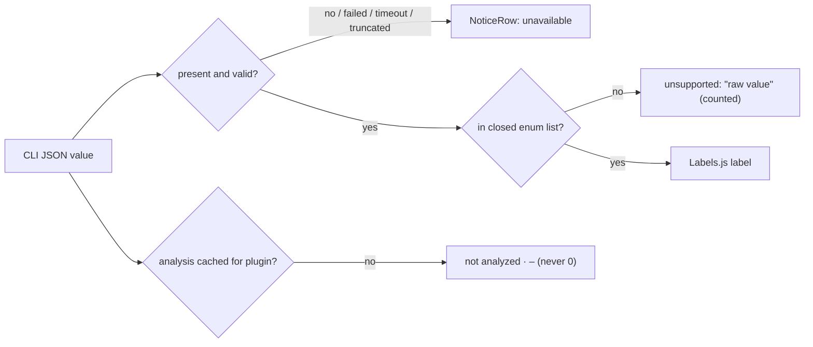

# OmaSafe design principles and language

This document fixes the rules every other design document and every line of the redesigned plugin must obey: twelve
principles that merge the Omarchy Quattro ethos with OmaSafe's six product ground rules, the visual system (type,
spacing, colour, encodings, borders, motion, glyphs, density, scaling) expressed only in `qs.Commons` tokens that exist
in the installed shell, the copy system with every status string the panel may print, and the review checklist a change
must pass to be called Quattro-native. It is the normative design reference for the companion UI, Trust Flow,
implementation roadmap, and research notes, which live in the sibling `omasafe-docs` project. Versions: omasafe-cli 0.2.1 · plugin
0.4.0 · Omarchy 4.0.2 Quattro · Quickshell 0.3.1 · Qt 6.11.2 · JetBrainsMono Nerd Font.

Contents

1. [Principles](#1-principles) — P1–P12, each with statement, why, do / don't, review test
2. [Visual system](#2-visual-system) — type roles, spacing, colour, encodings, borders, motion, glyphs, density, scaling
3. [Copy system](#3-copy-system) — voice, vocabulary, every status string, enum labels, tooltips, confirmations
4. [Quattro-native or not: review checklist](#4-quattro-native-or-not-review-checklist)
5. [Sources and references](#5-sources-and-references)

Ground rules are cited as GR1–GR6 in the order the brief lists them (no verdict · catalog claim is not trust · missing
renders unavailable, unknown renders unsupported · findings are evidence with confidence, coverage always visible ·
bounded processes in a long-lived shell · confirmed mutations with pinned identity, no keyboard bypass). Ethos
principles from the Quattro research are cited as E1–E14.

---

## 1 Principles

### P1 State, count and evidence — never a verdict (GR1, E14)

- **Statement.** Every element on screen states what the CLI observed: a state word, a count of things, or a row of
  evidence. No element exists whose only job is to look good or bad.
- **Why.** The panel is not the security authority; omasafe-cli reports drift, capabilities and coverage limits, and even
  the CLI refuses to call a plugin safe. Fear styling habituates (response drops from the second exposure) and a check
  glyph on "no findings" is read as "clean" by every user tested in the audit.
- **Do.** The hero title is the CLI's own status sentence (`3 alerts to review`, `No outstanding alerts`). Counts describe
  evidence volume (`5 review items`, `29 occurrences`), never quality. Severity is the rule's catalog default and is
  labelled as such. The PLUGINS footer defines what a baseline is. The bar shows a count in foreground; the urgent
  badge appears only for a critical / error alert or an enforcement block.
- **Don't.** Score, grade, percentage, meter, or "safe / clean / protected / verified (bare)". A green check is
  permitted only as the explicit `No active alerts` / `No local hits` marker described below; it is never a safety
  conclusion. Severity colours must always be paired with a word and glyph.
- **Review test.** Cover everything below the hero: the reader can state plugin count, data age and whether a scan is
  running, and cannot infer a safety judgment. Prefix any string with "It is a fact that…" and it stays true given only
  the CLI JSON.

### P2 Three authorities, three sections (GR2)

- **Statement.** A local trust baseline, a marketplace catalog claim and an enforcement decision are three different
  authorities. Each gets its own `PanelSectionHeader` with the authority named in the header's right slot; they never
  share a line, a pill, a glyph or a colour scale.
- **Why.** "Verified by marketplace" beside "TRUSTED" was the single most conflated moment in the audit. The catalog
  validates listings, not plugin security (its own `disclaimer` field says so), and a stale snapshot makes even that
  claim old news.
- **Do.** Headers `TRUST BASELINE` (no right value — the body's first line names the recorder), `MARKETPLACE CLAIM |
  CATALOG 65b6385 · 15 MIN`, `ENFORCEMENT | EVALUATED` / `NOT EVALUATED` / `NO DECISION` (the right value is the
  decision's `evaluation_state`; a recorded decision carries no advisory/hardened mode, so the header never prints one —
  03 §5.4). `registry_claim.verification_status`
  is prefixed `Catalog says:`; the CLI's correlation `status` renders as its §3.4 sentence, unprefixed and never as a
  bare enum word (the single rule of GR2, referenced by every other document). When `marketplace_stale` is true the word "verified" is suppressed
  in the whole section. The disclaimer string from `marketplace[].disclaimer` is quoted verbatim, once, in that section.
  Coverage maps are attributed to `rules coverage` `verified_at_commit` (964dc08…), never to the snapshot commit.
- **Don't.** "Verified plugin", a trust word on the same row as a catalog status, a marketplace layer in the Trust Flow,
  one IDENTITY block that mixes local and catalog facts.
- **Review test.** Search the rendered strings of every screen: no row contains both a trust word (`matches`, `differs`,
  `no baseline`) and a catalog word (`listed`, `listed commit`, `verified`, `unlisted`, `conflict`). `matches` and
  `differs` are reserved for the TRUST BASELINE comparison; the catalog's commit comparison says `is the listed commit` /
  `is not the listed commit` (§3.4), so the test also fails on any MARKETPLACE CLAIM string containing `matches` or
  `differs`.

### P3 Fail closed, in words (GR3)

- **Statement.** Missing, failed, truncated or stale data renders the literal word `unavailable`; an enum value outside
  the closed list renders `unsupported` with the raw value quoted; a plugin without a cached analysis renders
  `not analyzed`. None of these is ever hidden, zeroed, blanked or collapsed into an empty section.
- **Why.** An empty list reads as clean. `decision: null` means no decision was recorded, not "allowed" (enforcement.rs
  reason codes exist only on recorded decisions). The current `"Coverage: " + (… || "complete")` fallback at
  Panel.qml:3376 turns missing data into the most reassuring word available.
- **Do.** One `NoticeRow` with `reason ∈ {loading, none, unavailable, unsupported, stale, lexical-only}` for every
  non-value slot. `model/Labels.js` is the only enum→label map; anything unlisted returns `unsupported` and is still
  counted. Rule rows and `LOCAL HITS` print `–` until at least one plugin is analyzed (never `0`). `coverage_limitations`
  not an array → `Coverage unavailable`.
- **Don't.** "unknown", "n/a", "error" alone, a `0` that means "not measured", dropping an unrecognised alert kind, hiding
  a section whose absence is itself information.
- **Review test.** Run the panel against a fixture with an unlisted `classification`, a null `decision`, an analysis
  timeout and an empty `plugins[]`: each slot prints its word, every count is preserved, no section disappears. Feed
  `marketplace_stale: false` with `marketplace_age_seconds` = 40 days: the age renders without `(stale)` and "verified"
  is not suppressed — the panel has no staleness threshold of its own (§3.3).



### P4 Evidence carries its own quality; coverage is always visible (GR4)

- **Statement.** A review item is a rule match with two independent facts: catalog severity (the rule's default class)
  and confidence (where the evidence came from). Both are printed as words, never combined. `coverage_limitations` and
  `parser == null` are rendered whenever present, on every view that shows analysis results.
- **Why.** GitHub SARIF and Semgrep separate level from confidence for the same reason: a "low" text match and a "low"
  parser-backed match are different claims. A lexical-only build changes the meaning of every row, so it must be a
  persistent line, not a toast. Real data: sandman carries 13 limitations, omasafe 2, btop 3; all 10 local review items
  are `low` and parser-backed, which makes the two-word form the only honest one.
- **Do.** Words `parser-backed · text match only · no parser` beside `info · low · medium · high · critical`; two tooltips
  that define each axis. `COVERAGE | <n> LIMITS` renders without expansion whenever `n > 0`; `| NO LIMITS REPORTED` when
  the array is empty. Lexical-only analysis → `NoticeRow` under the hero plus dashed Trust Flow edges only where the
  represented support has no parser-backed evidence; unrelated and mixed edges remain solid.
- **Don't.** Confidence as ring/fill on the severity glyph, "risk", "vulnerability", a percentage of files covered,
  hiding COVERAGE behind a chevron.
- **Review test.** Open `lgse.sandman`: COVERAGE and its 13 grouped limits are visible with no interaction. Feed a
  `parser: null` fixture: the notice is on Overview, the detail sheet, Flow and Rules.

### P5 The confirmation shows exactly what is authorized (GR6, E8, E14)

- **Statement.** Every security-state mutation (record / replace / remove baseline, enable, reviewed update, schedule install) passes
  through `ConfirmSheet`, which prints the action-specific authorization facts that the CLI will compare atomically
  before writing: record/replace and enable use plugin id + required current Digest, with Head / Tree when present and
  visibly `unavailable` when null; remove uses plugin id + recorded
  baseline digest; review update uses plugin id + catalog-claimed target commit and shows the installed identity as
  context; schedule uses the unit names + exact effective scan argv/policy and has no plugin identity. Each sheet has one
  effect sentence, one caveat sentence, Cancel pre-selected and a confirm button labelled with the verb. No letter key
  opens or performs a mutation.
- **Why.** Quattro's own value statement for the polkit agent is "a themed prompt that shows exactly what's being
  authorized". Opinionated design is justified only at the decision point (Felt et al.). Today the scrim has no
  `MouseArea` (Panel.qml:2421–2428), Esc closes the panel with `*Confirming` flags left true, and a held Enter can reach
  a confirm.
- **Do.** Keep the kit `ConfirmDialog` key contract (`handleKey`: Esc cancels, Left/Right/Tab toggle, Enter fires the
  selected button only) but set `selectedIndex = 0` on every open; `keyCatcher.blocked = sheet.opened`; drop auto-repeat
  Return/Enter/Space and ignore non-repeat Return/Enter for the first 300 ms in `ConfirmSheet.Keys.onPressed` (03 §10).
  `swallowNextActivate` guards only same-event-loop double delivery; `navigationLocked` disables every action `Button`.
  Treat QML `targetStillExact` as a usability guard only;
  safety comes from expected values checked by the CLI inside the mutation lock. Gate Enable and Remove as unavailable
  until the selected CLI exposes those contracts, and raise `cliVersionMin` to that first supporting release.
- **Don't.** "Are you sure?", "Confirm" / "OK", elided or wrapped-by-word hashes, an accelerator such as `t` / `u` / `e`,
  a confirmation for Scan or Update catalog. Update catalog (`marketplace refresh --latest`, main.rs:4805
  `fetch_pinned_catalog`) is a non-destructive network fetch that replaces the local catalog snapshot — and with it every
  MARKETPLACE CLAIM row, the SOURCES age line and the basis of `provenance-conflict` alerts — so it is manual only, has no
  letter key, shows inline progress, and its `PanelActionButton` is gated on `!navigationLocked` like every other action
  so it cannot run under a sheet.
- **Review test.** Hold Enter on `Record baseline`: the sheet opens and nothing is confirmed. Press Esc: the sheet closes,
  the panel stays open, `pendingAction` is cleared. Click the scrim and scroll the wheel: nothing behind reacts. Change
  the source or recorded baseline after opening a sheet: the CLI rejects the now-stale expected value and writes nothing.

### P6 One kit, one vocabulary (E1)

- **Statement.** The panel is built from `qs.Ui` primitives and `qs.Commons` tokens and nothing else: `Panel`,
  `KeyboardPanel`, `PanelKeyCatcher`, `PanelHero`, `PanelSectionHeader`, `PanelSeparator`, `CursorSurface`, `Button`,
  `ButtonGroup`, `PanelActionButton`, `ToggleSwitch`, `TextField`, `PanelToolTip`, `OpticalGlyph`, `BorderSurface`,
  `PointerMoveGate`, `BarIconButton`.
- **Why.** A theme switch, font change or spacing change then re-skins the panel with zero panel code. Today the plugin
  uses 4 of the 32 components `Ui/qmldir` exports and re-implements the rest with 126 `Text`, 25 `Rectangle` and 6
  `MouseArea`, including a tab strip, seven cards, stat tiles and a confirm overlay that the kit already provides.
- **Do.** Rows are `CursorSurface`; buttons are `Button` / `PanelActionButton`; view chips are one `ButtonGroup`; headers
  are `PanelSectionHeader`; rules are `PanelSeparator`; the hero is `PanelHero`; the only local composites are those in
  the component inventory (companion roadmap §9) — `components/*` (`NoticeRow`, `SectionHeaderRow`,
  `InfoGrid`, `ActionRow`, `AlertRow`, `PluginRow`, `ClassRow`, `EvidenceRow`, `EdgeRow`, `SourceRow`, `RuleRow`,
  `RelationRow`, `CapabilityStrip`, `FactPill`, `Breadcrumb`, `FinderField`, `InspectorStrip`, `ConfirmSheet`),
  `graph/*` and `OmaSafeShield` — each composed from kit parts.
- **Don't.** A hand-rolled `Rectangle { color: … border.color: … }` card, pill, tab or scrim; a hex literal
  (`#e5a50a` at Panel.qml:153, BarWidget.qml:116, OmaSafeStatusIcon.qml:9); `Color.muted` (falls back to `foreground`,
  Color.qml:23 and 164).
- **Review test.** `grep -nE '#[0-9a-fA-F]{3,8}' *.qml components/*.qml views/*.qml graph/*.qml` is empty; every
  remaining `Rectangle` is a `BorderSurface` descendant or the documented scrim.

### P7 Type is a scale with a data floor (E2, G27)

- **Statement.** All type is `Style.font.{caption,bodySmall,body,subtitle,title,heading,display}` at the roles in §2.1.
  Anything read as data — ids, paths, line numbers, hashes, counts (including Flow node counts), rule ids, strip glyphs,
  matrix digits, button labels — is `bodySmall` or larger at every base size. `caption` is for headers, hero meta, hints,
  relative times and the footer.
- **Why.** `[font] base-size` is the rem root (Style.qml:327–338); the user knob runs 9–20 px. Panel.qml uses `caption`
  110 times, so at base 9 most of the panel is 7.5 px. First-party rows use `body` for primary text and `bodySmall` for
  key:value (power `InfoValue`, network 1961–1968).
- **Do.** One root binding `fontFamily: bar ? bar.fontFamily : Style.font.family` replaces the 154 ternaries. No literal
  `font.pixelSize`. Bold only for the hero title, headers, an outstanding-alert row, `differs`, `high`, `critical`.
- **Don't.** `caption` for a digest, a path or a count; `Style.font.*` multiplied; conditional token switching by base
  size (the role is fixed, the token scales).
- **Review test.** Set text size 9 and 20 via the Display panel: nothing clips or overlaps, no third line appears on a
  row, every hash is still `bodySmall`, `grep -c 'Style.font.caption'` is about 25.

### P8 Hero first, flat sections, two-line rows, rhythm 12 / 10 / 6 / 1 (E3, E9, E10, E11)

- **Statement.** The panel is one `PanelHero`, one `ButtonGroup`, then a flat sequence of `PanelSeparator` →
  `PanelSectionHeader` → rows. Outer `Column.spacing: Style.space(12)`, section `space(10)`, rows `space(6)`, lines
  `space(1)`. A row is `[glyph 22] [primary body / secondary bodySmall] [≤ 2 PanelActionButton]`.
- **Why.** Every first-party panel (tailscale, monitor, power, bluetooth, network) has this composition; the plugin has a
  header, a tab strip, cards with their own headers and tiles inside cards — three levels of grouping where the kit uses
  one.
- **Do.** Header right slot carries the count or authority (`ALERTS | 3`, `COVERAGE | 13 LIMITS`). Empty sections are
  hidden except those whose absence misleads (COVERAGE, lexical-only, unavailable). Plugin row line 2 is the
  `CapabilityStrip` plus `<n> items` (short form; `<n> review items` only in the detail-sheet header).
- **Don't.** Cards, nested grouping, a section behind a chevron, a third line on a row, a stat strip, a filled accent
  button.
- **Review test.** Count grouping devices on any screen: one `ButtonGroup` plus `PanelSectionHeader`s, nothing else. At
  base 12 a plugin row is ≤ `Style.space(44)` tall.

### P9 Semantic status is word + shape + colour (E4, E12, GR1)

- **Statement.** Content remains `fg` with three dim steps mixed toward the theme background (§2.3). The shared
  `SemanticMark` is the only exception: it reinforces explicit CLI states with a word, distinct glyph and
  theme-aware colour tier. Green is reserved for a current, explicit “No active alerts” or “No local hits” state;
  yellow marks medium/warning, amber marks high, red marks critical/error or blocked, and gray marks stale,
  unavailable or incomplete data. These are status cues, never a safety verdict.
- **Why.** The previous no-hue rule made warning and severity states unnecessarily hard to scan. Keeping the marker
  semantic, compact and always paired with text preserves accessibility while allowing the requested at-a-glance
  health signal.
- **Do.** Severity = word + glyph + tier colour; health = green check only for the two explicit clean facts; confidence
  = word (edges dashed in Analysis); trust = a right-aligned state word, bold only for `differs`; availability = dim
  word; occurrence counts = digits.
- **Don't.** `#e5a50a` or ad-hoc per-row hues, colour-only badges, green for stale/unavailable/not-analyzed data,
  opacity ramps on glyphs, `Color.accent` painted directly, `Color.muted`.
- **Review test.** Screenshot in `white`, `catppuccin-latte`, `retro-82`, `oxocarbon`, `ame-quattro`: every state is
  distinguishable with hue removed; verify each marker still prints its state word in expanded contexts.

### P10 The theme owns the surface (E5)

- **Statement.** Surface, border, radius and gap belong to `KeyboardPanel` and the theme: `Color.popups.*`,
  `Border.surfaceSpec("popups", …)`, `Style.cornerRadius` (mirrors Hyprland `decoration:rounding`), `Style.gapsOut`.
  Inside the card the only borders are `Border.controlSpec` (kit), `Border.flat(Color.accent, Style.normalBorderWidth)`
  on the confirm card and `Border.flat(urgent, Style.normalBorderWidth)` on an enforcement block row.
- **Why.** Themes vary from radius 0 (`retro-82`) to 4–6 px borders (`oxocarbon`) and 0.92 alpha with blur
  (`ame-quattro`); a second opaque plate or a fixed radius breaks all three.
- **Do.** Scrim `Util.alpha(Color.background, 0.7)` (the kit `ConfirmDialog` value) with a swallowing `MouseArea`; pills
  only as `FactPill` (§2.5 — the `PanelHero` detail-pill pattern, `BorderSurface` + `Border.controlSpec("normal")`,
  `radius: Style.cornerRadius`) on an expanded review item's severity and confidence words.
- **Don't.** `radius: 6`, `Util.alpha(Color.background, 0.94)` plates, a coloured border as a card frame.
- **Review test.** Switch `retro-82` → `ame-quattro` → `oxocarbon` live: every corner, border width and translucency in
  the OmaSafe panel follows without a shell restart.

### P11 Motion explains a change; nothing runs while closed (E6, E13, GR5)

- **Statement.** The motion set is {60, 120, 140, 900} ms: kit row and button fills, 140 ms `Easing.OutCubic` opacity for
  view swap / sheet push-pop / lens swap, 120 ms `ColorAnimation` on the hot edge stroke, 900 ms `Button.iconSpinning`
  only while `opened && checking`. No geometry `Behavior`s; no `Timer` beyond collector timeouts; no work while closed.
- **Why.** The shell is one long-running process; the release notes call it "event-driven rather than polled". A 160 ms
  column-width slide would misalign `PathSvg` edges mid-animation, so graph columns snap.
- **Do.** Keep last-good data visible with its age; flip a row after a successful trust and reconcile with
  `plugins status`; unload the Flow `Loader` when the panel closes; rebuild layout only on inventory / analysis / scope
  change.
- **Don't.** Auto-analyze on view open (analysis runs on `a` / `A` only); animate row height; poll; run a `Process` on
  hover or view switch; `layer.enabled`, `MultiEffect`, `Particles`, force simulation, `Canvas`.
- **Review test.** `grep -n duration` over the plugin shows only {60, 120, 140, 900}; every infinite loop is gated on
  `root.opened && <busy>`; with the panel closed the shell sits at idle CPU and RSS is flat after one hour of periodic
  scans.

### P12 One cursor, a fixed key grammar (E7, E8)

- **Statement.** The root owns `cursorActive`, `focusSection` and `selectedIndex`; every interactive row is a
  `CursorSurface` bound to that model; mouse hover sets the same cursor through `PointerMoveGate`; rows never read
  `containsMouse`. The `PanelKeyCatcher` grammar is law: Esc, Tab / Shift-Tab, arrows + hjkl, Enter / Space, `x`,
  single-letter accelerators; inline editors and the sheet set `blocked`.
- **Why.** Today Up / Down are swallowed, Enter is unbound, Tab switches bar panels so no `Button` ever receives focus,
  and hand-rolled rows paint their own hover — two highlights can coexist. The dev-gallery template
  (`GalleryPanel.qml:101–262`) is the sanctioned cursor model.
- **Do.** Digits switch views, `h` / `l` move horizontally or pop a level, `x` only unpins or collapses, `/` opens the
  finder, `?` shows the legend; `ensureCursorVisible` and `clampCursor` after every model change; cursor hidden on open
  until the first key or hover.
- **Don't.** `focusable: true` on any `Button`; a letter that mutates; Esc that closes the panel while a sheet is open;
  Backspace as a required key.
- **Review test.** Hover row A, press `j`: exactly one highlight, on row B. Reopen the panel: no highlight until a key or
  hover. Rescan with the cursor on the last row: it clamps.

---

## 2 Visual system

### 2.1 Type roles

Family is bound once on each root: `bar ? bar.fontFamily : Style.font.family`. No literal `font.pixelSize` anywhere.
Sizes at base 12 from Style.qml:327–338.

| Role | Token (px @12) | Weight / case | Where |
|---|---|---|---|
| Hero title | `Style.font.title` (14) bold | sentence case, `ElideRight` | `PanelHero.title` |
| Hero meta | `Style.font.caption` (10) bold, uppercased, `letterSpacing 1.2`, kit `PanelHero.dim` | kit (`PanelHero.qml:100`) | `PanelHero.meta` |
| Hero detail pill | `Style.font.body` (12) bold dim | kit | `PanelHero.detail`, shown only when it reads `unavailable` (the CLI version is a SOURCES row; 03 §3 gives the reasons) |
| Hero glyph | `Style.font.display` (24) | `iconOpacity 0.5` when unavailable | `OmaSafeShield` via `iconComponent` |
| Status line under hero | `Style.font.bodySmall` (11) | `urgent` on CLI failure, else dim | `Text` (tailscale 500–509 idiom) |
| View / lens chips | `Style.font.body` | bold when selected (kit) | `ButtonGroup` |
| Section header, header right value | `Style.font.caption` bold, `PanelSectionHeader` colour (kit) / `dimHeader` in `SectionHeaderRow` | literal uppercase | `PanelSectionHeader`, `SectionHeaderRow` |
| Row primary, notice text, button label, confirm body | `Style.font.body` | bold only for an outstanding alert row | `CursorSurface` rows, `NoticeRow`, `Button` |
| Key:value, digests, rule ids, paths, evidence, strip glyphs, matrix digits, node labels, node counts, trust word, `FactPill` text | `Style.font.bodySmall` | data floor (G27); `WrapAnywhere` only on hash-only `Text` | `InfoGrid`, `EvidenceRow`, `CapabilityStrip`, `MatrixGrid`, `FlowNode` (label and count), `FactPill` |
| Hints, relative times, footer, breadcrumb | `Style.font.caption` | dim | ≈ 25 uses in total |
| Row leading glyph | `Style.font.icon` (= title, 14) in a `Style.space(22)` column | `OpticalGlyph` | rows |
| Confirm title | `Style.font.title` bold | — | `ConfirmSheet` |
| Confirm buttons | `Style.font.body` (button-label role; deliberately not the kit's `caption` at `ConfirmDialog.qml:114`) | label = bare verb | `ConfirmSheet` |

### 2.2 Spacing rhythm

Rule: any `Style.space(n)` or `Style.spacing.*` token; never a bare pixel literal (the §4 blocker). The set the design
documents bind is n ∈ {1, 2, 3, 4, 6, 8, 10, 12, 14, 18, 20, 22, 28, 32, 34, 44, 72, 88, 190, 370, 400, 420, 560} plus
{780, 1120} for Phase 5 expanded mode only (04 §4.3, 05 §8); it is a preferred set, not a closed one — a new value needs a
stated reason in the document that introduces it, not an amendment here.

| Where | Value |
|---|---|
| Panel | compact: `fittedContentWidth(Style.space(420))` · `fittedContentHeight(h, Style.space(560))`; Phase 5 expanded: fitted `Style.space(1120)` × `Style.space(780)` target; the inner `space(480)` cap at Panel.qml:2394 goes |
| Vertical hierarchy | outer `Column.spacing: Style.space(12)` · section `space(10)` · rows `space(6)` · lines `space(1)` |
| Row | `implicitHeight: content + Style.spacing.rowPaddingX`; insets left `space(10)`, right `space(8)`; glyph column `space(22)`, glyph gap `space(8)` |
| Key:value | `GridLayout { columns: 2; columnSpacing: Style.space(20); rowSpacing: Style.spacing.labelGap }` |
| Action row | `Row { spacing: Style.space(6) }` of `Button { bordered: true }` |
| Confirm card | `width: min(parent.width − space(32), space(370))`, `padding: space(18)`, gap `space(10)` — kit `ConfirmDialog.qml:52–99` values. Buttons size to content with the kit minimum: `width: Math.max(Style.space(88), label.implicitWidth + Style.space(28)); height: Style.space(34)` (the kit's fixed `width: Style.space(88)` at `ConfirmDialog.qml:98` and `height: Style.space(34)` at `:99` fit `Cancel`/`Confirm` only; JetBrains Mono advances 0.6 em, so `Record baseline` at `body` is 108 units and would clip) |
| Graph | rows `Style.spacing.popupRowHeight`; rail `space(28)`; edge lane between the open pair `pairGutter = space(72)`; rail-to-neighbour `railGutter = space(12)`; body height derived from what the popup has left (04 §4.1 step 4: 10 rows at base 12), never a fixed cap |
| Long lists | `ListView { height: Math.min(contentHeight, Style.space(400)) }` (45 rules, source-use evidence) |

### 2.3 Colour roles and derivations

Declared once on each root; the shared `SemanticMark` owns the small, theme-aware semantic tier palette.

```qml
readonly property color fg:           bar ? bar.foreground : Color.foreground
readonly property color urgent:       bar ? bar.urgent : Color.urgent
// Opaque mix of fg toward the theme background (Color.background, the opaque palette value); k = 0 is fg, k = 1 is background.
function dimStep(k) { var b = Color.background; return Qt.rgba(fg.r * (1 - k) + b.r * k, fg.g * (1 - k) + b.g * k, fg.b * (1 - k) + b.b * k, 1) }
readonly property color dimHeader:    dimStep(0.25)   // section headers, header right value (≈ Qt.darker(fg, 1.4) on dark themes)
readonly property color dim:          dimStep(0.33)   // secondary lines, unavailable, unsupported, notices (≈ Qt.darker(fg, 1.5))
readonly property color faint:        dimStep(0.55)   // disabled glyphs, non-neighbour graph nodes (≈ Qt.darker(fg, 2.0))
readonly property color hoverFill:    Style.hoverFillFor(fg, Color.accent)
readonly property color selectedFill: Style.selectedFillFor(fg, Color.accent)
```

Rules: `Color.accent` reaches the screen only through the kit (`Style.*StateColor`, `Color.popups.border`,
`ConfirmDialog.selectedText`). `Color.muted` is never used. `Util.alpha(fg, …)` appears only inside `graph/EdgeLayer.qml`
(rest `Style.hoverBorderAlpha`, hot `0.9`) and inside the kit. `SemanticMark.qml` is the sole owner of semantic tier
colours and chooses readable light/dark variants from the theme background.

Why a mix toward background and not the kit's `Qt.darker` ladder (`PanelHero` 1.4, `Toggle` 1.5, `TextField` placeholder
1.6, `PanelActionButton` disabled 2.0): the hierarchy rests almost entirely on these three steps, because size contrast is
thin (`body` 12 vs `bodySmall` 11). `Qt.darker` only lowers lightness, so on a light theme it makes secondary text
*heavier* than primary — `catppuccin-latte` fg `#4c4f69` dims to `#323445` / `#262734`, and `white` fg `#000000` stays
`#000000` at every step, so headers, notices and disabled glyphs become indistinguishable from primary text. The kit has no
luminance-aware helper (`grep -iE 'isLight|luminance|lighter\('` over `Commons/` and `Ui/` returns nothing) and first-party
panels share the defect. `dimStep` is opaque (no wallpaper bleed, unlike alpha), works in both polarities, and on dark
themes lands within a few units of the `Qt.darker` values, so the panel still reads as the tailscale panel's sibling. This
is a deliberate divergence from `PanelHero.dim` / `PanelSectionHeader` (their own text keeps the kit colour; only OmaSafe's
`Text` uses `dimStep`). It is decided here, in Phase 1, not deferred: the Phase 1 acceptance screenshots include
`catppuccin-latte` and `white` at base 9. Panel.qml's 83 `Util.alpha` calls with ten distinct foreground alphas are
replaced by these three names.

### 2.4 Semantic encodings

Order of channels: the word is always printed; shape adds a glyph; the shared marker adds a tier colour; weight adds bold.
Hue never carries meaning alone and there are no opacity ramps. Nothing below encodes a verdict.

| Meaning | Word (always) | Glyph | Weight / paint |
|---|---|---|---|
| Trust `unchanged` / `partial` / `untrusted` (never) / `untrusted` (revoked) | matches baseline · matches · coverage limited · no baseline · baseline revoked | none | regular |
| Trust `changed` | differs · N files | `󰀦` | bold |
| Trust loading / unavailable / unsupported | checking… / unavailable / unsupported | none | dim |
| Severity `info` / `low` / `medium` / `high` | the word | info / info / medium / alert glyph | regular / regular / regular / bold; blue / blue / yellow / amber tier |
| Severity `critical` / unknown | critical / unavailable | critical / hollow glyph | bold red / dim gray |
| Health `healthy` / `stale` / `incomplete` | No active alerts / cached result / analysis incomplete | check / hollow glyph | green only for current healthy; gray otherwise |
| Confidence `ast-backed` / `lexical-fallback` / `null` | parser-backed / text match only / no parser | none in rows; Flow edges solid / dashed / dashed | — |
| Scan alert row | kind label (§3.3) | `󰀦` in fg; `urgent` only for `critical` / `error` | bold primary line |
| Catalog claim | Catalog says: … | none — never a pill, never beside a trust word | regular |
| Snapshot stale | Snapshot N days old (stale) | none | dim; "verified" suppressed in the section |
| Enforcement `block` | Blocked: <reason codes> | `󰂭` in `urgent` | row `Border.flat(urgent, Style.normalBorderWidth)` |
| Enforcement `allow` / `decision: null` | Allowed by policy · Allowed by override · two-sentence null (§3.3) | none | regular / dim |
| Unavailable / unsupported / not analyzed | the literal word; `–` in a count or cell slot | hollow `󰝦` on graph nodes only | dim; hero glyph `iconOpacity 0.5` |
| Lexical-only build (`parser == null`) | Lexical-only analysis (no QML parser). Review items are text matches. | `󰀦` in fg | persistent `NoticeRow` |
| Coverage limitations | N limits (header right value) | none | fg, rows expand inline |
| Relation `structural-equivalent` / `partial-overlap` / `not-covered` | Equivalent check / Partially covered / Not covered by OmaSafe | `=` / `≈` / none (no mark; the dim word `not covered` where a slot has room, 04 §2.1) | regular / regular / dim, row present |
| Occurrence / edge weight | digits | edge thickness `space(1)` ≤ 3 · `space(2)` 4–9 · `space(3)` ≥ 10 | never area, angle or hue |
| Cursor / current | — | — | `CursorSurface.hasCursor` → `hoverFill` + `Border.controlSpec("hover-cursor")`; `current` → `selectedFill` |

Notes. Every displayed severity tier has a glyph and a distinct marker colour — info/low use the info glyph, medium the
medium glyph, high the alert glyph and critical the critical glyph — so high and critical never differ by hue alone.
Health uses the green check only for the two explicit current no-alert/no-hit facts; stale, unavailable and incomplete
states remain gray. `󰝦` therefore means
exactly one thing: a hollow, unanalyzed or unavailable node in Flow. `󰄬` is never a state glyph; "matches baseline" is a
word only. Five hues are forbidden and Bertin's value channel (opacity) would be read as importance.

Placeholder vocabulary (one set, every view): `–` = not analyzed / no data, wherever a count or cell would go — the
`CapabilityStrip` of an unanalyzed plugin, a `MatrixGrid` cell, a Flow node count, a rule row's `LOCAL HITS`, the
Baseline coverage `exercised here` column; `·` = analyzed and not observed (strip and matrix); `unavailable` = the word,
when a fetch failed. The strip for an unanalyzed plugin prints a single `–` followed by `not analyzed`, never a run of
placeholders. No other placeholder mark exists.

### 2.5 Radius, borders, surfaces

- Radius: `Style.cornerRadius` on rows, confirm card, graph nodes and `FactPill`.
- Pills: `components/FactPill.qml` is the kit's own non-interactive pill, the `PanelHero` detail pill
  (`Ui/PanelHero.qml:67–87`): `BorderSurface { implicitWidth: text.implicitWidth + Style.space(10); implicitHeight:
  text.implicitHeight + Style.space(4); color: "transparent"; borderSpec: Border.controlSpec("normal", fg, Color.accent);
  radius: Style.cornerRadius }` with a `bodySmall` `Text` in `dim`, and a `PanelToolTip` shown on the parent row's
  `hasCursor`. It carries the severity and confidence words of an expanded review item. A disabled `Button` is never
  used as a label: it inherits disabled chrome, the cursor model would have to skip it, and it violates "one component
  for every clickable thing".
- Borders: `Border.controlSpec("normal" | "hover-cursor" | "selected", fg, Color.accent)` via `CursorSurface` / `Button`
  (never called by hand on a plain `Rectangle`); `Border.flat(Color.accent, Style.normalBorderWidth)` on the confirm
  card (kit `ConfirmDialog.qml:57` uses `selectedText`); `Border.flat(urgent, Style.normalBorderWidth)` only on an
  enforcement block row.
- No content is boxed. The seven tinted cards at Panel.qml:2591, 2667, 3044, 3242, 3394, 3625, 3722 become
  `PanelSeparator` + section `Column`.
- Scrim: `Util.alpha(Color.background, 0.7)` with a `MouseArea` that swallows clicks and wheel (the 0.94 plate at
  Panel.qml:2425 has none).
- Rows are transparent at rest; only cursor and current paint a fill. Tinted severity rows and `Button { background:
  Color.accent }` (Panel.qml:2341, 3529) are removed.

### 2.6 Motion

| Change | Duration / easing | Source |
|---|---|---|
| Row cursor / current fill | 60 ms `ColorAnimation` | `CursorSurface.qml:39`, `PanelActionButton.qml:69` |
| Button fill | 120 ms `ColorAnimation` | `Button.qml:128` |
| View swap, sheet push / pop, lens swap (`Loader` opacity) | 140 ms `Easing.OutCubic`, no slide | matches `KeyboardPanel.qml:393` |
| Hot edge stroke in Flow | 120 ms `ColorAnimation` on `ShapePath.strokeColor` | one per hot bucket |
| Scan in flight | `Button.iconSpinning` 900 ms loop, `running: root.opened && checking`; bar `RotationAnimation` same gate | `Button.qml:175` |
| Graph column width, row expand / collapse, anything while `!root.opened` | none — columns snap so `PathSvg` edges stay aligned | — |

### 2.7 Iconography

Glyphs are text in the monospace Nerd Font, sized by token (`Style.font.icon` in rows, `display` in the hero,
`bodySmall` in the strip and matrix), coloured `fg` or `dim`; state is shown by swapping the glyph or dimming, never by
recolouring. All codepoints below were re-verified today against `/usr/share/fonts/TTF/JetBrainsMonoNerdFont-Regular.ttf`
with fontTools, by **codepoint and glyph name** (`cmap[cp]` from `TTFont.getBestCmap()`): 47 of 48 present, the one absent
glyph, U+25D0, is banned. Presence alone is not enough — an earlier pass accepted U+F099F, U+F10A2 and U+F0053 because they
existed, while the font maps them to `md-set_top_box`, `md-decimal_comma` and `md-arrow_left_drop_circle_outline`. The
Phase 1 acceptance check (05 §4) therefore asserts the name for every row, e.g. `cmap[0xF0483] == 'md-security'`,
`cmap[0xF0499] == 'md-shield_outline'`, `cmap[0xF1513] == 'md-dock_top'`, `cmap[0xF120E] == 'md-archive_outline'`,
`cmap[0xF0029] == 'md-alert_octagon'`; `model/Glyphs.js` carries the expected name beside each codepoint so the check
reads the same table the panel does. `Glyphs.js` selects the ASCII column when
`Style.font.resolvedFamily.indexOf("Nerd") < 0`; the fallback is a legibility floor, not a design target, and no ASCII
character is assigned to two meanings.

UI glyphs

| Meaning | Glyph | Codepoint | ASCII | Meaning | Glyph | Codepoint | ASCII |
|---|---|---|---|---|---|---|---|
| shield, filled (bar, hero; a scan result exists) | `󰒃` | F0483 `md-security` (tailscale/Panel.qml:767) | `S` | in flight | `󰦖` | F0996 `md-progress_clock` | `/` |
| shield, outline (no scan result: ready, CLI missing / incompatible, failed with nothing prior; 03 §2) | `󰒙` | F0499 `md-shield_outline` | `s` | | | | |
| rescan | `󰑐` | F0450 | `@` | copy | `󰆏` | F018F | `c` |
| back / open | `󰅁` `󰅂` | F0141 F0142 | `<` `>` | expand / collapse | `󰅀` `󰅃` | F0140 F0143 | `v` `^` |
| alert / differs / high | `󰀦` | F0026 | `!` | info | `󰋽` | F02FD | `i` |
| critical (alert-octagon) | `󰀩` | F0029 | `O` | medium (filled circle) | `󰝥` | F0765 | `*` |
| hollow node (not analyzed / unavailable, Flow only) | `󰝦` | F0766 | `o` | rule | `󰧮` | F09EE | `R` |
| enforcement block | `󰂭` | F00AD | `X` | catalog / Baseline V3 | `󰆼` | F01BC | `B` |
| expand Flow | `󱁉` | F1049 | `#` | Git checkout | `󰊢` | F02A2 | `g` |
| installed without git | `󰏗` | F03D7 | `p` | backup copy | `󱈎` | F120E `md-archive_outline` | `b` |
| unsupported | `󰘥` | F0625 | `?` | | | | |

F0029 is `md-alert_octagon` in the installed font (verified with fontTools today; F068C, sometimes quoted for an
octagon, is `md-skull` and is not used). The outline shield is F0499 `md-shield_outline`, the MDI outline of the filled
`md-shield`; the filled form stays F0483 `md-security` because it is the glyph the tailscale panel draws and the two read
as a pair at `display` and `icon` size (F099F, previously listed here, is `md-set_top_box`). The backup glyph is F120E
`md-archive_outline`: an outlined box beside the filled package `󰏗` of "installed without git", and unlike F006F
`md-backup_restore` it does not share the circular-arrow shape of rescan `󰑐` (F0053, previously listed here, is
`md-arrow_left_drop_circle_outline` and would read as a second back affordance beside `󰅁`). The in-flight ASCII fallback
is `/` (spinner idiom); `~` belongs to the relation mark `≈` alone.

Capability classes. **Catalog order** is defined once, here: the order in which classes first appear in `rules list`
(`rules-list.json`, catalog v7), numbered below. `CapabilityStrip` and `MatrixGrid` always use catalog order, so a
column or strip position means the same class on every plugin. The Flow CAPABILITIES layer is the one exception: it
orders nodes by occurrences descending, id ascending, then barycentre-adjusts (04 §4.1), because edge crossings matter
more there than positional memory; its labels carry the glyph and name, so no position is read blind.

| # | Class | Glyph | Codepoint | ASCII | # | Class | Glyph | Codepoint | ASCII |
|---|---|---|---|---|---|---|---|---|---|
| 1 | process-execution | `󰆍` | F018D | `PX` | 10 | compositor-control | `󰍹` | F0379 | `WM` |
| 2 | detached-process-execution | `󰏌` | F03CC | `DX` | 11 | polkit-agent-ui | `󰯄` | F0BC4 | `PK` |
| 3 | filesystem-access | `󰉖` | F0256 | `FS` | 12 | session-lock-surface | `󰍁` | F0341 | `LK` |
| 4 | sensitive-path | `󰌆` | F0306 | `SP` | 13 | pam-authentication | `󰀋` | F000B | `PA` |
| 5 | input-injection | `󰌌` | F030C | `IN` | 14 | dynamic-code-execution | `󰅩` | F0169 | `DC` |
| 6 | screen-capture | `󰹑` | F0E51 | `SC` | 15 | shell-ipc-inventory | `󰌘` | F0318 | `IPC` |
| 7 | network-access | `󰖟` | F059F | `NW` | 16 | replaces-bar-context | `󱔓` | F1513 `md-dock_top` | `BAR` |
| 8 | persistence-scheduling | `󰔛` | F051B | `TM` | 17 | bundled-binary | `󰍛` | F035B | `BIN` |
| 9 | clipboard-access | `󰅌` | F014C | `CB` | — | unknown class | `󰘥` + "unsupported" | F0625 | `??` |

Class 16 is F1513 `md-dock_top` — a panel docked at the top edge, which is where the Omarchy bar sits; F10A2, previously
listed here, is `md-decimal_comma` and would have drawn a comma in the strip, the Matrix header and the Flow node.

Text glyphs (Unicode, verified present): relation `=` `≈` (a not-covered row has no mark); edge `─▶`; breadcrumb `›`;
placeholders `·` (analyzed, none observed) and `–` (not analyzed / no data — the single placeholder of §2.4); rail `+N`.
ASCII fallback: `~` (for `≈` only; in flight is `/`) `->` `>` `.` `-`. Never: `┄` or any second placeholder mark, `󰄬` as a state, the `✓ … ⟳ ? !` alphabet of
`OmaSafeStatusIcon.qml`, emoji, U+25D0.

### 2.8 Density

Rows are two lines. Plugin row line 1: classification glyph · id (`ElideMiddle`) · right-aligned trust word; line 2:
17-glyph `CapabilityStrip` · `<n> items` / `not analyzed` / `analysis unavailable` (short form; tooltip `review items`;
the long form `<n> review items` is the detail-sheet header only). Review item row: severity
glyph · title; `rule_id · path:line · confidence word` (`ElideRight`). Rule row: `rule_id`; `class · catalog severity ·
relation`. Nothing has a third line; long text elides, prose wraps with `WordWrap`, hashes wrap with `WrapAnywhere`.

```
[p ] io.github.tuthan.omasafe                        no baseline
     PX ·  ·  ·  ·  ·  · TM ·  ·  ·  ·  ·  ·  ·  ·  ·          1 item
[g ] lgse.sandman                                    no baseline
     PX · FS ·  ·  ·  · TM · WM ·  ·  ·  ·  ·  ·  ·  ·         2 items
[p ] io.github.hvo.omarchy-unraid                    no baseline
     –                                               not analyzed
```

ASCII stand-ins are used above for the Nerd glyphs (`g`/`p` classification, two-letter class codes); strip positions
follow the catalog order of §2.7. Values are from the captured fixture: `io.github.tuthan.omasafe` is
`classification: built-in` (no git remote, so `p`) and `state: untrusted` with reason `no trust baseline exists`; the only
`unchanged` plugin in the fixture is `io.github.tuthan.dropdown-terminal`. The 17-glyph strip's `implicitWidth` at base 12 is
estimated at ≈ 130 px (0.6 em advance) and is measured and recorded here by the Phase 1 acceptance pass (05 §4) — the
non-Mono Nerd variant's glyph advance may exceed 0.6 em, and 03 §4.1 caps the strip `Text` at `Style.space(190)`.

### 2.9 Text scaling and light / dark

The Display panel snaps `[font] base-size` to 9, 10, 11, 12, 14, 16, 20 (`monitor/Panel.qml:59`); acceptance
screenshots are taken at 9, 12, 16 and 20.

| Base | Card width (units → px) | Behaviour |
|---|---|---|
| 9 | 420 → 315 | trust word abbreviates (`matches`, `differs · 3`, `no baseline`); strip stays (17 × bodySmall ≈ 130 px); Flow open columns 87 units each (04 §4.3) with 11-character `ElideMiddle` labels; digests wrap per character |
| 12 | 420 | as wireframed in the companion UI proposal |
| 16 | 560 | labels rarely elide; Flow open columns 157 units each |
| 20 | 700, capped by `fittedContentWidth` at the screen | row heights grow with `rowPaddingX`; confirm card stays `min(width − 32, space(370))`; nothing has a fixed pixel width |

Themes: everything derives from `fg`, `urgent`, `Color.accent` through the kit, so the panel re-skins live
(Color.qml:19–23 palette, 135–165 `loadColors`). Acceptance themes: `white` (urgent `#2a2a2a` — nothing may rely on red reading as red),
`catppuccin-latte`, `retro-82` (radius 0), `oxocarbon` (thick borders), `ame-quattro` (0.92 alpha, blur). Flow edges
bind their rest alpha to `Style.hoverBorderAlpha` so the theme's own control-border contrast applies.

---

## 3 Copy system

### 3.1 Voice

Factual, present tense. Sentence case with a period for messages; uppercase for hero meta (the kit uppercases) and
section headers (literal). No exclamation marks, no "Are you sure?", no adjectives of judgment. Banned words in UI
copy: clean, safe, protected, verified (bare), risk, dangerous, permission, unknown, gate, preflight, mutation,
fingerprint (outside PROVENANCE), interposed, equivalence map. Test for every string: prefix "It is a fact that…" and it
stays true given only the CLI JSON. "Trusted" appears only in the PLUGINS footer definition and in confirm titles
("trust baseline").

### 3.2 Vocabulary

| Use | Never | Why |
|---|---|---|
| capability (observed in source) · use · source location | permission, grant, request | A use is one capability reference emitted by analysis; Omarchy has no permission boundary, so this is evidence rather than a granted permission |
| review item (rule match) | finding (in UI), vulnerability, issue | "finding" stays in code and JSON |
| alert (scan alert) | finding, item to review, warning (noun) | ends both collisions |
| baseline · Record / Replace / Remove baseline · matches / differs from baseline · no baseline · baseline revoked | Trust source / identity, trusted, untrusted, clean, changed (alone) | trust is the user's act; the state is a comparison |
| Catalog says: … · catalog snapshot · listed | verified plugin, marketplace verified | attribution every time (GR2) |
| snapshot integrity verified | verified (bare) | it is the file, not the plugin |
| catalog severity | risk, danger level | the rule's default class |
| parser-backed · text match only · no parser | confidence high / low | names the evidence source |
| unavailable · unsupported · not analyzed · nothing observed · not analyzable | unknown, error (alone), 0, blank, n/a | fail-closed vocabulary (GR3) |
| decision · Blocked: … · Allowed by policy | gate, preflight, mutation, interposed | plain outcome words |
| Git checkout · Installed without git · Installed without git (local copy) · Backup copy (not scanned) · First-party: yes / no / not stated | Git-managed, built-in (raw), cloned/local (raw), "shell built-in" | both non-git values have `repository: null`; a parenthesis states only what the CLI asserted (omasafe-plugin-trust/src/lib.rs:353–359: `built-in` when the shell reports `first_party == true` **or** `cloned_from == ""`, so `built-in` does not imply first-party — both fixture built-ins report `first_party: false`); first-party status is its own fact line from the record's `first_party` field (`true` / `false` / null) |
| evidence · what to check | proof, exploit | `evidence` and `review_guidance` are the CLI's fields |

Preserved verbatim from today: the footer sentence (§3.3), the CLI `disclaimer` pass-through, "No outstanding"
phrasing, the confirm caveat "does not establish that the plugin is safe".

### 3.3 Status strings

Hero titles: `No outstanding alerts` · `1 alert to review` / `<n> alerts to review` · `1 critical alert to review` /
`<n> critical alerts to review` · `Scanning…` · `Ready to scan` · `Scan unavailable` · `omasafe-cli not found` ·
`omasafe-cli incompatible` · detail sheet: `<plugin id>`.

Hero meta fragments (` · `-joined; the kit uppercases): `<n> PLUGINS` · `<n> NEW` · `SCANNED <relative>` · `LAST SCAN
FAILED` · `SHOWING <n> ALERTS FROM <relative>` · `EARLIER RESULT: NO ALERTS · <relative>` · `NO EARLIER RESULTS` ·
`READING INSTALLED STATE` · `INSTALL OMASAFE-CLI, THEN RESTART THE SHELL` · `<found> FOUND · <min> OR NEWER REQUIRED` ·
detail sheet: `GIT CHECKOUT · 35 FILES · SERVICE, BAR WIDGET`. A failed scan always titles `Scan unavailable`; the two
`SHOWING … FROM` / `EARLIER RESULT` fragments carry the stale facts, and `No outstanding alerts` is never printed from
stale data (03 §3). Detail pill: `unavailable` only — the CLI version is the first SOURCES row, never a hero pill (03 §3).

Relative time (`model/Time.js`): `just now` (< 60 s) · `<n> min ago` · `<n> h ago` · `yesterday` · `<n> days ago`; ISO
value in a tooltip. Ages: `<n> min old` · `<n> days old` · `<n> days old (stale)` when and only when
`result.marketplace_stale` is true. `Time.js` formats ages and decides nothing: the staleness flag is the CLI's
(omasafe-cli/src/main.rs:4649, currently `marketplace_age_seconds > 30*24*60*60`), and the panel keeps no threshold of its
own, so a change to the CLI's policy never leaves the two disagreeing. The same flag, alone, suppresses "verified" in
MARKETPLACE CLAIM (§3.4).

Loading (one verb): `Loading plugins…` · `Loading analysis…` · `Loading rules…` · `Loading coverage map…` · `Loading
catalog…` · `Loading decision…` · `Checking baseline…` (per row) · `Updating catalog… <n> s` · `Scanning…`.

Unavailable: `<Noun> unavailable: <verbatim CLI reason>.` · `omasafe-cli timed out after 30 seconds.` · `Output was
larger than 2 MiB and was discarded. Run \`omasafe-cli <command>\` in a terminal.` · `omasafe-cli is not installed or
not on PATH.` · gate: `Plugins, review items, rules and the trust flow are unavailable until omasafe-cli 0.2.1 or newer
is found on PATH.`

Empty (reasoned, never blank): `No alerts outstanding.` · `No plugins installed.` · `No review items in analyzed files.
<n> files were not analyzed.` · `No capabilities observed in analyzed files.` · `No decision has been recorded. A
decision exists only after a gated enable or reviewed update.` · `No override records. This panel cannot create
overrides.` · `No plugin, class, rule or baseline id matches "<text>".` · `Not analyzed. Press a or Analyze.` (no
timing promise — the 126–182 ms figure is a warm-cache measurement on one machine; the `Analyze` button's tooltip carries
the key).

Trust rows (long form in the detail sheet / short form on the plugin row): `No trust baseline recorded` / `no baseline`
· `Baseline revoked; record a new one to resume drift reports` / `baseline revoked` · `Installed source matches the
baseline you recorded` / `matches baseline` · `Matches the baseline; coverage is limited (see COVERAGE)` / `matches ·
coverage limited` · `Installed source differs from the baseline · <n> files changed` / `differs · <n> files` ·
`Baseline status unavailable: <reason>` / `unavailable`. PLUGINS footer: `A baseline is the exact source identity you
recorded. "Matches" and "differs" compare the installed files against it; neither is a safety judgment.`

Alert kinds (`Labels.alertKind`; line 2 = `<plugin id> · reported <relative>` + ` · plugin changed` when `post_change`):

| `kind` | Primary line |
|---|---|
| `source-drift` | Source differs from baseline |
| `missing-plugin` | Recorded plugin is missing |
| `lost-coverage` | Coverage lost |
| `bar-replacement` | Third-party bar replaces the OmaSafe widget |
| `provenance-conflict` | Repository conflicts with catalog |
| `new-capability` | New capability class observed |
| `finding-regression` | New review item: <rule> |
| `analyzer-policy-update` | Analyzer policy changed; re-evaluated |
| `analyzer-improvement` | Results changed under unchanged source |
| `fingerprint-instability` | Analysis was not deterministic; review required |
| other | Unsupported alert kind: "<kind>" |

Success lines (rendered in place; `trustOutput` is rendered, unlike today): `Baseline recorded for <id> at digest
<12>.` · `Baseline replaced for <id> at digest <12>.` · `Baseline removed for <id>.` · `<id> enabled.` · `<id> updated
to <commit7> and baseline recorded.` · `Schedule installed (<policy>).` · `Catalog updated to <commit7>.`

`<id> enabled.` is keyed on the CLI's own words, never on exit status alone: `plugins enable --format json` prints
`EnableResult { plugin_id, policy, enabled, decision }` (main.rs:2216–2221) and under a hardened block or a failed
postcondition prints `enabled: false` before returning exit 1 (main.rs:2345, 2374, 2449). The success line renders only
when `schema === "omasafe.report.v1" && result.enabled === true`; otherwise the same JSON renders `Enable refused:
<decision.reason_codes, hyphens replaced by spaces>` and ENFORCEMENT is re-fetched. A future exit-code change can then
never render a block as enabled (GR3).

Footer (Overview only, once per panel, verbatim): `OmaSafe reports changes and coverage limits. It does not declare
plugins safe.`

### 3.4 Enum labels (`model/Labels.js`; unknown → "unsupported", counted, never dropped)

| Field | Value → label |
|---|---|
| `classification` | `Git-managed` → Git checkout · `built-in` → Installed without git · `cloned/local` → Installed without git (local copy) · `backup` → Backup copy (not scanned) · `unscannable` → Unscannable: <classification_reason> · other → Unsupported classification: "<value>". All five are emitted values (omasafe-plugin-trust/src/lib.rs:340–370: non-git is `built-in` only when the shell reports `first_party == true` or `cloned_from == ""`, else `cloned/local`). `built-in` carries no parenthesis: the `cloned_from == ""` branch makes it true for plugins the shell does not call first-party (fixture: `io.github.tuthan.omasafe` and `io.github.hvo.omarchy-unraid` are `built-in` with `first_party: false`), so "shell built-in" would assert what the CLI did not |
| `first_party` (plugin record) | `true` → First-party: yes · `false` → First-party: no · null → First-party: not stated (null on every `backup` record in the fixture). A separate `InfoGrid` fact line in the detail sheet, never folded into the classification label |
| marketplace `status` | `listed` → Listed in catalog snapshot · `installed-differs` → Listed; installed commit is not the listed commit · `unlisted` → Not in catalog snapshot · `conflict` → Catalog entry not matched: installed repository conflicts with the listing or is unavailable · `incomplete` → Catalog entry incomplete. One-line contexts (the Flow inspector line, 04 §5) use `Labels.marketplaceStatusShort`: `listed` → Listed in snapshot · `installed-differs` → Listed; not at listed commit · `unlisted` → Not in snapshot · `conflict` → Catalog entry not matched · `incomplete` → Catalog entry incomplete. `conflict` is followed by the CLI `reason` verbatim, and when `plugin.repository == null` by the fact line `Installed repository: unavailable (no git remote)` — the CLI emits `conflict` whenever the id matched but no repository matched, including when the repository was simply absent (omasafe-marketplace/src/lib.rs:367–371; in the fixture `io.github.tuthan.omasafe` and `io.github.hvo.omarchy-unraid` are this case), so the label must not assert a definite conflict (GR3). `matches` / `differs` never appear in a marketplace label: they are the TRUST BASELINE comparison words (§3.2, P2), and a reader who has learned `differs` = source drift would read `installed-differs` as drift from the baseline; the catalog comparison is always phrased against "the listed commit" |
| `registry_claim.verification_status` | `verified` → Catalog says: verified · `unverified` → Catalog says: unverified · null → Catalog says: not stated · other → Catalog says: "<value>" |
| `registry_claim.upstream_moved` | true → Upstream has moved past the validated commit · false → Upstream still at the validated commit · null → Upstream movement not stated (`Option<bool>`, lib.rs:85; null whenever `listing_validated_commit` or `upstream_observed_commit` is absent, lib.rs:392–398) |
| `registry_claim.installed_matches_listing` | true → Installed commit is the listed commit · false → Installed commit is not the listed commit · null → Listing commit not stated (`Option<bool>`, lib.rs:86; null when either commit is absent, lib.rs:387–391) |
| `marketplace_source` | `pinned-fetch` → pinned fetch, snapshot integrity verified · `unverified-cache` → cached snapshot, not re-verified · `local-file` → local catalog file · absent → snapshot unavailable |
| `marketplace_stale` | true → Snapshot <n> days old (stale); "verified" suppressed in the section |
| trust `state` | `untrusted` (+`reason`) → no baseline / baseline revoked · `unchanged` → matches baseline · `partial` → matches · coverage limited · `changed` → differs · <n> files · panel `unavailable` |
| coverage state | `analyzed` → analyzed · `partial` → partially analyzed · `skipped` → skipped · `truncated` → truncated · `unsupported` → not analyzable · `unreferenced` → nothing observed |
| `confidence` | `ast-backed` → parser-backed · `lexical-fallback` → text match only · null → no parser |
| `severity` (rule default and alert) | `info` `low` `medium` `high` `critical` → the word; alert `warning` / `error` → the word; other → unsupported |
| `relation` | `structural-equivalent` → Equivalent check · `partial-overlap` → Partially covered · `not-covered` → Not covered by OmaSafe · row with neither `omaRuleId` nor `omaCapability` → Inventory behaviour only (see note) |
| enforcement | `evaluation_state` `evaluated` / `not-evaluated` → Evaluated / Not evaluated · `outcome` `allow` + `authorization_basis` `policy` → Allowed by policy · `override` → Allowed by override · expires <date> · `block` → Blocked: <reason codes, hyphens replaced by spaces> · `decision: null` → the two-sentence empty state |
| schedule (`Labels.schedulePolicy`) | `installed: false` → not installed · `policy` `advisory` → Advisory: daily drift scan, reports only · `hardened` → Hardened: daily drift scan with analysis, reports only · `last_known_execution` → Last run <relative> · exit <n> / Last run unavailable · `metadata_consistent: false` → Unit metadata inconsistent. The only effect of `--policy hardened` on the unit is ` --include-analysis` appended to `ExecStart=… scan --notify --only-new`, and `report_only` is always `true` (main.rs:3424–3500); a scheduled scan never refuses enable or update |
| enforcement policy (`Labels.enforcementPolicy`, enable and review update only) | `advisory` → Advisory: reports and proceeds · `hardened` → Hardened: may refuse. Never reused for the schedule row |
| limitation code | four grammars (01 §8.3), matched in this order — the parser tests the known-code prefixes of (2), (3) and (4) first and falls back to the file grammar (1) only for an unknown kind, because a `<code>:<value>` code read under (1) would print its value as a file name: (1) `kind[:sub]:file[:line[:target]]` parsed and grouped by file then kind: `LidService.qml · 5 sink references rejected (absolute) · 8 missing local target` (the fixture's 13 `lgse.sandman` codes), `dataflow-assignment-depth-limit:Panel.qml` → `Panel.qml · dataflow depth limit reached`; (2) `sink-reference-rejections-truncated:<n>` → `<n> further sink-reference rejections not listed`; (3) bare codes with no file segment — `analysis_time_budget_exhausted`, `time_budget_exhausted`, `file_limit_exceeded`, `aggregate_byte_limit_reached`, `tree_depth_limit_exceeded`, `directory_entry_limit_exceeded`, `symlink_target_truncated`, `staged-script-analysis-budget-exhausted` — are known codes rendered verbatim as their own group (`Analysis limits · <code> · <code>`), never as "unsupported limitation"; (4) `<code>:<value>` codes with no file, appended by `plugins analyze` (omasafe-cli/src/main.rs:5404–5411, 5457–5459, 5470–5473) — `suppressions-unreadable:<error text>` (the value is free-form and may itself contain colons; everything after the first colon is the value), `suppression-reconfirmation-required:<n>`, `equivalence-map-stale:map-v<x>-observed-v<y>` — are known codes rendered as their own group `Suppressions and equivalence map` with the value verbatim: `Suppressions unreadable: <error text>` · `<n> suppressions need reconfirmation` · `Equivalence map stale: map-v<x>-observed-v<y>`. Raw codes one Enter away; anything else → verbatim + unsupported limitation |

### 3.5 Coverage, Baseline V3 and ineligible verbs

Coverage: per-file summary `3 analyzed · 4 partially analyzed · 3 nothing observed · 8 not analyzable` (never a
percentage); header `COVERAGE | 13 LIMITS` or `COVERAGE | NO LIMITS REPORTED`; `coverage_limitations` not an array →
`Coverage unavailable`. Filters print what they hide, appended to the section header value: `HIDING 7 BACKUPS`
(unanalyzed plugins are never hidden, so no `NOT ANALYZED` fragment exists); `b` on replaces it with `SHOWING 7 BACKUPS
(NOT SCANNED)`.

Baseline V3 header lines: `automated-security-baseline v3 · map 2 · checked against marketplace commit 964dc08` (from
`verified_at_commit`; never the bare word "verified", which the same view family suppresses for stale catalog claims —
03 §7.2) · `Relations are coverage claims about rules; no plugin is checked against Baseline V3 here.` Footer: `Not
covered by OmaSafe: cargo-git-unpinned · remote-build · remote-git-execution-unpinned`. Dash rule: rule rows and
`LOCAL HITS | –` print `–` (not yet measured) only while zero plugins are analyzed; once n ≥ 1 they print the measured
value, including `not observed in <n> analyzed plugins` under a covering rule (03 §7.2). Unanalyzed plugins are listed
as `not analyzed`, never omitted. No plugin count is ever placed on a Baseline V3 row itself.

Ineligible verbs stay visible, dim, with the unmet condition named: `Review update needs: catalog status listed (at or
off the listed commit) · a baseline that matches · an upstream commit claimed by the catalog · an analysis of the
installed source (press a).` (03 §5.4 prints the first unmet condition alone under the button) · `Enable applies only to
plugins that are disabled and inactive.` · `Enable needs a CLI that can verify the displayed source identity.` ·
`Remove baseline needs a recorded baseline and a CLI that can verify its digest.` Record and Replace are one state-matched
surface, so no separate unavailable Replace control or copy exists.

### 3.6 Tooltips (`PanelToolTip`, `Style.font.bodySmall`, 400 ms delay — kit default)

Every tooltip states a fact or a key; none repeats a label.

| Target | Text |
|---|---|
| Scan `Button` | Run scan (r) |
| Back `PanelActionButton` | All plugins (h) |
| Row open chevron | Open plugin / Open rule / Open review item |
| Copy `PanelActionButton` | Copy full digest |
| Analyze | Analyze (a) |
| Expanded panel (Phase 5) | Expand panel (g) / Compact panel (g) |
| Severity word | Catalog severity: the rule's default severity class. Not a measure of this plugin. |
| Confidence word | Confidence: evidence quality. Parser-backed = syntax tree; text match only = lexical; no parser = context or lexical build. |
| Trust word (plugin row, short form) | the long-form trust row of §3.3 for the same state, e.g. `No trust baseline recorded` — the baseline definition itself is printed only in the `ConfirmSheet` body and the PLUGINS footer (03 §4.1) |
| Catalog value | Snapshot fetched <ISO>. The catalog validates listings, not plugin security. |
| `CapabilityStrip` | Observed: <class> <n> · <class> <n> … |
| CAPABILITIES header | APIs and tools referenced in source. Presence, not permission or intent. |
| Relative time | <ISO timestamp> |

### 3.7 Confirmation template

All six mutations use `ConfirmSheet` (kit `ConfirmDialog` key contract; `selectedIndex = 0` on open; Cancel first).
Hashes are `bodySmall` with `WrapAnywhere` in a two-column `InfoGrid`; the body is `body` with `WordWrap`. Buttons carry
the `body` label role and size to content with the kit minimum (§2.2); the confirm label is the bare verb because the
title already names the object.

```
+------------------------------------------------+
| Record trust baseline?                         |  Style.font.title bold
|                                                |
| Plugin   lgse.sandman                          |  InfoGrid, bodySmall
| Head     e8161c6e…(40 hex, wraps anywhere)     |  or "unavailable"
| Tree     4e5fab6d…(40 hex)                     |
| Digest   59fdc825…(64 hex)                     |
|                                                |
| OmaSafe will store this identity and report    |  body, WordWrap
| drift from it in future scans. It does not     |
| establish that the plugin is safe. Nothing is  |
| executed.                                      |
|                                                |
|                         [ Cancel ]  [ Record ] |  body label; max(88, text + 28) x 34; Cancel selected
+------------------------------------------------+
```

Identity values are `lgse.sandman`'s from the captured `inventory.json` (head `e8161c6edb1c…`, tree `4e5fab6d57a7…`,
digest `59fdc825eab4…`).

Variants: remove replaces the current identity with `Recorded baseline digest <64 hex>`; review update replaces Head with
`Expected commit <40 hex> — claimed by catalog snapshot <commit7>` and groups the installed identity under an `Installed now` sub-heading as `Current tree` / `Current digest` (03 §10); enable,
review update and schedule add `Policy [Advisory] [Hardened]` (`ButtonGroup`) with a one-line definition that names the
policy's effect for *that* command — enable and review update: `Advisory reports and proceeds; hardened may refuse.`;
schedule: `Advisory runs scan --notify --only-new; hardened adds --include-analysis. Both report only.` (the definitions
are `Labels.enforcementPolicy` and `Labels.schedulePolicy`, never interchanged). Schedule has no plugin identity: it names
the units and prints the exact effective `ExecStart` argv before authorization.

| Kind | Title | Effect · caveat | Confirm label | Destructive chrome |
|---|---|---|---|---|
| record | Record trust baseline? | OmaSafe will store this identity and report drift from it in future scans. It does not establish that the plugin is safe. Nothing is executed. | Record | no |
| replace | Replace trust baseline? | The previous baseline is superseded by this identity; drift is measured from it. It does not establish that the plugin is safe. Nothing is executed. | Replace | no |
| remove | Remove trust baseline? | Future scans report this plugin as having no baseline. The plugin keeps running. Nothing is executed. | Remove | yes |
| enable | Enable plugin? | The CLI checks this exact source before enabling it and may refuse under hardened policy. A decision is recorded either way. | Enable | yes |
| review update | Update at the catalog-claimed commit? | The CLI updates <id> only if upstream still matches the commit the catalog snapshot claims, re-analyzes it, and records the result as the baseline. The commit is a catalog claim; the CLI verifies it before anything changes. | Update | yes |
| schedule | Install scheduled scan? | Installs or replaces omasafe-scan.timer / omasafe-scan.service with <policy> policy. Scheduled scans report only; hardened adds analysis and does not disable a running plugin. No plugin identity is involved. | Install | no |

While `operationRunning` both buttons are disabled and the confirm label reads `Working…`. Selection change cancels a
pending sheet and prints `Confirmation cancelled: selection changed.`

---

## 4 Quattro-native or not: review checklist

Mark each item Y / N. Any N in the blocker block rejects the change.

**Blockers**

- [ ] No colour literal: `grep -nE '#[0-9a-fA-F]{3,8}' *.qml components/*.qml views/*.qml graph/*.qml` is empty.
- [ ] No pixel literal: `grep -nE 'font\.pixelSize:\s*[0-9]' …` and `grep -nE '(spacing|margin|width|height):\s*[0-9]{2,}' …` are empty (kit tokens or `Style.space(n)` only).
- [ ] Kit only: rows `CursorSurface`, buttons `Button` / `PanelActionButton`, chips `ButtonGroup`, headers `PanelSectionHeader`, rules `PanelSeparator`, hero `PanelHero`; no `Rectangle` outside `BorderSurface` descendants and the scrim.
- [ ] Every `Color.urgent` use belongs to the semantic allowlist in P9; independent critical/block rows are never hidden to satisfy a count.
- [ ] Dim colours are `dimHeader` / `dim` / `faint` from `dimStep` (§2.3); no `Qt.darker` in plugin code; hierarchy holds in `catppuccin-latte` and `white` at base 9 (Phase 1 screenshots).
- [ ] No `󰄬` anywhere; no `✓ … ⟳ ? !` text glyphs; no U+25D0; no emoji; `󰝦` only on a hollow Flow node; no `┄`.
- [ ] No percentage anywhere in coverage copy; `–` (never `0`) before analysis and as the only placeholder for a missing count or cell; no "complete" fallback.
- [ ] Confirm buttons: `body` label, bare verb, `Math.max(Style.space(88), implicitWidth + Style.space(28))` wide; no clipped label at base 9–20.
- [ ] Success lines keyed on the CLI JSON (`result.enabled === true`), never on exit status alone.
- [ ] Every `Text` has `textFormat: Text.PlainText` (`grep -c 'Text {'` equals `grep -c 'Text.PlainText'` per file).
- [ ] No `Color.muted`; no `Util.alpha(fg, …)` outside `graph/EdgeLayer.qml`.
- [ ] Renders in `white`, `catppuccin-latte`, `retro-82`, `oxocarbon`, `ame-quattro` at base 9, 12, 16, 20 with no clipping and every state distinguishable with hue removed.
- [ ] No string fails the "It is a fact that…" test; no banned word from §3.1 in UI copy.
- [ ] Catalog and trust facts never share a row, pill or glyph; every `registry_claim.verification_status` value starts `Catalog says:`; the correlation `status` is a §3.4 sentence, never a bare enum word and never prefixed.

**Interaction**

- [ ] Root owns `cursorActive`, `focusSection`, `selectedIndex`; no row reads `containsMouse` for paint (`grep -n containsMouse` hits only the kit and `PointerMoveGate` callers).
- [ ] Cursor hidden on open; clamps after model change; `ensureCursorVisible` on every move.
- [ ] `PanelKeyCatcher` grammar honoured; `blocked = sheet.opened || finder.activeFocus`; Esc cancels the sheet without closing the panel.
- [ ] Every security-state mutation opens `ConfirmSheet` with its action-specific authorization facts; `selectedIndex = 0`; the auto-repeat + 300 ms held-key guard passes; `swallowNextActivate` is only a same-turn delivery guard; no letter key mutates; `x` never mutates.
- [ ] `navigationLocked` disables every action `Button`, the `ButtonGroup`s, the finder and `Flickable.interactive`; scrim swallows clicks and wheel.
- [ ] Data arrival never changes view, depth or cursor.

**Content**

- [ ] One hero, one meta line, one trailing control; no stat strip.
- [ ] Flat sections; empty sections hidden except COVERAGE, lexical-only and unavailable notices.
- [ ] Rows are two lines; secondary facts joined with ` · `; data at `bodySmall` or larger.
- [ ] Every empty slot has a reasoned `NoticeRow`; unknown enums print `unsupported` with the raw value and stay counted.
- [ ] Two independent words per review item (catalog severity, confidence) in `FactPill`s, not disabled `Button`s; no composite.
- [ ] `conflict`, null `upstream_moved`, null `installed_matches_listing`, `cloned/local` and `unscannable` each render their §3.4 label; schedule rows never show the enforcement-policy definition.
- [ ] The footer sentence appears once, verbatim; the CLI `disclaimer` is quoted verbatim in MARKETPLACE CLAIM.

**Performance**

- [ ] No `Process` on hover, view switch or graph open; analysis only on `a` / `A`; collectors 3815–5173 untouched.
- [ ] `grep -n duration` shows only {60, 120, 140, 900}; every infinite loop gated on `root.opened && busy`; no geometry `Behavior`.
- [ ] Lists ≤ ~30 rows use `Repeater` in a `Column`; longer lists use `ListView` with a `space(400)` cap and `positionViewAtIndex`.
- [ ] Graph: node delegates from stable per-column arrays (≤ 89 bound, 31 in the fixture) with rows outside the window `visible: false`, no delegate created or destroyed on `h` / `l` / `j` / `k`; ≤ 150 edges, path strings ≤ 6 KB, relayout only on data / scope / filter change; no `Canvas`, `layer.enabled`, `MultiEffect`, `Particles`, force simulation.
- [ ] RSS flat after one hour with periodic scans on; shell idle when the panel is closed.

---

## 5 Sources and references

Kit and host (read in full for this document)

- `/usr/share/omarchy/shell/Commons/Style.qml` — type tokens 327–338, spacing tokens 234–260, state fills and borders, `space()`.
- `/usr/share/omarchy/shell/Commons/Color.qml` — palette 19–23, `loadColors` 135–165 (no yellow/warning), `muted` fallback 164.
- `/usr/share/omarchy/shell/Commons/Border.qml` — `flat`, `controlSpec`, `surfaceSpec`; `Commons/Util.qml` — `alpha` 33, `execArgv` 62.
- `/usr/share/omarchy/shell/Ui/{PanelHero,PanelSectionHeader,PanelSeparator,CursorSurface,PanelActionButton,OpticalGlyph,PanelToolTip,Button,ConfirmDialog,ButtonGroup,ToggleSwitch,Toggle,PanelKeyCatcher,KeyboardPanel,BorderSurface,PointerMoveGate,TextField}.qml` — property names, dim derivations, durations, `handleKey` contract.
- `/usr/share/omarchy/shell/plugins/panels/tailscale/Panel.qml:500–529, 767` — status line, not-installed row, shield glyph; `plugins/panels/monitor/Panel.qml:59` — text size stops; `plugins/dev-gallery/GalleryPanel.qml:101–262` — cursor template.
- `/usr/share/fonts/TTF/JetBrainsMonoNerdFont-Regular.ttf` — codepoint and glyph-name verification with fontTools
  (`TTFont(path).getBestCmap()`; 47/48; U+25D0 absent; F099F, F10A2 and F0053 rejected by name and replaced by F0499,
  F1513, F120E).
- `/usr/share/omarchy/themes/white/colors.toml:17` — `red = "#2a2a2a"`.

Plugin and CLI

- `/home/hvo/Projects/omasafe-plugin/Panel.qml` — 153 (`#e5a50a`), 1482 (legacy definition), 2341 / 3529 (accent-filled buttons), 2394 (inner cap), 2421–2428 (confirm overlay), 2591–3722 (cards), 2763 / 3766 (footer, disclaimer fallback), 3376 ("complete" fallback); `BarWidget.qml:116`; `OmaSafeStatusIcon.qml:9`.
- `/home/hvo/Projects/omasafe/crates/omasafe-analyzer/src/rules.rs:41–45` (severity), `payload.rs:59–85` (coverage states), `omasafe-report/src/analysis.rs:45, 127` (confidence, parser), `omasafe-report/src/enforcement.rs:251–285` (reason codes), `omasafe-marketplace/src/lib.rs:85–86` (`Option<bool>` claim fields), 367–371 (`conflict` reason), 376–407 (statuses), `omasafe-plugin-trust/src/lib.rs:340–370` (classification values), `omasafe-cli/src/main.rs:2216–2221, 2345, 2374, 2449, 2466` (`EnableResult`), 3424–3500 (`schedule_install`, `--include-analysis`, `report_only`), 4282–4299 (trust states), 2698–2985 (alert kinds), 4605–4615 (`marketplace_source`), 4805 (`fetch_pinned_catalog`).
- CLI samples: `cli-samples/{inventory,scan,rules-list,rules-coverage,schedule-status,override-list}.json`, `analyze-*.json`, `status-*.json`, `enforcement-*.json`, `explain-process-execution.json`, `SUMMARY.md`.

Design inputs

- Decision record §6–§8, §12 (binding names, tokens, strings, keys); draft A §2, §4, §7; draft B §4.6 (glyph table); draft C §7 (ineligible verbs, `–` rule, confirmation variants).
- Research: Quattro ethos (E1–E14, review checklist, divergences), visual kit audit (§1 kit language, §3 token misuse, §5 token set and "no honest yellow"), UX research (§3 wording, §4 encodings, Felt et al. CHI 2015, Anderson/Vance habituation, GitHub SARIF and Semgrep two-axis metadata, Firefox explicit empty states, Sigstore provenance wording), UX audit (copy audit, confirmation defects), data model (enum semantics), QML feasibility (`ConfirmDialog` limits, closed enums).
- Omarchy v4.0.0 release notes — "a themed prompt that shows exactly what's being authorized", "event-driven rather than polled" (https://github.com/omacom/omarchy/releases/tag/v4.0.0).
