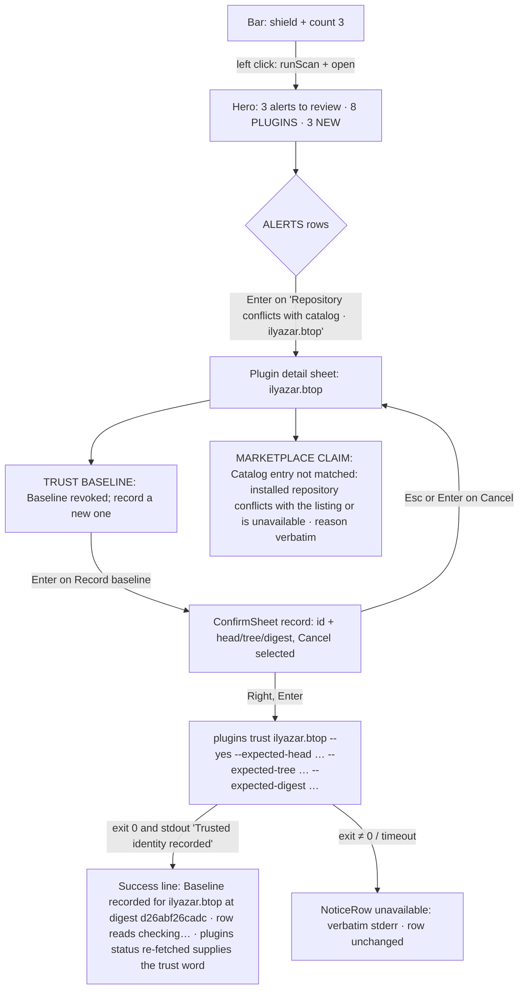
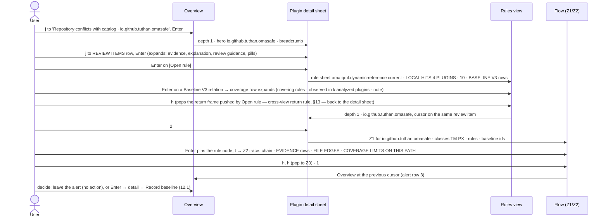

# OmaSafe UI/UX overhaul — screens

This document is the screen-by-screen proposal for the OmaSafe Omarchy plugin: the bar widget, the panel shell, the
three views (Overview, Flow, Rules), the plugin detail sheet, the rule and baseline sheets, the finder, every
confirmation, the loading / empty / unavailable / unsupported / stale / lexical-only states, the interaction flows, the
keyboard map and accessibility. It applies the decisions in [Design principles](02-design-principles.md) (visual system,
copy, glyphs) and the research in [Research and audit](01-research-and-audit.md); the body of the Trust Flow graph is
specified in [Trust graph](04-trust-graph-spec.md) and only its frame, entry and exit appear here; phasing and acceptance
checks are in [Implementation roadmap](05-implementation-roadmap.md). Every `qs.Ui` component, `Style`/`Color`/`Border`
token, CLI argv, JSON field and enum named below was read from the installed kit at `/usr/share/omarchy/shell`, from
`Panel.qml`/`BarWidget.qml` in this repository, from the omasafe-cli 0.2.1 Rust source, or from the real CLI samples
captured on 2026-09-02. Status: proposal, unimplemented, runtime-unverified.

Contents

1. [Conventions and fixture data](#1-conventions-and-fixture-data)
2. [Bar widget](#2-bar-widget)
3. [Panel shell](#3-panel-shell)
4. [Overview view](#4-overview-view)
5. [Plugin detail sheet](#5-plugin-detail-sheet)
6. [Flow view — frame, entry, exit](#6-flow-view--frame-entry-exit)
7. [Rules view](#7-rules-view)
8. [Finder and breadcrumb](#8-finder-and-breadcrumb)
9. [NoticeRow catalogue](#9-noticerow-catalogue)
10. [Confirmations](#10-confirmations)
11. [States matrix](#11-states-matrix)
12. [Interaction flows](#12-interaction-flows)
13. [Keyboard map and cursor model](#13-keyboard-map-and-cursor-model)
14. [Accessibility](#14-accessibility)
15. [CLI calls and fields per screen](#15-cli-calls-and-fields-per-screen)
16. [Sources and references](#16-sources-and-references)

## 1 Conventions and fixture data

Wireframes are 52 columns wide, one column ≈ 8 units of the 420-unit card at base font size 12. ASCII stand-ins are used
once and consistently: `(S)` = the filled shield `󰒃` U+F0483 (the last scan succeeded and its result is what is shown), `(s)` = the
outline shield `󰒙` U+F0499 (no current scan result: ready, CLI missing or incompatible, or the last scan failed — whether
or not an earlier result is kept beside it; both hero and bar), `!` =
alert `󰀦`, `o` = outline circle `󰝦` (not analyzed / unavailable), `g` = Git checkout `󰊢`, `p` = installed without git
`󰏗` (the same ASCII fallback as `Glyphs.js` and 02 §2.7–2.8), `<` `>` = back/open `󰅁` `󰅂`, `^` `v` = collapse/expand `󰅃` `󰅀`, `[c]` = copy `󰆏`, `[@]` = rescan `󰑐`,
`PX TM WM FS DX` = capability class glyphs in the strip (real glyphs and codepoints in 02 §2.7; the strip is one
`Text` of 17 positions in catalog order, so a glyph is drawn at its catalog position and `·` fills every analyzed, not
observed position — `PX·FS····TM·WM·······` is PX 1, FS 3, TM 8, WM 10; the wireframes never pack glyphs together), `----` = `PanelSeparator`, `CAPS | value`
= `SectionHeaderRow`, `[ ]` = `Button`, `(  o)` = kit `ToggleSwitch`, `▒` = `ScrollBar.vertical`, `~~` = scrim,
`- - fold - -` = the bottom of the visible viewport at base 12 (content below it scrolls). Line references: `Panel.qml:<n>` unqualified, `BW:<n>` (BarWidget.qml), `Icon:<n>`
(OmaSafeStatusIcon.qml), `Ui/<File>.qml:<n>` for the kit.

Every example uses the captured fixture (`cli-samples/`): 15 inventory rows = 8 live plugins (6 `Git-managed`, 2
`built-in`) + 7 `backup`; 4 analyzed (`ilyazar.btop` 27 occurrences / 5 review items, `io.github.tuthan.dropdown-terminal`
10 / 2, `io.github.tuthan.omasafe` 54 / 1, `lgse.sandman` 29 / 2; all 10 review items `low`, all
`oma.qml.dynamic-reference`); 3 outstanding alerts, all `provenance-conflict`, `highest_severity: warning`; marketplace
snapshot `65b6385`, `marketplace_source: pinned-fetch`, `marketplace_age_seconds: 935`, `marketplace_stale: false`;
catalog v7 · 45 rules · 17 classes; coverage map 15 rows = 12 `partial-overlap` + 3 `not-covered`, `verified_at_commit`
`964dc08…`, `map_version` 2; `plugins status`: sandman and omasafe `untrusted` ("no trust baseline exists"), btop
`untrusted` ("trust baseline was revoked; …"), dropdown-terminal `unchanged`; every `enforcement-status` `decision: null`;
`schedule status` `installed: false`; `override list` empty; inventory-level `coverage.limitations: []`; `parser`
`tree-sitter-qmljs 0.3.1` in all four analyses.

## 2 Bar widget

The bar item becomes a `Row { spacing: Style.space(2) }` in `BarWidget.qml` holding the existing `BarIconButton {
iconComponent: …; slotSize: Style.bar.statusSlot }` (BW:516–540) and a sibling count `Text`. The count cannot live inside
the icon: `BarIconButton` fixes `fixedWidth: slotSize` (`Ui/BarIconButton.qml:20`), mounts `iconComponent` in a `Loader {
anchors.fill }` over the 16-unit `opticalCanvas` (24–47) and shows its `text` glyph only when `iconComponent` is null (32,
43); `Style.bar.statusSlot` is 21 units (`Style.qml:347`), and a 13-unit shield plus a gap plus a `bodySmall` `9+` needs ≈ 30.
No first-party bar widget draws icon + text in one slot (`SystemUpdate.qml` is glyph-only in the same slot;
`BarIndicator.qml:49` also fixes `statusSlot`), and a digit-in-badge is out: TailscaleIcon's badge is `max(7, 0.42 · icon)`
≈ 7 px at base 9–12 with a 5 px glyph, illegible. The widget root binds `implicitWidth: row.implicitWidth` — the
`WidgetButton.implicitWidth` contract (`Ui/WidgetButton.qml:68`) already lets a widget grow past one slot; in a vertical
bar (`fixedHeight: slotSize`, `Ui/BarIconButton.qml:21`) the same two items stack in a `Column`. `OmaSafeShield.qml`
replaces `OmaSafeStatusIcon.qml`: the shield is a `Text` glyph as at `tailscale/Panel.qml:767` (`TailscaleIcon.qml` itself
draws a 3×3 `Dot: Rectangle` grid, 26–34 / 66–71, not a glyph); the badge copies the `TailscaleIcon.qml:46–64` `BorderSurface`
(`radius: width / 2`, `Border.flat(Color.popups.background, 1)`, "!" in `Color.background`) but sizes its ink with a
`Style.font.*` token — `TailscaleIcon.qml:61` uses a literal `Math.max(6, parent.height * 0.72)` that the no-literal blocker
(02 §4) forbids copying. `visible: !vertical` (BW:112) is removed; `#e5a50a`
(BW:116, Icon:9, Panel.qml:153) is deleted.

```qml
// BarWidget.qml — replaces the bare BarIconButton at BW:516–540
Row {
  id: row
  spacing: Style.space(2)
  BarIconButton {
    id: button
    slotSize: Style.bar.statusSlot
    iconComponent: Component { OmaSafeShield { filled: root.hasScanResult; dim: root.cliFailed; checking: root.checking; badge: root.urgentBadge } }  // all four are new root properties, declared below
    tooltipText: root.iconTooltip()
    onPressed: function(mouseButton) { /* BW:532–539 unchanged */ }
  }
  Text {
    id: countText
    visible: (root.hasScanResult || root.earlierResultKept) && root.outstandingCount > 0
    text: root.outstandingCount > 9 ? "9+" : String(root.outstandingCount)
    anchors.verticalCenter: parent.verticalCenter
    textFormat: Text.PlainText
    font.family: root.bar ? root.bar.fontFamily : Style.font.family
    font.pixelSize: Style.font.bodySmall          // a count is data: bodySmall floor, 02 P7 — never caption
    color: root.earlierResultKept ? root.dim : root.barForeground
  }
}
// BarWidget.qml root — NEW declarations. None of these exist today: BW:11–31 exposes scanState, outstandingCount,
// highestSeverity, cliVerified, cliVersion, cliError and statusLevel (BW:117), and Ui/BarWidget.qml adds only bar,
// moduleName, settings, vertical and barSize. Every root.* name used above is declared here (05 Phase 1).
// implicitWidth: row.implicitWidth
// readonly property color barForeground: bar ? bar.barForeground : Color.foreground  // Bar.qml:69 — the transparent-bar-aware
//                                        // colour the kit's WidgetButton uses, not bar.foreground (Bar.qml:68); Ui/Panel.qml:22 has the same line
// readonly property color dim: dimStep(0.33)                                        // over barForeground, 02 §2.3
// readonly property bool checking: scanState === "checking"                         // replaces the statusLevel === "checking" tests (BW:117–124)
// readonly property bool hasScanResult: scanState === "quiet" || scanState === "attention"   // the two states set from a fresh result (BW:235)
// readonly property bool earlierResultKept: scanResultsStale && lastScanAt !== ""  // BW:15 / BW:19: a stale earlier result is still held
// readonly property bool cliFailed: scanState === "missing-cli" || scanState === "incompatible-cli" || scanState === "unavailable"
// readonly property bool urgentBadge: hasScanResult && (highestSeverity === "critical" || highestSeverity === "error" || blockedDecisions > 0)  // blockedDecisions = count of enforcement_summary.decisions[].outcome === "block" from the inventory, new root int
```

The shield's shape, not its colour, says whether a current scan result exists: the filled shield `󰒃` U+F0483 is drawn
only when `hasScanResult` (`scanState` is `quiet` or `attention`, the two states a fresh result sets); the outline shield
`󰒙` U+F0499 (present in JetBrainsMonoNerdFont-Regular.ttf as `md-shield_outline`, re-checked with fontTools) is drawn for `ready`, `missing-cli`,
`incompatible-cli` and for every `unavailable` — with or without an earlier result — and is dimmed for the three failure
states. Failure is encoded by shape, never by dim alone: at `Style.bar.iconFont` size, and on light themes where
`dimStep(0.33)` over a black foreground is a mid-grey glyph a few pixels wide (02 §2.3), a filled-but-dim shield is not
reliably distinguishable from the quiet shield, so it is not used. When a failed scan keeps an earlier result, the stale
count stays beside the outline shield, dim (`(s) 3`), and the tooltip names the age. A never-scanned machine therefore
never looks like a quiet scan, and a failed scan never does either — the filled shield means exactly one thing. `checking` never swaps the shield out: whichever shield
applies stays, and a small `󰑐` (`fg`, no fill) drawn in the badge position (bottom-right) carries the 900 ms
`RotationAnimation` while `opened && checking`. The hero glyph mirrors the same outline/filled rule (§3).

```
+--------------------------------------------------+
| bar, right section            state              |
|  ...  (s)        ready: outline shield, fg, no   |
|                  scan result yet                 |
|  ...  (S)        quiet: filled shield, fg, no    |
|                  count                           |
|  ...  (S) 3      attention: filled shield +      |
|                  sibling bodySmall count, fg     |
|  ...  (S)!3      one urgent badge: critical or   |
|                  error severity, or a block      |
|  ...  (s)        dim outline: CLI missing/incom- |
|                  patible; scan failed, no prior  |
|  ...  (s) 3      dim outline + dim count: scan   |
|                  failed, earlier result kept     |
|  ...  (S)@       scanning: shield stays, small   |
|                  rotating glyph in badge slot    |
+--------------------------------------------------+
```

| Host state (`scanState` BW:14, `outstandingCount` BW:11, `highestSeverity` BW:16) | Shield and colour | Count (sibling `Text`) | Badge slot | Tooltip (`iconTooltip()` BW:124) |
|---|---|---|---|---|
| `missing-cli` | outline `󰒙` in `dim` (`dimStep`, 02 §2.3, declared on the BarWidget root over `bar.foreground`) | — | — | `OmaSafe: omasafe-cli not found` |
| `incompatible-cli` | outline, dim as above | — | — | `OmaSafe: omasafe-cli <found> found; <min> or newer required` |
| `unavailable` (scan failed, timed out, output over 2 MiB), no earlier result | outline, dim | — | — | `OmaSafe: last scan failed; results unavailable` |
| `unavailable`, earlier result kept (`earlierResultKept`) | outline `󰒙`, dim — never the filled shield | last known count, dim (none when the earlier result was quiet) | — | `OmaSafe: last scan failed; showing results from <relative>` |
| `ready` (CLI verified, no scan yet) | outline `󰒙` `barForeground` | — | — | `OmaSafe: click to scan` |
| `checking` | shield of the previous state, unchanged | unchanged | `󰑐` `RotationAnimation` 900 ms, `running: opened && checking` | `OmaSafe: scanning` |
| scanned, `outstandingCount == 0` | filled `󰒃` `barForeground` | — | — | `OmaSafe: no outstanding alerts` |
| scanned, `outstandingCount > 0`, highest not critical/error | filled `󰒃` `barForeground` | `bodySmall`, `9+` cap | — | `OmaSafe: 3 alerts to review` / `OmaSafe: 1 alert to review` |
| highest ∈ {`critical`, `error`} or any `enforcement_summary.decisions[].outcome == "block"` | filled `󰒃` | digits | `BorderSurface` circle, `color: bar.urgent`, 42 % of glyph, "!" | `OmaSafe: 1 critical alert to review` |

Badge rules: the badge is the only `urgent` paint in the bar; the count is foreground text, never a filled disc; a failed
scan always shows the outline shield — it never keeps the filled (quiet-looking) glyph, dimmed or not (fail-closed) — and a
never-run scan never fills it; the count never reads `0` (quiet has no count). Left click runs a scan and opens the panel, middle click scans only (BW:532–539, unchanged).
Acceptance (05 Phase 1): the widget's `implicitWidth` equals `statusSlot` with no count and grows by
`countText.implicitWidth + Style.space(2)` with one; verified in a top bar and a left (vertical) bar.

## 3 Panel shell

```
Panel > KeyboardPanel  contentWidth fittedContentWidth(Style.space(420)) · contentHeight fittedContentHeight(fixed.implicitHeight + Style.space(12) + viewLoader.implicitHeight, Style.space(560))
└─ PanelKeyCatcher  blocked: sheet.opened || finder.activeFocus
   └─ Column { spacing: Style.space(12) }
      ├─ Column fixed          never scrolls
      │   ├─ PanelHero         iconComponent OmaSafeShield · title · meta · detail (pill only when it reads "unavailable") · trailingControl scan Button
      │   ├─ status line       Text bodySmall; verbatim cliError in urgent, stale sentence in dim; hidden otherwise
      │   ├─ NoticeRow ×0..n   unavailable · stale · lexical-only · inventory coverage.limitations[]
      │   ├─ ButtonGroup       [Overview] [Flow] [Rules]  keys 1 2 3
      │   ├─ FinderField       kit TextField, shown by "/"
      │   └─ Breadcrumb        shown at depth ≥ 1
      └─ Flickable             height: parent.height − fixed.height − Style.space(12) · contentHeight: viewLoader.implicitHeight
          │                    clip: true · interactive: !sheet.opened · ScrollBar.vertical: ScrollBar { policy: ScrollBar.AsNeeded }
          └─ Loader            active view (Overview incl. its footer · detail sheet · Flow · Rules · finder results), 140 ms Easing.OutCubic opacity crossfade
   ConfirmSheet  z: 20, sibling of the outer Column, covers the whole card
```

- `KeyboardPanel` (Panel.qml:1300–1308) keeps `focusTarget: keyCatcher`; the inner `Style.space(480)` cap at 2394 and
  the `Style.space(600)` at 1308 collapse into the one `space(560)` cap. Only the view body scrolls: hero, status line,
  notices, chips, finder and breadcrumb are the fixed part, so the status sentence and the `1 2 3` chips stay in view
  while a long Overview or detail sheet is scrolled (§4.1 fold), and the Flow body has a computable viewport (04 §4.3 must
  size the graph to the Flickable's `height`, not the column's). Precedent for the scrolling body: `tailscale/Panel.qml:432`
  `Flickable`, `audio/Panel.qml:693` `ScrollBar.vertical.policy` switched on overflow. `ensureCursorVisible` drives
  `Flickable.contentY` (§13). `interactive` is gated on `sheet.opened` only — not on `navigationLocked`, which also covers
  the up-to-60 s CLI calls, during which the panel must stay scrollable; action `Button`s stay disabled on the full
  `navigationLocked`.
- Hero: `PanelHero { iconComponent: OmaSafeShield { iconSize: Style.font.display; filled: root.hasScanResult }; title;
  meta; detail: root.cliVerified ? "" : "unavailable"; iconOpacity; trailingControl: Button { iconText: "󰑐";
  iconSpinning: root.checking; tooltipText: "Run scan (r)"; enabled: root.cliVerified && !root.checking &&
  !root.navigationLocked; hasCursor: root.focusSection === "hero" } }`. `root.checking` and `root.hasScanResult` are new
  Panel.qml root properties — `readonly property bool checking: root.statusLevel === "checking"` (today the string is
  tested inline at 196, 219, 2153, 2336, 2783) and `readonly property bool hasScanResult: hostWidget ? hostWidget.hasScanResult
  : false` (the BarWidget property declared in §2); `root.barForeground` already exists on `Ui/Panel.qml:22`. The kit owns title (`Style.font.title` bold,
  `ElideRight`), meta (`caption` bold, uppercased, `letterSpacing 1.2`, `Qt.darker(fg, 1.4)`) and the detail pill (`body`
  bold dim, `Border.controlSpec("normal")`) — `Ui/PanelHero.qml:50–101`. The pill appears only when it carries a state the
  user must see (`unavailable`); the CLI version lives in the SOURCES row alone. Reasons: `PanelHero.detail` is used by no
  first-party panel (only `plugins/menu/Menu.qml:540`), the version is an architecture fact the copy system keeps off
  user-facing surfaces, and the kit subtracts the pill's `implicitWidth` from the title (`Ui/PanelHero.qml:54`), which
  would force `ElideRight` on `1 critical alert to review` at base 9. The filled accent `Button { background:
  Color.accent }` at 2341 and the `Style.space(64)` width go.
- Hero glyph shape follows §2: filled `󰒃` when a scan result exists, outline `󰒙` otherwise (`ready`, CLI missing or
  incompatible, failed scan with nothing prior).

| Hero state | `title` | `meta` (kit uppercases) | `detail` | glyph · `iconOpacity` |
|---|---|---|---|---|
| quiet | `No outstanding alerts` | `8 PLUGINS · SCANNED 12 MIN AGO` | — | filled · 1.0 |
| attention | `3 alerts to review` | `8 PLUGINS · 3 NEW · SCANNED 12 MIN AGO` | — | filled · 1.0 |
| critical | `1 critical alert to review` | `8 PLUGINS · SCANNED 2 MIN AGO` | — | filled · 1.0 |
| checking | `Scanning…` | `8 PLUGINS · READING INSTALLED STATE` | — | previous shape · 1.0 |
| ready | `Ready to scan` | `8 PLUGINS` | — | outline · 1.0 |
| scan failed, earlier result had alerts | `Scan unavailable` | `LAST SCAN FAILED · SHOWING 3 ALERTS FROM 2 H AGO` | — | outline · 0.5 |
| scan failed, earlier result was quiet | `Scan unavailable` | `LAST SCAN FAILED · EARLIER RESULT: NO ALERTS · 2 H AGO` | — | outline · 0.5 |
| scan failed, nothing prior | `Scan unavailable` | `LAST SCAN FAILED · NO EARLIER RESULTS` | — | outline · 0.5 |
| missing CLI | `omasafe-cli not found` | `INSTALL OMASAFE-CLI, THEN RESTART THE SHELL` | `unavailable` | outline · 0.5 |
| incompatible CLI | `omasafe-cli incompatible` | `0.1.9 FOUND · 0.2.1 OR NEWER REQUIRED` | `unavailable` | outline · 0.5 |
| `hostWidget == null` (the bar widget reference is absent; live state recorded in 01 §2.2) | `Scan status unavailable` | `WAITING FOR THE OMASAFE WIDGET` | `unavailable` | outline · 0.5 |
| plugin detail sheet | `<plugin id>` | `GIT CHECKOUT · 35 FILES · SERVICE, BAR WIDGET` | — | filled · 1.0 |

- Failed-scan rule (GR3): when `scanState == unavailable` the title is always `Scan unavailable`, the shield is the outline
  (`hasScanResult` is false) and `iconOpacity` 0.5, whatever the last successful scan said. The stale facts move into the meta (`SHOWING 3 ALERTS FROM 2 H AGO` / `EARLIER
  RESULT: NO ALERTS · 2 H AGO`), the ALERTS rows from the earlier result stay listed under a `stale` `NoticeRow`, and the
  headline `No outstanding alerts` is never printed from stale data. The bar (§2) follows the same rule: a failed scan
  never shows the quiet glyph.

- Views: `ButtonGroup { options: [{value:"overview",label:"Overview"},{value:"flow",label:"Flow"},{value:"rules",
  label:"Rules"}]; value: root.view; focusable: false; cursorIndex: root.focusSection === "views" ? root.selectedIndex :
  -1; fontSize: Style.font.bodySmall; onChanged: root.setView(value) }` (`Ui/ButtonGroup.qml:26–45`). Chips are kit
  `Button { bordered: true; selected }`; no hand-rolled tab strip (2287–2330 goes). Disabled while `navigationLocked`, and
  `setView(value)` begins with `if (root.navigationLocked) return` so the digit keys (§13) and the mouse share one gate —
  today `setActive()` is blocked the same way (01 §2.5).
- Every `Text` is `textFormat: Text.PlainText`; family is one root binding `bar ? bar.fontFamily : Style.font.family`.
- Colour is declared once on the root exactly as 02 §colour (`fg`, `urgent`, `dimHeader`, `dim`, `faint`, `hoverFill`,
  `selectedFill`); no other file contains a colour expression.
- Rows are `CursorSurface { implicitHeight: content + Style.spacing.rowPaddingX; radius: Style.cornerRadius; hasCursor;
  current }` with a `Style.space(22)` glyph column, `Style.space(8)` gap, insets `space(10)` left and `space(8)` right;
  sections are `SectionHeaderRow` (`PanelSeparator` + `Row { PanelSectionHeader; Text value }`) over a `Column { spacing:
  Style.space(6) }`. No cards; the seven tinted `Rectangle` containers of the current tabs are gone.

## 4 Overview view

### 4.1 Attention state (fixture: 3 provenance-conflict alerts)

The frame below shows the moment inventory has arrived and the per-plugin `plugins status` queue has returned four of
eight rows, so four plugin rows still read `checking…` — the per-row loading state is real, not decorative.

```
+--------------------------------------------------+
| (S)  3 alerts to review                          |
|      8 PLUGINS · 3 NEW · SCANNED 12 MIN AGO   [@]|
| [Overview] [ Flow ] [ Rules ]                    |
| ------------------------------------------------ |
| ALERTS                                         3 |
|  !  Repository conflicts with catalog          > |
|     ilyazar.btop · reported 12 min ago           |
|  !  Repository conflicts with catalog          > |
|     io.github.hvo.omarchy-unraid · 12 min ago    |
|  !  Repository conflicts with catalog          > |
|     io.github.tuthan.omasafe · 12 min ago        |
| ------------------------------------------------ |
| PLUGINS                           8 · 4 ANALYZED |
|  g  ilyazar.btop                baseline revoked |
|     PXDXFS····TM·WM·······     5 items · 3 limits|
|  p  io.github.tuthan.omasafe         no baseline |
|     PX······TM·········         1 item · 2 limits|
|  p  io.github.hvo.omarchy-unraid      checking…  |
|     –                 not analyzed               |
|  g  io.github.tuthan.dropdown-… matches baseline |
|     PX·FS····TM·WM·······                 2 items|
|  g  lgse.sandman                     no baseline |
|     PX·FS····TM·WM·······    2 items · 13 limits |
|  g  crmne.hyprmoncfg                  checking…  |
|     –                 not analyzed             ▒ |
| - - - - - - - - - - fold - - - - - - - - - - - - |
|  g  ianswope.snapshots                checking…  |
|     –                 not analyzed               |
|  g  io.github.tuthan.omarchy-lunar-…  checking…  |
|     –                 not analyzed               |
|  Show 7 backup copies (not scanned)         (  o)|
|     A baseline is the exact source identity you  |
|     recorded. "Matches" and "differs" compare   |
|     the installed files against it; neither is a |
|     safety judgment.                             |
| ------------------------------------------------ |
| SOURCES                                          |
|     omasafe-cli 0.2.1                            |
|     Catalog snapshot 65b6385 · 15 min old     [@]|
|     Scheduled scan · not installed     [Install] |
|     Enforcement overrides · none recorded        |
|                                                  |
|  OmaSafe reports changes and coverage limits. It |
|  does not declare plugins safe.                  |
+--------------------------------------------------+
```

The separator after the view chips ends the fixed part; the body below it scrolls.

The fold: at base 12 the Overview-attention body is ≈ 900 units (ALERTS 20 + 3 × 42, PLUGINS 20 + 8 × 42, toggle row 34,
two-line footer 30, SOURCES 20 + 4 × 28, disclaimer 26, section gaps) against a Flickable of ≈ 440 units (`space(560)`
minus the fixed part), so the hero, chips, ALERTS and about six plugin rows are visible on open and the rest scrolls at
every base size — 9, 12, 16 and 20 alike, because everything scales together. Decisions: (1) PLUGINS is not capped — the
live plugins are the subject of the view and alert-bearing plugins sort first (analyzed or not: `io.github.hvo.omarchy-unraid`
is third above, alerted and `not analyzed`), so every alerted plugin is above the fold whenever there are alerts; (2) the
scroll is discoverable: `ScrollBar.vertical: ScrollBar { policy: ScrollBar.AsNeeded }` on the Flickable (`▒` above) and `ensureCursorVisible` on every cursor move, so `j` from the last visible row scrolls; (3) the
product disclaimer stays the Overview footer (verbatim, once), one scroll away; the confirmation sheets carry the caveat
at each decision point, so nobody acts without reading it. Phase 1 acceptance (05): `ScrollBar.vertical` present,
`ensureCursorVisible` reaches SOURCES with `j` alone, no horizontal scroll at base 9–20.

Callouts, top to bottom:

- `ALERTS | 3`: `SectionHeaderRow { text: "ALERTS"; value: String(scan.outstanding) }`. Rows are `AlertRow`
  (`CursorSurface`): glyph `󰀦` in `fg` (`urgent` only when `severity` is `critical` or `error`); line 1 =
  `Labels.alertKind(kind)` in `Style.font.body` bold; line 2 = `plugin_id · reported <relative generated_at>` in
  `bodySmall` dim, plus ` · plugin changed` when `post_change` is true; trailing `PanelActionButton { iconText: "󰅂";
  tooltipText: "Open plugin" }`. Pseudo ids (`marketplace`, `trust-history`, a bar id) render as text with no open action.
  Ordering: `highest_severity` first, then `new` before acknowledged, then plugin id. The section is not rendered when
  `outstanding == 0` — the hero already states it.
- `PLUGINS | 8 · 4 ANALYZED`: `PluginRow` = `CursorSurface { current: id === root.selectedPluginId }`. Line 1: classification
  glyph (`Git-managed` → `󰊢`, `built-in` → `󰏗`, unknown → `󰘥` + "unsupported"), id in `body` `ElideMiddle`, trust word
  right-aligned in `bodySmall` (`Labels.trustShort(status)`: `no baseline` · `baseline revoked` · `matches baseline` ·
  `matches · coverage limited` · `differs · <n> files` in bold with `󰀦` · `checking…` / `unavailable` dim). Line 2:
  `CapabilityStrip` (one `Text` of 17 glyphs in fixed catalog order — class glyph when observed, `·` when analyzed and not
  observed, a single `–` when not analyzed — the one placeholder mark of 02 §2.4, never a run of them; glyphs sit at their
  catalog positions (02 §2.7: PX 1, DX 2, FS 3, TM 8, WM 10), so the same position is the same class on every row —
  `PX·FS····TM·WM·······` for sandman and dropdown-terminal, `PXDXFS····TM·WM·······` for btop, `PX······TM·········` for
  omasafe; `PanelToolTip` lists `Observed: process-execution 16 · persistence-scheduling 8 · …`)
  followed by a right-aligned `bodySmall` count. Width budget for line 2: the strip `Text` has `width:
  Math.min(implicitWidth, Style.space(190))` (`elide: ElideRight` past it); the count is right-aligned and never elides.
  The count uses the approved short form from `Labels.js` — `<n> items` / `1 item` (tooltip `review items`); the long form
  `<n> review items` appears only in the detail-sheet header — or `not analyzed` / `analysis unavailable`. Coverage is
  visible on the same line (GR4): when `coverage_limitations.length > 0` the count is followed by ` · <n> limits` in dim
  `bodySmall` (`· 13 lim` at base 9), and when `parser == null` by ` · text match only`; sandman (13), btop (3) and omasafe
  (2) therefore no longer read like dropdown-terminal (0). Order: outstanding alert desc, analyzed first, then id ascending —
  against `scan.json` that is btop, omasafe, omarchy-unraid (all three alerted; unraid unanalyzed), then dropdown-terminal
  before sandman (both analyzed, `io.github…` < `lgse…`), then hyprmoncfg, snapshots, omarchy-lunar-calendar. At base 9
  the trust word abbreviates and the strip stays (17 × `bodySmall` glyphs ≈ 130 px, to be measured — Phase 1 acceptance
  records the 17-glyph `implicitWidth` at base 12 in 02 §2.8, since the non-Mono Nerd variant's glyph advance may exceed
  0.6 em); nothing wraps to a third line at base 20.
- Catalog status never appears on a plugin row (GR2). It is a detail-sheet section.
- Backups: a `CursorSurface` row (same height rule as every row) holding the label `Text` and a kit `ToggleSwitch {
  interactive: false; checked: root.showBackups; hasCursor }` (`Ui/ToggleSwitch.qml:34`; first-party precedent
  `network/Panel.qml:1143`) drawn `(  o)` above. The kit `Toggle` row is not used: it hard-codes `implicitHeight:
  Math.max(54, …)` (`Ui/Toggle.qml:45`, a 54 px floor that does not scale down and breaks the ≤ `space(44)` row rule),
  `implicitWidth: Style.space(240)` (46), a bold `Style.font.subtitle` title (`titleSize` 34, bold applied at 77),
  `activeFocusOnTab: true` (40 — a Tab
  from the finder would land focus on it and paint a focus ring) and a 100 ms `ColorAnimation` outside the motion set
  (55). `ToggleSwitch` animates at 120 ms (`Ui/ToggleSwitch.qml:87–98`), inside the set. When on, the header meta reads
  `PLUGINS | 15 · 4 ANALYZED · SHOWING 7 BACKUPS` and each backup row prints `Backup copy (not scanned)` where the trust
  word would be. Key `b` toggles the same property.
- Footer under PLUGINS: one `caption` dim `WordWrap` line — `A baseline is the exact source identity you recorded.
  "Matches" and "differs" compare the installed files against it; neither is a safety judgment.` The full definition sentence and the "does not establish that the plugin is
  safe" caveat are printed exactly twice on the whole path: in the `ConfirmSheet` body (decision point) and in the Overview
  footer (verbatim product sentence). They are not repeated under buttons, in the trust-word tooltip or in section bodies.
- `SOURCES`: `SourceRow`s (`CursorSurface`, empty glyph column). `omasafe-cli 0.2.1` (`hostWidget.cliVersion`);
  `Catalog snapshot <commit7> · <age>` with `PanelActionButton { iconText: "󰑐"; tooltipText: "Update catalog" }` that runs
  `marketplace refresh --latest` (existing collector at 3927, 60 s) with inline `Updating catalog… <n> s`; `Scheduled scan ·
  not installed` with `Button { text: "Install"; bordered: true }` → `ConfirmSheet(schedule)`; `Enforcement overrides ·
  none recorded` (expands when non-empty). Rows expand inline on Enter (§4.4).
- Footer: exactly one dim `caption` `Text`; the four other disclaimer copies in the current tabs are removed.

### 4.2 Quiet state

Same frame with hero `No outstanding alerts · 8 PLUGINS · SCANNED 12 MIN AGO` and no `ALERTS` section; `PLUGINS` follows
the view chips directly. Review-item counts stay on the plugin rows: they are evidence, not alerts, and the hero uses the
CLI's `outstanding == 0`, never the word "clean".

### 4.3 Unavailable CLI, loading, error

```
+--------------------------------------------------+
| (s)  omasafe-cli not found          [unavailable]|
|      INSTALL OMASAFE-CLI, THEN RESTART THE SHELL |
| [Overview] [ Flow ] [ Rules ]                    |
|     Plugins, review items, rules and the trust   |
|     flow are unavailable until omasafe-cli 0.2.1 |
|     or newer is found on PATH.                   |
|  [footer, see §4.1]                              |
+--------------------------------------------------+
```

One `NoticeRow { reason: "unavailable" }` replaces the seven "unavailable until…" sentences (375, 436, 2638, 2782, 3084, 3195,
3610). The view chips stay enabled so `2`/`3` still switch views; each view renders the same notice in place of its body;
the Flow lens chips (`Graph`/`Matrix`) are disabled because there is no body for them to switch. Nothing else is drawn —
no zero counts, no empty headers.

```
+--------------------------------------------------+
| (s)  Scanning…                                   |
|      8 PLUGINS · READING INSTALLED STATE      [@]|
| [Overview] [ Flow ] [ Rules ]                    |
| ------------------------------------------------ |
| PLUGINS                                          |
|     Loading plugins…                             |
+--------------------------------------------------+
| (S)  Scanning…                                   |
|      8 PLUGINS · READING INSTALLED STATE      [@]|
| [Overview] [ Flow ] [ Rules ]                    |
| ------------------------------------------------ |
| PLUGINS                        LOADING PLUGINS…  |
|  g  ilyazar.btop                baseline revoked |
|     PXDXFS····TM·WM·······     5 items · 3 limits|
|     (last-good rows stay until the new           |
|      inventory replaces them)                    |
+--------------------------------------------------+
| (s)  Scan unavailable                            |
|      LAST SCAN FAILED · SHOWING 3 ALERTS FROM 2 H|
|      Plugin inventory timed out after 30 seconds.|
| [Overview] [ Flow ] [ Rules ]                    |
| ------------------------------------------------ |
| PLUGINS                                          |
|     Plugins unavailable: omasafe-cli timed out   |
|     after 30 seconds. Run `omasafe-cli plugins   |
|     inventory` in a terminal to inspect.         |
+--------------------------------------------------+
```

Loading, first-ever open (`vm.plugins.length === 0`, top frame): the body is `NoticeRow { reason: "loading"; text:
"Loading plugins…" }` and the header carries no right value — one loading indicator, never a `LOADING…` header over an
empty body. Loading with last-good rows (second frame): the `PLUGINS` header right value becomes `LOADING PLUGINS…` and
the rows remain visible (Quattro live-data principle); no skeleton rows. Error (third frame): the hero title is `Scan
unavailable` per §3, the status line under it carries the verbatim `cliError`/`panelError` in `urgent` (`bodySmall`,
`WordWrap`, the tailscale idiom at `tailscale/Panel.qml:500–509`), and the section body is `NoticeRow { reason:
"unavailable" }`. Counts are never printed as `0` when `inventory` is null.

### 4.4 SOURCES expanded (schedule installed, one override — constructed example; the fixture has neither)

```
+--------------------------------------------------+
| SOURCES                                          |
|     omasafe-cli 0.2.1                            |
|     Catalog snapshot 65b6385 · 15 min old     [@]|
|     pinned fetch, snapshot integrity verified    |
|     Snapshot fetched 2026-09-02T09:30:06Z.       |
|     Scheduled scan · Advisory: reports only      |
|     Last run yesterday · exit 0      [Reinstall] |
|     Enforcement overrides · 1 active           ^ |
|     <plugin id> · active · expires <expires_at>  |
|     rules <rule id> · commit <commit7>           |
|     Override validity is evaluated by the CLI;   |
|     this panel cannot create overrides.          |
+--------------------------------------------------+
```

- Snapshot row line 2 maps `marketplace_source` (`pinned-fetch` → `pinned fetch, snapshot integrity verified`;
  `unverified-cache` → `cached snapshot, not re-verified`; `local-file` → `local catalog file`; absent → `snapshot
  unavailable`). When `marketplace_stale` is true the row reads `Snapshot <n> days old (stale)` and the word "verified" is
  not rendered anywhere in the row. Tooltip: `Snapshot fetched <marketplace_retrieved_at>. The catalog validates listings,
  not plugin security.`
- Schedule row (`schedule status`): `installed: false` → `not installed` + `[Install]`; installed → `Labels.schedulePolicy(policy)`
  (`Advisory: daily drift scan, reports only` / `Hardened: daily drift scan with analysis, reports only` — 02 §3.4; never
  the enforcement-policy definition, because a scheduled scan refuses nothing) and `Last run <relative
  last_known_execution.service_finished_at> · exit <service_exit_code>` or `Last run unavailable`; `metadata_consistent:
  false` adds a dim `Unit metadata inconsistent` line with `metadata_error` verbatim behind Enter. `[Reinstall]` opens the
  same `ConfirmSheet(schedule)`.
- Overrides row (`plugins override list`): `No override records. This panel cannot create overrides.` when empty; each
  entry renders `plugin_id · <status word> · expires <expires_at>` and `rules <rule_ids> · commit <commit7>`. The status
  word and the header count (`1 active`) come from `overrides[].status` — computed by the CLI at list time
  (`main.rs:4244–4249`) — through the existing `overrideStatus` gate (Panel.qml:338: `active` / `expired`, anything else →
  `unsupported`); the binding fields come from `overrides[].binding` (`OverrideBinding`, `enforcement.rs:363–375`), which
  carries `expires_at` and no status. `expires_at` is displayed verbatim and never compared to the local clock: the panel
  does not evaluate override validity. Fixture check (05 §11.2 shim): an entry with `status: "active"` and a past
  `expires_at` renders `active`. Read-only by design.

## 5 Plugin detail sheet

Entered by Enter or `l` on a plugin row, Enter on an alert row, or Enter on a pinned plugin node at Z1 in Flow (Z0 Enter
zooms to Z1 first, 04 §6.1). Depth 1 of the Overview stack: the hero swaps to the plugin, the breadcrumb appears, and the
Overview cursor position is restored on return (`h` in a vertical section, `-`, the back `PanelActionButton`, or the
breadcrumb). Sections in decision order, seven visible plus one collapsed: TRUST BASELINE → WHAT CHANGED (state `changed`
only) → REVIEW ITEMS → CAPABILITIES OBSERVED → COVERAGE (with the file references folded in) → MARKETPLACE CLAIM →
ENFORCEMENT → PROVENANCE (collapsed). Review items come before capabilities because they are what the persona looks at
first; the file-reference chains are Z2-trace material owned by Flow (04 §9.4) and appear here only as a collapsed
COVERAGE sub-row.

### 5.1 Top — TRUST BASELINE, WHAT CHANGED (fixture: lgse.sandman)

```
+--------------------------------------------------+
| (S)  lgse.sandman                             [<]|
|      GIT CHECKOUT · 35 FILES · SERVICE, BAR WIDG…|
| [Overview] [ Flow ] [ Rules ]                    |
|  < All plugins                                   |
| ------------------------------------------------ |
| TRUST BASELINE                                   |
|     No trust baseline recorded                   |
|       Head    e8161c6e                        [c]|
|       Tree    4e5fab6d                        [c]|
|       Digest  59fdc825eab4                    [c]|
|     [Record baseline]  [Remove baseline]         |
|                        needs a recorded baseline |
| ------------------------------------------------ |
| WHAT CHANGED                             3 FILES |
|     <changed_files[0]>                           |
|     <changed_files[1]>                           |
|     <changed_files[2]>                           |
|     [Replace baseline]  [Remove baseline]        |
+--------------------------------------------------+
```

- Hero: `title: plugin.id`, `meta: Labels.classification(p) + " · " + p.content_file_count + " FILES · " +
  kinds.map(Labels.kind).join(", ")`, `trailingControl: PanelActionButton { iconText: "󰅁"; tooltipText: "All plugins
  (h)" }`. `built-in` renders `INSTALLED WITHOUT GIT` (verified: `repository: null`, `head: null` in the inventory).
- Breadcrumb at depth 1 renders the way back only — back glyph `󰅁` + parent label `All plugins` — because the hero already
  names where you are; the full `›` path appears at depth ≥ 2 (§8).
- `TRUST BASELINE` carries no header right value: the body's first line already says who recorded the baseline (the
  user), and the slot is reserved for data or counts (`ALERTS | 3`, `COVERAGE | 13 LIMITS`). Row 1 is
  `Labels.trustLong(status)` from `plugins status` (`state` + `reason`): `No trust baseline recorded` · `Baseline revoked;
  record a new one to resume drift reports` · `Installed source matches the baseline you recorded` · `Matches the
  baseline; coverage is limited (see COVERAGE)` · `Installed source differs from the baseline · <n> files changed` ·
  `Baseline status unavailable: <reason>`. Row 2 is `InfoGrid` (`GridLayout { columns: 2; columnSpacing: Style.space(20);
  rowSpacing: Style.spacing.labelGap }`, `bodySmall`, label `opacity: 0.6`) over `current.head` (8), `current.tree` (8),
  `current.content_digest` (12); each value has `PanelActionButton { iconText: "󰆏"; tooltipText: "Copy full digest" }` →
  `Util.execArgv(["wl-copy", "--", value])`; the full hash is in the tooltip. `head`/`tree` null (omasafe itself) render
  `unavailable`, never blank. When `trusted` is non-null and differs, a second `InfoGrid` titled `Recorded baseline` shows
  the baseline identity. The section is state line → identity grid → button row, nothing else: the effect and caveat
  sentences live in the `ConfirmSheet` body (§10), where the decision is made.
- Actions (`ActionRow`): `state == untrusted` → `[Record baseline]`; `changed` → `[Replace baseline] [Remove baseline]`;
  `unchanged`/`partial` → `[Remove baseline]`. Record and Replace are the same verb on the same argv (§5.5) and differ
  only in the state they name, so exactly one of them is shown — the one matching `state` — and the other is never drawn,
  dim or otherwise; Remove is always drawn (eligible when `trusted != null`, dim otherwise). This is the one exception to
  "ineligible verbs stay visible": a dim `Replace baseline` next to `Record baseline` would read as two decisions where
  there is one, so the 02 §3.5 string `Replace baseline appears only when the source differs from the baseline` has no
  surface and is not needed. Each eligible verb is `Button { bordered: true; hasCursor; enabled:
  !root.navigationLocked }` and opens the matching `ConfirmSheet` (§10). Ineligible verbs stay visible as dim disabled
  `Button { bordered: true; enabled: false; foreground: root.faint; tooltipText: <unmet condition> }`. The kit tooltip is
  gated on `mouseArea.containsMouse` (`Ui/Button.qml:131`); `enabled: false` on the `Button` propagates to that internal
  `MouseArea`, and whether Qt 6.11 still delivers hover to a `MouseArea` under a disabled ancestor is unverified — no
  first-party file puts a tooltip on a disabled `Button`. So the condition line under the row is the carrier, not the
  tooltip: `ActionRow` prints the condition as one `caption` dim `Text` under the row whenever the ineligible verb is drawn
  (drawn above under `[Remove baseline]`), and the tooltip is a duplicate for pointer users if it fires at all. Phase 2
  acceptance (05 §5) hovers a disabled `Button { tooltipText }` on the first build; if the tooltip does not appear the
  `tooltipText` is dropped from ineligible verbs and the line stays. Conditions (`Labels.js`): `needs a recorded baseline`
  · `Enable applies only to plugins that are disabled and inactive` · the review-update condition (§5.4). No permanent
  sentence is printed beyond these condition lines.
- `WHAT CHANGED | <n> FILES` renders only when `state == changed`, from `plugins diff <id> --format json`
  (`DiffReport.changed_files`, `main.rs:4320–4328`; fetched only in that state as today at 852): up to five file rows and
  `+N more` (Enter expands). The fixture has no `changed` plugin, so this block is schematic.

### 5.2 REVIEW ITEMS and CAPABILITIES OBSERVED

```
+--------------------------------------------------+
| REVIEW ITEMS                                   2 |
|     QML loads content through a computed ref.  ^ |
|     oma.qml.dynamic-reference · BarWidget.qml:40 |
|     [low · catalog severity] [parser-backed]     |
|     Evidence                                     |
|     dynamic-reference-sink:Loader.source:        |
|     computed:Qt.resolvedUrl("Panel.qml")         |
|     Why this rule exists                         |
|     A Loader source or FileView path is computed |
|     at runtime instead of a literal.             |
|     What to check                                |
|     Trace what flows into the reference;         |
|     computed sinks evade static containment      |
|     review.                                      |
|     [Open rule]                                  |
|     QML loads content through a computed ref.  > |
|     oma.qml.dynamic-reference · Service.qml:308  |
| ------------------------------------------------ |
| CAPABILITIES OBSERVED             29 · 4 CLASSES |
|  PX process execution      16 sites · 2 files  ^ |
|     LidService.qml:142 · Process · parser-backed |
|     LidService.qml:156 · Process · parser-backed |
|     LidService.qml:169 · Process · parser-backed |
|     +13 more                                   > |
|  TM persistence scheduling  8 sites · 3 files  v |
|  WM compositor control      4 sites · 1 file   v |
|  FS filesystem access       1 site · 1 file    v |
+--------------------------------------------------+
```

- `REVIEW ITEMS | 2`: the header right value is the count only — evidence volume, never a roll-up of quality. `ALL LOW`
  is not printed anywhere: read alone it summarises the plugin, which P1/P4 forbid. When a breakdown is wanted it is
  counts by class in catalog-severity order with the word after the digit — `2 LOW`, `1 HIGH · 3 LOW` — never `ALL`, and
  the header tooltip reads `Catalog severity of matched rules; not a measure of this plugin.` Rows carry the glyph + word
  as specified below.
- `CAPABILITIES OBSERVED | 29 · 4 CLASSES`: header tooltip `APIs and tools referenced in source. Presence, not permission
  or intent.` (tooltip only — 02 §3.6 forbids repeating a tooltip as a label, so there is no explainer line under the
  header). `ClassRow` = `CursorSurface`: class glyph (`Style.font.icon` in the `space(22)` column), `Labels.capability(cls)`,
  `N sites · M files` in `bodySmall`, expand glyph. Counts come from `analysis.capabilities[]` grouped by `capability` —
  deduplicated by class, never the raw 54-token join at 2923. Order: occurrences desc, then name. Expanded (Enter, one
  class open at a time): site rows `relative_path:line · detail · <confidence word>` in `bodySmall`, three then `+N more`
  (Enter opens the full list inline); the fixture's first three process-execution sites are `LidService.qml:142`, `:156`,
  `:169` (`analyze-lgse.sandman.json`; `:158` occurs only inside `sink-reference-rejected` limitation codes). Confidence
  word: `ast-backed` → `parser-backed`, `lexical-fallback` → `text match only`, null → `no parser` (the fixture's
  `manifest.json:1 · headless-service-kind · no parser`).
- `REVIEW ITEMS` rows: `EvidenceRow` = severity glyph per 02 §2.4 (`󰋽` info · none for `low` — the word alone, which is
  why the two rows above have an empty glyph column · `󰝥` medium · `󰀦` high · `󰀩` alert-octagon in `urgent` critical ·
  none + "unsupported" unknown), `title` in `body` (bold from high), line 2 `rule_id · relative_path:line` in `bodySmall`,
  expand glyph. Expansion is keyed on `findingKey(finding)` (1161, currently dead), not `rule_id` (1169), so only this row
  opens. Expanded body: two `FactPill`s (02 §2.5 — the `PanelHero` detail-pill pattern, `BorderSurface` +
  `Border.controlSpec("normal")`, `radius: Style.cornerRadius`, `bodySmall` dim text, `PanelToolTip` on the row's
  `hasCursor`; never a disabled `Button`), drawn `[…]` in the frame above — `<severity> · catalog severity` with tooltip `Catalog severity: the rule's default severity class. Not a measure of this
  plugin.` and `<confidence word>` with tooltip `Confidence: evidence quality. Parser-backed = syntax tree; text match only
  = lexical; no parser = context or lexical build.`; then `Evidence` (`evidence` verbatim, `bodySmall`, `WrapAnywhere`),
  `Why this rule exists` (`explanation`, `body`, `WordWrap`), `What to check` (`review_guidance`), and `[Open rule]` →
  Rules view with that rule current and its sheet open (§7.1), pushing a return frame so `h`, `-` or the breadcrumb's back
  button in the Rules view comes back to this sheet with the cursor on this review item (cross-view return rule, §13).
- Empty: `No review items in analyzed files. <n> files were not analyzed.` (`NoticeRow { reason: "none" }`); `No
  capabilities observed in analyzed files.`; not analyzed → `Not analyzed. Press a or Analyze.` (no timing promise, 02 §3.3) with a
  `Button { text: "Analyze"; tooltipText: "Analyze (a)" }`; failed → `Analysis unavailable: <verbatim stderr first line>.` with the rest behind Enter.

### 5.3 COVERAGE (with file references)

```
+--------------------------------------------------+
| COVERAGE                               13 LIMITS |
|     3 analyzed · 4 partially analyzed · 3 nothing|
|     observed · 8 not analyzable                  |
|  !  LidService.qml · 5 sink references rejected  |
|     (absolute) · 8 missing local target        v |
|     5 file references                          ^ |
|     BarWidget.qml ─▶ Model.js · nothing observed |
|     BarWidget.qml ─▶ Panel.qml · nothing observed|
|     Panel.qml ─▶ Model.js · nothing observed     |
|     Service.qml ─▶ Model.js · nothing observed   |
|     Service.qml ─▶ sandman.py · partially        |
|     analyzed                                     |
|     parser tree-sitter-qmljs 0.3.1 · catalog v7  |
+--------------------------------------------------+
| COVERAGE                               2 LIMITS  |
|  !  Lexical-only analysis (no QML parser).       |
|     Review items are text matches.               |
|     … (per-file summary, limitation rows,        |
|        file references, parser row)              |
+--------------------------------------------------+
```

- `COVERAGE | 13 LIMITS` is always rendered in the sheet. Line 1 is the per-file summary from
  `payload_inventory.coverage_states` in `Labels` words, never a percentage. When `coverage_limitations` is not an array
  the header reads `COVERAGE` and the body `Coverage unavailable` — never "complete" (fixes 3376 and 1737). Limitation rows
  follow the four grammars of 02 §3.4 / 01 §8.3, testing the known prefixes of the special branches before the generic
  file grammar: `kind[:sub]:file[:line[:target]]` codes are parsed and grouped by file then kind (`LidService.qml · 5 sink references rejected (absolute) · 8 missing local target`;
  `dataflow-assignment-depth-limit:Panel.qml` → `Panel.qml · dataflow depth limit reached`);
  `sink-reference-rejections-truncated:<n>` → `<n> further sink-reference rejections not listed`; the bare, file-less
  codes (`analysis_time_budget_exhausted`, `time_budget_exhausted`, `file_limit_exceeded`, `aggregate_byte_limit_reached`, `tree_depth_limit_exceeded`,
  `directory_entry_limit_exceeded`, `symlink_target_truncated`, `staged-script-analysis-budget-exhausted`) render verbatim
  as one `Analysis limits · …` group; `<code>:<value>` codes `suppressions-unreadable:<error text>`,
  `suppression-reconfirmation-required:<n>` and `equivalence-map-stale:map-v<x>-observed-v<y>` render in a
  `Suppressions and equivalence map` group with everything after the first colon preserved as the value. Known codes
  never become "unsupported". Enter expands to the raw codes one per line (`bodySmall`,
  `WrapAnywhere`); anything else renders verbatim with `unsupported limitation`. Last row: `parser <grammar> <grammar_version> · catalog
  v<rule_catalog_version>` from `analysis.parser` and `policy_identity`.
- File references are a collapsed sub-row of COVERAGE — `<n> file references ›` (`No file references observed.` when
  `invocation_edges` is empty) — not a section of their own: the coverage state on each target is coverage information,
  and the full chains are Z2-trace material owned by Flow (04 §9.4). Expanded, `EdgeRow`s from
  `analysis.invocation_edges[]` (`from_path`, `line`, `target_path`) render `from ─▶ target`, with the target's
  `payload_inventory.entries[].coverage_state` appended through `Labels.coverageState` when it is not `analyzed` (`partial`
  → `partially analyzed`, `unreferenced` → `nothing observed`, `unsupported` → `not analyzable`, `skipped`, `truncated`).
  Chains follow `target_path` while the target has exactly one outgoing edge (cycle-guarded, depth ≤ 6). Tooltip on a row:
  `<from_path>:<line>`. `nothing observed` means nothing was observed in that file, not that nothing is wrong — the tooltip
  on the state word says so. The former `FILES AND EDGES | <n> EDGES` header string is retired.
- `parser == null`: `NoticeRow { reason: "lexical-only" }` is the first row of `COVERAGE` and is also pinned under the hero
  for as long as any cached analysis in view is lexical-only; every confidence word reads `text match only`.

### 5.4 MARKETPLACE CLAIM, ENFORCEMENT, PROVENANCE

```
+--------------------------------------------------+
| MARKETPLACE CLAIM        CATALOG 65b6385 · 15 MIN|
|     Listed in catalog snapshot                   |
|     Catalog says: verified                       |
|     Installed commit is the listed commit        |
|     Upstream still at the validated commit       |
|     Marketplace fields are claims made by the    |
|     named registry snapshot, not local security  |
|     guarantees.                                  |
|     [Review update]                              |
|     needs a matching baseline (no baseline is    |
|     recorded)                                    |
| ------------------------------------------------ |
| ENFORCEMENT                          NO DECISION |
|     No decision has been recorded. A decision    |
|     exists only after a gated enable or reviewed |
|     update.                                      |
|     [Enable]                                     |
| ------------------------------------------------ |
| PROVENANCE                                     v |
+--------------------------------------------------+
| ENFORCEMENT                            EVALUATED |
|  ⊘  Blocked: coverage incomplete · analyzer      |
|     identity stale                               |
|     enable · 2026-09-02T09:50:12Z                |
|     Blocking rules  <rule id>                  > |
|     omasafe-cli said: <stderr of the refused     |
|     enable, verbatim>                            |
+--------------------------------------------------+
```

(`[Review update]` and `[Enable]` above are the dim disabled `Button`s of §5.1; the condition line under `[Review
update]` is the unconditional carrier of the unmet condition, §5.1.)

- `MARKETPLACE CLAIM | CATALOG <commit7> · <age>` names the snapshot (`marketplace_repository_commit`,
  `marketplace_age_seconds`); ` · STALE` is appended when `marketplace_stale`, and then "verified" is suppressed in the
  section. Rows: `Labels.marketplaceStatus(status)` (`listed` → `Listed in catalog snapshot`; `installed-differs` →
  `Listed; installed commit is not the listed commit`; `unlisted` → `Not in catalog snapshot`; `conflict` → `Catalog entry
  not matched: installed repository conflicts with the listing or is unavailable` (02 §3.4 — the CLI emits `conflict`
  whenever the id matched but no repository did, including `repository: null`, so the label asserts no definite conflict;
  when `repository` is null the fact line `Installed repository: unavailable (no git remote)` follows); `incomplete` →
  `Catalog entry incomplete`; else `Unsupported catalog status: "<value>"`); `Catalog says: <verification_status>`
  (`verified` / `unverified` / `not stated` for null / any other value quoted verbatim); `installed_matches_listing` →
  `Installed commit is the listed commit` / `Installed commit is not the listed commit` / null → `Listing commit not stated`
  (`listing_validated_commit` 7 chars in the tooltip); `upstream_moved` → `Upstream has moved past the validated commit` /
  false → `Upstream still at the validated commit` / null → `Upstream movement not stated`; the CLI `disclaimer` verbatim;
  `reason` verbatim when non-null (conflict rows: `plugin ID matched, but repository identity conflicted or was
  unavailable`). The claim is text only — no pill, no glyph, never on the same row
  as a trust word.
- Review update: `Button { text: "Review update"; bordered: true }` → `ConfirmSheet(review-update)` is enabled exactly when
  the existing `updateEligible()` (1183–1194) holds: `status` ∈ {`listed`, `installed-differs`} · trust `state`
  `unchanged` (the code accepts `["unchanged", "clean", "acknowledged"]`, never `partial`; `clean`/`acknowledged` are not
  states the CLI emits) · a claimed `registry_claim.upstream_observed_commit` · a cached analysis for the current digest
  (`root.analysisDigestFor(plugin) !== ""`, later passed as `reviewUpdateDigest` and re-checked in `runReviewUpdate()`
  1269–1273). `partial` is not added: a plugin whose coverage is limited must be analyzed and re-baselined before an
  update is reviewed against it. When unmet, the dim disabled button's tooltip and cursor line name the first unmet
  condition (`Labels.js`): `needs catalog status listed (at or off the listed commit)` · `needs a matching baseline (<trust word>)`
  · `needs an upstream commit claimed by the catalog` · `needs an analysis of the installed source (press a)`. This
  replaces the current `Reviewed update unavailable` (3570).
- `ENFORCEMENT | EVALUATED` / `NOT EVALUATED` / `NO DECISION` from `plugins enforcement-status <id> --format json`: the
  header right value is `Labels.evaluationState(decision.evaluation_state)` uppercased, through the existing
  `enforcementEnum` gate (Panel.qml:240; an unknown value → `UNSUPPORTED`), or `NO DECISION` when `decision` is null (the
  current `POLICY` header named no authority and carried no data). The advisory/hardened mode of a recorded decision is
  **not** rendered here because the CLI does not provide it: `EnforcementDecision` (`enforcement.rs:381–404`) has no
  `mode`/`policy` field, `plugins enforcement-status` (`main.rs:4030–4045`) emits only `{plugin_id, decision}`, and
  `decision.enforcement_policy_identity` is a SHA-256 hex fingerprint of the canonical policy (`identity()`,
  `enforcement.rs:206–226`), not a mode word — printing `ADVISORY` / `HARDENED` from it would be the panel inferring
  policy on its own. The mode words appear only in the `ConfirmSheet` policy chooser (§10) and in the success or refusal
  line of the current session's enable, which renders `EnableResult.policy` verbatim (`main.rs:2216–2221`, §5.5); the
  fingerprint is shown in PROVENANCE. A CLI ask (05 §12) is to persist `mode` on `EnforcementDecision` so a future header
  can render it verbatim. `decision: null` → the two-sentence null copy
  (dim), never "allowed". A decision renders `Blocked: <reason_codes with hyphens replaced>` with `󰂭` in `urgent` and the
  row bordered `Border.flat(urgent, Style.normalBorderWidth)` — an allowlisted semantic urgent use — or `Allowed by
  policy` / `Allowed by override · expires <override_binding.expires_at>`; then `<operation> · <evaluated_at>` (the
  evaluation word is already the header value); `blocking_rule_ids` as rule rows that open the rule sheet; and, after a refused enable
  or review update in this session, the CLI's stderr verbatim under `omasafe-cli said:`. The panel renders only
  CLI-supplied text here — `EnforcementDecision` (`enforcement.rs:381–404`) has no recovery or remediation field and
  `enforcement_status` (`main.rs:4030`) emits none, so no "recovery command" is derived from reason codes: a panel-made
  mapping would be an enforcement-policy interpretation of its own (`analyzer-identity-stale` needs a CLI upgrade, not a
  re-analyze; `override-expired-or-mismatched` needs an override the panel cannot create). A `recovery`/`next_step` field
  on `EnforcementDecision`, rendered verbatim once it exists, is a CLI ask (05 §12). `Enable` is enabled only when
  `enabled === false && active === false` (existing `enableEligible`); otherwise the dim disabled button carries `Enable
  applies only to plugins that are disabled and inactive`. Unknown `outcome`/`evaluation_state`/`authorization_basis` →
  `unsupported` via the existing `enforcementEnum` gate.
- `PROVENANCE` (collapsed by default): `InfoGrid` of `analysis_fingerprint`, `policy_identity.analyzer_version`,
  `rule_catalog_version`, `rule_catalog_fingerprint`, `severity_table_version`, `parser_versions`, `limits_fingerprint`,
  `equivalence_map_version`, `supported_surface_version`, `parser.*`, `equivalence.*`, and — when a decision exists — the
  decision's `enforcement_policy_identity` labelled `Enforcement policy fingerprint` (a hash, shown as one; never
  interpreted as a mode) and `audit_event_id` — labelled fields, never
  `JSON.stringify` (3031). Values `bodySmall` `WrapAnywhere` with copy buttons on the three fingerprints.

### 5.5 Actions summary

The last column distinguishes the current 0.2.1 argv from the target authorization contract. A sheet may open only when
its target CLI contract is available; QML re-checks improve feedback but never substitute for the CLI's atomic comparison.
The redesigned mutation UI raises `cliVersionMin` to the first release implementing both missing contracts; that version
number is intentionally not guessed here.

| Action | Where | Eligibility (dim sentence when unmet) | Sheet | CLI argv / target contract |
|---|---|---|---|---|
| Record baseline | TRUST BASELINE | `state == untrusted` and current digest available | record | `plugins trust <id> --yes --note "trusted from OmaSafe panel" [--expected-head H] [--expected-tree T] --expected-digest D` (syntax exists at 571–582; target UI makes digest mandatory) |
| Replace baseline | TRUST BASELINE / WHAT CHANGED | `state == changed` and current digest available | replace | same as record |
| Remove baseline | TRUST BASELINE | `trusted != null` **and CLI supports expected baseline digest** | remove | target: `plugins review <id> --action untrust --reason "untrusted from OmaSafe panel" --expected-trusted-digest <D> --yes`; 0.2.1 lacks/enforces no such precondition, so unavailable |
| Enable | ENFORCEMENT | `enabled === false && active === false` **and CLI supports expected identity** | enable | target: `plugins enable <id> --policy <advisory\|hardened> [--expected-head <H>] [--expected-tree <T>] --expected-digest <D> --format json`; digest is mandatory, git fields are passed when present; 0.2.1 accepts no expected identity, so unavailable |
| Review update | MARKETPLACE CLAIM | `updateEligible()` 1183–1194: listed/installed-differs · trust state `unchanged` · claimed upstream commit · cached analysis for the current digest | review-update | `plugins review-update <id> --expected-commit <sha> --policy <p> --yes` (1291–1295) |
| Install schedule | SOURCES | CLI-gated | schedule | `schedule install --policy <p>` (910); sheet shows fixed unit names and the exact derived scan argv for `<p>` |
| Update catalog | SOURCES | `cliVerified && !navigationLocked` (manual only, no letter key, inline progress `Updating catalog… <n> s`; a non-destructive network fetch that replaces the snapshot, 02 P5) | none | `marketplace refresh --latest` (3927) |
| Analyze | plugin row / detail / Flow | not analyzed or stale cache | none | `plugins analyze <id> --format json` (4712) |

Success lines render in place (today `trustOutput` is never shown) and are keyed on the CLI's own words, never on exit
status alone (GR3, 02 §3.3): `Baseline recorded for <id> at digest <12>.` / `Baseline replaced for <id> at digest <12>.`
(stdout contains `Trusted identity recorded`, `main.rs:391`) · `Baseline removed for <id>.` (stdout contains `Review
decision recorded`, `main.rs:3952`) · `<id> enabled (<EnableResult.policy>).` (only when the JSON says so: `schema ===
"omasafe.report.v1" && result.enabled === true`; `enabled: false` renders `Enable refused (<policy>): <reason codes>` and
re-fetches ENFORCEMENT) · review update: `<id> updated to <commit7> and baseline recorded.` only when stdout contains
`Reviewed update complete` (`main.rs:2100`, the one line the CLI prints after the postconditions pass); exit 0 with
`Already at pinned commit` (`main.rs:1201` — the CLI exits 0 without updating anything) renders `Already at the claimed
commit; nothing was updated.`; exit 0 with neither phrase renders the neutral `Review update finished; TRUST BASELINE and
ENFORCEMENT re-fetched.` and the re-fetched `plugins status` supplies the trust word (CLI ask, 05 §12: `review-update
--format json` with a `ReviewUpdateResult { updated: bool, commit, decision }` so the panel can key on `updated === true`
instead of stdout text) · `Schedule installed (<policy>).` · `Catalog updated to <commit7>.` Exit 0 without the expected
phrase never produces a positive line. After a trust operation the row's trust word is set to the loading word `checking…`
(never to `matches baseline` on the panel's own authority — that word renders only the CLI state `unchanged`, 02 §3.2)
until the `plugins status <id> --format json` re-fetch supplies `state`; no view change, no cache wipe, no automatic scan.

## 6 Flow view — frame, entry, exit

The graph body (layers, layout, encodings, lenses, zoom levels, inspector, rendering) is specified in
[Trust graph](04-trust-graph-spec.md). This document fixes only its frame inside the shell and how it is entered and left.

```
+--------------------------------------------------+
| (S)  3 alerts to review                          |
|      8 PLUGINS · 3 NEW · SCANNED 12 MIN AGO   [@]|
| [Overview] [Flow ] [ Rules ]                     |
| ------------------------------------------------ |
| TRUST FLOW · ALL PLUGINS         4 OF 8 ANALYZED |
| [Graph] [ Matrix ]                             ? |
|                                                  |
|          [Trust Flow body — see 04]              |
|          body height derived (04 §4.1 step 4)    |
|                                                  |
| ------------------------------------------------ |
|  <InspectorStrip: 3–4 lines for the cursor node> |
|  [Open]                                          |
+--------------------------------------------------+
```

- Header: `SectionHeaderRow { text: "TRUST FLOW · ALL PLUGINS"; value: "4 OF 8 ANALYZED" }` at Z0; `TRUST FLOW ·
  <plugin id>` at Z1; `TRACE` at Z2 (with the breadcrumb above). Lens `ButtonGroup { options: ["Graph","Matrix"] }`,
  key `m`. `?` is `PanelActionButton { iconText: "󰋽"; tooltipText: "Keys and glyphs (?)" }` opening the legend
  `PanelToolTip`. The optional Phase 5 launcher `PanelActionButton { iconText: "󱁉"; tooltipText: "Open large view (g)" }`
  occupies the header slot only when the wide surface is available.
- Filters and toggles print what they hide, appended to the section header value: `4 OF 8 ANALYZED · HIDING 7 BACKUPS`
  (unanalyzed plugins are never hidden, so no `NOT ANALYZED` fragment exists; `b` on replaces it with `SHOWING 7 BACKUPS
  (NOT SCANNED)`). The body height is not a fixed cap: it is what the popup has left after the fixed rows — 10 rows at
  base 12 with nothing to report (04 §4.1 step 4, §4.3).
- Entry: `2` from anywhere (Z0; from a detail sheet, Z1 for that plugin); Enter on a pinned plugin node at Z1 → detail
  sheet (at Z0, Enter on a pinned plugin zooms to Z1 first — 04 §6.1 is the binding table); `t` on a pinned path → Z2. Exit: `1`/`3` switch views (Flow keeps its depth and cursor), `h` in a vertical column at Z1/Z2 or `-`
  pops one zoom level, Esc closes the panel. Analysis never starts on entering Flow — only `a` (cursor plugin) or `A` (all
  live plugins, one process at a time through the root `analysisQueue` — new root state, 04 §10.1; `Panel.qml` has no
  analysis queue today).
- States rendered inside the frame: CLI unavailable → `NoticeRow { reason: "unavailable" }` in place of the body; no
  analyses → hollow plugin nodes, rails read `not analyzed`, inspector offers `Analyze (a) · Analyze all (A)`; `parser ==
  null` → persistent lexical-only `NoticeRow` under the header.

## 7 Rules view

### 7.1 Rule catalog and rule sheet

```
+--------------------------------------------------+
| (S)  3 alerts to review                          |
|      8 PLUGINS · 3 NEW · SCANNED 12 MIN AGO   [@]|
| [Overview] [ Flow ] [Rules ]                     |
| ------------------------------------------------ |
| RULE CATALOG                      V7 · 45 RULES  |
|  PX QML process execution                      ^ |
|     oma.qml.process-execution · qml · medium     |
|     QML starts an arbitrary argv child process.  |
|     Anchor  Quickshell.Io.Process                |
|     What to check                                |
|     Review the command argv and data provenance; |
|     spawning alone is not malicious.             |
|     LOCAL HITS                    4 PLUGINS · 45 |
|     io.github.tuthan.omasafe                   > |
|       18 occurrences · 2 limits                  |
|     lgse.sandman                               > |
|       16 occurrences · 13 limits                 |
|     ilyazar.btop                               > |
|       6 occurrences · 3 limits                   |
|     io.github.tuthan.dropdown-terminal         > |
|       5 occurrences                              |
|     crmne.hyprmoncfg            not analyzed     |
|     +3 not analyzed                              |
|     BASELINE V3                     1 ROW · MAP 2|
|     ≈ curl-pipe-shell · Partially covered      > |
|       OmaSafe flags runtime QML download-and-    |
|       execute provenance; the baseline           |
|       additionally scans install-time scripts.   |
|  DX QML detached process execution             v |
|     oma.qml.detached-execution · qml · medium    |
|  FS QML loads content through a computed ref.  v |
|     oma.qml.dynamic-reference · qml · low   10 · |
+--------------------------------------------------+
```

- `RULE CATALOG | V7 · 45 RULES` from `rules list --format json` (`result.rule_catalog_version`, `result.rules[]` with
  `id`, `title`, `summary`, `capability`, `default_severity`, `language`, `surface_anchor`, `review_guidance`). Rows are
  `RuleRow` in a `ListView { height: Math.min(contentHeight, Style.space(400)) }` with `positionViewAtIndex(currentIndex,
  ListView.Contain)`; sorted by capability class then id; line 1 = class glyph + `title` (`body`) — the glyph is the rule's
  `capability` class from 02 §2.7 (`oma.qml.dynamic-reference` is `filesystem-access`, hence `FS` above; `󰝦` is never a rule
  glyph), line 2 = `id · language
  · <default_severity>` (`bodySmall`) and a right-aligned local hit count, which reads `–` (never `0`) until at least one
  plugin is analyzed. Severity is the word plus the 02 glyph; no hue.
- Rule sheet (inline expansion, one open at a time): `summary`, `Anchor <surface_anchor>`, `What to check
  <review_guidance>`; `LOCAL HITS | <k> PLUGINS · <n>` inverts cached analyses by `findings[].rule_id` and
  `capabilities[].source_rule_id` — every live plugin is listed, unanalyzed ones as `not analyzed`, never omitted. A hit
  row is two lines: the plugin id, then `<n> occurrences` followed by the same dim ` · <n> limits` (when
  `coverage_limitations.length > 0`) and ` · text match only` (when `parser == null`) suffix as the Overview `PluginRow`
  line 2 (§4.1, reused rule — P4: coverage is visible on every view that shows analysis results, so sandman's 16 hits
  under 13 limits never read like dropdown-terminal's 5 under none). Enter on
  a hit opens that plugin's detail sheet with the class row expanded. `BASELINE V3 | <n> ROWS · MAP 2` from `rules explain
  <id> --format json` (`external_equivalences[]`: `externalId`, `relation`, `note`; the call at 4830 gains `--format
  json`). Relation glyph and word: `=` `Equivalent check` (`structural-equivalent`), `≈` `Partially covered`
  (`partial-overlap`), no mark + `Not covered by OmaSafe` (`not-covered`; a dim row, 02 §2.4), unknown → `unsupported`. Enter on a relation row jumps
  to that id in the coverage table below.
- Loading / unavailable: `Loading rules…` / `Rules unavailable: <reason>.` as `NoticeRow`; a rule sheet whose `explain`
  call fails shows `Baseline V3 relations unavailable: <reason>.` in place of the sub-list.

### 7.2 Baseline V3 coverage table

```
+--------------------------------------------------+
| BASELINE V3 COVERAGE   12 PARTIAL · 3 NOT COVERED|
|     automated-security-baseline v3 · map 2 ·     |
|     checked against marketplace commit 964dc08   |
|     Relations are coverage claims about rules;   |
|     no plugin is checked against Baseline V3     |
|     here.                                        |
|  ≈  curl-pipe-shell                            ^ |
|     3 OmaSafe rules · Partially covered          |
|     oma.qml.process-execution                  > |
|       observed in 4 analyzed plugins             |
|     oma.script.download-execute                > |
|       not observed in 4 analyzed plugins         |
|     oma.python.download-execute                > |
|       not observed in 4 analyzed plugins         |
|     OmaSafe flags runtime QML download-and-      |
|     execute provenance; the baseline             |
|     additionally scans install-time scripts.     |
|  ≈  installer                                  v |
|     process-execution (class) · Partially covered|
|  ≈  bundled-executable-binary                  v |
|     Inventory behaviour only (see note)          |
|     cargo-git-unpinned                           |
|     Not covered by OmaSafe                       |
|  ...                                             |
|     Not covered by OmaSafe: cargo-git-unpinned · |
|     remote-build · remote-git-execution-unpinned |
+--------------------------------------------------+
```

- Row anatomy: the two-line `RelationRow` drawn above (line 1 = relation mark + `externalId`; line 2 = `<n> OmaSafe
  rules` / `<class> (class)` / `Inventory behaviour only (see note)` · relation word, or `Not covered by OmaSafe`) is the
  binding definition for 05 Phase 2b; it follows the 02 §2.8 two-line density rule, and the 04 §9.6 frame is a schematic of
  this row, not a second anatomy.
- Source: `rules coverage --format json` — `result.coverage[]` (`externalId`, `relation`, `omaRuleId?`, `omaCapability?`,
  `note`), `result.not_covered[]`, `external_ruleset_name`, `external_ruleset_version`, `map_version`,
  `verified_at_commit`. The attribution line reads `checked against marketplace commit 964dc08` from `verified_at_commit`
  and `map_version` 2 — never the marketplace snapshot commit `65b6385`, which is a different artefact, and never the bare
  word "verified": `verified_at_commit` (`omasafe-analyzer/src/equivalence.rs:22`) is the marketplace-repository commit at
  which OmaSafe's own map was checked, and the same view family suppresses "verified" for stale catalog claims, so the
  word would read as a marketplace verification of something local. Tooltip: `verified_at_utc <ISO>` once `rules coverage`
  emits it (the map carries the field, `equivalence.rs:23`; the command output today does not — CLI ask, 05 §12).
- All 12 distinct `externalId`s render, grouped (curl-pipe-shell's three rows collapse into one with `3 OmaSafe rules`);
  rows with neither `omaRuleId` nor `omaCapability` read `Inventory behaviour only (see note)`; `not-covered` rows are dim
  but present, and the footer repeats them. No plugin count is ever placed on a Baseline V3 row: the coverage map is a
  rule-to-rule overlap record (`equivalence.rs:3–8`), the CLI never evaluates a Baseline check locally, and `4 of 4` under
  `curl-pipe-shell` would read as "4 plugins trigger the baseline's curl-pipe-shell check" when the occurrences are generic
  `Quickshell.Io.Process` sites. Expanded (`baseline sheet`): each covering OmaSafe rule as a row whose second line is a
  fact about that rule only — `observed in <k> analyzed plugins` / `not observed in <n> analyzed plugins` from the same
  inversion as LOCAL HITS (§7.1) — then the `note` verbatim. The dash rule (02 §3.5): `–` (`not yet measured`) appears only
  while zero plugins are analyzed; once n ≥ 1 the line prints the measured `not observed in <n> analyzed plugins`, so a
  rule that fires nowhere is never shown as a pass on the baseline row and never as "not measured" when it was. Enter on a
  covering rule opens its rule sheet in §7.1.
- The header sentence `Relations are coverage claims about rules; no plugin is checked against Baseline V3 here.` is
  mandatory: no Baseline V3 rule titles or marketplace scan results exist locally, so the panel can never say a plugin
  passed the baseline.

## 8 Finder and breadcrumb

```
+--------------------------------------------------+
| [Overview] [ Flow ] [ Rules ]                    |
|  / proc                                          |
| ------------------------------------------------ |
| CAPABILITIES                                   2 |
|  PX process-execution · 10 rules · 4 plugins   > |
|  DX detached-process-execution · 1 rule        > |
| RULES                                          3 |
|  PX QML process execution                      > |
|     oma.qml.process-execution · qml · medium     |
|  DX QML detached process execution             > |
|     oma.qml.detached-execution · qml · medium    |
|  PX Python script wires a socket to a process  > |
|     oma.python.reverse-shell · python · high     |
| BASELINE V3                                    1 |
|  ≈  privileged-process-control-from-shared-temp> |
+--------------------------------------------------+
|  < All plugins                                   |
|  lgse.sandman › process-execution › oma.qml.pro… |
+--------------------------------------------------+
```

The first breadcrumb is depth 1; the second is depth ≥ 2 (Flow Z2).

- `FinderField` = kit `TextField { placeholderText: "plugin, capability, rule or baseline id"; font.pixelSize:
  Style.font.bodySmall }` (`Ui/TextField.qml`; `placeholderText` is inherited from Controls). `/` shows and focuses it;
  `keyCatcher.blocked` follows `finder.activeFocus`. Matching is case-insensitive substring over one prebuilt lowercase
  index of ≈ 85 strings (8 plugin ids, 17 class names, 45 rule ids + titles, 12 Baseline ids + 3 not-covered). The frame
  above is the real result for `proc` against the fixture: no plugin id contains it (the PLUGINS group is omitted — a group
  with no match is not drawn, so no header sits over an empty body), 2 classes, 3 rules by id + title (`oma.qml.
  process-execution`, `oma.qml.detached-execution`, `oma.python.reverse-shell` via its title; 11 if the index also
  matched `capability`, which it does not), 1 Baseline id. Titles are `rules-list.json` titles verbatim. Results
  (`FinderResultsView`) replace the view body under the matching `SectionHeaderRow`s, ≤ 6 rows each, using the same row
  components as the views; `Up`/`Down` inside the field move the result cursor, `Enter` opens the result (plugin → detail
  sheet; class → Flow, Matrix lens, cursor on that class's column — the same destination as a pinned class at Z0, 04 §6.1;
  rule → rule sheet; baseline id → coverage row), `Esc` clears the text, hides the field and refocuses the catcher.
  `FinderField.Keys.onPressed` accepts Tab/Backtab as a no-op: the kit `TextField` is a QQC `TextField` that does not
  accept Tab, so an unaccepted Tab would bubble to the blocked catcher and let Qt's focus chain move `activeFocus` to any
  `activeFocusOnTab` item, dropping `finder.activeFocus`, un-blocking the catcher and painting a focus ring (no item in the
  panel sets `activeFocusOnTab`; Phase 2 acceptance adds `grep -rn activeFocusOnTab` = empty). Empty: `No plugin, class,
  rule or baseline id matches "<text>".`
- `Breadcrumb` (`Text` `bodySmall`, segments `ElideMiddle`, `›` separators, leading back `PanelActionButton 󰅁`) appears
  at depth ≥ 1 of any view and reflects that view's depth stack. At depth 1 it renders the way back only — `󰅁 All plugins`
  — because the hero title already names the current plugin two lines above and printing the id twice in three lines
  says nothing; the full `›` path renders at depth ≥ 2: Flow `lgse.sandman › process-execution › oma.qml.process-execution
  › curl-pipe-shell` at Z2. `h` (in a vertical section), `-`, the back button or Enter on the breadcrumb pop one level and
  restore the previous cursor. Backspace is opportunistic (Phase 1 verifies `event.text === "\b"` reaches `textKey`). Esc
  never pops — it closes the panel (kit grammar) unless a sheet or the finder holds focus.

## 9 NoticeRow catalogue

```
+--------------------------------------------------+
|     Loading plugins…                     loading |
|     Checking baseline…              loading, row |
|     No alerts outstanding.                  none |
|     No review items in analyzed files.      none |
|     8 files were not analyzed.                   |
|     Analysis unavailable: omasafe-cli unavailable|
|     timed out after 30 seconds.                  |
|     Output was larger than 2 MiB and unavailable |
|     was discarded. Run `omasafe-cli plugins      |
|     analyze lgse.sandman` in a terminal.         |
|     Unsupported classification:      unsupported |
|     "vendored"                                   |
|     Results are from the last              stale |
|     successful scan 2 h ago.                     |
|     Snapshot 31 days old (stale).          stale |
|  !  Lexical-only analysis (no QML   lexical-only |
|     parser). Review items are text matches.      |
|     Coverage limits reported for    (inventory)  |
|     the installed set: <code> · <code>           |
+--------------------------------------------------+
```

`NoticeRow { reason: "loading" | "none" | "unavailable" | "unsupported" | "stale" | "lexical-only"; text }` is a
`CursorSurface` without cursor holding one `Text` (`Style.font.body`, `WordWrap`), the tailscale not-installed idiom
(`tailscale/Panel.qml:511–529`). `reason` selects only the glyph and paint: dim for everything except `lexical-only`
(`fg` with `󰀦`) and `unavailable` when it carries a CLI failure (`urgent`, one of P9's allowlisted uses). The text always
carries the meaning on its own; a slot is never blank and never `0`/`n/a`. The inventory-level `coverage.limitations[]`
(never rendered today) uses the same component under the hero whenever it is non-empty.

## 10 Confirmations

All six mutating actions pass through one local `ConfirmSheet` (`components/ConfirmSheet.qml`), a sibling of the
`Flickable` at `z: 20` outside the view `Loader`, replacing the root overlay at 2421–2581. It keeps the kit
`ConfirmDialog` contract — `opened`, `handleKey(event)`, `canceled()`, `confirmed()`, scrim `Util.alpha(Color.background,
0.7)`, card `BorderSurface { width: Math.min(parent.width - Style.space(32), Style.space(370)); borderSpec:
Border.flat(Color.accent, Style.normalBorderWidth); padding: Style.space(18); radius: Style.cornerRadius }`, buttons
sized to content with the kit minimum (`Math.max(Style.space(88), label.implicitWidth + Style.space(28)) ×
Style.space(34)`, `body` label, bare verb — 02 §2.2, §3.7) with `Ui/ConfirmDialog.qml:96–130` chrome — and departs from it
deliberately in four
ways (01 §9.6): `selectedIndex` starts at `0` (Cancel; the kit defaults to `1`, `Ui/ConfirmDialog.qml:11`); a
`title` (`Style.font.title` bold) + identity `InfoGrid` (`bodySmall`, `WrapAnywhere` on hash-only `Text`s so 64-hex
digests wrap instead of clipping) + `body` sentence replace the single `message`; an optional policy `ButtonGroup {
options: ["advisory","hardened"] }` with a one-line definition; `destructive: bool` selects the urgent chrome for the
confirm button (kit `destructive` at `Ui/ConfirmDialog.qml:96` is index-based; here it is per kind). `busy` while
`operationRunning` disables both buttons and relabels confirm `Working…`. Two more departures, both about reachability
of the button row: the card has a height cap and a scrolling middle — `height: Math.min(implicitHeight, parent.height −
Style.space(32))`, title + `InfoGrid` + body inside a `Flickable`, the button row anchored to the card bottom — because
the kit card wraps one message while the review-update card below is ≈ 440 units at base 12 (≈ 733 px at base 20) and the
scrim is the panel viewport (≈ 700 px on a 768-px display at base 20), where an uncapped card would push Cancel/Update
off-screen; eliding hashes is not an option under GR6 (05 §11.3 adds the 768-px/base-20 case). And the button
`MouseArea`s do not pre-select on hover: the kit sets `selectedIndex` on `onEntered` (`Ui/ConfirmDialog.qml:119–121`), so
a pointer resting where the confirm button appears would flip the selection to confirm on open; here a button's hover
goes through the same `PointerMoveGate.moved()` the rows use (only real pointer motion pre-selects) and a click on the
confirm button fires `confirmed()` directly without touching the keyboard selection.

Template:

```
<Verb phrase>?                                  title, Style.font.title bold
Plugin   <id>                                   InfoGrid, bodySmall, WrapAnywhere
[Head / Tree / Digest <full hex>]               record · replace · enable
[Recorded baseline digest <64 hex>]             remove
[Expected commit <40 hex> — claimed by catalog snapshot <commit7>]   review update target
[Installed now · Current tree / digest]          review update context, not authorization target
[Unit names · ExecStart <exact argv>]            schedule, no plugin identity
[Policy  [Advisory] [Hardened] + one-line definition]                enable · review update · schedule
<Effect sentence>. <Caveat sentence>.           body
[ Cancel ]  [ <Verb> ]                          body label, bare verb; Cancel pre-selected
```

| Kind | Title | Identity | Effect · caveat | Confirm | Destructive |
|---|---|---|---|---|---|
| record | Record trust baseline? | `current.head/tree/content_digest` | OmaSafe will store this identity and report drift from it in future scans. It does not establish that the plugin is safe. Nothing is executed. | Record | no |
| replace | Replace trust baseline? | current identity; `Recorded` grid with `trusted.*` above it | The previous baseline is superseded by this identity; drift is measured from it. It does not establish that the plugin is safe. Nothing is executed. | Replace | no |
| remove | Remove trust baseline? | `Recorded baseline digest <trusted.content_digest>`; trusted head/tree may follow as labelled context | Future scans report this plugin as having no baseline. The plugin keeps running. Nothing is executed. | Remove | yes |
| enable | Enable plugin? | current identity + Policy group | The CLI checks this exact source before enabling it and may refuse under hardened policy. A decision is recorded either way. | Enable | yes |
| review-update | Update at the catalog-claimed commit? | `Expected commit <upstream_observed_commit> — claimed by catalog snapshot <commit7>` (the only target identity) + `Current tree` / `Current digest` (the installed source, not the commit being installed) + Policy | The CLI updates <id> only if upstream still matches the commit the catalog snapshot claims, re-analyzes it, and records the result as the baseline. The commit is a catalog claim; the CLI verifies it before anything changes. | Update | yes |
| schedule | Install scheduled scan? | `Unit  omasafe-scan.timer · omasafe-scan.service` + Policy + `ExecStart <exact effective argv>` | Installs or replaces omasafe-scan.timer / omasafe-scan.service with <policy> policy. Scheduled scans report only; hardened adds analysis and does not disable a running plugin. No plugin identity is involved. | Install | no |

The policy definition line under the `ButtonGroup` names the effect for that command and is never interchanged: enable and
review update print `Labels.enforcementPolicy` (`Advisory reports and proceeds; hardened may refuse.`), schedule prints
`Labels.schedulePolicy` (`Advisory runs scan --notify --only-new; hardened adds --include-analysis. Both report only.`) —
02 §3.7.

Record baseline (fixture: lgse.sandman; neutral chrome):

```
+--------------------------------------------------+
| ~~ +------------------------------------------+~~|
| ~~ | Record trust baseline?                   |~~|
| ~~ |                                          |~~|
| ~~ | Plugin  lgse.sandman                     |~~|
| ~~ | Head    e8161c6edb1c7e57d41308259d91232b |~~|
| ~~ |         edbba32e                         |~~|
| ~~ | Tree    4e5fab6d57a7b8d18d46cc93517b6ffb |~~|
| ~~ |         c54bb0dc                         |~~|
| ~~ | Digest  59fdc825eab40a681cd70c21b81b42ee |~~|
| ~~ |         ef0dbda8ad894f36060664f4fc7cb3dc |~~|
| ~~ |                                          |~~|
| ~~ | OmaSafe will store this identity and     |~~|
| ~~ | report drift from it in future scans. It |~~|
| ~~ | does not establish that the plugin is    |~~|
| ~~ | safe. Nothing is executed.               |~~|
| ~~ |                                          |~~|
| ~~ |                   [ Cancel ]  [ Record ] |~~|
| ~~ +------------------------------------------+~~|
+--------------------------------------------------+
```

Review update (fixture: io.github.tuthan.dropdown-terminal — `listed`, `unchanged`, `upstream_moved: true`; destructive
chrome). The pinned target identity is `--expected-commit` alone; the tree and digest shown are those of the currently
installed source, so the `InfoGrid` groups them under an `Installed now` sub-heading as `Current tree` / `Current digest`
(today's overlay already labels the second value `Current digest`, Panel.qml:2478) — a bare `Tree`/`Digest` beside
`Expected commit` would read as the identity of what will be installed:

```
+--------------------------------------------------+
| ~~ +------------------------------------------+~~|
| ~~ | Update at the catalog-claimed commit?    |~~|
| ~~ |                                          |~~|
| ~~ | Plugin    io.github.tuthan.dropdown-     |~~|
| ~~ |           terminal                       |~~|
| ~~ | Expected  c56ffad5261777c91e8c261d1d0f83 |~~|
| ~~ | commit    1bed116c20                     |~~|
| ~~ |           claimed by catalog snapshot    |~~|
| ~~ |           65b6385 · Catalog says:        |~~|
| ~~ |           unverified                     |~~|
| ~~ | Installed now                            |~~|
| ~~ | Current   7bf0f381ef02900ff59b230b2a4b45 |~~|
| ~~ | tree      b00e09e741                     |~~|
| ~~ | Current   8e3e5d3860131a24df5adb7000c167 |~~|
| ~~ | digest    8fc90c0d7116e9c5ebcbe2b1c97a1a |~~|
| ~~ |           fa8f                           |~~|
| ~~ | Policy    [Advisory] [ Hardened ]        |~~|
| ~~ |           Advisory reports and proceeds; |~~|
| ~~ |           hardened may refuse.           |~~|
| ~~ |                                          |~~|
| ~~ | The CLI updates io.github.tuthan.        |~~|
| ~~ | dropdown-terminal only if upstream still |~~|
| ~~ | matches the commit the catalog snapshot  |~~|
| ~~ | claims, re-analyzes it, and records the  |~~|
| ~~ | result as the baseline. The commit is a  |~~|
| ~~ | catalog claim; the CLI verifies it       |~~|
| ~~ | before anything changes.                 |~~|
| ~~ |                                          |~~|
| ~~ |                   [ Cancel ]  [ Update ] |~~|
| ~~ +------------------------------------------+~~|
+--------------------------------------------------+
```

Wiring and no-bypass invariants (acceptance checks in 05 Phase 0/1):

1. `keyCatcher.blocked = sheet.opened || finder.activeFocus` (`Ui/PanelKeyCatcher.qml:36`: blocked forwards all keys to
   descendants). The sheet calls `forceActiveFocus()` on open and its `Keys.onPressed: event.accepted = handleKey(event)`
   follows the kit contract (`Ui/ConfirmDialog.qml:23–38`: Esc → `canceled()`; Left/Right/Tab/Backtab toggle; Return/Enter
   fires the selected button; Space returns false and does nothing). Focus returns to the catcher on close. Signals are
   never "routed" to `handleKey` — they are not `KeyEvent`s.
2. `openSheet(kind)` sets one `pendingAction` enum (`record | replace | remove | enable | review-update | schedule`); a
   second request while open is ignored (fixes the stacked `*Confirming` flags resolved by if-order at 2437/2571).
   Activation is wired to `activateRequested` only: the catcher emits `returnRequested()` and then `activateRequested()`
   for one Return press (`Ui/PanelKeyCatcher.qml:71–74`), so nothing is wired to `returnRequested` and there is no second
   activate from the same press to swallow. `swallowNextActivate` is therefore defined narrowly as "ignore an
   `activateRequested` that arrives in the same event-loop turn in which `pendingAction` was set" — a guard against
   double delivery, not the mechanism that stops a held key. The held key is stopped in the sheet: `ConfirmSheet.
   Keys.onPressed` begins with `if (event.isAutoRepeat && (event.key === Qt.Key_Return || event.key === Qt.Key_Enter ||
   event.key === Qt.Key_Space)) { event.accepted = true; return }`, and additionally ignores any non-repeat Return/Enter
   for the first 300 ms after open (an auto-repeat that reaches the sheet's own `Keys.onPressed` is not seen by the
   catcher, so `blocked` alone cannot catch it). Without this the auto-repeated Return would fire the selected button —
   Cancel — and a held Enter would open and immediately dismiss the sheet.
3. `selectedIndex = 0` on every open, and hover never changes it: the button `MouseArea`s route through
   `PointerMoveGate.moved()` (real pointer motion only), unlike the kit's `onEntered: root.selectedIndex = index`
   (`Ui/ConfirmDialog.qml:119–121`), which would let a pointer parked where the confirm button appears pre-select confirm
   on show and turn the next Enter into a confirmation. Confirming needs Left/Right/Tab then Enter, or a click on the
   confirm button (which fires `confirmed()` directly and leaves `selectedIndex` alone).
4. `navigationLocked` (144) disables every action `Button`, the view/lens `ButtonGroup`s and the finder — `enabled:
   !root.navigationLocked && …`, not only `!operationRunning`. The `Flickable` is `interactive: false` only while
   `sheet.opened` (`pendingAction !== ""`), not on the full `navigationLocked`: enable and review update run up to 60 s,
   and the panel (which always scrolls, §4.1) must stay scrollable for the duration of a CLI call.
5. The scrim is `Rectangle` + `MouseArea { anchors.fill; onClicked: sheet.canceled(); onWheel: wheel.accepted = true }`
   (the current overlay `Rectangle` at 2421, 0.94 alpha at 2425, has no `MouseArea`, so every button under it stays
   clickable — and most are not gated on the confirmation at all: 2994, 3019 and 3106 have no `enabled` binding, and 3663
   gates only on its own process, 01 A2).
6. `close()` (947) and `onOpenedChanged(false)` reset `pendingAction`, the finder text and the depth stacks; today the flags
   persist and the dialog reappears on reopen with tabs locked.
7. `r` runs a scan only when `cliVerified && !checking && !navigationLocked` (2277 today runs during confirmations).
   `checking` is the §2/§3 Phase 1 property; the Phase 0 build of this gate spells it `root.statusLevel !== "checking"`
   (05 §3 item 0.6), since `hostWidget` is `property var` and a premature `!hostWidget.checking` reads `undefined`.
8. Selection change cancels a pending sheet (existing 808–816, kept) and `targetStillExact` re-validates displayed facts
   against live QML state before the process starts. This is a fast feedback guard, not authorization. The process always
   passes the sheet's expected values to a CLI contract that compares them inside the mutation lock; a mismatch writes
   nothing and closes with `Cancelled: <id> changed since the confirmation opened.` Enable and Remove remain unavailable
   on CLI 0.2.1 because those atomic contracts do not exist there.
9. Esc inside a sheet is `canceled()`; the panel stays open.

Extended `handleKey` (the kit version, `Ui/ConfirmDialog.qml:23–38`, knows only Esc, Left/Right/Tab/Backtab and
Return/Enter; with the catcher blocked nothing else would move the cursor between the optional policy `ButtonGroup` and the
button row, and Left/Right would toggle Cancel/confirm and move the policy chip at once): Up/Down/`j`/`k` switch the sheet
section (`policy` ↔ `buttons`); Left/Right/`h`/`l`/Tab/Backtab move within the focused section only; Enter on `policy`
selects the chip and moves the section to `buttons` (never confirms); Enter on `buttons` fires the selected button; Esc
cancels; every other key is accepted and ignored (nothing leaks to the catcher while blocked). Acceptance (05 Phase 1):
(a) park the pointer over the confirm button's future position, press and hold Enter on `[Record baseline]` — the sheet
opens, nothing is confirmed, the sheet stays open with Cancel selected; (b) with `[Enable]` under the cursor, Enter opens
the sheet, `k`/`j` move between Policy and the buttons, `l` on Policy changes the chip without touching the button
selection.

## 11 States matrix

Cells name the rendering; "—" means the state cannot occur for that surface. Every non-value cell is a `NoticeRow` or a
literal word; no cell is blank or `0`.

| Surface | loading | none | unavailable | unsupported | stale | lexical-only | not analyzed |
|---|---|---|---|---|---|---|---|
| Hero | `Scanning…` · `READING INSTALLED STATE`; shield keeps its previous shape | `No outstanding alerts` (only from a successful scan), filled shield | `Scan unavailable` / `omasafe-cli not found` / `incompatible` / `Scan status unavailable` (`hostWidget == null`, meta `WAITING FOR THE OMASAFE WIDGET`), `iconOpacity 0.5`, outline shield; `detail: unavailable` for the two CLI states and the null-widget state | `Unsupported alert kind: "<kind>"` in the alert row, hero counts it | title always `Scan unavailable`, `iconOpacity 0.5`, outline shield (a stale result never fills it, §2); meta `LAST SCAN FAILED · SHOWING <n> ALERTS FROM <relative>` or `LAST SCAN FAILED · EARLIER RESULT: NO ALERTS · <relative>` — never `No outstanding alerts` from stale data | — | — |
| Status line | hidden | hidden | verbatim `cliError` in `urgent` | hidden | stale sentence, dim | hidden | — |
| ALERTS | header value `…` (hero says Scanning) | section hidden | `Alerts unavailable: <reason>.` | row with verbatim kind | rows from last scan under `NoticeRow { reason: "stale" }`, hero meta says so | — | — |
| PLUGINS rows | `vm.plugins.length === 0` → body `NoticeRow { reason: "loading"; text: "Loading plugins…" }`, no header value; otherwise `LOADING PLUGINS…` value over the last-good rows; per-row `checking…` | `No plugins installed.` | `Plugins unavailable: <reason>.` | `Unsupported classification: "<value>"` row, counted | — | strip drawn, count `<n> items` + ` · text match only`; lexical notice under hero | `–` strip · `not analyzed` |
| Detail: TRUST BASELINE | `Checking baseline…` | `No trust baseline recorded` | `Baseline status unavailable: <reason>` | `Unsupported trust state: "<value>"` | — | — | — |
| Detail: REVIEW ITEMS / CAPABILITIES | `Loading analysis…` | `No review items in analyzed files. <n> files were not analyzed.` / `No capabilities observed in analyzed files.` | `Analysis unavailable: <reason>.` (stderr behind Enter) | severity/confidence word `unsupported`, row kept | cached analysis whose `policy_identity` differs from the current one is treated as `not analyzed` (01 §8.3: such a cache hit is discarded; the CLI's `analyzer-policy-update` alert is the one source of the staleness fact): `Analyzer policy changed since this analysis (alert analyzer-policy-update). Press a to re-analyze.` — no review-item or capability rows | first COVERAGE row + all confidence words `text match only` | `Not analyzed. Press a or Analyze.` + `[Analyze]` |
| Detail: COVERAGE | with analysis | `COVERAGE \| NO LIMITS REPORTED` + per-file summary; file-references sub-row `No file references observed.` | `Coverage unavailable` (limitations not an array) | verbatim code + `unsupported limitation`; edge target state `unsupported` → `not analyzable` | policy mismatch → same notice as REVIEW ITEMS, no rows | lexical `NoticeRow` first, always; edges listed, confidence not applicable | `Coverage unavailable until analyzed` |
| Detail: MARKETPLACE CLAIM | `Loading catalog…` | `Not in catalog snapshot` | `Catalog snapshot unavailable` (no `marketplace[]`) | `Unsupported catalog status: "<value>"`; `Catalog says: "<value>"` verbatim | header ` · STALE`, "verified" suppressed | — | — |
| Detail: ENFORCEMENT | `Loading decision…` | two-sentence null copy | `Decision unavailable: <reason>.` | `unsupported` outcome, dim; no Enable | — | — | — |
| Flow body | header value `LOADING…` | hollow nodes, rails `not analyzed` | `NoticeRow` in place of body | node label + `unsupported` | header ` · STALE` | lexical `NoticeRow` + affected evidence edges dashed; parser-backed and mixed edges solid | hollow node `󰝦`, inspector `Analyze (a)` |
| Rules: catalog | `Loading rules…` | — (45 rules always) | `Rules unavailable: <reason>.` | severity word `unsupported` | — | — | hit count `–` |
| Rules: Baseline V3 | `Loading coverage map…` | — | `Coverage map unavailable: <reason>.` | relation `unsupported`, row kept | — | — | covering-rule line `–` (not yet measured) only while zero plugins are analyzed; otherwise `not observed in <n> analyzed plugins` |
| SOURCES: catalog row | `Updating catalog… <n> s` | — | `snapshot unavailable` | `marketplace_source` verbatim + `unsupported` | `Snapshot <n> days old (stale)` | — | — |
| SOURCES: schedule row | `Loading schedule…` | `not installed` + `[Install]` | `Schedule status unavailable: <reason>.` | `Unsupported policy: "<value>"` | `Last run unavailable` | — | — |
| SOURCES: overrides row | `Loading overrides…` | `none recorded` (expands to the two-sentence text) | `Overrides unavailable: <reason>.` | `overrides[].status` outside {`active`, `expired`} → `unsupported`, binding shown | entries whose CLI-computed `overrides[].status` is `expired` read `expired · expires <expires_at>` (the word from the CLI field, the date verbatim; the panel never compares `expires_at` to the clock) | — | — |

## 12 Interaction flows

### 12.1 Open → understand → act



The view, depth and cursor never change on data arrival: `setActive(1)` at 855 and the post-trust re-selection are
removed, so the user stays on the sheet they acted in and reads the success line where they pressed the button.

### 12.2 Alert → trace → decide



Every hop is one Enter; every return is `h`/`-`/back; nothing on this path mutates state.

### 12.3 Record / replace / remove baseline

```mermaid
sequenceDiagram
  actor U as User
  participant P as Panel.qml (root)
  participant S as ConfirmSheet
  participant C as omasafe-cli
  U->>P: Enter on [Record baseline] (or Replace / Remove)
  P->>P: pendingAction = record; swallowNextActivate = true; navigationLocked = true
  P->>S: open(kind, identity from plugins status current.* / trusted.*)
  S->>S: selectedIndex = 0 (Cancel); forceActiveFocus(); keyCatcher.blocked = true
  U->>S: Right (or Tab) → confirm selected; Enter
  S->>P: confirmed()
  P->>P: targetStillExact(...) as a fast feedback guard
  alt QML facts appear unchanged
    P->>C: plugins trust <id> --yes --note … --expected-head H --expected-tree T --expected-digest D
    Note over P,C: remove = plugins review <id> --action untrust --reason … --expected-trusted-digest D --yes; unavailable until supported · 30 s timeout · SIGTERM→SIGKILL · 2 MiB cap
    C->>C: compare expected identity/baseline while holding mutation lock
    alt expected value still matches
      C-->>P: success, stdout
      P->>P: success line keyed on CLI words · trust word = checking… · plugins status re-fetch supplies state
    else expected value stale
      C-->>P: refusal; no write
      P->>S: close with 'Cancelled: <id> changed since the confirmation opened.'
    end
  else QML already sees identity moved
    P->>S: close with 'Cancelled: <id> changed since the confirmation opened.'
  end
  P->>P: pendingAction = none; navigationLocked = false; focus → keyCatcher
```

### 12.4 Reviewed update

```mermaid
sequenceDiagram
  actor U as User
  participant D as Plugin detail sheet
  participant S as ConfirmSheet
  participant C as omasafe-cli
  U->>D: Enter on [Review update] (visible only when eligible; else the dim 'Review update needs: …' sentence)
  D->>S: open(review-update): Expected commit = registry_claim.upstream_observed_commit, 'claimed by catalog snapshot <commit7>', Tree, Digest, Policy group
  U->>S: h/l picks Advisory or Hardened; Right; Enter (Cancel was selected)
  S->>C: plugins review-update <id> --expected-commit <sha> --policy <p> --yes
  Note over C: verifies upstream still matches the claimed commit, updates, re-analyzes, records the decision and baseline; may refuse under hardened
  C-->>D: exit 0, stdout 'Reviewed update complete' → '<id> updated to <commit7> and baseline recorded.' · TRUST BASELINE, MARKETPLACE CLAIM and ENFORCEMENT re-fetched
  C-->>D: exit 0, stdout 'Already at pinned commit' → the §5.5 'nothing was updated' line (the CLI exits 0 without updating, main.rs:1201)
  C-->>D: exit 0, neither phrase → the neutral §5.5 'Review update finished' line · the re-fetched plugins status supplies the trust word
  C-->>D: exit ≠ 0 → 'Update unavailable: <verbatim stderr>.' · ENFORCEMENT shows the recorded decision (Blocked: … when refused)
```

## 13 Keyboard map and cursor model

The `PanelKeyCatcher` grammar is fixed (`Ui/PanelKeyCatcher.qml:48–84`): Esc → `closeRequested`; Tab/Backtab →
`tabRequested`; Down/`j`, Up/`k`, Right/`l`, Left/`h` → `moveRequested`; Return/Enter → `returnRequested` then
`activateRequested`; Space → `activateRequested`; `x`/`X` → `deleteRequested`; any other single character → `textKey`.
Nothing is forked.

| Key | Signal | No sheet, finder unfocused | Sheet open (`blocked`) | Finder focused (`blocked`) |
|---|---|---|---|---|
| Esc | `closeRequested` | close panel | `canceled()`; panel stays open | clear text, hide finder, refocus catcher |
| Tab / Shift-Tab | `tabRequested` | `bar.switchPanelFrom` (host popout switching, unchanged from 2268–2271) | toggle Cancel/confirm (kit `handleKey`) | field-internal |
| ↓ j / ↑ k | `moveRequested(0,±1)` | `moveCursor(±1)` across sections, `ensureCursorVisible` | nothing | move result cursor |
| → l / ← h | `moveRequested(±1,0)` | horizontal sections (`ButtonGroup`s, action rows, graph columns, matrix cells); in a vertical section at depth ≥ 1 `h` = back; `l` on a plugin row = open | toggle Cancel/confirm; move inside the policy `ButtonGroup` when it has the cursor | caret |
| Enter / Space | `activateRequested` | `activateCursor()`: open, expand, press, pin | fires the selected button only (Cancel by default); Space does nothing | Enter opens the result |
| x | `deleteRequested` | unpin (Flow) / collapse the expanded row; while an `A` sweep runs, also drops the rest of the `analysisQueue` (the running process finishes, 04 §6.1); never mutates | nothing | field-internal |
| 1 2 3 | `textKey` | views via `setView()`; no-op while `navigationLocked` (same gate as the `ButtonGroup`, §3 — the lock is not the sheet: it also covers the instant between `confirmed()` and the sheet's `busy` state and any future action that runs without a sheet); the current view's digit pops to depth 0; `2` from a detail sheet opens Flow at Z1 for that plugin | nothing | typed |
| r | `textKey` | `hostWidget.runScan()` when `cliVerified && !checking && !navigationLocked` | nothing | typed |
| a / A | `textKey` | analyze cursor plugin / all live plugins sequentially | nothing | typed |
| / | `textKey` | show and focus the finder; no-op while `navigationLocked` | nothing | typed |
| - | `textKey` | pop one depth level (or the cross-view return frame, below); no-op while `navigationLocked` | nothing | typed |
| m · c · b · t · g · ? | `textKey` | Flow lens toggle · all 17 classes (Matrix) · backups toggle · trace pinned path · open large view (Phase 5, when available) · key legend | nothing | typed |

No letter opens or performs a mutation; mutations are reached only by cursor + Enter on their `Button`, then the sheet.

Cursor model (dev-gallery template, `plugins/dev-gallery/GalleryPanel.qml:101–262`): root owns `cursorActive` (false on
open; the first move or hover reveals the highlight), `focusSection`, `selectedIndex`, per-view `visibleSections`,
`sectionCount(section)`, `sectionIsHorizontal(section)`, `moveCursor`, `moveCursorH`, `activateCursor`, `clampCursor`
(after every model change — a rescan that shrinks a list can never leave the cursor out of range), `ensureCursorVisible`
(`Flickable.contentY`; `ListView.positionViewAtIndex(i, ListView.Contain)` for the rules list). Hover sets the same
cursor through `PointerMoveGate.moved(item, mouse)` (`Ui/PointerMoveGate.qml:30`) so reflow under a stationary pointer
cannot steal it; rows never read `containsMouse`. Only the catcher holds focus; no `Button` is `focusable` (Tab must keep
switching bar panels). Sections with zero rows are skipped.

| View | `visibleSections` in order (H = horizontal) |
|---|---|
| Overview | `hero` → `views` (H) → `alerts` → `plugins` → `backups-toggle` → `sources` |
| Plugin detail sheet | `hero` → `views` (H) → `trust` (identity rows; `l` moves the cursor onto the row's copy `PanelActionButton`, as 01 §4 describes for row actions; the optional `Recorded baseline` grid is part of the same section) → `trust-actions` (H) → `changed` → `review` → `classes` → `coverage` (limitation rows, the `<n> file references` sub-row and its `EdgeRow`s when expanded, the parser row) → `claim-actions` (H) → `enforcement` → `provenance` |
| Flow | `hero` → `views` (H) → `lens` (H) → `col-0` … `col-3` (`h`/`l` cross columns) → `inspector-actions` (H) |
| Rules | `hero` → `views` (H) → `rules` → `baseline` |
| Finder results | `results` (one section over the groups that have matches; Enter: plugin → detail sheet, class → Flow Matrix lens with the cursor on that column, rule → rule sheet, baseline id → coverage row) |
| ConfirmSheet | `policy` (H, optional) → `buttons` (H); Up/Down/`j`/`k` switch sections, Left/Right/`h`/`l`/Tab move within one (extended `handleKey`, §10) |

Cross-view return rule. Depth stacks are per view, so a jump that changes the view needs its own way back: `[Open rule]`
in a review item (§5.2), Enter on a pinned rule node in Flow (04 §6.1) and a finder result opened from another view push
one `returnFrame = { view, depth, cursor }` on the root before calling `setView()`. While a `returnFrame` exists in the
current view, `h` in a vertical section at depth 0, `-`, and the breadcrumb's back button pop it — restoring the recorded
view, depth stack and cursor — before the view's own depth stack is consulted, and the `Breadcrumb` renders the frame's
origin as the way back (`󰅁 lgse.sandman` when the rule sheet was opened from that plugin's detail sheet; `󰅁 Flow` from a
Flow node). Only one frame is held: a second cross-view jump replaces it, and `1 2 3` (an explicit view choice) and
`close()` clear it. Esc never pops a frame — it closes the panel (kit grammar).

## 14 Accessibility

- Colour independence: every meaning is printed as a word; glyph shape and weight are redundant channels; hue appears only
  in `urgent` (critical/error severity, enforcement block, CLI failure, destructive confirm, bar badge) and in the theme's
  own cursor/selection tokens through the kit. Multiple independent critical/block rows may be urgent. Strip out all colour and the panel reads
  unchanged. Acceptance screenshots include `white` (urgent `#2a2a2a`, so red must never be assumed to read as red),
  `catppuccin-latte`, `retro-82` (radius 0), `oxocarbon` (thick borders), `ame-quattro` (0.92 alpha, blur).
- Contrast: secondary text is `dim` and headers `dimHeader`, the three `dimStep` mixes of `fg` toward `Color.background`
  (02 §2.3: within a few units of the kit's `Qt.darker` 1.4 / 1.5 / 2.0 on dark themes, and still a hierarchy on light
  ones, where `Qt.darker` makes secondary text heavier than primary); the panel adds no alpha on text over the translucent
  card. Decided in Phase 1, with `catppuccin-latte` and `white` at base 9 in the acceptance screenshots.
- Text scaling 9–20 px (`Style.font.*` and `Style.space()` only; no `font.pixelSize` literal, no raw pixel width):

| Base | Card width | Behaviour |
|---|---|---|
| 9 | ≈ 315 | hero meta elides right (kit); trust word abbreviates (`matches`, `differs · 3`, `no baseline`); `· 13 lim`; strip stays (17 × `bodySmall`); identity grid hashes wrap per character; confirm card `min(width − 32, space(370))`; Overview-attention and the detail sheet scroll inside the `space(560)` viewport (fold after ≈ 6 plugin rows) |
| 12 | 420 | as wireframed; Overview-attention (≈ 900 units of body) and the detail sheet (≈ 2 viewports) scroll — the fold in §4.1 |
| 16 | 560 | strip and trust word never elide; rule ids rarely elide; same fold ratio — everything scales together, so the visible row count does not change |
| 20 | ≈ 700, capped by `fittedContentWidth` to the screen | row heights grow with `Style.spacing.rowPaddingX`; two-line rows stay two lines; on a 768-px display `fittedContentHeight` clamps the viewport below `space(560)` and the confirm card scrolls its middle (§10) |

Every base size scrolls Overview-attention and the detail sheet; what scaling changes is the card's pixel size, not how
much of the view fits. The fixed part (hero, status line, chips, finder, breadcrumb) never scrolls (§3).

- Data floor: ids, paths, line numbers, hashes, counts, rule ids and strip glyphs are `Style.font.bodySmall` or larger at
  every base size; `caption` is used only for headers, hero meta, hints, relative times and the footer.
- Motion: only the kit set — 60 ms row fill, 120 ms button fill, 140 ms `Easing.OutCubic` view/sheet crossfade, 900 ms
  spinner while `opened && checking`. No geometry `Behavior`s; nothing animates while the panel is closed.
- Keyboard: every target is reachable with `j`/`k`/`h`/`l` and Enter; the single highlight is shared by keyboard and
  pointer; confirmations require a deliberate horizontal key before Enter.
- Screen readers: this release is **not claimed to be screen-reader accessible**. No Quickshell panel accessibility bridge
  could be verified and first-party panels do not establish a working `Accessible` attached-property pattern. Plain
  `Text.PlainText` preserves visible wording for a future bridge, but does not supply roles, names, focus exposure or live
  announcements. Accessibility support requires host verification and an explicit assistive-technology test before claim.

## 15 CLI calls and fields per screen

All invocations are argv-only through `cliCommand()` (164–167, `/usr/bin/false` when unverified), bounded to 2 MiB per
stream, 15/30/60 s timeouts with SIGTERM → SIGKILL, guarded by `requestId`/generation — unchanged in every phase.

| Screen | Command (argv) | Fields consumed |
|---|---|---|
| Bar, hero, ALERTS | `scan --include-analysis --format json` (BW:302) | `result.alerts[] {plugin_id, kind, severity, message, post_change}`, `outstanding`, `new`, `highest_severity`, `quiet`, `generated_at` |
| PLUGINS, SOURCES catalog row, MARKETPLACE CLAIM | `plugins inventory --format json` (3824) | `plugins[] {id, classification, kinds, content_file_count, head, tree, content_digest, enabled, active, repository, limitations}`, `marketplace[] {plugin_id, status, reason, registry_claim{verification_status, listing_validated_commit, upstream_observed_commit, upstream_moved, installed_matches_listing}, disclaimer}`, `marketplace_repository_commit`, `marketplace_age_seconds`, `marketplace_stale`, `marketplace_source`, `marketplace_snapshot_verified`, `marketplace_retrieved_at`, `coverage.limitations[]`, `enforcement_summary.decisions[]` |
| Trust word, TRUST BASELINE, confirm identity | `plugins status <id> --format json` (622, 844) | `state`, `reason`, `current{head, tree, content_digest, file_count, limitations}`, `trusted{…}` |
| WHAT CHANGED | `plugins diff <id> --format json` (852; only when `state == changed`) | `changed_files[]`, `source_changed`, `limitation` |
| REVIEW ITEMS, CAPABILITIES, COVERAGE (incl. file references), PROVENANCE, Flow, LOCAL HITS | `plugins analyze <id> --format json` (4712; on `a`/`A` only) | `analysis{findings[], capabilities[], invocation_edges[], coverage_limitations[], parser, policy_identity, analysis_fingerprint, equivalence}`, `payload_inventory{coverage_states, entries[] {relative_path, coverage_state, kind}}` |
| ENFORCEMENT | `plugins enforcement-status <id> --format json` (847, 943) | `decision` (null or `EnforcementDecision{evaluation_state, outcome, authorization_basis, reason_codes[], blocking_rule_ids[], override_binding, evaluated_at, operation}`) |
| RULE CATALOG | `rules list --format json` | `rule_catalog_version`, `rules[] {id, title, summary, capability, default_severity, language, surface_anchor, review_guidance}` |
| Rule sheet BASELINE V3 | `rules explain <id> --format json` (4830, gains `--format json`) | `rule{…}`, `external_equivalences[] {externalId, relation, omaRuleId?, note}` |
| BASELINE V3 COVERAGE | `rules coverage --format json` (4524) | `coverage[] {externalId, relation, omaRuleId?, omaCapability?, note}`, `not_covered[]`, `external_ruleset_name`, `external_ruleset_version`, `map_version`, `verified_at_commit` |
| SOURCES schedule row | `schedule status --format json` (4360) | `installed`, `policy`, `metadata_consistent`, `metadata_error`, `last_known_execution{service_exit_code, service_finished_at}`, `timer_unit`, `service_unit` |
| SOURCES overrides row | `plugins override list --format json` (4607) | `overrides[]` (`OverrideBinding` fields) |
| Mutations | §5.5 argv | success lines keyed on the CLI's own stdout phrases (`Trusted identity recorded` · `Review decision recorded` · `Reviewed update complete` / `Already at pinned commit`) or on `EnableResult.enabled`, never on exit 0 alone; errors verbatim from stderr |

## 16 Sources and references

Project files (this repository, `/home/hvo/Projects/omasafe-plugin`):
- `Panel.qml` — anchors 153, 164–167, 571–598, 622, 808–816, 844–855, 910, 947, 1099, 1161, 1169, 1183–1194, 1244–1246,
  1269–1273, 1260–1263, 1291–1295, 1300–1308, 2260–2281, 2277, 2283–2345, 2394, 2421–2581, 2478, 2923, 3376, 3570, 3824,
  3927, 4360, 4524, 4607, 4681, 4712, 4830
- `BarWidget.qml` — 11–18, 112, 116–124, 124–135, 302, 480–541; `OmaSafeStatusIcon.qml` — 1–20; `manifest.json`
- `docs/design/decision-record` inputs: `brief.md`, `decision-record.md`, drafts A/B/C, research reports (ux-audit,
  visual-kit-audit, data-model, qml-feasibility, ux-research, quattro-ethos) in the workflow scratchpad
- Sibling documents: [README](README.md), [01 Research and audit](01-research-and-audit.md), [02 Design
  principles](02-design-principles.md), [04 Trust graph](04-trust-graph-spec.md), [05 Implementation
  roadmap](05-implementation-roadmap.md)

Omarchy Quattro shell (`/usr/share/omarchy/shell`, omarchy 4.0.2, Quickshell 0.3.1, Qt 6.11.2):
- `Ui/PanelHero.qml` (7–23, 50–101), `Ui/ButtonGroup.qml` (1–45, 105–132), `Ui/CursorSurface.qml` (14–39),
  `Ui/PanelSectionHeader.qml`, `Ui/PanelSeparator.qml`, `Ui/PanelActionButton.qml` (27–55), `Ui/Toggle.qml` (15–105),
  `Ui/PanelToolTip.qml`, `Ui/ConfirmDialog.qml` (7–38, 50–60, 90–130), `Ui/PanelKeyCatcher.qml` (34–84),
  `Ui/KeyboardPanel.qml` (42–61, 161–175), `Ui/Button.qml` (21–62, 168–177), `Ui/TextField.qml`, `Ui/BarIconButton.qml`,
  `Ui/BorderSurface.qml`, `Ui/OpticalGlyph.qml`, `Ui/PointerMoveGate.qml`, `Ui/Panel.qml`, `Ui/BorderOverlay.qml:51`
- `Commons/Style.qml` (font 321–338, spacing 231–260, fills 154–164, border widths/alphas 77–92, `space` 219),
  `Commons/Color.qml` (19–23, 78–86), `Commons/Border.qml` (`flat` 16, `controlSpec` 216), `Commons/Util.qml` (`alpha` 33,
  `execArgv` 62)
- `plugins/panels/tailscale/Panel.qml` (500–529, 767), `plugins/panels/tailscale/TailscaleIcon.qml`,
  `plugins/panels/network/Panel.qml` (449–468), `plugins/panels/wifiqr/Panel.qml` (51–92),
  `plugins/dev-gallery/GalleryPanel.qml` (86–262), `shell.qml` (426–438)

omasafe-cli 0.2.1 source (`/home/hvo/Projects/omasafe/crates`):
- `omasafe-report/src/analysis.rs` (24–130: `PolicyIdentity`, `ParserMetadata`, `RenderedFinding`, `CapabilityOccurrence`,
  `InvocationEdge`, `EquivalenceSummary`, `AnalysisSection`)
- `omasafe-report/src/enforcement.rs` (34–37 `EnforcementMode`, 65–91 `EvaluationState`/`EnforcementOutcome`/
  `AuthorizationBasis`, 363–375 `OverrideBinding`, 381–404 `EnforcementDecision`)
- `omasafe-cli/src/main.rs` (229 usage string; 2216–2221 `EnableResult`; 3519–3544 `ScheduleExecution`,
  `ScheduleStatusResult`; 4276–4305 `status` states and reasons; 4320–4328 `DiffReport`; alert kinds 2698–3243)

CLI samples (captured 2026-09-02, `cli-samples/`): `inventory.json`, `scan.json`, `status-{ilyazar.btop,
io.github.tuthan.dropdown-terminal, io.github.tuthan.omasafe, lgse.sandman}.json`, `analyze-*.json` (four),
`enforcement-*.json` (four), `rules-list.json`, `rules-coverage.json`, `explain-process-execution.json`,
`schedule-status.json`, `override-list.json`, `SUMMARY.md`.
