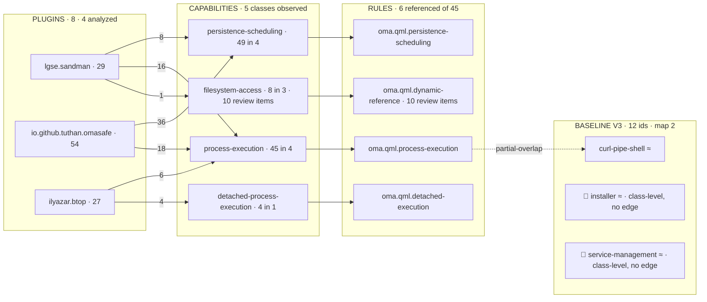
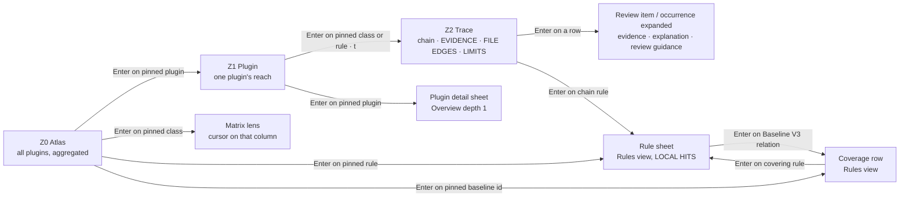

# Trust Flow — interactive trust graph specification

Trust Flow is the graph view (`Flow`, key `2`) of the OmaSafe panel. It draws what omasafe-cli 0.2.1 reports as a
deterministic, layered, left-to-right flow `PLUGINS → CAPABILITIES → RULES → BASELINE V3`, lets the user walk it with the
Quattro cursor, and drills from a plugin to a single `path:line` of evidence, to the rule that named it, to the Baseline V3
row that rule partially covers. It lives inside the 420-unit bar popup as its primary and complete home; a `panel`-kind
window is an optional last phase. Every number here comes from the real CLI samples of 2026-09-02 (`cli-samples/`); every
component, token, signal and enum was checked against `/usr/share/omarchy/shell` (Omarchy 4.0.2 Quattro, Quickshell 0.3.1,
Qt 6.11.2) and the Rust source in `/home/hvo/Projects/omasafe/crates`. Names follow the decision record; the surrounding
shell is specified in [03-ui-overhaul-proposal.md](03-ui-overhaul-proposal.md) and the tokens in
[02-design-principles.md](02-design-principles.md). The graph never renders a verdict: no score, no grade, no "safe".

## Contents

1. [Purpose and the questions it answers](#1-purpose-and-the-questions-it-answers)
2. [The four-layer model](#2-the-four-layer-model)
3. [Data view-model](#3-data-view-model)
4. [Layout algorithm — `graph/FlowLayout.js`](#4-layout-algorithm--graphflowlayoutjs)
5. [Visual encodings](#5-visual-encodings)
6. [Interactions and keyboard](#6-interactions-and-keyboard)
7. [Progressive disclosure ladder](#7-progressive-disclosure-ladder)
8. [States](#8-states)
9. [Wireframes](#9-wireframes)
10. [QML architecture](#10-qml-architecture)
11. [Performance budget and caps](#11-performance-budget-and-caps)
12. [Testing and acceptance checklist](#12-testing-and-acceptance-checklist)
13. [Open points](#13-open-points)
14. [Sources and references](#sources-and-references)

## 1 Purpose and the questions it answers

The maintainer asked for "a nice, beautiful, interactive, easy-to-understand graph about what plugins the user has
installed, what permissions/actions they can do, what findings or risks they bring, and a way to trace/find/understand the
related rules or rulesets we cover" (`brief.md`). Omarchy has no permission boundary and OmaSafe issues no verdicts, so:

| User question | Graph answer | Where |
|---|---|---|
| What is installed? | The PLUGINS layer: the 8 live plugins (6 Git checkouts, 2 installed without git); the 7 backup copies behind the `b` toggle, never drawn as analyzed | Z0 Atlas, Matrix rows |
| What can each plugin do? | Capability classes *observed in source* (`analysis.capabilities[]` grouped by `capability`) with occurrence counts. Presence, not permission, not intent | Z0 edges, Matrix cells, Z1 |
| Which plugins can do Y? | One capability node's hot set, or the Matrix column for Y | Z0 pin, Matrix lens |
| What review items does a plugin bring? | Review items (`analysis.findings[]`) as evidence rows with catalog severity and confidence; never aggregated into a score | Z2 Trace, inspector |
| Which rule named this, and what does the marketplace baseline call it? | RULES (`rules list`, catalog v7) and BASELINE V3 (`rules coverage`, map 2, `verified_at_commit` 964dc08) with relation glyphs | Z0 right pair, Z2 chain, coverage table |
| Where does static review stop? | `coverage_limitations`, `parser == null`, file coverage states on invocation edges | Z2 sections, node suffix `· N limits`, lexical-only `NoticeRow` |

The graph does not draw the marketplace claim as a layer (a catalog claim is not a trust relationship, GR2), does not
colour, size or rank anything by "risk", does not analyze plugins on its own (`a` / `A` only, G18) and does not animate layout.

## 2 The four-layer model

### 2.1 Layers

| Layer | Node key | Label | Count text | Source |
|---|---|---|---|---|
| PLUGINS | `plugin.id` (live, `classification != "backup"`) | id, `Text.ElideMiddle`; no leading glyph unless hollow / analyzing / blocked | observed capability occurrences, or `–` when not analyzed | `plugins inventory --format json` → `result.plugins[]` |
| CAPABILITIES | capability class string | class glyph + class name, `Text.ElideRight` (the first six characters distinguish all 17 classes; the glyph repeats the identity) | occurrences (the plugin count is inspector line 2) | `analysis.capabilities[].capability` (+ `findings[].capability` for classes reached only through review items) |
| RULES | `rule.id` | rule id, `Text.ElideMiddle`; no leading glyph in the open column (`󰧮` is the rail form — the column header already names the layer) | **local hits** = occurrences + review items, one labelled quantity (legend: `digits = occurrences · RULES digits = local hits`); the inspector always splits it `45 occurrences · no review items` — the measured value once ≥ 1 plugin is analyzed, `no review items` never `0`; `–` only while zero plugins are analyzed (02 §3.5) | `capabilities[].source_rule_id`, `findings[].rule_id`; facts from `rules list --format json` |
| BASELINE V3 | `externalId` | external id, `Text.ElideMiddle`; glyph slot = the via-class glyph when the row is reached only through a class (`󰆍 installer`), empty otherwise (`󰆼` is the rail form) | the relation mark `=` / `≈` in the count slot; not-covered rows have no mark and a `dim` label (inspector line 1 `Not covered by OmaSafe`; in the Phase 5 window the slot prints the word `not covered`) | `rules coverage --format json` → `result.coverage[]`, `result.not_covered[]` |

Evidence (occurrence sites and review items) is not a fifth column: at Z0 review-item groups collapse to the same keys as
rules, a fifth column does not fit 420 units, and a `path:line` is a row to read, not a node to route through; it is the Z2
Trace zoom (§7). Three facts are adornments and inspector lines, never layers: trust state (a word), an outstanding scan
alert (bold label), an enforcement block (`󰂭` in `Color.urgent`, an allowlisted semantic urgent use). Marketplace facts
appear nowhere on a node and on one inspector line only: the correlation `status` as `Labels.marketplaceStatusShort(status)`
(OmaSafe's own result, unprefixed; the one-line forms of 02 §3.4) followed by `Catalog says: <verification_status>` (the catalog's word, `not stated` when
`registry_claim` is null) and the snapshot commit and age. Review items are inspector facts at Z0 (plugin line 2, rule
split) and rows at Z2; a class node carries no second count line — rows are one `Style.spacing.popupRowHeight` high.



Class-level Baseline rows (`omaCapability` without a rule pointer) are not drawn as edges: the class glyph on the row and
the class node's hot set carry the relation (§2.2, §5).

### 2.2 Edge derivation

| Edge | Weight | Line style | Source fields |
|---|---|---|---|
| plugin → class | occurrences of that class in that plugin (`byClass[cls].occurrenceIds.length`) | solid if any backing occurrence is `ast-backed`; dashed only if every backing fact is `lexical-fallback` or `null`. `parser == null` makes that analysis's evidence lexical-only; it never changes unrelated edges | `analysis.capabilities[]`; a class present only through review items gets weight = review items from `findings[].capability` |
| class → rule | occurrences via `source_rule_id` plus review items via `findings[].rule_id` | as above | `capabilities[].source_rule_id`, `findings[].rule_id` |
| rule → baseline | 1 | solid = `structural-equivalent`; dashed = `partial-overlap` | `rules coverage` rows with `omaRuleId` |
| class → baseline | not an edge | encoded on the BASELINE node: the class glyph in its glyph slot (`󰆍 installer ≈`), the node added to the class node's hot set (label `faint` → `fg` when the cursor is on `process-execution`), inspector line `via class process-execution`. A curve would have to cross the RULES column behind transparent rows (02 §2.5, P10) and would carry nothing the glyph does not | rows with `omaCapability` (`sudoers-modification` carries both pointers: a rule edge when `oma.script.privilege-escalation` is drawn, and the class glyph from `process-execution`) |
| (none) for not-covered ids | — | no incoming edge, no relation mark; the node is still listed with a `dim` label | `result.not_covered[]` |

Occurrences with `source_rule_id == null` (none in the samples; allowed by `analysis.rs:80–81`) form a class edge but no
class → rule edge (inspector: `no covering rule yet`). Occurrences never enter a review-item count (`analysis.rs:74–76`).

### 2.3 Secondary views over the same store

| View | Question | Form | Entry |
|---|---|---|---|
| Matrix lens | which plugins can do Y | plugins × classes grid of digits; `·` none observed; `–` not analyzed; observed classes by default, all 17 on `c` | `m`, or Enter on a pinned capability at Z0 |
| Z1 Plugin | one plugin's flow | same four layers reduced to the plugin's reach; non-neighbours `faint` | Enter on a pinned plugin; `2` from a plugin detail sheet |
| Z2 Trace | the exact evidence behind one plugin × class (or × rule) | chain line + `EVIDENCE` + `FILE EDGES · PLUGIN-WIDE` + `COVERAGE LIMITS · PLUGIN-WIDE` | Enter on a pinned class or rule at Z1; `t` |
| Rule-centric reverse trace | which installed plugins trigger rule R | cursor on a RULES node: hot set = plugins reaching it; Enter (pinned) → rule sheet with `LOCAL HITS \| <k> PLUGINS · <n>` | Z0 / Z1 |
| Baseline coverage table | what OmaSafe covers of Baseline V3 | 12 rows, relation mark, covering rules/classes, per covering rule `observed in / not observed in <n> analyzed plugins` (never a count on the Baseline row itself, 03 §7.2), not-covered footer | Rules view; Enter on a pinned baseline id |

## 3 Data view-model

### 3.1 Sources and cost (measured on this machine)

| Command (argv verbatim from `Panel.qml`) | Yields | Cost | Cache |
|---|---|---|---|
| `plugins inventory --format json` (3824) | PLUGINS nodes, marketplace claims, `coverage.limitations[]` | 204 ms / 41 KB | per open, after scan or mutation |
| `plugins analyze <id> --format json` (4712) | per-plugin capabilities, review items, edges, limitations, parser | 126–182 ms / 14–34 KB | key = `content_digest + tool_version + canonical policy_identity` (1099–1136); on `a` / `A` only, one process at a time through the root `analysisQueue` (§10.1 — `analysisProcess.startFor()` at 4692–4707 is a single-slot preempt, not a queue) |
| `rules list --format json` | RULES facts: title, capability, default_severity, language, summary, review_guidance, surface_anchor | 4 ms / 25 KB | once per CLI version |
| `rules coverage --format json` (4524) | BASELINE V3 rows, `not_covered`, `map_version`, `verified_at_commit` | 4 ms / 5 KB | once per CLI version |
| `plugins status <id> --format json` (622, 4182) | trust word for the inspector | 64 ms each | per selection / sweep |
| `plugins enforcement-status <id> --format json` (4258) | `󰂭` adornment, `Blocked: …` line | 1–3 ms | per open |
| `scan --include-analysis` (BarWidget) | bold-label adornment, hero | periodic / `r` | source of truth |
| `rules explain <id>` (4830; Phase 0 adds `--format json`) | rule sheet only — never called by the graph | — | — |

### 3.2 Shapes

`model/ViewModel.js` normalises the raw reports (dropping `file_digests`) into the store of
[01-research-and-audit.md](01-research-and-audit.md); `graph/FlowLayout.js` consumes only the slice below, rebuilt per data
event and assigned to root properties at the cadences stated below.

```js
// Input to FlowLayout.build(): ViewModel.flowInput(store, scope, filters)
{
  scope:   { kind: "all" } | { kind: "plugin", id: "lgse.sandman" },
  lexicalOnlyCount: 0,                     // analyzed plugins in scope whose parser == null; notice only
  plugins: [{
    id: "lgse.sandman", classification: "Git-managed",
    analysis: "analyzed",                   // not analyzed | analyzing | analyzed | unavailable
    occurrences: 29, classes: 4, reviewItems: 2, limits: 13,
    outstanding: 0,                         // scan alerts naming this id
    trust: "untrusted", trustReason: "no trust baseline exists",   // CLI state + reason, never re-labelled here
    block: false,                           // enforcement decision outcome == "block"
    byClass: { "process-execution": { n: 16, review: 0, files: 2, parserBacked: 16, lexicalOnly: 0,
                                      rules: ["oma.qml.process-execution"] } /* … */ }
  }],
  classes: [{ id: "process-execution", occurrences: 45, plugins: 4, reviewItems: 0,
              parserBacked: 45, lexicalOnly: 0 }],
  rules:   [{ id: "oma.qml.process-execution", title: "QML process execution", severity: "medium",
              language: "qml", occurrences: 45, reviewItems: 0, hits: 45, plugins: 4 }],
  baseline: [{ id: "curl-pipe-shell", relation: "partial-overlap",
               viaRules: ["oma.qml.process-execution"], viaClasses: [], note: "OmaSafe flags runtime QML …" },
             { id: "installer", relation: "partial-overlap", viaRules: [], viaClasses: ["process-execution"] }],  // glyph 󰆍, no edge
  edges: [ { from: ["plugin","lgse.sandman"], to: ["class","process-execution"], w: 16,
             support: { parserBacked: 16, lexicalOnly: 0 }, dashed: false },
           { from: ["class","process-execution"], to: ["rule","oma.qml.process-execution"], w: 45,
             support: { parserBacked: 45, lexicalOnly: 0 }, dashed: false },
           { from: ["rule","oma.qml.process-execution"], to: ["baseline","curl-pipe-shell"], w: 1,
             coverageRelation: "partial-overlap", dashed: true } ]
           // no class → baseline edges: viaClasses is rendered on the baseline node (§2.2)
}

// Output of FlowLayout.build(input, geometry). TrustFlow keeps separate properties so that a slide or a window
// move never touches the Repeater models:
//   nodes    — four per-column arrays; reassigned when membershipKey OR contentKey changes
//   geometry — x, width, open, offset, hidden, rows per column; reassigned on every h/l slide or offset move
//   paths    — bucketed path strings; set by build() and by hot()
{
  membershipKey: "8|5|6|12|all|nobackups",       // key identities and scope/filter membership
  contentKey: "analysis-rev:4|alerts-rev:9|trust-rev:12", // counts/adornments/labels; analysis may recreate delegates
  nodes: [ [{ key: "plugin|lgse.sandman", label: "lgse.sandman", count: "29", glyph: "", hollow: false,
              bold: false, urgent: false, faint: false, suffix: "· 13 limits", tooltip: "lgse.sandman · 29 …" }]
           /* capabilities, rules, baseline (baseline: count = "≈" | "=" | "", glyph = via-class glyph | "") */ ],
  geometry: { headerH: 20, rows: 10,
              cols: [ { key: "plugins", x: 0, width: 118, open: true, offset: 0, hidden: 0 } /* … */ ] },
  edges: [ { a: "plugin|lgse.sandman", b: "class|process-execution", d: "M118 14 C142 14 166 42 190 42 ",
             bucket: "thick", dashed: false } ],
  byNode: { "plugin|lgse.sandman": [0, 1, 2, 3] },                 // incidence for hot sets
  hotSets: { "class|process-execution": ["baseline|installer", "baseline|package-manager", "baseline|privilege",
                                          "baseline|sudoers-modification"] },   // class-level baseline rows (§2.2)
  paths: { dimThinSolid: "M…", dimThinDashed: "", dimMedSolid: "", dimMedDashed: "",
           dimThickSolid: "", dimThickDashed: "", hotSolid: "", hotDashed: "" }
}
```

### 3.3 Worked example — the two plugins the record names

`lgse.sandman` (`analyze-lgse.sandman.json`, `status-lgse.sandman.json`, inventory row):

| Field | Value | Rendered as |
|---|---|---|
| classification / head / tree / digest | `Git-managed` · `e8161c6e…` · `4e5fab6d…` · `59fdc825…` (35 files) | inspector `Git checkout · 35 files`; identity grid in the detail sheet only |
| trust | `state: "untrusted"`, `reason: "no trust baseline exists"`, `trusted: null` | inspector `No trust baseline recorded` |
| marketplace | `status: "listed"` (CLI correlation result, `omasafe-marketplace/src/lib.rs:338–411`), `registry_claim.verification_status: "verified"`, `installed_matches_listing: true`, `upstream_moved: false` | inspector `Listed in snapshot · Catalog says: verified · snapshot 65b6385, 15 min old` — the status label is `Labels.marketplaceStatusShort` (02 §3.4), unprefixed; only the `verification_status` fragment is attributed to the catalog; never on the node |
| enforcement | `decision: null` | no adornment; the detail sheet prints the two-sentence null copy |
| capabilities | 29 = process-execution 16 (LidService.qml 9, Service.qml 7) · persistence-scheduling 8 (7 `ast-backed`, 1 `null` from `manifest.json` `headless-service-kind`) · compositor-control 4 · filesystem-access 1 | node count `29`; four plugin → class edges 16 / 8 / 4 / 1 → thick / med / med / thin, all solid (each class has ≥ 1 `ast-backed` row) |
| findings | 2 × `oma.qml.dynamic-reference` `low` `ast-backed` (BarWidget.qml:40, Service.qml:308), capability `filesystem-access` | class → rule edge `filesystem-access → oma.qml.dynamic-reference` weight 2 at Z1 (10 at Z0); Z2 evidence rows |
| invocation_edges | 5: BarWidget.qml:4 → Model.js · BarWidget.qml:40 → Panel.qml · Panel.qml:6 → Model.js · Service.qml:6 → Model.js · Service.qml:55 → sandman.py | Z2 `FILE EDGES · PLUGIN-WIDE \| 5`; `sandman.py` appends `· partially analyzed` (coverage_state `partial`) |
| coverage_limitations | 13, all `sink-reference-rejected:*:LidService.qml:*` (5 `absolute` at lines 144 / 158 / 171 / 213 / 239, 8 `missing-local-target`) | node suffix `· 13 limits`; Z2 `COVERAGE LIMITS · PLUGIN-WIDE \| 13` grouped per G26: `LidService.qml · 5 sink references rejected (absolute) · 8 missing local target` |
| parser / coverage_states | `tree-sitter-qmljs 0.3.1`; analyzed 3 · partial 4 · unreferenced 3 · unsupported 8 (18 entries) | solid edges; Z2 inspector `3 analyzed · 4 partially analyzed · 3 nothing observed · 8 not analyzable` |

`io.github.tuthan.omasafe` (the widget itself):

| Field | Value | Rendered as |
|---|---|---|
| classification | `built-in`, `repository: null`, `head: null`, `tree: null`, digest `397df358…` (14 files) | `Installed without git · 14 files`; identity grid shows Head / Tree as `unavailable` |
| trust | `untrusted`, `no trust baseline exists` | `No trust baseline recorded` |
| marketplace | `status: "conflict"` (CLI correlation result), `registry_claim: null`, reason `plugin ID matched, but repository identity conflicted or was unavailable` | inspector `Catalog entry not matched · Catalog says: not stated · snapshot 65b6385, 15 min old` (`Labels.marketplaceStatusShort`, 02 §3.4; the detail sheet prints the long label and the `reason` verbatim) — the catalog states nothing about this plugin, so nothing is attributed to it; an outstanding `provenance-conflict` alert names it → **bold** label |
| capabilities | 54 = persistence-scheduling 36 (`Timer`: Panel.qml 31, BarWidget.qml 5) · process-execution 18 (`Process`) | the heaviest plugin node on the machine; count `54`; two thick edges — exactly why the count is labelled occurrences, never risk |
| findings | 1 × `oma.qml.dynamic-reference` `low` (BarWidget.qml:508) | thin edge `filesystem-access → oma.qml.dynamic-reference`; this plugin reaches the class only through the review item |
| invocation_edges | 1: BarWidget.qml:508 → Panel.qml (`partial`) | `BarWidget.qml ─▶ Panel.qml · partially analyzed` |
| coverage_limitations | `dataflow-assignment-depth-limit:Panel.qml`, `dataflow-statement-limit:Panel.qml` | `· 2 limits`; Z2 `Panel.qml · dataflow depth limit · dataflow statement limit` |

Z0 totals from all four analyses: classes 5 (persistence-scheduling 49 in 4 plugins · process-execution 45 in 4 ·
compositor-control 14 in 3 · filesystem-access 8 in 3 plus 10 review items in 4 · detached-process-execution 4 in 1); rules
6 with local hits 49 / 45 / 14 / 10 (`oma.qml.dynamic-reference`, all review items) / 8 / 4; plugin → class edges 16 (sandman
4, omasafe 2, btop 5, dropdown-terminal 4, plus omasafe's review-item-only edge into `filesystem-access`); class → rule 6;
rule → baseline 1 (`oma.qml.process-execution → curl-pipe-shell`, dashed); baseline ids reachable 6 of 12 (`curl-pipe-shell`
via the rule edge; `installer`, `package-manager`, `privilege`, `sudoers-modification` carry the `󰆍` process-execution glyph;
`service-management` carries `󰔛` persistence-scheduling — class-level, no edge).

## 4 Layout algorithm — `graph/FlowLayout.js`

Pure functions, no QML objects, no timers. `build()` runs on inventory change, analysis arrival, scope change, lens/filter
change and width change; `hot()` runs on cursor or pin change only.

### 4.1 Steps

1. **Node sets** from `scope` and filters. Plugins: live rows (`b` adds backups as `faint`, edgeless, `not scanned`).
   Classes: those present in any cached analysis in scope (Matrix lens: all 17 from `rules list`, fixed catalog order).
   Rules: those referenced by a drawn class → rule edge (6 here; the full 45 live only in the Rules view). Baseline: at Z0
   with at least one analyzed plugin, every distinct `externalId` in `rules coverage` in map order (12), including
   `not_covered`; with zero analyses, one `not analyzed` sentinel represents the column because no local path exists yet.
   At Z1 only the ids reachable from the scope plugin through a rule edge or a class-level pointer (6 for
   `lgse.sandman`; the other 6 live in the coverage table).
2. **Order keys.** Plugins: `outstanding desc, analyzed first, id asc`. Classes: `occurrences desc, id asc` — the one
   exception to the catalog order defined in 02 §2.7 (`CapabilityStrip` and `MatrixGrid` keep catalog order). Rules:
   `reviewItems desc, occurrences desc, id asc`. Baseline: map order. Keys are computed on Flow entry or scope change and
   frozen while open (`orderEpoch`): an analysis arriving after `a` fills its node in place and appends new class/rule nodes
   at the column end; the next entry re-sorts.
3. **Barycentre tie-break sweep** over the middle layers only: left → right assigns each class the weighted mean row of
   its plugin neighbours and each rule the weighted mean row of its class neighbours; right → left repeats from baseline
   (fixed) to rules to classes. The declared order keys in step 2 remain primary; barycentre only orders nodes tied on
   those keys, so the drawn occurrence order does not silently become a topology order. The sweep runs only when
   `orderEpoch` changes (Flow entry or scope reset). On same-epoch data arrival the previous order is retained and
   genuinely new keys append at the column end; neither key-sort nor barycentre may move existing nodes. Previous index
   breaks the final tie. Under 100 nodes this is sub-millisecond.
4. **Window.** `rowH = Style.spacing.popupRowHeight`. The body gets what the popup has left, not a fixed cap:
   `bodyH = fittedContentHeight cap − KeyboardPanel.verticalContentInset − Σ(fixed rows and gaps above and below the body)`
   (§4.3 table); `maxRows = floor(bodyH / rowH)` — 10 at base 12 with no status or notice row, 9 with one, 7 at Z1 with a
   breadcrumb and a notice, 5 on a 768-px screen at base 20. All four columns share one window height:
   `rows = min(maxRows, max(node count over the four columns))`. A column with more nodes than `rows` shows `rows − 1` and a
   `+N more` rail row; the cursor moves that column's window (`offset`, geometry only — no node array changes), and edges
   into hidden nodes terminate at the `+N more` row. `ensureCursorVisible` is mandatory on every graph cursor move.
5. **Geometry (focus pair).** Two adjacent columns are open, two are rails. `railW = Style.space(28)`; the two open columns
   are separated by the **edge lane** `pairGutter = Style.space(72)`; a rail and its neighbour by `railGutter =
   Style.space(12)`; `openW = (width − 2·railW − pairGutter − 2·railGutter) / 2` = 118 at base 12, where `width` is the
   graph item's width (the popup's content holder). Edges into a rail end at the rail's glyph column (they are only ever
   1-hop hot highlights there). Columns snap; no `Behavior` on widths (edges would misalign mid-slide).
6. **Edges.** From column `i` row `r` to column `j = i + 1` row `s`: `x1 = col[i].x + col[i].width`, `x2 = col[j].x`,
   `lane = x2 − x1`, `y = headerH + (row − offset) · rowH + rowH / 2`; cubic Bézier `M x1 y1 C x1+lane/3 y1 x2−lane/3 y2 x2 y2`.
   Control points at thirds (not the midpoint) make parallel edges fan visibly across the 72-unit lane instead of packing
   into a near-vertical S. There are no skip edges: class-level Baseline relations are node adornments (§2.2).
7. **Buckets.** Thickness by weight: `thin` ≤ 3, `med` 4–9, `thick` ≥ 10 (`Style.space(1)` / `space(2)` / `space(3)`).
   Dashed per §2.2. Eight path strings: `dim × {thin, med, thick} × {solid, dashed}` + `hot × {solid, dashed}` (hot always
   `space(2)`). Empty strings cost nothing.

### 4.2 Pseudocode

```js
// graph/FlowLayout.js — pure; ≈ 200 lines when implemented
function build(input, geo) {
  var cols = nodeSets(input)                        // [plugins, classes, rules, baseline]
  if (input.orderEpoch !== geo.orderEpoch) {
    cols.forEach(sortByKeys)
    barycentre(cols, 1, 0); barycentre(cols, 2, 1)  // left → right (classes, rules)
    barycentre(cols, 2, 3); barycentre(cols, 1, 2)  // right → left
  } else {
    cols.forEach((c, i) => preservePreviousOrderAndAppend(c, geo.previousNodes[i]))
  }
  var rows = Math.min(geo.maxRows, Math.max.apply(null, cols.map(c => c.nodes.length)))
  var x = 0
  for (var i = 0; i < 4; i++) {
    cols[i].x = x; cols[i].width = geo.pair[i] ? geo.openW : geo.railW
    x += cols[i].width + (geo.pair[i] && geo.pair[i + 1] ? geo.pairGutter : geo.railGutter)
    windowColumn(cols[i], rows)                     // sets row numbers, hidden count, "+N more"
  }
  var edges = input.edges.map(e => placeEdge(e, cols, geo))
  return { membershipKey: membershipKey(cols, input),
           contentKey: contentKey(cols, input),          // counts, state, adornments and copy
           nodes: cols.map(c => c.nodes), geometry: geometryOf(cols, rows, geo),
           edges: edges, byNode: incidence(edges), hotSets: classLevelBaseline(input),
           paths: bucket(edges, new Set()) }
}

function barycentre(cols, target, ref) {
  var pos = indexMap(cols[ref].nodes)
  cols[target].nodes.forEach(n => {
    var links = n.neighbours[ref].filter(link => isFinite(pos[link.key]))
    var weight = links.reduce((sum, link) => sum + link.weight, 0)
    n.bc = weight ? links.reduce((sum, link) => sum + pos[link.key] * link.weight, 0) / weight : n.bc
  })
  stableSort(cols[target].nodes,
             (a, b) => primaryCompare(a, b) || a.bc - b.bc || a.index - b.index)
}

function placeEdge(e, cols, geo) {
  var a = locate(cols, e.from), b = locate(cols, e.to)        // hidden node → its column's "+N more" row
  var x1 = cols[a.col].x + cols[a.col].width, x2 = cols[b.col].x, lane = x2 - x1
  var y1 = rowCenter(a, geo), y2 = rowCenter(b, geo), c1 = x1 + lane / 3, c2 = x2 - lane / 3
  return { a: key(e.from), b: key(e.to),
           d: "M" + x1 + " " + y1 + " C" + c1 + " " + y1 + " " + c2 + " " + y2 + " " + x2 + " " + y2 + " ",
           bucket: e.w >= 10 ? "thick" : (e.w >= 4 ? "med" : "thin"), dashed: e.dashed }
}

function bucket(edges, hotSet) {                      // called by build() and hot()
  var p = { dimThinSolid: "", dimThinDashed: "", dimMedSolid: "", dimMedDashed: "",
            dimThickSolid: "", dimThickDashed: "", hotSolid: "", hotDashed: "" }
  edges.forEach(e => {
    var hot = hotSet.has(e.a) || hotSet.has(e.b)
    p[hot ? "hot" + (e.dashed ? "Dashed" : "Solid")
          : "dim" + cap(e.bucket) + (e.dashed ? "Dashed" : "Solid")] += e.d
  })
  return p
}

function hot(layout, cursorKey, pinnedKey) {          // cursor: 1-hop; pin: full reach within scope
  var set = new Set(cursorKey ? [cursorKey] : [])
  if (pinnedKey) reach(layout, pinnedKey).forEach(k => set.add(k))
  ;(layout.hotSets[cursorKey] || []).forEach(k => set.add(k))   // class-level baseline rows brighten, no edge
  return { paths: bucket(layout.edges, set), hotKeys: set }      // hotKeys drives FlowNode.faint at Z1
}

// slide(layout, pair) and moveWindow(layout, col, offset) recompute `geometry`, `edges[].d` and `paths` only;
// `nodes` is never touched, so no FlowNode delegate is created or destroyed on h / l / j / k.
```

### 4.3 Sizing math

Popup: `KeyboardPanel.contentWidth = fittedContentWidth(Style.space(420))`; content holder width = card − 2 ·
`Style.spacing.popupPadding` − 2 · border (`max(1, Style.space(2))`). Glyph advance for JetBrainsMonoNerdFont = 0.6 em for
letters and for all 17 class glyphs (checked in the font's `hmtx`); `bodySmall` at base 12 is 11 px → 6.6 px per character.

Widths:

| Base | Card | Content width | `railW` | `pairGutter` (edge lane) | `railGutter` | `openW` | `rowH` | Label chars at `bodySmall`: PLUGINS · RULES (digits, no glyph) / CAPABILITIES (glyph + digits) / BASELINE (glyph + mark) |
|---|---|---|---|---|---|---|---|---|
| 9 | 315 | 289 | 21 | 54 | 9 | 87 | 21 | 11 / 7 / 8 (12 without a via-class glyph) |
| 12 | 420 | 388 | 28 | 72 | 12 | 118 | 28 | 11 / 7 / 8 (12) |
| 16 | 560 | 516 | 37 | 96 | 16 | 157 | 37 | 11 / 7 / 8 (12) |
| 20 | 700 | 648 | 47 | 120 | 20 | 197 | 47 | 11 / 7 / 8 (12) |

Label capacity is constant because every term scales by the same factor. PLUGINS and open RULES: `openW − space(10) −
space(8) − countW(2 digits, 13 px) − space(8)` = 79 px ≈ 11 characters — `lgse.sandman` (12) elides to `lgse.…ndman`,
`io.github.tuthan.dropdown-terminal` to `io.gi…minal`, rule ids to `oma.q…ution` (`oma.qml.process-execution` and
`oma.qml.detached-execution` collide at this width; the inspector's first line and the rail glyph resolve it). CAPABILITIES
(glyph column `space(22)` + gap `space(6)` + digits): 51 px ≈ 7 characters, `Text.ElideRight` — `persis…`, `proces…`,
`compos…`, `filesy…`, `detach…`; the first six characters are distinct for all 17 catalog classes. BASELINE (mark in the
count slot, 7 px): 8 characters with a via-class glyph (`󰆍 inst…ler ≈`), 12 without (`curl-…shell ≈`). The full id is
always the first inspector line and the hover tooltip. The record's "≈ 146 units at base 12" used the card width and a
24-unit gutter; the formula above is binding and the content-holder value (118) is what the implementation sees. Why the
lane costs 12 label characters per column: a plugin → class edge can span nine rows (≈ 250 units vertically); in a 24-unit
gutter its cubic is a near-vertical S and 16 such edges are a hairball; at 72 units with thirds control points the four edges
out of one plugin fan visibly, which is the whole point of the Graph lens over the Matrix.

Heights at base 12 (cap `fittedContentHeight(h, Style.space(560))` = 560; `KeyboardPanel.verticalContentInset` = 2 ·
`popupPadding` 14 + 2 · border 2 = 32, `Ui/KeyboardPanel.qml:159–173`, leaving 528 for content):

| Row | Height | Present |
|---|---|---|
| `PanelHero` + `Column.spacing` | 40 + 12 | always |
| views `ButtonGroup` + spacing | 34 + 12 | always |
| status line or `NoticeRow` + spacing | 20 + 12 each | when the CLI failed, the snapshot is stale, or `parser == null` in scope |
| `Breadcrumb` + section spacing | 20 + 10 | Z1, Z2 |
| `SectionHeaderRow` + spacing | 20 + 10 | always |
| lens row + spacing | 34 + 10 | Z0, Z1 |
| graph body | `rows · rowH` | — |
| spacing + `InspectorStrip` (title + 3 lines) | 10 + 62 | always |

Fixed rows without body: 244 → body 284 → **10 rows** (Z0, nothing to report); one notice → 252 → 9 rows; Z1 with breadcrumb
→ 254 → 9; Z1 with breadcrumb and notice → 222 → 7. The old "hero 40 + … ≈ 546" sum omitted the gaps and the inset; with a
fixed `space(360)` body the real total was ≈ 640 against a 560 cap, so the inspector sat below the fold on every Flow entry.
On a 768-px screen at base 20 `availableCardHeight` ≈ 700, inset ≈ 52, fixed rows ≈ 407 → body ≈ 241 → 5 rows of 47; every
column over 5 nodes windows. 03 §3 pins the hero, status line, notices, view chips, finder and breadcrumb outside the `Flickable`, whose height is
`parent.height − fixed.height − Style.space(12)`; `FlowView` therefore computes `bodyH = Flickable.height − (section header
+ lens row + InspectorStrip + their gaps)`, which is the same 284 at base 12 — the fixed part is subtracted either way, so
the row counts above hold. The graph body never scrolls the outer `Flickable`: the column under the pointer owns the wheel
(§6.1) and `ensureCursorVisible` moves the column `offset`.

Optional window (`TrustFlowWindow.qml`, Phase 5): `BorderSurface` card `min(Style.space(1080), screen − 2·Style.gapsOut)`,
`padding: Style.spacing.panelPadding`; all four columns open, `colW = (inner − 3·pairGutter) / 4` = 206 px at base 12 (≈ 28
label chars; the count slot is wide enough to print `not covered` and `unavailable` beside the label), 154 at base 9, 344 at
base 20 on a 1920-px screen (card capped at 1910); 20 rows per column (`space(600) / rowH`); same `FlowLayout.js`,
`EdgeLayer` and `InspectorStrip` — the window adds width, not features.

## 5 Visual encodings

Rule: **nothing encodes a verdict.** Colour never carries meaning alone; size encodes counts that are also printed as
digits; `Color.urgent` is restricted to the semantic allowlist in 02 P9 and may appear on multiple independent
critical/block rows. Root colours: `fg`, `urgent`, `dimHeader`, `dim`, `faint`, `hoverFill`, `selectedFill`.

| Meaning | Channel | Spec |
|---|---|---|
| Node kind | column + leading glyph | PLUGINS: no glyph (classification is an inspector fact); CAPABILITIES: class glyph from `model/Glyphs.js` (`󰆍 󰏌 󰖟 󰉖 󰌆 󰌌 󰹑 󰔛 󰅌 󰍹 󰯄 󰍁 󰀋 󰅩 󰌘 󱔓 󰍛`; unknown class `󰘥` + `unsupported`); RULES: `󰧮` in the rail form only; BASELINE V3: `󰆼` in the rail form, the via-class glyph on class-level rows, relation mark `=` (structural-equivalent) / `≈` (partial-overlap) as text in the count slot; not-covered rows have no mark |
| Count | digits in `Style.font.bodySmall` (data floor, 02 P7) at the node's right edge + edge thickness buckets | size is the only quantitative channel and the number is always printed; PLUGINS and CAPABILITIES digits = occurrences, RULES digits = local hits (occurrences + review items, split on inspector line 2), BASELINE slot = relation mark; the legend labels each; never "risk". Words in the slot (`unavailable`, `…`, `–`) print in the popup only when the label keeps ≥ 6 characters, else the label stays dim and the word is inspector line 1 |
| Not analyzed / analysis unavailable | hollow glyph `󰝦` + `–` or `unavailable` in the count slot + `dim` label; no edges | never zero, never omitted; inspector `Not analyzed. Press a or Analyze.` (02 §3.3) or `Analysis unavailable: <verbatim reason>` |
| Analyzing | `󰦖` in the glyph slot, count `…`; the `Button.iconSpinning` spinner lives on the hero scan button only | no per-node animation |
| Outstanding scan alert | **bold** label | weight only; `Color.urgent` never touches a plugin node for an alert |
| Enforcement block | `󰂭` in `urgent` in the glyph slot | allowlisted for every independently blocked plugin; inspector `Blocked: <reason codes>` |
| Trust state | none on the node | inspector word: `No trust baseline recorded` / `Installed source matches the baseline you recorded` / `Matches the baseline; coverage is limited` / `Installed source differs from the baseline · <n> files changed` / `Baseline revoked; …` / `Baseline status unavailable: <reason>` |
| Marketplace | none on the node | one inspector line: `<Labels.marketplaceStatusShort(status)> · Catalog says: <verification_status> · snapshot <commit7>, <age>`. The status label (`Listed in snapshot`, `Catalog entry not matched`, … — the one-line forms of 02 §3.4) is OmaSafe's correlation result and is never prefixed; the `Catalog says:` fragment carries only `registry_claim.verification_status` (`verified` / `unverified` / `not stated` when the claim is null / verbatim quoted); "verified" suppressed and `(stale)` appended when `marketplace_stale` |
| Severity (Z2 rows and inspector only) | glyph + word | `󰋽` info · no glyph for `low` (word only) · `󰝥` medium · `󰀦` high (bold) · `󰀩` alert-octagon for critical in `urgent` (bold) · unknown → no glyph, `unsupported` (02 §2.4; `󰝦` means only a hollow node); the RULES node prints `catalog severity <word>` in the inspector, never a colour |
| Confidence | edge dash + word | solid = at least one `ast-backed` row backs the edge; `ShapePath.DashLine` `dashPattern: [4, 4]` = all backing facts are `lexical-fallback`/`null`. A mixed edge stays solid and its inspector says `mixed evidence: <n> parser-backed · <m> text-match-only`; a parser-null analysis affects only edges it backs. Z2 words: `parser-backed` / `text match only` / `no parser` |
| Coverage relation | edge dash + text mark + via-class glyph | rule → baseline edge solid with `=`, dashed with `≈`; class-level rows: no edge, the class glyph in the glyph slot, `≈` in the count slot, brightened in the class node's hot set; not-covered: no mark, no edge, `dim` label, inspector `Not covered by OmaSafe` |
| Coverage limitations | node suffix `· N limits`, `dim` `bodySmall` (a count) | Z2 section always rendered when > 0 |
| Cursor / pinned | `CursorSurface.hasCursor` → `hoverFill` + `Border.controlSpec("hover-cursor")`; `current` → `selectedFill` + `Border.controlSpec("selected")` | kit only; one highlight on screen |
| Edge at rest / hot / non-neighbour (Z1) | `Util.alpha(fg, Style.hoverBorderAlpha)` / `Util.alpha(fg, 0.9)` with 120 ms `ColorAnimation` / nodes `faint` (`dimStep(0.55)`, 02 §2.3) | theme-owned alphas; light themes may move to `Style.normalBorderAlpha` after the Phase 4 contrast pass |
| Filter / toggle | the section header value prints what is hidden | `TRUST FLOW · ALL PLUGINS \| 4 OF 8 ANALYZED · HIDING 7 BACKUPS` (G6). Unanalyzed plugins are never hidden (§8), so no `NOT ANALYZED` fragment exists; `b` replaces the fragment with `SHOWING 7 BACKUPS (NOT SCANNED)` |

Legend (`?` on the lens row → `PanelToolTip`, `bodySmall`, one line per entry; thickness described in words, never with
dash or equals characters that would collide with the relation marks): `thin ≤ 3 · medium 4–9 · thick ≥ 10 occurrences ·
dashed = text match only or no parser · digits = occurrences · RULES digits = local hits (occurrences + review items) · =
equivalent check · ≈ partially covered · class glyph on a BASELINE row = covered at class level · no mark, dim = not
covered by OmaSafe · 󰝦 not analyzed · bold = outstanding alert · 󰂭 blocked by policy · j k h l move · Enter pin/open · x
unpin · t trace · a analyze · m matrix`.

## 6 Interactions and keyboard

### 6.1 Inputs

| Input | Z0 Atlas | Z1 Plugin | Z2 Trace | Matrix |
|---|---|---|---|---|
| Hover | `PointerMoveGate.moved(node, mouse)` → `setCursor(col, row)` and `hoverKey`; hot 1-hop set; the one TrustFlow-level `PanelToolTip` (full label + one catalog sentence) shows at the hovered node only — a keyboard cursor move never pops it, the `InspectorStrip` is the keyboard path (Little Snitch pattern: fixed inspector, not floating tooltips) | same | row cursor | cell cursor |
| `j` / `k`, ↓ / ↑ | move within the column; window scrolls; no wrap | same | move across `EVIDENCE` → `FILE EDGES` → `COVERAGE LIMITS` rows | move row |
| `h` / `l`, ← / → | neighbouring column, landing on the nearest node connected to the previous cursor node (a hot edge always survives); a rail slides open | same; `h` at the leftmost column pops to Z0 | `h` pops to Z1 | move column (label → first cell … last cell) |
| Enter / Space / click | unpinned → pin (`current`, inspector locks). Pinned plugin → Z1. Pinned class → Matrix lens, cursor on that column. Pinned rule → rule sheet (Rules view, row expanded). Pinned baseline id → coverage row expanded | pinned plugin → plugin detail sheet; pinned class or rule → Z2; pinned baseline → coverage row | evidence row → inline expansion (evidence, explanation, review guidance); chain rule segment → rule sheet; limitation row → raw code | cell → Z2 for that plugin × class; row label → Z1; `–` cell → inspector hint |
| `x` | unpin; while an `A` sweep is running, also drops the remaining `analysisQueue` (the running process finishes; nothing is mutated) | unpin | collapse expanded row | — |
| `t` | Z2 when a plugin is pinned and the cursor is on a connected class or rule; else inspector hint `Trace needs a plugin and a connected class or rule.` | Z2 for the cursor class/rule | — | Z2 for the cell |
| `a` / `A` | analyze the cursor plugin / all live unanalyzed plugins, one process at a time through the root `analysisQueue` (§10.1; each run keeps the 4712 argv, 30 s timeout, 2 MiB cap, SIGTERM → SIGKILL). `a` on a node that is not `selectedPluginId` enqueues that id — it never changes the selection; a running sweep shows `󰦖` on exactly one node | same | analyze the scope plugin | same |
| `m` · `c` · `b` | lens Graph ↔ Matrix (140 ms opacity crossfade) · — · backups as `faint` edgeless rows, header value `SHOWING 7 BACKUPS (NOT SCANNED)` in place of `HIDING 7 BACKUPS` | same | — | back to Graph · observed ↔ all 17 classes (horizontal `Flickable`) · same |
| `-` · `1` / `3` · `2` | — · views · `2` while in Flow pops to Z0 | pop to Z0 | pop to Z1 | — |
| `/` | finder (`keyCatcher.blocked = finder.activeFocus`); Enter on a result: plugin → Z1, class → Matrix column, rule → rule sheet, baseline → coverage row | same | same | same |
| `?` · `g` | legend `PanelToolTip` · Phase 5 only: `bar.shell.summon(root.moduleName, JSON.stringify(payload))` when `bar.shell` exists, hidden otherwise. `root.moduleName` is the popup's own id (`Panel.qml:9`, declared `Ui/Panel.qml:13`; the bar injects the same string into the widget, `plugins/bar/Bar.qml:1770`, and it equals the registry key `manifest.id`, `shell.qml:678`, because `Util.canonicalWidgetId` is the identity, `Commons/Util.qml:70`). `manifest` is never available here: the host injects it only into panel/overlay/menu loader items (`shell.qml:631`) and a bar widget receives `bar`, `moduleName`, `settings` only (`Ui/BarWidget.qml:15–17`), so `manifest.id` is used solely inside `TrustFlowWindow.qml`. The precedent passes a literal (`network/Panel.qml:468`, `"omarchy.wifiqr"`) | same | same | same |
| Wheel | one column-level `MouseArea` per column in `TrustFlow` (not in `FlowNode`) handles `onWheel` (`wheel.angleDelta.y`) and moves that column's `offset` (geometry only), accepting the event so the outer `Flickable` never scrolls under the graph; `PointerMoveGate.reset()` after the window moves | same | scrolls the `ListView` | scrolls rows / columns |
| Esc | closes the panel (kit grammar) — never pops depth | same | same | same |

No key performs or opens a mutation from the graph. The inspector's `Button` is always read-only navigation (`Open`, `Open
rule`, `Open coverage row`, `Analyze (a)`, `Matrix (m)`); Record / Replace / Remove baseline live only in the detail sheet's
`TRUST BASELINE` section and pass through `ConfirmSheet` ([03](03-ui-overhaul-proposal.md)).

### 6.2 Cursor model integration

Flow's sections in the dev-gallery template (`GalleryPanel.qml:101–262`): `hero → views(H) → lens(H) → col-0 → col-1 →
col-2 → col-3 → inspector-actions(H)` (`(H)` = `sectionIsHorizontal`). Within `col-*` the root overrides `moveCursorH`:

```js
function moveCursorH(delta) {                                   // Panel.qml root, Flow view only
  if (!focusSection.startsWith("col-")) return baseMoveCursorH(delta)
  var col = Number(focusSection.slice(4)), next = col + delta
  if (next < 0) { if (flowDepth > 0) popDepth(); return }        // h at the left edge pops Z1 → Z0
  if (next > 3) return
  var fromKey = trustFlow.nodes[col][selectedIndex].key
  var targetNodes = trustFlow.nodes[next]
  var connected = targetNodes.findIndex(n => layout.byNode[fromKey].some(i => touches(layout.edges[i], n.key)))
  focusSection = "col-" + next
  selectedIndex = connected >= 0 ? connected : Math.min(selectedIndex, targetNodes.length - 1)
  if (!layout.geometry.cols[next].open) slidePair(next)         // rail → open: geometry + edges + paths only; nodes untouched
  ensureCursorVisible()                                          // may move geometry.cols[next].offset
  gate.reset(); trustFlow.paths = FlowLayout.hot(layout, cursorKey(), pinnedKey).paths
}
```

`activateCursor()` for `col-*` implements the Enter table above and honours `swallowNextActivate` (set by `openSheet()`,
so the Enter that opened a `ConfirmSheet` elsewhere can never land on the graph). `clampCursor()` runs after every `nodes`
assignment; `ensureCursorVisible` runs on every graph cursor move and changes the column `offset` (geometry) only — the
`Repeater` models are the stable `nodes` arrays, so `h` / `l` / `j` / `k` create and destroy no delegates. `trustFlow.paths` is
a plain property written by both `build()` (via the root handlers) and `hot()`; nothing binds `EdgeLayer.paths` to a
layout field that an imperative write could shadow. Hover never reads `containsMouse`: `FlowNode` calls `gate.moved(node,
mouse)` and the root sets the cursor — the `CursorSurface` contract.

```mermaid
sequenceDiagram
  participant U as User
  participant K as PanelKeyCatcher
  participant R as Panel.qml root
  participant P as analysisProcess (bounded)
  participant L as FlowLayout.js
  participant V as TrustFlow / EdgeLayer
  U->>K: a
  K->>R: textKey("a")
  R->>R: plugin = cursor node; cacheKey = digest|0.2.1|policy
  alt cached
    R->>L: build(flowInput(store), geo)
  else not cached
    R->>R: analysisQueue.push(id); analysisStateById[id] = "analyzing"; startNextAnalysis()
    R->>P: plugins analyze <id> --format json (30 s, 2 MiB, analysisSweepGeneration)
    P-->>R: onExited → applyAnalysis (schema omasafe.analysis.v1) → startNextAnalysis()
    R->>L: build(flowInput(store), geo)   (frozen order: node fills in place)
  end
  L-->>R: layout
  R->>V: nodes (if membershipKey or contentKey changed); geometry; paths = hot(layout, cursorKey, pinnedKey).paths
  V-->>U: node filled, edges appear; inspector "29 occurrences · 4 classes …"
```

## 7 Progressive disclosure ladder



> **Phase 4 / T4.1 refinement.** The displayed heading below reads `ANALYSIS PATHS · …`, not `TRUST FLOW · …`
> (the internal name and `flow*` identifiers are unchanged); a wrapping legend line `Plugin → observed capability →
> detecting rule → Baseline V3 mapping` sits under it. Z0 opens on the **Matrix** lens (the readable comparison form),
> Graph one keystroke away; the graph draws no resting-state edges (only a cursor's one hop or a pin's path); the
> inspector is never blank; and `+N more` rails are typed (`+3 plugins`, `+N Baseline ids`). See `docs/implementation/
> phase-4-polish.md` §T4.1.

| Depth | Breadcrumb (`components/Breadcrumb.qml`) | Header (`SectionHeaderRow`) | What is added |
|---|---|---|---|
| Z0 | none | `TRUST FLOW · ALL PLUGINS \| 4 OF 8 ANALYZED · HIDING 7 BACKUPS` (the hidden-count fragment appears whenever a filter or toggle hides rows) | counts, edges, adornments, inspector facts |
| Z1 | `󰅁 All plugins` (depth 1 renders the way back only, 03 §8; the header names the plugin) | `TRUST FLOW · lgse.sandman` | per-plugin weights, non-neighbours faint, `· 13 limits` |
| Z2 | `lgse.sandman › process-execution › oma.qml.process-execution › curl-pipe-shell` | `TRACE` | `path:line · detail · confidence`, file edges with target coverage state, grouped limitations |
| row expanded | same | — | `evidence` verbatim (`bodySmall`, `WrapAnywhere`), `explanation`, `review_guidance`; severity and confidence words as `FactPill`s (02 §2.5) with their tooltips |
| rule sheet | Rules view | `RULE CATALOG \| V7 · 45 RULES` | title, summary, `catalog severity`, language, surface anchor, `LOCAL HITS \| <k> PLUGINS · <n>`, `BASELINE V3 \| <n> ROWS · MAP 2` |
| coverage row | Rules view | `BASELINE V3 COVERAGE \| 12 PARTIAL · 3 NOT COVERED` | covering rules and classes, note verbatim; under each covering rule `observed in <k> analyzed plugins` / `not observed in <n> analyzed plugins` (03 §7.2; no count on the Baseline row itself) |

Popping (`h` at the left edge, `-`, the back `PanelActionButton 󰅁`, or a breadcrumb segment) restores the previous cursor and pin.

## 8 States

| Condition | Rendering | Copy |
|---|---|---|
| CLI missing / incompatible / gate `/usr/bin/false` (164–167) | `NoticeRow { reason: "unavailable" }` in place of the body; view chips stay enabled (`1`/`3` still switch), lens chips disabled — there is no body for them to switch (03 §4.3) | `Plugins, review items, rules and the trust flow are unavailable until omasafe-cli 0.2.1 or newer is found on PATH.` |
| Inventory loading · zero live plugins | `NoticeRow` `loading` · `none` | `Loading plugins…` · `No plugins installed.` |
| Inventory ready, no analyses | PLUGINS column with every node hollow; the other three columns show one dim rail row each; inspector offers `Analyze (a) · Analyze all (A)`; RULES/BASELINE counts `–` | `Not analyzed. Press a or Analyze.` |
| Some analyzed · analysis in flight | unanalyzed nodes hollow, edgeless, listed (never omitted); header `4 OF 8 ANALYZED` · `analysisStateById[id] == "analyzing"` → `󰦖` glyph, count `…` on that one node, nothing else moves; the rest of an `A` sweep stays hollow until its turn | node count `–` · inspector `Loading analysis…` / `Queued (3 ahead)` |
| Analysis failed / timed out / oversize | hollow node, `unavailable` in the count slot, inspector quotes the reason; never drawn as zero capabilities | `Analysis unavailable: <stderr first line>.` · `omasafe-cli timed out after 30 seconds.` · `Output was larger than 2 MiB and was discarded. Run \`omasafe-cli plugins analyze <id>\` in a terminal.` |
| `parser == null` in any analysis in scope | persistent `NoticeRow { reason: "lexical-only" }` under the header; only evidence edges with no parser-backed support are dashed; mixed and unrelated edges remain solid; Z2 confidence words `text match only` / `no parser` | `<n> analyzed plugins used lexical-only analysis; affected edges are dashed.` |
| `coverage_limitations` non-empty · not an array · inventory `coverage.limitations[]` non-empty | node suffix `· N limits`, Z2 section always rendered · suffix `· coverage unavailable`, section `Coverage unavailable` · `NoticeRow` under the hero (shared with Overview) | `COVERAGE LIMITS · PLUGIN-WIDE \| 13` · never "complete" · grouped per G26 |
| Zero review items in an analyzed plugin | RULES column still shows rules reached via occurrences | `No review items in analyzed files. <n> files were not analyzed.` |
| Rule catalog or coverage map unavailable · snapshot stale | RULES nodes labelled by id only; BASELINE column a single dim rail row · the inspector marketplace line keeps the status label, drops "verified" from the `Catalog says:` fragment and appends `(stale)` to the age | `Rule facts unavailable: <reason>.` · `Coverage map unavailable: <reason>.` · `Listed in snapshot · Catalog says: unverified · snapshot 65b6385, 31 days old (stale)` |
| Enforcement block on a plugin | `󰂭` urgent glyph in that node | `Blocked: <reason codes with hyphens replaced>` |
| Outstanding alert names a plugin · filter or toggle active | bold label · the section header value appends the hidden count | inspector line 2 prefixed with the alert kind label · `4 OF 8 ANALYZED · HIDING 7 BACKUPS` (unanalyzed plugins are never hidden, so no other fragment exists) |
| Too many nodes (column > `rows`, §4.1 step 4) | `+N more` rail row; cursor scrolls the window; edges into hidden nodes end at that row | `+3 more` (BASELINE at Z0, 10-row window) · `+36 more` (full catalog only) |
| Finder with no match | body replaced by `NoticeRow { reason: "none" }` | `No plugin, class, rule or baseline id matches "<text>".` |
| `Shape.CurveRenderer` smoke test fails (Phase 3) | Graph lens hidden; Matrix + Trace become the Flow body; no `Canvas` | header `TRUST FLOW · MATRIX` |

## 9 Wireframes

All popup frames are 52 columns. ASCII stand-ins, stated once: `(S)` shield hero glyph, `[@]` scan `Button`, `[<]` back
`PanelActionButton`, `?` legend `PanelActionButton`, `o` hollow node (not analyzed), `*` filled node, `PX TM WM FS DX` class
glyphs (process-execution, persistence-scheduling, compositor-control, filesystem-access, detached-process-execution), `R`
rule rail glyph, `B` baseline rail glyph, `!` alert (bold label), `=` thick edge, `-` medium/thin edge, `.` dashed edge, `\`
`/` bends, `~` (rails) and `≈` (open columns) partial-overlap mark; a baseline row with no mark is not covered (dim label). A
`PX~` rail row is a class-level baseline row (class glyph + mark). Caption text is narrower than an ASCII cell (388 px hold
64 caption characters but 50 cells), so header values are drawn truncated with `…` and given in full in the callouts.
Real UI uses the Nerd Font codepoints in [02](02-design-principles.md).

### 9.1 Z0 Atlas — focus pair PLUGINS | CAPABILITIES (default on entry)

```
+--------------------------------------------------+
| (S)  3 alerts to review                          |
|      8 PLUGINS · 3 NEW · SCANNED 12 MIN AGO  [@] |
| [Overview] [Flow] [Rules]                        |
| ------------------------------------------------ |
| TRUST FLOW · ALL PLUGINS  4 OF 8 ANALYZED · HID… |
| [Graph] [Matrix]                               ? |
| PLUGINS                 CAPABILITIES     RU   BA |
| !ilyaz….btop 27 --\-\-\ TM persis… 49    R49  B~ |
| !io.gi…asafe 54 ==/=\=\=PX proces… 45    R45  B  |
| !io.gi…nraid  o – /\-\.-WM compos… 14    R14  B~ |
|  io.gi…minal 10 -/-/.\--FS filesy…  8    R10  PX~|
|  lgse.…ndman 29 ==/-/-\-DX detach…  4    R 8  PX~|
|  crmne…oncfg  o –                        R 4  PX~|
|  iansw…shots  o –                             B~ |
|  io.gi…endar  o –                             B  |
|                                               B  |
|                                               +3 |
| ------------------------------------------------ |
| io.github.tuthan.omasafe           [Open (Enter)]|
| 54 occurrences · 2 classes · 1 review item · 2 l…|
| No trust baseline recorded                       |
| Catalog entry not matched · Catalog says: not st…|
+--------------------------------------------------+
```

Callouts: hero and view chips are the shared shell ([03](03-ui-overhaul-proposal.md)); the section header is a
`SectionHeaderRow` whose value reads in full `4 OF 8 ANALYZED · HIDING 7 BACKUPS`; the lens row is a kit `ButtonGroup`
(`cursorIndex` driven) with the `?` legend `PanelActionButton` in its right slot (and the Phase 5 launcher `󱁉` when
available), exactly as 03 §6 draws it; column headers are `PanelSectionHeader`s, rails abbreviated `RU` / `BA` with
tooltips. The open pair is PLUGINS (118 units, 11-character labels: `io.gi…asafe`, `lgse.…ndman`) | CAPABILITIES (glyph +
7-character `ElideRight` name + occurrences), separated by the 72-unit edge lane in which the 16 plugin → class edges fan
(thick = ≥ 10). Each node is a `FlowNode` (`CursorSurface`); `!` marks the bold label of the three `provenance-conflict`
plugins; `o –` is the hollow glyph and `–` count of the four unanalyzed plugins. PLUGINS rows follow the §4.1 step 2 key
verbatim — the layer is not barycentre-adjusted (step 3 sweeps the middle layers only): the three alerted plugins first
(analyzed `ilyazar.btop` and `io.github.tuthan.omasafe` in id order, then unanalyzed `io.github.hvo.omarchy-unraid`), then
the analyzed `io.github.tuthan.dropdown-terminal` and `lgse.sandman`, then the three unanalyzed plugins in id order; the
cursor sits on row 2 (`io.gi…asafe`). The RULES rail prints local hits (`R10` =
`oma.qml.dynamic-reference`, all review items; it sorts above `R 8` because both hang off `FS` and the tie key is review
items first). The window is 10 rows (`min(maxRows 10, max(8, 5, 6, 12))`): the BASELINE rail shows 9 ids in map order and
`+3` for `service-management`, `sudoers-dangerous-passwordless-command`, `sudoers-modification`; `PX~` rows are the
class-level ids `installer`, `package-manager`, `privilege`; markless `B` rows are the not-covered ids (`cargo-git-unpinned`,
`remote-build`, `remote-git-execution-unpinned`), listed, dim, edgeless. The four-line `InspectorStrip` describes the cursor
node — here the heaviest one (36 `Timer`); its fourth line reads in full `Catalog entry not matched · Catalog says: not stated ·
snapshot 65b6385, 15 min old` (the short status form of 02 §3.4; the detail sheet carries the long label and the `reason`).

### 9.2 Z0 Atlas — pair slid right (`l` twice from CAPABILITIES): RULES | BASELINE V3

```
+--------------------------------------------------+
| TRUST FLOW · ALL PLUGINS  4 OF 8 ANALYZED · HID… |
| [Graph] [Matrix]                               ? |
| PL  CA   RULES                   BASELINE V3     |
| *27 TM49 oma.q…uling 49          bundled-exec… ≈ |
| *54 PX45 oma.q…ution 45  ..\     cargo-git-un…   |
|  o  WM14 oma.q…ntrol 14     \....curl-pipe-sh… ≈ |
| *10 FS 8 oma.q…rence 10          PX installer ≈  |
| *29 DX 4 oma.q…ccess  8          PX package-… ≈  |
|  o       oma.q…ution  4          PX privilege ≈  |
|  o                               privileged-p… ≈ |
|  o                               remote-build    |
|                                  remote-git-e…   |
|                                  +3 more         |
| ------------------------------------------------ |
| oma.qml.process-execution     [Open rule (Enter)]|
| QML process execution · catalog severity medium  |
| LOCAL HITS 4 plugins · 45 occurrences · no revie…|
| Baseline V3: ≈ curl-pipe-shell · partially cover…|
+--------------------------------------------------+
```

Callouts: rails now carry PLUGINS (`*` filled + count, `o` hollow, in the same §4.1 step 2 order as §9.1) and CAPABILITIES
(glyph + count). The open RULES column
has no leading glyph (11-character `ElideMiddle` ids; `oma.q…ution` appears twice — process-execution and
detached-execution — which the inspector's first line resolves) and prints local hits. The lane holds the single
rule → baseline edge on this machine, dashed (`partial-overlap`) from `oma.qml.process-execution` to `curl-pipe-shell`. The
open BASELINE column prints the relation mark `≈` in the count slot; `PX installer`, `PX package-…`, `PX privilege` carry the
process-execution glyph because the coverage map points at the class, not a rule — no curve is drawn for them, and they
brighten when the cursor is on the `PX45` rail node; `cargo-git-un…`, `remote-build`, `remote-git-e…` have no mark, a dim
label and no edge (not covered); `+3 more` hides `service-management` (`TM`), `sudoers-dangerous-passwordless-command`,
`sudoers-modification` (`PX`). `no revie…` is the inspector's split of the 45 hits: `45 occurrences · no review items` — a
measured zero over four analyzed plugins, printed as the word (matching the Matrix inspector, §9.5), never as `0` and never
as `–`. `–` is reserved for "not analyzed / not yet measured" (02 §2.4, §3.5) and appears in this slot only while zero
plugins are analyzed; printing it for a measured zero would make an analyzed result look unmeasured and teach the reader
that `–` can mean "none found", which would undermine every other `–` on the screen.

### 9.3 Z1 Plugin — `lgse.sandman`, default pair CAPABILITIES | RULES

```
+--------------------------------------------------+
| [<] All plugins                                  |
| TRUST FLOW · lgse.sandman         29 OCCURRENCES |
| [Graph] [Matrix]                               ? |
| PL  CAPABILITIES             RULES            BA |
| *29 PX proces… 16   =========oma.q…ution 16   B~ |
|     TM persis…  8   ---------oma.q…uling  8   PX~|
|     WM compos…  4   ---------oma.q…ntrol  4   PX~|
|     FS filesy…  1   ..---\...oma.q…rence  2   PX~|
|                           \..oma.q…ccess  1   TM~|
|                                               PX~|
| ------------------------------------------------ |
| process-execution                     [Trace (t)]|
| 16 occurrences in 2 files · LidService.qml 9 · S…|
| Rule oma.qml.process-execution · catalog severit…|
| Presence in source, not permission or intent.    |
+--------------------------------------------------+
```

Callouts: the breadcrumb at depth 1 is the way back only — leading back `PanelActionButton 󰅁` + `All plugins` (03 §5.1,
§8); the `›` path appears from depth 2 (§9.4). The header line `TRUST FLOW · lgse.sandman` already names the plugin, so
repeating the id in the crumb would say nothing (the hero does not swap at Z1 — the header carries the name instead, which
is why the same rule holds here as in the detail sheet). The PLUGINS rail shows only the scope
plugin; weights are this plugin's (16 / 8 / 4 / 1 and the 2 review items that give `oma.q…rence` its hits — it sorts above
`oma.q…ccess` on the review-items-first tie key). At Z1 the node sets are the plugin's reach (§4.1 step 1): the BASELINE
rail holds exactly the six ids reachable from `lgse.sandman` in map order — `curl-pipe-shell` (`B~`, via the rule edge),
`installer`, `package-manager`, `privilege` (`PX~`), `service-management` (`TM~`), `sudoers-modification` (`PX~`) — so the
window is `min(maxRows, max(1, 4, 5, 6))` = 6 rows and there is no `+N more` row; the six unreachable ids live in the
coverage table. The inspector for a class node states the counts, the file split, the covering rule and the capability
definition sentence.

### 9.4 Z2 Trace — `lgse.sandman › process-execution`

```
+--------------------------------------------------+
| lgse.sandman › process-execution › oma.qml.pro…  |
| TRACE                                        [<] |
| lgse.sandman -16- PX process-execution           |
|   - R oma.qml.process-execution ≈ curl-pipe-shell|
|   via class PX: installer · package-manager · pr…|
| ------------------------------------------------ |
| EVIDENCE                                 16 ROWS |
|  LidService.qml:142  Process        parser-backed|
|  LidService.qml:156  Process        parser-backed|
|  LidService.qml:169  Process        parser-backed|
|  Service.qml:250     Process        parser-backed|
|  +12 more                                        |
| ------------------------------------------------ |
| FILE EDGES · PLUGIN-WIDE                       5 |
|  Service.qml:55 -> sandman.py · partially analyz…|
|  Service.qml:6 -> Model.js · nothing observed    |
|  BarWidget.qml:40 -> Panel.qml · nothing observed|
|  +2 more                                         |
| ------------------------------------------------ |
| COVERAGE LIMITS · PLUGIN-WIDE                 13 |
|  LidService.qml · 5 sink references rejected (ab…|
|  LidService.qml · 8 missing local target         |
| ------------------------------------------------ |
| LidService.qml:142 · Process · parser-backed     |
| Rule oma.qml.process-execution · catalog severit…|
| Review the command argv and data provenance; spa…|
| 3 analyzed · 4 partially analyzed · 3 nothing ob…|
+--------------------------------------------------+
```

Callouts: the chain is three `Text` lines (`TraceChain.qml`): plugin `-16-` class; `-` rule `≈` baseline via rule; the
third line names the class-level baseline ids in words (`via class process-execution: installer · package-manager ·
privilege · sudoers-modification`) — the same relation the `PX` glyph carries on those rows in the graph. `EVIDENCE | 16
ROWS` is a `ListView` of `EvidenceRow`s capped at `Style.space(400)`; its first rows are the first process-execution sites in
`analyze-lgse.sandman.json` — `LidService.qml` 142, 156, 169 (then 182, 211, 237, 252, 263, 265) and `Service.qml` 250 (then
267, 281, 293, 366, 377, 383); `FILE EDGES · PLUGIN-WIDE | 5` uses `EdgeRow` with the target's coverage state appended when not
`analyzed`; `COVERAGE LIMITS · PLUGIN-WIDE | 13` groups the colon-grammar codes by file then kind — `5 sink references
rejected (absolute)` and `8 missing local target`, all on `LidService.qml` (raw codes one Enter away); the inspector's last
line is the per-file coverage summary — never a percentage.

### 9.5 Matrix lens — observed classes (5); `c` shows all 17 in a horizontal `Flickable`

```
+--------------------------------------------------+
| TRUST FLOW · ALL PLUGINS  4 OF 8 ANALYZED · 5 OF…|
| [Graph] [Matrix]                               ? |
|                      PX   DX   FS   TM   WM      |
| !io.github.t…safe    18    ·    ·   36    ·      |
| !ilyazar.btop         6    4    6    4    7      |
|  lgse.sandman        16    ·    1    8    4      |
|  io.github.t…inal     5    ·    1    1    3      |
| !io.github.h…raid     –    –    –    –    –      |
|  crmne.hyprmoncfg     –    –    –    –    –      |
|  ianswope.snapsho     –    –    –    –    –      |
|  io.github.t…ndar     –    –    –    –    –      |
| ------------------------------------------------ |
| lgse.sandman × process-execution      [Trace (t)]|
| 16 occurrences in 2 files · no review items      |
| Rule oma.qml.process-execution · parser-backed   |
| No trust baseline recorded                       |
+--------------------------------------------------+
```

Callouts: `MatrixGrid.qml` — two `Repeater`s of `CursorSurface` cells with one `Text` each (`bodySmall` digits, data
floor); columns are in catalog order (02 §2.7: PX DX FS TM WM for the five observed classes), so a column means the same
class on every row; column headers are class glyph `Text`s with `PanelToolTip` names; the inspector's review-item slot
prints `no review items` (never `0`) and, when files were skipped, `· 8 not analyzable`; `·` = analyzed, none observed; `–` = not analyzed
(never `0`); row labels keep the bold-alert adornment; the section header value reads in full `4 OF 8 ANALYZED · 5 OF 17
CLASSES (c) · HIDING 7 BACKUPS` and the lens row keeps the `?` legend in its right slot (03 §6); the inspector names the
cell, its file split, the covering rule and, on its own line, the plugin's trust word.

### 9.6 Baseline V3 coverage table (Rules view; Enter on a pinned baseline id lands here)

```
+--------------------------------------------------+
| BASELINE V3 COVERAGE     12 PARTIAL · 3 NOT COV… |
| automated-security-baseline v3 · map 2 · checked |
| against marketplace commit 964dc08. Relations are|
| coverage claims about rules; no plugin is checked|
| against Baseline V3.                             |
|  ≈ bundled-executable-binary  note only          |
|    cargo-git-unpinned         not covered        |
|  ≈ curl-pipe-shell            3 rules          ^ |
|      oma.qml.process-execution                 > |
|        observed in 4 analyzed plugins            |
|      oma.script.download-execute               > |
|        not observed in 4 analyzed plugins        |
|      oma.python.download-execute               > |
|        not observed in 4 analyzed plugins        |
|  ≈ installer                  class PX           |
|  ≈ package-manager            class PX           |
|  ≈ privilege                  class PX           |
|  ≈ privileged-process-contr…  note only          |
|    remote-build               not covered        |
|    remote-git-execution-unp…  not covered        |
|  ≈ service-management         class TM           |
|  ≈ sudoers-dangerous-passwo…  2 rules            |
|  ≈ sudoers-modification       1 rule · PX        |
| Not covered by OmaSafe: cargo-git-unpinned ·     |
| remote-build · remote-git-execution-unpinned     |
+--------------------------------------------------+
```

Callouts: `RelationRow`s, one per `externalId` in map order; the relation mark `≈` / `=` leads a covered row and a
not-covered row has no mark and prints the dim word `not covered` where the covering rules would be (the full-width row has
the room the 118-unit graph column lacks); the two note-only rows read `note only` and expand to `Inventory behaviour only
(see note)`. No plugin count sits on a Baseline row (03 §7.2: the map is a rule-to-rule overlap record and `4 of 4` would
read as four plugins triggering the baseline's check). Expanded (`curl-pipe-shell` above), each covering rule is a row
whose second line is a fact about that rule alone — `observed in <k> analyzed plugins` / `not observed in <n> analyzed
plugins` from the LOCAL HITS inversion; `–` (not yet measured) appears only while zero plugins are analyzed — then the note
verbatim; Enter on a covering rule opens its rule sheet. The header attribution is `checked against marketplace commit
964dc08` from `verified_at_commit` and `map 2`, never the marketplace snapshot commit and never the bare word "verified"
(03 §7.2). The optional
window (§4.3) is the same `TrustFlow` with all four columns open and needs no separate wireframe.

### 9.7 Z0 Atlas — inventory ready, zero analyses (first Flow entry on a fresh cache)

```
+--------------------------------------------------+
| (S)  3 alerts to review                          |
|      8 PLUGINS · 3 NEW · SCANNED 12 MIN AGO  [@] |
| [Overview] [Flow] [Rules]                        |
| ------------------------------------------------ |
| TRUST FLOW · ALL PLUGINS  0 OF 8 ANALYZED · HID… |
| [Graph] [Matrix]                               ? |
| PLUGINS                 CAPABILITIES     RU   BA |
| !ilyaz….btop  o –       not analyzed     –    –  |
| !io.gi…nraid  o –                                |
| !io.gi…asafe  o –                                |
|  crmne…oncfg  o –                                |
|  iansw…shots  o –                                |
|  io.gi…minal  o –                                |
|  io.gi…endar  o –                                |
|  lgse.…ndman  o –                                |
| ------------------------------------------------ |
| ilyazar.btop                        [Analyze (a)]|
| Not analyzed. Press a or Analyze; A analyzes all.|
| No trust baseline recorded                       |
| Catalog entry not matched · Catalog says: not st…|
+--------------------------------------------------+
```

Callouts: the §8 "inventory ready, no analyses" row drawn (GR3: nothing here reads as clean). Every PLUGINS node is hollow
(`o`) with a `–` count; the order is still the §4.1 step 2 key, now with no analyzed plugin to promote — the three alerted
ids first in id order, then the five others in id order. The open CAPABILITIES column holds one `dim` row reading
`not analyzed` (not `nothing observed`, which is an analyzed result); the RULES and BASELINE rails hold one `dim` row each
with the count `–`; no edge exists, so the eight `ShapePath` strings are empty. The header value reads in full `0 OF 8
ANALYZED · HIDING 7 BACKUPS`. The window is `min(10, max(8, 1, 1, 1))` = 8 rows. The `InspectorStrip` for the cursor
plugin carries the one read-only `Button` `Analyze (a)`; line 2 is the §8 state copy extended with the sweep key
(`A` runs the eight `plugins analyze` processes one at a time through the root `analysisQueue`, §6.1); lines 3–4 are the
same trust word and catalog line as §9.1 (`ilyazar.btop` is `untrusted` / `conflict` with `registry_claim: null` in
`status-ilyazar.btop.json` and `inventory.json`). After `a` on this node it fills in place (`orderEpoch` frozen, §4.1
step 2) and its class and rule nodes append at the column ends; the header counts `1 OF 8 ANALYZED`; the seven other nodes
stay hollow — they are never omitted and never drawn as zero.

### 9.8 Flow states drawn by delta

The remaining §8 rows change a drawn frame in one or two places each and get no separate frame:

- **Lexical-only (`parser == null` in scope)** — delta from §9.1: a persistent `NoticeRow { reason: "lexical-only" }`
  (`<n> analyzed plugins used lexical-only analysis; affected edges are dashed.`) sits under the header (§8), taking one
  row from the body (9-row window at base 12: the BASELINE rail shows 8 ids and `+4 more`, §12). Only lanes backed
  exclusively by lexical/null evidence become `.`; unrelated and mixed lanes remain solid. The inspector reads `text
  match only` / `no parser`, or the mixed-evidence count when both support kinds back one edge. Nothing else moves.
- **CLI unavailable / incompatible / gate** — delta from 03 §4.3: the section header, lens row, columns and `InspectorStrip`
  are all replaced by one `NoticeRow { reason: "unavailable" }` carrying the gate sentence (`Plugins, review items, rules
  and the trust flow are unavailable until omasafe-cli 0.2.1 or newer is found on PATH.`); the view chips stay enabled,
  the lens chips are disabled (there is no body for them to switch); `a` / `A` / `m` / `t` do nothing.
- **Text-only fallback (`Shape.CurveRenderer` fails the Phase 3 smoke test, §10.3)** — delta from §9.5: the header reads
  `TRUST FLOW · MATRIX | 4 OF 8 ANALYZED · 5 OF 17 CLASSES (c) · HIDING 7 BACKUPS`; the lens row is hidden (no `Graph`
  chip, `m` inert) and the `?` legend moves to the section header's right slot; `t` / Enter on a cell opens §9.4 unchanged;
  §9.1–§9.3 are never rendered.
- **Analysis in flight / failed** — delta from §9.7: exactly one node shows `󰦖` with the count `…` while its process runs;
  a failed node stays hollow with `unavailable` in the inspector's count fact and the stderr first line quoted on inspector
  line 2 (`Analysis unavailable: <stderr first line>.`) — the count slot itself keeps `–`, never `0`.

## 10 QML architecture

### 10.1 Files

| File | Composes | Owns |
|---|---|---|
| `views/FlowView.qml` | `SectionHeaderRow`, `ButtonGroup` (lens), `NoticeRow`, `Loader` (Graph: `TrustFlow`; Matrix: `MatrixGrid`; Z2: `TraceChain`), `InspectorStrip` | Flow depth stack, lens, scope, the `HIDING …` fragment of the section header value, `?` legend button in the lens row's right slot |
| `graph/TrustFlow.qml` | column headers, four `Repeater`s of `FlowNode` over the `nodes` arrays, `+N more` rail rows, `EdgeLayer`, one column-level wheel `MouseArea` per column, one `PanelToolTip` at the hovered node, `PointerMoveGate` | `nodes` (four arrays, reassigned when `membershipKey` or `contentKey` changes), `geometry` (pair, x, width, open, offset, rows), `paths` (written by `build()` and `hot()`), `hoverKey` |
| `graph/FlowNode.qml` | `CursorSurface`, `OpticalGlyph`, label `Text`, count `Text` (`bodySmall`), `MouseArea` (hover + click only, no tooltip, no wheel) | one node row |
| `graph/EdgeLayer.qml` | `Shape { preferredRendererType: Shape.CurveRenderer }` + 8 static `ShapePath { PathSvg }` | `paths` |
| `graph/MatrixGrid.qml` | header `Text`s, two `Repeater`s of `CursorSurface` + `Text`, horizontal `Flickable` | Matrix lens |
| `graph/TraceChain.qml` | chain `Text`s, `ListView` of `EvidenceRow`, `EdgeRow`s, limitation rows | Z2 body |
| `graph/FlowLayout.js` | pure functions (§4) | node sets, order, barycentre, geometry, buckets, `hot()` |
| `components/InspectorStrip.qml` | `PanelSeparator`, four `Text`, one `Button` | cursor facts for Graph / Matrix / Trace |
| `model/ViewModel.js`, `Labels.js`, `Glyphs.js`, `Time.js` | pure functions | `flowInput()`, enum labels, glyph table + ASCII fallback, relative time |
| Phase 5: `TrustFlowWindow.qml` | `PanelWindow`, `BorderSurface` card, `PanelKeyCatcher`, `PanelHero`, `ButtonGroup`, `TrustFlow`, `InspectorStrip`, `PluginDetailView`, `ConfirmSheet` (mutations exist only inside the detail sheet, so the window needs it to have anything for a `ConfirmSheet` to open — 05 §9) | the large view; `open(payloadJson)` / `close()` |

Root (`Panel.qml`) keeps the collectors (3815–5173, untouched), `analysisCache` and its key (1099–1136), `store`,
`flowInput`, `layout`, `cursorKey()`, `pinnedKey`, `pendingAction` and the cursor model; the Flow `Loader` unloads on close
and `layout` is reused on reopen.

**Analysis queue (new root state, Phase 3 work item — needed by the detail sheet's Analyze button as well).** Panel.qml has
no analysis queue today: `analysisProcess.startFor()` (4692–4707) keeps one `nextPluginId` slot and preempts the running
analysis with `terminateBoundedProcess`, and `ensureAnalysis()` (1096) reads `selectedPlugin()` into the single-slot
`analysisPluginId` / `analysisReport` / `analysisLoading` (109–116). `a` on a cursor node that is not `selectedPluginId` and
`A` over eight plugins both need, mirroring `statusQueue` / `statusSweepGeneration` (77–78, 602–622):

| Root member | Role |
|---|---|
| `property var analysisQueue: []` | plugin ids waiting; `a` pushes one, `A` pushes every live plugin whose cache key misses |
| `property int analysisSweepGeneration` | bumped by `x` (drop the rest of a sweep), by `close()` / `onOpenedChanged(false)` and by CLI gate loss; a result whose generation is stale is discarded |
| `property var analysisStateById: ({})` | `not analyzed` / `analyzing` / `analyzed` / `unavailable` per id (replaces `analysisLoading` for the graph; the detail sheet reads the same map) |
| `function startNextAnalysis()` | no-op while `analysisProcess.running`; otherwise shifts the queue and calls `startFor(id, ++requestId)` — `startFor()`'s preemption is kept only for the selected-plugin path (`ensureAnalysis`) |
| `analysisProcess.onExited` | `applyAnalysis` (unchanged schema check) → `analysisStateById[id]` → `startNextAnalysis()` |

The queue is sequential by construction (one `Process`), so the 30 s timeout and 2 MiB cap apply per run and a sweep of
eight plugins takes ≈ 8 × 0.2 s when nothing is cached.

### 10.2 Sketch — only APIs verified in the installed kit and Qt 6.11.2

```qml
// graph/EdgeLayer.qml
import QtQuick
import QtQuick.Shapes
import qs.Commons

// One Shape, eight static buckets (ShapePath is not an Item, so Repeater cannot generate them). Ui/BorderOverlay.qml:51 technique.
Shape {
  id: root
  property var paths: ({})                       // FlowLayout.bucket() output
  property color foreground: Color.foreground
  readonly property color dimStroke: Util.alpha(foreground, Style.hoverBorderAlpha)
  readonly property color hotStroke: Util.alpha(foreground, 0.9)
  preferredRendererType: Shape.CurveRenderer

  component Bucket: ShapePath { fillColor: "transparent"; capStyle: ShapePath.RoundCap }
  component Dashed: Bucket { strokeStyle: ShapePath.DashLine; dashPattern: [4, 4] }

  Bucket { strokeWidth: Math.max(1, Style.space(1)); strokeColor: root.dimStroke
           PathSvg { path: root.paths.dimThinSolid || "" } }
  Dashed { strokeWidth: Math.max(1, Style.space(1)); strokeColor: root.dimStroke
           PathSvg { path: root.paths.dimThinDashed || "" } }
  Bucket { strokeWidth: Math.max(1, Style.space(2)); strokeColor: root.dimStroke
           PathSvg { path: root.paths.dimMedSolid || "" } }
  Dashed { strokeWidth: Math.max(1, Style.space(2)); strokeColor: root.dimStroke
           PathSvg { path: root.paths.dimMedDashed || "" } }
  Bucket { strokeWidth: Math.max(1, Style.space(3)); strokeColor: root.dimStroke
           PathSvg { path: root.paths.dimThickSolid || "" } }
  Dashed { strokeWidth: Math.max(1, Style.space(3)); strokeColor: root.dimStroke
           PathSvg { path: root.paths.dimThickDashed || "" } }
  Bucket { strokeWidth: Math.max(1, Style.space(2)); strokeColor: root.hotStroke
           Behavior on strokeColor { ColorAnimation { duration: 120 } }
           PathSvg { path: root.paths.hotSolid || "" } }
  Dashed { strokeWidth: Math.max(1, Style.space(2)); strokeColor: root.hotStroke
           PathSvg { path: root.paths.hotDashed || "" } }
}
```

```qml
// graph/FlowNode.qml — one node row. Never reads containsMouse for paint (CursorSurface contract).
import QtQuick
import qs.Commons
import qs.Ui

CursorSurface {
  id: node
  required property var modelData                 // {key,label,count,glyph,hollow,bold,urgent,faint,tooltip}
  required property int index
  property int column: 0
  property bool open: true                          // false in a rail: glyph + count only
  property var gate: null                           // PointerMoveGate owned by TrustFlow
  property string fontFamily: Style.font.family
  property color fg: Color.foreground
  property color urgentColor: Color.urgent
  property color dimColor: fg                       // root passes dim / faint / dimHeader from dimStep (02 §2.3);
  property color faintColor: fg                     // no Qt.darker in plugin code
  property color dimHeaderColor: fg
  property bool faint: modelData.faint              // TrustFlow clears it for keys in the cursor's hot set
  readonly property color labelColor: faint ? faintColor : (modelData.hollow ? dimColor : fg)
  signal cursorRequested(int column, int index)
  signal activated(int column, int index)

  height: Style.spacing.popupRowHeight
  foreground: fg

  OpticalGlyph {
    id: glyph
    visible: text !== ""
    anchors { left: parent.left; leftMargin: Style.space(10); verticalCenter: parent.verticalCenter }
    width: visible ? Style.space(22) : 0; height: parent.height
    text: node.modelData.urgent ? "󰂭" : (node.modelData.hollow ? "󰝦" : node.modelData.glyph)
    fontFamily: node.fontFamily; fontSize: Style.font.bodySmall
    color: node.modelData.urgent ? node.urgentColor : node.labelColor
  }
  Text {
    visible: node.open
    anchors { left: glyph.visible ? glyph.right : parent.left; leftMargin: glyph.visible ? Style.space(6) : Style.space(10)
              right: count.left; rightMargin: Style.space(8); verticalCenter: parent.verticalCenter }
    textFormat: Text.PlainText; text: node.modelData.label; elide: Text.ElideMiddle; color: node.labelColor
    font.family: node.fontFamily; font.pixelSize: Style.font.bodySmall; font.bold: node.modelData.bold
  }
  Text {
    id: count
    anchors { right: parent.right; rightMargin: Style.space(8); verticalCenter: parent.verticalCenter }
    textFormat: Text.PlainText; text: node.modelData.count       // "29" · "–" · "…" · "≈" (baseline mark)
    color: node.dimHeaderColor; font.family: node.fontFamily; font.pixelSize: Style.font.bodySmall   // data floor
  }
  MouseArea {
    anchors.fill: parent; hoverEnabled: true
    onPositionChanged: function(mouse) {
      if (node.gate && node.gate.moved(node, mouse)) node.cursorRequested(node.column, node.index)
    }
    onClicked: node.activated(node.column, node.index)
    // no onWheel here: the column MouseArea in TrustFlow owns the wheel
    // no PanelToolTip here: TrustFlow owns the single hover tooltip (keyboard moves never pop one)
  }
}
```

```qml
// graph/TrustFlow.qml — column skeleton (headers and "+N more" rail rows elided)
import QtQuick
import qs.Commons
import qs.Ui

Item {
  id: flow
  // Three properties, three reassignment cadences (§3.2):
  property var nodes: [[], [], [], []]              // assigned when membershipKey or contentKey changes
  property var geometry: ({ headerH: Style.space(20), rows: 0, cols: [] })   // every slide / offset move
  property var paths: ({})                          // every build() and every hot()
  property var hotKeys: ({})                        // keys brightened by the cursor (class-level baseline rows)
  property string focusSection: ""
  property int selectedIndex: -1
  property string pinnedKey: ""
  property string hoverKey: ""                      // set by the root from gate.moved; "" on keyboard moves
  property color fg: Color.foreground
  signal cursorRequested(int column, int index)
  signal activated(int column, int index)
  signal wheelRequested(int column, int steps)

  PointerMoveGate { id: gate; referenceItem: flow }

  // Paths and nodes share this root coordinate space. rowCenter() already includes headerH.
  EdgeLayer { anchors.fill: parent; paths: flow.paths; foreground: flow.fg }

  Repeater {
    model: 4                                        // fixed: the four layers
    delegate: Item {
      id: col
      required property int index
      readonly property var geo: flow.geometry.cols[index] || ({ x: 0, width: 0, open: false, offset: 0 })
      x: geo.x; y: flow.geometry.headerH; width: geo.width
      height: flow.geometry.rows * Style.spacing.popupRowHeight
      clip: true
      MouseArea {                                   // the column owns the wheel; the outer Flickable never sees it
        anchors.fill: parent; acceptedButtons: Qt.NoButton
        onWheel: function(wheel) { wheel.accepted = true; flow.wheelRequested(col.index, wheel.angleDelta.y > 0 ? -1 : 1) }
      }
      Repeater {
        model: flow.nodes[col.index]                // stable array: h / l / j / k never recreate delegates
        delegate: FlowNode {
          width: col.width; y: (index - col.geo.offset) * Style.spacing.popupRowHeight
          visible: index >= col.geo.offset && index < col.geo.offset + flow.geometry.rows
          column: col.index; open: col.geo.open; gate: gate; fg: flow.fg
          hasCursor: flow.focusSection === "col-" + col.index && flow.selectedIndex === index
          current: flow.pinnedKey === modelData.key
          faint: modelData.faint && !flow.hotKeys[modelData.key]
          onCursorRequested: function(c, i) { flow.cursorRequested(c, i) }
          onActivated: function(c, i) { flow.activated(c, i) }
        }
      }
    }
  }

  PanelToolTip {                                    // one for the whole graph; pointer hover only
    readonly property var node: flow.hoverNode()    // root-provided lookup of hoverKey → {item, tooltip}
    visible: !!node && !!node.tooltip
    text: node ? node.tooltip : ""
    fontFamily: Style.font.family
  }
}
```

```qml
// components/InspectorStrip.qml
import QtQuick
import qs.Commons
import qs.Ui

Column {
  id: strip
  property var facts: ({ title: "", lines: [], action: "", actionEnabled: false })
  property bool actionHasCursor: false
  property string fontFamily: Style.font.family
  property color fg: Color.foreground
  property color dim: fg                            // root passes dimStep(0.33), 02 §2.3
  signal actionClicked()
  width: parent ? parent.width : implicitWidth
  spacing: Style.space(1)

  PanelSeparator { foreground: strip.fg }
  Row {
    width: parent.width; spacing: Style.space(8)
    Text {
      width: parent.width - action.width - parent.spacing; anchors.verticalCenter: parent.verticalCenter
      textFormat: Text.PlainText; text: strip.facts.title; elide: Text.ElideMiddle
      color: strip.fg; font.family: strip.fontFamily; font.pixelSize: Style.font.body; font.bold: true
    }
    Button {
      id: action
      visible: strip.facts.action !== ""; text: strip.facts.action; bordered: true
      enabled: strip.facts.actionEnabled; hasCursor: strip.actionHasCursor
      foreground: strip.fg; fontFamily: strip.fontFamily; fontSize: Style.font.bodySmall
      onClicked: strip.actionClicked()
    }
  }
  Repeater {
    model: strip.facts.lines                          // ≤ 3 strings; the marketplace line is one string (§5): status · Catalog says: … · snapshot
    delegate: Text {
      required property string modelData
      width: strip.width; textFormat: Text.PlainText; text: modelData; elide: Text.ElideRight
      color: strip.dim; font.family: strip.fontFamily; font.pixelSize: Style.font.bodySmall
    }
  }
}
```

Binding discipline: `nodes`, `geometry` and `paths` are plain objects assigned in handlers (`onStoreChanged`,
`onScopeChanged` → assign `nodes` when either `membershipKey` or `contentKey` changed, then assign `geometry` + `paths`;
`onPairChanged`, `onWidthChanged`, `ensureCursorVisible` → `geometry` + `paths`; cursor/pin handlers → `paths` + `hotKeys`);
analysis/content changes may recreate node delegates, which is acceptable and required for QML notification; navigation
and windowing never reassign the model. `EdgeLayer.paths` binds to `flow.paths` and nothing else ever binds it,
so an imperative `hot()` write can never shadow a `build()` binding; no `Repeater.model` calls a function (today's
`visiblePlugins()` bound 12× and the `Panel.qml:3202` pattern do not survive in the graph path); every `Text` is
`Text.PlainText`; fonts come through the root binding `bar ? bar.fontFamily : Style.font.family`; no `font.pixelSize`
literal anywhere.

### 10.3 Text-only fallback

If `Shape.CurveRenderer` fails the Phase 3 smoke test under fractional Hyprland scaling (blurred or missing strokes,
`QSG_RENDER_TIMING=1` spikes), `FlowView` hides the Graph lens and the Flow body becomes `MatrixGrid` + `TraceChain`, which
encode the same DAG as digits and `path:line` rows. No `Canvas`: no first-party file instantiates one, so it has no precedent.

## 11 Performance budget and caps

| Item | Budget | Mechanism |
|---|---|---|
| Node `Item`s | one delegate per node (31 on this machine: 8 + 5 + 6 + 12; ≤ 15 + 17 + 45 + 12 = 89 if backups are shown and every class and rule were observed), rows outside the window `visible: false`; each a `CursorSurface` + `OpticalGlyph` + 2 `Text` + `MouseArea`; zero creations or destructions on `h` / `l` / `j` / `k` / wheel; data/analysis revisions may rebuild affected models | model assignment keyed by `membershipKey` / `contentKey`; window by `offset` + `visible` |
| Edges | ≤ 150 (136 worst case plugin → class at 8 × 17; 23 real: 16 + 6 + 1); path strings ≤ 6 KB total (≈ 40 chars/edge) | eight static `ShapePath`s; string concat over the edge array |
| Model/content rebuild | only on inventory / analysis / alert/trust content / scope / filter change; < 1 ms at this scale | `FlowLayout.build()` → `nodes` when `membershipKey` or `contentKey` changed + `geometry` + `paths` |
| Slide / window move | `h` / `l` onto a rail, `ensureCursorVisible`, wheel, width change: geometry and path strings only | `FlowLayout.slide()` / `moveWindow()` → `geometry` + `paths`; no model assignment |
| Hot path | one `bucket()` pass per cursor or pin change (≤ 150 iterations) + a hot-key set | `FlowLayout.hot()` → `paths` + `hotKeys` |
| Analyses | on `a` / `A` only, one process at a time through the root `analysisQueue` (§10.1) driving `analysisProcess` (4692): 30 s timeout, 2 MiB per-stream cap, SIGTERM → SIGKILL, `analysisSweepGeneration` guard; 126–182 ms and 14–34 KB each measured; normalised store ≈ 30 KB for 4 plugins (`file_digests` dropped) | existing collector, existing cache key (1099), new queue state |
| Matrix | ≤ 8 × 17 = 136 cells (255 with backups shown) of `CursorSurface` + `Text` | two `Repeater`s; observed classes by default (≈ 40 cells) |
| Timers | zero beyond collector timeouts; `Button.iconSpinning` and the bar `RotationAnimation` run only while `opened && checking` | no polling, no `FrameAnimation` |
| Motion | 60 ms `CursorSurface` fill, 120 ms `Button` fill and hot-stroke `ColorAnimation`, 140 ms `Easing.OutCubic` lens/zoom opacity | nothing else animates; no geometry `Behavior` |
| Idle cost while closed | 0: the Flow `Loader` is inactive; `layout` (≈ 20 KB) stays at root | `Loader.active: root.opened && view === "flow"` |
| Forbidden | `layer.enabled`, `MultiEffect`, `Particles`, force simulation, per-edge `ShapePath` via `Instantiator`, `Canvas` | review checklist blocker |

## 12 Testing and acceptance checklist

Static:

- [ ] `omarchy plugin validate .` passes; `qmllint -I /usr/share/omarchy/shell -I /usr/lib/qt6/qml graph/*.qml views/FlowView.qml components/InspectorStrip.qml` reports nothing.
- [ ] `qml -platform offscreen graph/EdgeLayer.qml` exits 0. Already checked for the probe on Qt 6.11.2: a `Shape { preferredRendererType: Shape.CurveRenderer }` with the `component Bucket: ShapePath {…}` / `component Dashed: Bucket { strokeStyle: ShapePath.DashLine; dashPattern: [4, 4] }` buckets, `Behavior on strokeColor` and `PathSvg` loads and instantiates (a control with an unknown base type exits 2), so the bucket pattern is not a `qmllint`-only claim.
- [ ] In `graph/`, `views/FlowView.qml`, `components/InspectorStrip.qml`: no `#[0-9a-fA-F]{6}`, no `font.pixelSize:` literal, no `Color.muted`, no `Timer`, no `containsMouse`; `Util.alpha` only in `EdgeLayer.qml`.

Layout on the four real samples (`cli-samples/`):

- [ ] Z0 node counts: PLUGINS 8 (4 hollow), CAPABILITIES 5, RULES 6, BASELINE V3 12 (3 markless, edgeless; 5 with a via-class glyph: `installer`, `package-manager`, `privilege`, `sudoers-modification` `󰆍`, `service-management` `󰔛`). Window at base 12 with no notice row: 10 rows → BASELINE shows 9 ids + `+3 more`; with one notice row: 9 rows → 8 + `+4 more`; the PLUGINS column never windows (8 ≤ rows).
- [ ] Edge counts: plugin → class 15 (sandman 4, omasafe 2, btop 5, dropdown-terminal 4) plus omasafe's review-item-only edge into `filesystem-access` = 16; class → rule 6; rule → baseline 1 (`oma.qml.process-execution → curl-pipe-shell`, dashed); class → baseline 0 (no skip edges exist; the five class-level rows are in `hotSets["class|process-execution"]` × 4 and `hotSets["class|persistence-scheduling"]` × 1 and brighten from `faint` to `fg` when the cursor is on that class).
- [ ] Buckets: `omasafe → persistence-scheduling` (36), `omasafe → process-execution` (18), `sandman → process-execution` (16) are `thick`; `sandman → persistence-scheduling` (8), `btop → compositor-control` (7) `med`; every weight ≤ 3 `thin`.
- [ ] Every rendered count equals the JSON: sandman 29 / 4 classes / 2 review items / 13 limits / 5 edges; omasafe 54 / 2 / 1 / 2 / 1; btop 27 / 5 / 5 / 3 / 3; dropdown-terminal 10 / 4 / 2 / 0 / 4. RULES nodes print local hits 49 / 45 / 14 / 10 / 8 / 4 and the inspector splits each (`oma.qml.dynamic-reference`: `0 occurrences · 10 review items`; `oma.qml.process-execution`: `45 occurrences · no review items`). Every count `Text` in `graph/` is `Style.font.bodySmall`; `caption` appears only in column headers.
- [ ] Label widths at base 12: PLUGINS and open RULES show 11 characters (`lgse.…ndman`, `io.gi…minal`, `oma.q…ution`), open CAPABILITIES 7 with `ElideRight` (`persis…`, `proces…`, `compos…`, `filesy…`, `detach…`), open BASELINE 8 with a via-class glyph / 12 without; the edge lane between the open pair measures `Style.space(72)`; edges enter and leave at thirds of the lane.
- [ ] Edge endpoints use the same TrustFlow-root coordinate space as nodes: `EdgeLayer` has no `headerH` top margin, `rowCenter()` includes `headerH` exactly once, and endpoints align with node vertical centres at base 9 / 12 / 16 / 20.
- [ ] Z1 for `lgse.sandman`: weights 16 / 8 / 4 / 1 (+ 2 review items on `oma.qml.dynamic-reference`), BASELINE rail exactly 6 reachable ids in map order (`curl-pipe-shell`, `installer`, `package-manager`, `privilege`, `service-management`, `sudoers-modification`), 6-row window, no `+N more` row; Z2 `lgse.sandman › process-execution`: `EVIDENCE | 16 ROWS` starting `LidService.qml:142`, `:156`, `:169`, then `Service.qml:250` after the LidService sites, `FILE EDGES · PLUGIN-WIDE | 5` with `sandman.py · partially analyzed`, `COVERAGE LIMITS · PLUGIN-WIDE | 13` grouped as `LidService.qml · 5 sink references rejected (absolute) · 8 missing local target` (the fixture has 5 `absolute` and 8 `missing-local-target` codes).
- [ ] Matrix default shows 5 columns in catalog order (PX DX FS TM WM, 02 §2.7), `–` in all 20 cells of the 4 unanalyzed rows, `·` where analyzed and none observed (omasafe × compositor-control); coverage table has 12 rows in map order with no plugin count on any row, `curl-pipe-shell 3 rules` expanding to `oma.qml.process-execution · observed in 4 analyzed plugins` and two `not observed in 4 analyzed plugins` lines, `sudoers-dangerous-passwordless-command 2 rules` expanding to two `not observed in 4 analyzed plugins` lines, `note only` on the two note-only rows, `not covered` printed on the three not-covered rows and their ids in the footer, `map 2 · checked against marketplace commit 964dc08` in the header.
- [ ] Header and lens row: the section header value is `4 OF 8 ANALYZED · HIDING 7 BACKUPS` at Z0 (and `· 5 OF 17 CLASSES (c)` inserted in the Matrix lens); the lens row's right slot holds the `?` legend button and nothing else; no `NOT ANALYZED` fragment is ever printed.

Interaction invariants:

- [ ] A hot edge survives every `h` / `l`: from any node with ≥ 1 edge, crossing columns lands on a connected node (`byNode[cursorKey]` intersects `byNode[newCursorKey]`).
- [ ] `a` on a hollow plugin node fills it in place: no other node changes row (`orderEpoch` frozen); new class/rule nodes append at the column end.
- [ ] Pin → Enter → `h` → `-` restores the exact previous cursor and pin at each depth; Esc always closes the panel from any depth.
- [ ] `x` never triggers a CLI process (dropping the rest of an `A` sweep starts nothing); no `textKey` handler in Flow calls `openSheet()`; with a `ConfirmSheet` open no Flow key handler runs (`keyCatcher.blocked`) and the `swallowNextActivate` Enter never pins or drills.
- [ ] No delegate recreation on `h` / `l` / `j` / `k` / wheel: a `Component.onCompleted` counter in `FlowNode` stays constant across 50 cursor moves including four pair slides and two window moves; it rises only on inventory, analysis, scope or filter change.
- [ ] Keyboard cursor moves never show a tooltip; hovering a node shows the one TrustFlow `PanelToolTip`; the `InspectorStrip` updates on both.
- [ ] Wheel over a column scrolls only that column's window and never the outer `Flickable`; `gate.reset()` prevents a cursor jump under a stationary pointer; `ensureCursorVisible` keeps the cursor row on screen after every `j` / `k` / `h` / `l`.
- [ ] `A` with 8 live plugins and an empty cache runs 8 `plugins analyze` processes strictly one after another; exactly one node shows `󰦖` at any time; `x` mid-sweep leaves the running process to finish and starts no more; closing the panel mid-sweep cancels the remainder and reopening shows the completed ones filled and the rest hollow (`not analyzed`), never `unavailable`.
- [ ] `a` on a plugin node that is not the selected plugin analyzes that node and leaves `selectedPluginId`, the Overview cursor and the detail sheet untouched.

Honesty fixtures (synthetic JSON fed through `applyAnalysis`):

- [ ] Scope containing one `parser: null` analysis → lexical-only `NoticeRow` present; only edges backed exclusively by that lexical/null evidence are dashed, and independent parser-backed edges stay solid.
- [ ] One class backed only by `confidence: "lexical-fallback"` rows → exactly that plugin → class edge dashed, siblings solid. Add one parser-backed fact to the same edge: it becomes solid and the inspector reports both support counts.
- [ ] `coverage_limitations: "oops"` (not an array) → node suffix `· coverage unavailable`, never "complete".
- [ ] Dash rule: an analyzed rule with zero review items never prints `–` — with the four real analyses cached, the `oma.qml.process-execution` inspector line and the rule sheet `LOCAL HITS` print `45 occurrences · no review items`; with the analysis cache emptied (zero plugins analyzed) the same slot prints `–` and the RULES / BASELINE rail counts print `–`; `0` never appears in a review-item slot.
- [ ] `capability: "quantum-tunnel"` → node glyph `󰘥`, label verbatim, inspector `unsupported class`, counted, not dropped; `severity: "extreme"` → Z2 row word `unsupported`, no glyph, no urgent.
- [ ] Two independent `decision.outcome: "block"` fixtures → both nodes retain `󰂭` in `Color.urgent`; every urgent use is in the 02 P9 allowlist and no state is hidden to meet a count.
- [ ] `marketplace_stale: true` → the inspector marketplace line keeps the unprefixed status label, its `Catalog says:` fragment contains no "verified" and the age ends in `(stale)` (`Listed in snapshot · Catalog says: unverified · snapshot 65b6385, 31 days old (stale)`); `registry_claim: null` → `Catalog says: not stated`; the string `Catalog says: listed` or `Catalog says: conflict` never appears (correlation `status` is never attributed to the catalog); analysis stderr `error: plugin not found` → hollow node, inspector line 1 quotes the line verbatim (the count slot prints `unavailable` only where the label keeps ≥ 6 characters, §5).

Rendering:

- [ ] `Shape.CurveRenderer` smoke test at Hyprland scale 1.0 / 1.25 / 1.5: crisp strokes, `QSG_RENDER_TIMING=1` shows no frame > 4 ms on cursor moves; otherwise switch to the text fallback (§10.3).
- [ ] Themes `white` (urgent `#2a2a2a`), `catppuccin-latte`, `flexoki-light`, `retro-82` (radius 0), `oxocarbon`, `ame-quattro` at base 9 / 12 / 16 / 20: dim edges legible over the translucent popup (raise to `Style.normalBorderAlpha` if not), labels never wrap, `+N more` present where expected; `omarchy-shell` RSS after 1 h with 20 open/close cycles and `A` run twice stays within noise of baseline.

## 13 Open points

- `openW` at base 12 is 118 px in the content holder (the record's ≈ 146 assumed the card width and a 24-unit gutter; the
  72-unit edge lane is what makes the Graph lens legible, §4.3). Consequences taken here: the open RULES and BASELINE
  columns have no fixed layer glyph (11 / 12 characters); CAPABILITIES keeps its class glyph and uses `ElideRight` (7
  characters, distinct for all 17 classes). Two levers remain if Phase 3 screenshots still read badly: drop the count digits
  from the open CAPABILITIES column (+3 characters; the rail form, inspector line 2 and the Matrix keep the number) or
  accept `oma.q…ution` ×2 in RULES and rely on inspector line 1. The words `unavailable` and `not covered` never fit a
  118-px count slot beside a label; in the popup they are inspector facts, in the Phase 5 window they print.
- The spacing set of the consistency contract gains `Style.space(72)` (`pairGutter`); `railGutter` reuses `space(12)`.
  `Style.space(360)` is no longer used by the graph (the body height is derived, §4.1 step 4 / §4.3).
- Enter on a pinned capability at Z0 goes to the Matrix column; the record's "Z1 filtered" has no single-plugin scope to
  land in. Resolved: 03 §8 (finder class result) and 03 §13 bind the same destination.
- Frozen ordering (`orderEpoch`) reconciles "analyzed first" with "`a` fills one node without relayout"; the re-sort runs on
  the next Flow entry.
- Rail headers use caption abbreviations `PL · CA · RU · BA` with tooltips; the record does not name a rail header form.
- `x` does two read-only things in Flow (unpin; drop the rest of an `A` sweep). Neither mutates; 03 §13 now lists both. The
  owner may still prefer a sweep that simply finishes.
- `dashPattern: [4, 4]` is in stroke-width units (thin dashes 4 px, medium 8 px); if that reads as two encodings, scale the
  pattern by `1 / strokeWidth` per bucket. Elided rule ids are the one thing only a live render can judge; the text fallback
  is inspector line 1. Class-level baseline relations no longer depend on rendering at all (glyph + hot set).

## Sources and references

Project: `/home/hvo/Projects/omasafe-plugin/Panel.qml` — 77–78 and 602–622 (`statusQueue`, `statusSweepGeneration`,
`runNextPluginStatus` — the pattern the analysis queue mirrors), 109–116 (single-slot `analysisReport` /
`analysisPluginId` / `analysisLoading`), 622, 844–855 (`setActive(1)`), 1096–1136 (`ensureAnalysis`, cache), 1306
(`fittedContentWidth(Style.space(420))`), 2390–2396 (`Style.space(480)` cap), 3202, 3815–5173 (collectors), 3824, 4182,
4258, 4524, 4692–4707 (`analysisProcess.startFor`, single `nextPluginId` slot + `terminateBoundedProcess` preemption), 4712
(`plugins analyze <id> --format json`, `analysisTimeout`, `SplitParser`), 4830;
`manifest.json` (`kinds: ["bar-widget"]`). Scratchpad: `brief.md`; `decision-record.md` (§2 G1–G27, §5, §6, §8, §9, §12,
§13); drafts `designs/A-evidence-first.md` §6, `B-graph-first.md` §6, `C-keyboard-dense.md` §5.3, §5.5, §6; research
`qml-feasibility.md` §5, §9, `data-model.md` §5–7, `ux-research.md`, `quattro-ethos.md`, `visual-kit-audit.md`,
`ux-audit.md`; probes `qml-probe/EdgeLayer.qml`, `GraphProbe.qml` (pass `qmllint`; the `EdgeLayer` bucket pattern also
instantiates under `qml -platform offscreen` on Qt 6.11.2, exit 0; not yet rendered on a live Hyprland surface).

CLI samples (`cli-samples/`, omasafe-cli 0.2.1, 2026-09-02): `inventory.json`; `analyze-{lgse.sandman,
io.github.tuthan.omasafe, ilyazar.btop, io.github.tuthan.dropdown-terminal}.json`; `status-lgse.sandman.json`,
`status-io.github.tuthan.omasafe.json`; `enforcement-*.json`; `rules-list.json`; `rules-coverage.json`
(`verified_at_commit` 964dc08, `map_version` 2); `explain-process-execution.json`; `scan.json`; `schedule-status.json`;
`override-list.json`; `SUMMARY.md`.

Rust contracts (`/home/hvo/Projects/omasafe/crates`): `omasafe-marketplace/src/lib.rs:338–411` (`correlate()` — `status`
∈ listed / installed-differs / unlisted / conflict / incomplete is computed locally from id and repository; only
`registry_claim.*` is the catalog's word); `omasafe-report/src/analysis.rs` (`RenderedFinding`,
`CapabilityOccurrence` 74–92, `InvocationEdge`, `ParserMetadata`, `EquivalenceSummary`, `AnalysisSection`);
`omasafe-cli/src/main.rs:4277–4295` (trust `state` ∈ untrusted / unchanged / partial / changed), 4893 (`not-covered`);
`omasafe-analyzer/src/payload.rs:59–71` (`CoverageState`); `omasafe-analyzer/src/fingerprint.rs:18–20`,
`detect.rs:104–105` (`ast-backed` / `lexical-fallback`); `omasafe-analyzer/src/rules.rs:30–36` (`Severity`);
`omasafe-analyzer/src/equivalence.rs:38` (relations).

Omarchy Quattro kit (`/usr/share/omarchy/shell`): `Commons/Style.qml` (`space()`, `spacing.*`, `font.*`,
`hoverBorderAlpha`, `normalBorderAlpha`, `*FillFor`, `cornerRadius`, `gapsOut`); `Commons/Color.qml`; `Commons/Util.qml`
(`alpha`, `execArgv`); `Commons/Border.qml` (`controlSpec`, `flat`, `none`); `Ui/CursorSurface.qml` (contract header);
`Ui/BorderOverlay.qml:51` (`Shape.CurveRenderer` + `PathSvg`); `Ui/PointerMoveGate.qml`; `Ui/PanelKeyCatcher.qml` (signal
set and `blocked`); `Ui/PanelToolTip.qml`; `Ui/PanelSectionHeader.qml`; `Ui/PanelSeparator.qml`; `Ui/PanelHero.qml`;
`Ui/ButtonGroup.qml` (`cursorIndex`, `changed`, `hovered`); `Ui/Button.qml` (`bordered`, `hasCursor`, `iconSpinning`);
`Ui/PanelActionButton.qml`; `Ui/OpticalGlyph.qml`; `Ui/BorderSurface.qml`; `Ui/KeyboardPanel.qml` (`fittedContentWidth`,
`fittedContentHeight`, `popupPadding`, border `max(1, Style.space(2))`); `Ui/ToggleSwitch.qml`; `Ui/TextField.qml`;
`plugins/dev-gallery/GalleryPanel.qml:101–300` (cursor template, `ensureCursorVisible`);
`plugins/panels/tailscale/Panel.qml:767` (shield glyph); `plugins/panels/network/Panel.qml:468` (`bar.shell.summon` with a
literal id); `shell.qml:631` (`manifest` injected into panel loader items only), `shell.qml:678` (widget registry key =
`manifest.id`); `plugins/bar/Bar.qml:1770` (`moduleName` injection); `Ui/BarWidget.qml:15–17`; `Ui/Panel.qml:13`;
`Commons/Util.qml:70` (`canonicalWidgetId` is the identity).

Qt 6.11.2 type registry: `/usr/lib/qt6/qml/QtQuick/Shapes/plugins.qmltypes` (`Shape.preferredRendererType`,
`RendererType.CurveRenderer`, `ShapePath.strokeStyle` ∈ `SolidLine | DashLine`, `dashPattern`, `capStyle` ∈ `FlatCap |
SquareCap | RoundCap`, `strokeColor`, `strokeWidth`, `fillColor`); `/usr/lib/qt6/qml/QtQuick/plugins.qmltypes:12159–12162` (`QtQuick/PathSvg`).

External patterns adopted (URLs in [01-research-and-audit.md](01-research-and-audit.md)): Ghoniem, Fekete & Castagliola
2004 (node-link beats matrix only for path following); Bertin (size is the only quantitative channel); Little Snitch (linked
selection); Firefox extension permissions (explicit empty states); GitHub code scanning / SARIF (two independent axes).
