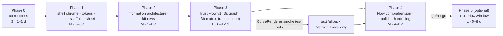

# OmaSafe overhaul — implementation roadmap

This document turns the design in [03-ui-overhaul-proposal.md](03-ui-overhaul-proposal.md) and
[04-trust-graph-spec.md](04-trust-graph-spec.md) into an ordered, shippable plan for this repository. It names the
files each phase creates or edits, the `qs.Ui` primitives they compose, the CLI calls they depend on, the risks and
their mitigations, the acceptance checks a reviewer runs before merging, and the invariants no phase may touch. It
stays the citable summary — 01–04, 06 and 07 reference its sections — while
[`docs/implementation/`](../implementation/README.md) expands each phase into one file of numbered tasks with the code
sites they touch, their commit order and their per-task verification. Every
`Panel.qml` line number, kit property, token, CLI argv and JSON field below was re-verified today against
`Panel.qml` (5174 lines), `BarWidget.qml`, `OmaSafeStatusIcon.qml`, `/usr/share/omarchy/shell` (Omarchy 4.0.2,
Quickshell 0.3.1, Qt 6.11.2) and `cli-samples/` from omasafe-cli 0.2.1; the anonymized facts used by the proposal are
versioned as sanitized fixtures in `docs/design/fixtures/`. Status: proposal, unimplemented,
runtime-unverified.

Contents

1. [Scope, sequencing and what never changes](#1-scope-sequencing-and-what-never-changes)
2. [Panel.qml range → fate table](#2-panelqml-range--fate-table)
3. [Phase 0 — Correctness, no visual change](#3-phase-0--correctness-no-visual-change)
4. [Phase 1 — Kit, tokens, cursor, confirm sheet](#4-phase-1--kit-tokens-cursor-confirm-sheet)
5. [Phase 2 — Information architecture](#5-phase-2--information-architecture)
6. [Phase 3 — Trust Flow v1 (in-panel)](#6-phase-3--trust-flow-v1-in-panel)
7. [Phase 4 — Comprehension, polish and hardening](#7-phase-4--comprehension-polish-and-hardening)
8. [Phase 5 — Optional large view (TrustFlowWindow)](#8-phase-5--optional-large-view-trustflowwindow)
9. [Component inventory](#9-component-inventory)
10. [CLI call matrix](#10-cli-call-matrix)
11. [Validation](#11-validation)
12. [Rollout, screenshots, README](#12-rollout-screenshots-readme)
13. [Open questions](#13-open-questions)
14. [Sources and references](#sources-and-references)

## 1 Scope, sequencing and what never changes

Six phases. Phases 0–4 are the product; Phase 5 is optional and gated on a go/no-go after Phase 3. Each phase ships on
its own, passes the full validation section, and leaves the panel usable. The order is chosen so the riskiest visual
work (the graph) lands on a keyboard model and component set that are already proven, and so the correctness and
authorization prerequisites are fixed before structural visual work begins.



| Phase | Ships | Effort | Risk |
|---|---|---|---|
| 0 | Correctness fixes inside the current four-tab UI; action-specific CLI authorization gate; unsafe Enable/Remove unavailable until the supporting CLI release; dead code deleted | S · 2–3 d plus CLI dependency | medium (cross-repository contract) |
| 1 | Shell chrome only: bar icon, hero, `ButtonGroup`, tokens, root colour/type bindings, `ConfirmSheet`, cursor scaffold over shell targets; tab bodies untouched | M · 2–3 d | medium (keyboard regressions) |
| 2 | Two views (Overview, Rules), kit rows written once, plugin detail sheet, rule sheet, finder, breadcrumb, full copy system; Flow chip hidden | M · 5–6 d | medium (parity with four tabs) |
| 3 | Trust Flow: 3a Graph lens (Z0/Z1) + inspector; 3b Trace (Z2), Matrix lens, a/A queue; Flow chip visible | L · 8–12 d | medium-high (rendering unknowns) |
| 4 | Live Flow correctness and comprehension, tooltips, legend, light-theme pass, performance audit, screenshots, docs | M · 4–6 d | medium (live QML + presentation changes) |
| 5 | `panel`-kind `TrustFlowWindow.qml` with all four layers open; manifest change; IPC route note | L · 5–8 d | high (new surface, IPC alias) |

Effort assumption for every estimate: one QML-fluent engineer, full time, with the fixture shim (section 11.2) in
place from Phase 0. Phases 0–4 total 20–29 working days.

The spec's phase names map onto this numbering as follows: shell/hero/navigation = Phase 1; plugin list and detail,
evidence view, rules/coverage = Phase 2 (milestones 2a and 2b); graph v1 = Phase 3; live Flow comprehension and polish
= Phase 4; graph v2 = Phase 5.

### 1.1 Never changes, in any phase

Reviewers reject a phase that touches any of the following. They are security posture, not implementation detail.

- Argv-only invocation via `cliCommand()` (`Panel.qml:164–167`, `BarWidget.qml:139`) and the `/usr/bin/false` gate until
  `hostWidget.cliVerified` is true. Existing read-only argv stays stable. Mutation argv changes only as specified in
  section 10 to carry action-specific expected values; `cliVersionMin` is raised from 0.2.1 to the first CLI release that
  implements both missing Enable and Remove contracts, with `cliVersionRequireIdentity` still evaluated in
  `BarWidget.qml:178–206`. No version number is guessed before that release exists.
- The bounded process pattern: `SplitParser` per stream with the 2 MiB cap (`v02OutputCharCap`, 121), timeouts
  15 / 30 / 60 s per collector (section 10), `terminateBoundedProcess()` (174) SIGTERM → 3 s → SIGKILL,
  first-terminal-event latches, `requestId` / `selectionRequestId` / `analysisRequestId` generation guards.
- Schema checks in every `apply*` (`omasafe.report.v1`, `omasafe.analysis.v1`, `omasafe.enforcement.v1`,
  `omasafe.schedule.v1`, `omasafe.enforcement-summary.v1`) and the fail-closed enum gates `enforcementEnum` (240),
  `coverageRelation` (320), `overrideStatus` (338): unknown → `unsupported`, missing → `unavailable`, never
  allow / clean.
- Confirmation semantics: every security-state mutation shows its action-specific authorization facts and passes those exact values to
  a CLI that compares them atomically before writing: record/replace and enable bind required current digest plus
  head/tree when present; remove
  binds the recorded baseline digest; review update binds the claimed target commit and labels current identity as
  context; schedule binds unit names and exact effective scan argv/policy. `targetStillExact` remains a feedback guard,
  selection changes cancel (808–816), and no bare keypress reaches or confirms a mutation.
- Marketplace attribution: every catalog field is a claim of the named snapshot; the CLI `disclaimer` is passed
  through verbatim; catalog state never enters the hero title.
- Analysis honesty: `coverage_limitations` rendered whenever non-empty; `parser == null` surfaced as lexical-only;
  provenance verbatim; the analysis cache keyed on content digest + CLI version + policy identity (1099). The key never
  changes; its clearing policy does (item 0.16 — the key already fails closed on a changed identity or policy).
- The badge is count/state only. No score, grade, verdict or "safe" wording anywhere.
- Collector-side files are never re-flowed for style: the 15 `Process` blocks and their timers (3815–5173) move only
  when a phase explicitly says so, and then verbatim.

## 2 Panel.qml range → fate table

The shared refactor checklist. Ranges were re-verified today; names follow the component inventory (section 9).

| Range today | Content | Fate | Phase |
|---|---|---|---|
| 1–139 | root state (≈ 120 properties), `v02OutputCharCap` (121), tabs model (134–139), `operationRunning` / `navigationLocked` (142–147), `warningColor` (153) | keep; delete `warningColor`; add `pendingAction`, `swallowNextActivate`, `view`, per-view depth stacks, `cursorActive`, `focusSection`, `selectedIndex`, `vm`; replace the five `*Confirming` booleans | 0–2 |
| 164–186 | `cliCommand` gate, `terminateBoundedProcess` | keep verbatim | — |
| 187–450 | label helpers; `enforcementEnum` 240, `coverageRelation` 320, `overrideStatus` 338; analysis labels 379–450 | all closed-enum gates and pure label text move to `model/Labels.js`; temporary `Panel.qml` wrappers delegate to `Labels` during migration, then consumers call `Labels` directly. A pure JS module never calls a QML root | 1–2 |
| 568–600 | `trustSelectedPlugin` / `untrustSelectedPlugin` argv builders | keep trust shape; add the target `--expected-trusted-digest` to remove once the CLI implements it; gate Remove before then | 0–1 |
| 808–856 | `selectPlugin` (+ forced tab jump 855) | keep; delete `if (alert) root.setActive(1)` | 0 |
| 858–954 | `open` / `loadInventory` / `close` (947) | keep; `close()` resets `pendingAction`, finder text, depth stacks and no longer calls `clearAnalysisCache()` (947–948; item 0.16) | 0 |
| 962–999 | `applyInventory` | keep; initial selection no longer changes view | 0 |
| 1062–1159 | `ensureAnalysis`, cache (1099), `clearAnalysisCache` (1147) | keep; Phase 0 narrows the callers of `clearAnalysisCache()` (item 0.16); Phase 3 adds the root `analysisQueue`, `analysisSweepGeneration`, `analysisStateById` and `startNextAnalysis()` (doc 04 §10.1) | 0, 3 |
| 1161–1181 | `findingKey` (dead) / `explainRule` (keys on `rule_id` at 1169) | `expandedFindingKey = findingKey(finding)` | 0 |
| 1183–1199 | `updateEligible`, `enableEligible` | keep; return the unmet condition string for ineligible-verb copy | 2 |
| 1202–1243 | `beginReviewUpdate` (1202), `beginEnable` (1217), `applyEnableResult` (1227) | the two `begin*` capture immutable action-specific authorization values and set `pendingAction` (`review-update` / `enable`) instead of the `*Confirming` booleans; Enable is gated until its CLI capability exists | 0–1 |
| 1244–1268 | `runEnable` with `targetStillExact` (1246) | retain QML feedback check; add required expected digest and optional present head/tree argv; rely on the CLI's locked comparison as the authorization boundary | 0–1 |
| 1269–1298 | `runReviewUpdate` with `targetStillExact` (1273), argv 1291–1295 | keep verbatim | — |
| 1300–1308 | `KeyboardPanel` sizing (`space(420)`, `space(600)`) | `fittedContentWidth(Style.space(420))`, `fittedContentHeight(fixed.implicitHeight + Style.space(12) + viewLoader.implicitHeight, Style.space(560))`; the inner `space(480)` cap at 2394 goes; the body is a fixed `Column` (hero, status line, notices, chips, finder, breadcrumb) over a `Flickable` holding only the view `Loader` (doc 03 §3) | 1 |
| 1310–2258 | `panelFlick` (`Flickable { visible: false }`) holding `Component legacyContent` (1322–2256), never instantiated | delete (≈ 950 lines) | 0 |
| 2260–2281 | `PanelKeyCatcher` handlers (tab switching only; `r` ungated at 2277) | rewrite to the cursor model of doc 03 §keyboard; `blocked: sheet.opened \|\| finder.activeFocus` | 0 (gate), 1 (cursor) |
| 2283–2417 | `tabShell`: tab strip `Repeater` (2288–2346, filled accent Scan button 2341), status row (2349–2389), `activeFlick` + `Loader` (2392–2417) | Phase 0: one `Text` under the status row for inventory `coverage.limitations[]` (0.15); Phase 1: replace tab strip and status row with `PanelHero`, status line, `NoticeRow`s, `ButtonGroup` (four options); Phase 2: `FinderField`, `Breadcrumb`, view `Loader` | 0–2 |
| 2421–2581 | confirmation overlay `Rectangle` (scrim colour 2425, title chain 2437, "verified" copy 2455, action if-order 2571) | Phase 0: add swallowing `MouseArea`, single `pendingAction`; Phase 1: replace with `components/ConfirmSheet.qml` | 0, 1 |
| 2584–2770 | `overviewTabComponent` | content re-homed in `views/OverviewView.qml` | 2 |
| 2772–3184 | `findingsTabComponent` (capabilities join 2923) | content re-homed in `views/PluginDetailView.qml` (REVIEW ITEMS, CAPABILITIES OBSERVED, COVERAGE) and `views/RulesView.qml` (Baseline V3) | 0 (dedupe), 2 |
| 3186–3590 | `pluginsTabComponent` ("complete" fallback 3376; "Reviewed update unavailable" 3570) | content re-homed in `views/OverviewView.qml` (PLUGINS) and `views/PluginDetailView.qml` (TRUST BASELINE, WHAT CHANGED, ENFORCEMENT) | 0 (fallback), 2 |
| 3592–3790 | `catalogTabComponent` | content re-homed in SOURCES rows and the MARKETPLACE CLAIM section | 2 |
| 3784–3813 | `hostWidget` `Connections` | keep; `onCliVerifiedChanged` (3788) retains its loads; `onAlertsChanged` (3808–3809) drops only cache entries of plugins named by an `analyzer-policy-update` or `source-drift` alert instead of clearing the whole cache (item 0.16); `onCliVersionChanged` (3796–3799) keeps the wholesale clear; Phase 2: no longer depends on `activeTabKey` | 0, 2 |
| 3815–5173 | 15 `Process` blocks + timeout / kill `Timer`s | preserve the bounded-process machinery; Phase 0 edits 4830 argv, 4681 refresh-in-place, the cache-clear calls at 5055/5138, and the Enable/Remove argv builders when their target CLI contracts land (0.17); Phase 2 adds one sibling collector (`rulesListProcess`) cloned from `coverageProcess` | 0, 2 |

Expected size after Phase 2: `Panel.qml` ≈ 2 900–3 100 lines. Arithmetic: 5 174 − 950 (legacy 1310–2258) − ≈ 1 210
(tab components 2584–3790) − ≈ 160 (overlay 2421–2581) − ≈ 130 (tab strip and status row) ≈ 2 720, plus the cursor
model, depth stacks, `vm` rebuild, `pendingAction` plumbing and the cloned `rulesListProcess` (≈ 80 lines). The 15
`Process` blocks and their timers (3815–5173, ≈ 1 360 lines) stay in the file because section 1.1 forbids moving
them; a `Collectors.qml` `QtObject` holding them verbatim would bring the root under ≈ 1 700 lines but needs an
explicit amendment to that rule (open question 8). Views 150–350 lines each; components 40–160 lines each.

## 3 Phase 0 — Correctness, no visual change

Goal: every audit defect that is a correctness or ground-rule violation fixable before the IA refactor is closed inside
the current UI, so later phases refactor a correct panel. That is the High items A1–A4, A6–A10, A13 and A17 plus A21
(M) and A39 (L); the remaining High items (A5, A11, A12, A14–A16, A18–A20, A42) need the kit, the IA or the bar icon
and land in Phases 1–2. Nothing moves on screen; a before/after screenshot in `tokyo-night` at base 12 must be
pixel-identical except for the strings named below and the unavailable-state copy introduced by 0.17 (0.15 adds a line
only when inventory `coverage.limitations[]` is non-empty; on this machine it is `[]`).

Files: `Panel.qml` and, when the supporting CLI release exists, `manifest.json` (`cliVersionMin`). Components: none new.
CLI calls: `rules explain RULE_ID` gains `--format json` (4830); mutation calls gain only the expected-value arguments
in 0.17, and their `apply*` paths preserve the report schema checks.

| # | Defect (verified anchor) | Change |
|---|---|---|
| 0.1 | Dead legacy component 1310–2258 | delete `panelFlick` and `legacyContent`; nothing references them |
| 0.2 | 70 of 126 `Text` items render CLI / plugin-supplied strings with `textFormat` at its `AutoText` default | `textFormat: Text.PlainText` on every `Text` lacking it |
| 0.3 | Confirmation scrim 2421 is a bare `Rectangle`: wheel scrolls and every action `Button` under it stays clickable, with three different gaps — schedule installs (2727, 2737) gate on `!operationRunning` only; Update catalog (`Button` 3663, `enabled` 3666) gates only on its own `marketplaceRefreshProcess.running`, so it is reachable even while a mutation runs; Explain rule (2994, which launches a CLI process at 3002) and the two detail expanders (3019, 3106) carry no `enabled` binding at all | `MouseArea { anchors.fill: parent; hoverEnabled: true; onWheel: wheel => wheel.accepted = true }` under the card; every action `Button.enabled` bound to `!root.navigationLocked` (adding the binding where none exists today) |
| 0.4 | Five `*Confirming` booleans can stack; the overlay resolves by `if`-order (title chain 2437, confirm-label chain 2559–2563, action chain 2571) | one `property string pendingAction: ""` (values `record`, `replace`, `remove`, `enable`, `review-update`, `schedule`); `navigationLocked = operationRunning \|\| pendingAction !== ""`; a request while one is pending is ignored |
| 0.5 | Esc closes the panel mid-confirmation (2267) and `close()` (947) never resets the flags, so the dialog reappears on reopen with tabs locked; no `onOpenedChanged` handler exists | `onCloseRequested`: if `pendingAction !== ""` cancel it, else `close()`; `close()` resets `pendingAction`; add `onOpenedChanged: if (!opened) pendingAction = ""` |
| 0.6 | `r` runs a scan during confirmations (2277) and the scan's `onAlertsChanged` clears the analysis cache under the dialog | gate on `root.cliVerified && root.statusLevel !== "checking" && !root.navigationLocked`. Phase 0 must use `statusLevel` (155, aliasing BW:117; already tested inline at 196, 219, 2153, 2336, 2783), not the `checking` shorthand: `checking` is declared in Phase 1 (03 §2 on `BarWidget`, 03 §3 on the panel root), Phase 0 does not touch `BarWidget.qml`, and because `hostWidget` is `property var` (13) a premature `!hostWidget.checking` reads `undefined` and silently passes with no `qmllint` error. Phase 1 re-spells the same gate `!root.checking` |
| 0.7 | Forced tab jump: `selectPlugin(id, alert)` → `setActive(1)` at 855 on every open with alerts and after every successful trust | delete line 855; trust success no longer re-selects |
| 0.8 | `trustOutput` is never rendered; a successful trust shows nothing | render the success line in the Plugins tab (`Baseline recorded for <id> at digest <12>.`) |
| 0.9 | `expandedFindingKey` keyed on `rule_id` (1169) expands every finding sharing a rule; `findingKey` (1161) is dead | key on `findingKey(finding)` |
| 0.10 | Capabilities joined undeduplicated (2923): 54 tokens for `io.github.tuthan.omasafe`, 36 identical | group by `capability`, print `<class> ×<n>` |
| 0.11 | `"Coverage: complete"` rendered when `limitations` is missing (3376; 1737 dies with 0.1) | `Array.isArray(limitations) ? (limitations.length ? join : "No limitations reported") : "Coverage unavailable"` |
| 0.12 | `rules explain` called without `--format json` (4830); output rendered from `JSON.stringify` fallback | add `--format json`; validate `schema === "omasafe.report.v1"`; render `result.rule.*` fields; failure → `Rule explanation unavailable: <stderr>` |
| 0.13 | `enforcementRefreshTimer` (4681) nulls the decision every 60 s, flashing a loading state | keep the previous decision until the refreshed report is applied |
| 0.14 | Review-update confirm body calls a marketplace-claimed commit "verified" (2455) | `the commit the catalog snapshot claims; the CLI verifies it before anything changes` |
| 0.15 | Inventory-level `result.coverage.limitations[]` arrives in `inventoryReport` (14, set by `applyInventory` 962) but nothing reads it (audit A9, ground rule 4) | one `Text { textFormat: Text.PlainText; font.pixelSize: Style.font.caption }` under the status row (2349–2389), `visible: Array.isArray(limitations) && limitations.length > 0`, text `Inventory coverage limited: <codes joined by " · ">`; Phase 2 re-homes it as a `NoticeRow` |
| 0.16 | `clearAnalysisCache()` (1147) runs in `close()` (947–948), after every scan (`onAlertsChanged` 3808–3809 — and the bar left-click scans before it opens, BW:532–535), after review update (5055) and after trust / untrust (5138), so every reopen starts cold and `A` re-runs eight bounded processes (01 §2.7 item 5, §8.7) | remove the clears at 947–948, 5055 and 5138 (the key `content_digest + tool_version + policy_identity` already misses on any changed identity); `onAlertsChanged` drops only the entries of plugins named by an `analyzer-policy-update` or `source-drift` alert; `onCliVersionChanged` (3796–3799) and the installed-set signature clear (974) stay. No pixel changes; a cached analysis now survives close / reopen |
| 0.18 | Added during implementation planning (07 §8 PF-10). `trustSelectedPlugin` (568) reads `selectedPlugin()` at confirm time (569) and builds `--expected-head/--expected-tree/--expected-digest` from that row, and the overlay identity block (2469–2492) reads the same live row, so nothing pins what the user authorized. The window is reachable: Update catalog (3663) is gated only on its own process and is not part of `operationRunning`, so a refresh started before the confirmation opens can land `applyInventory` (962, via 3958 → 716) under the open sheet; the argv then carries a digest that was never displayed, and the CLI's comparison cannot detect it because it compares against the same new value. A `plugins status` re-fetch moves the Remove sheet's baseline digest and can flip the record/replace title (2440–2442) the same way | capture the authorization facts once, when the confirmation opens (`authorizedPluginId`, `authorizedHead`, `authorizedTree`, `authorizedDigest`, `authorizedBaselineDigest`), render the overlay identity block from them with `unavailable` for empty git fields, decide record vs replace at open time, build argv from them, and re-validate before the process starts — on drift, write nothing and close with `Cancelled: <id> changed since the confirmation opened.` (03 §10 invariant 8). This is a feedback guard plus an argv contract; the CLI's locked comparison remains the authorization boundary. Phase 1's `ConfirmSheet` inherits these values instead of introducing them |
| 0.17 | Enable shows current identity but 0.2.1 accepts no expected identity; Remove shows the recorded baseline but the untrust branch does not enforce an expected baseline (01 §2.4; GR6) | define CLI contracts: Enable requires `--expected-digest` and accepts `--expected-head/--expected-tree` when present; Remove requires `--expected-trusted-digest`; each compares while holding the mutation lock and refuses without writing on mismatch. Until the first supporting CLI release is selected and `cliVersionMin` raised to it, render both controls unavailable with the missing-contract reason. QML `targetStillExact` remains only a feedback guard |

Risks and mitigations: `Text.PlainText` on a `Text` that intentionally used rich text — none exists (grep `<b>` /
`<i>` in `Panel.qml` returns nothing). Replacing five booleans with one enum touches every confirm branch — do it
in a single commit with the acceptance script below run before and after.

Acceptance (reuse `docs/cli-v0.2-plan.md:229–246`, all still pass, plus):

- `qmllint -I /usr/share/omarchy/shell -I /usr/lib/qt6/qml Panel.qml BarWidget.qml OmaSafeStatusIcon.qml` exits 0
  (it does today); `omarchy plugin validate .` exits 0 (it does today).
- `grep -c 'textFormat: Text.PlainText' Panel.qml` equals `grep -c 'Text {' Panel.qml`.
- Open with 3 outstanding alerts: the panel stays on the tab that was active when it closed.
- Press Replace baseline on `io.github.tuthan.dropdown-terminal`, press Esc: the dialog closes, the panel stays open,
  `pendingAction === ""`. Close and reopen: no dialog.
- With a trust confirmation open: clicking Update catalog, Install advisory schedule and Explain rule does nothing;
  the wheel does not scroll the content; `r` does not start a scan; a second confirmation request is ignored.
- Confirm a trust on a plugin whose head matches: exit 0 renders `Baseline recorded for <id> at digest <12>.` and the
  view does not change.
- A plugin whose `id` fixture contains `<b>x</b>` renders the tag characters literally.
- Fixture with `limitations` absent renders `Coverage unavailable`; with `[]` renders `No limitations reported`.
- `io.github.tuthan.omasafe` analysis renders two capability classes with counts, not 54 tokens.
- Over five minutes open, the enforcement section never shows its loading string after the first load.
- Fixture with inventory `coverage.limitations: ["a", "b"]` renders `Inventory coverage limited: a · b` under the
  status row; with `[]` or the field absent the line is not visible.
- Analyze `lgse.sandman`, close and reopen the panel: the analysis renders from cache with no `plugins analyze` process;
  a scan whose alerts name no `analyzer-policy-update` / `source-drift` for it leaves the entry; one that does drops only
  that plugin's entry; a CLI version change clears everything.
- On CLI 0.2.1, Enable and Remove are unavailable and explain that identity-safe CLI support is required. Against the first
  supporting CLI, open either sheet, mutate the source/baseline out of band, then confirm: the CLI refuses and writes
  nothing; the panel reloads the facts. The manifest's `cliVersionMin` equals that release, not 0.2.1.
- With a confirmation open, replace the fixture's digest, then confirm: no process starts and the panel prints
  `Cancelled: <id> changed since the confirmation opened.` Under the replay shim, a confirmed trust's argv carries the
  digest displayed when the confirmation opened, not one that arrived while it was open (item 0.18).

Effort S (2–3 days in this repository, excluding the separately owned CLI implementation and release).
Task-level detail, ordering, commit plan and per-task verification:
[`docs/implementation/phase-0-correctness.md`](../implementation/phase-0-correctness.md).

## 4 Phase 1 — Kit, tokens, cursor, confirm sheet

Goal: the panel shell is built from `qs.Ui` primitives and theme tokens only, has one keyboard cursor over the shell
targets, and confirms through a sheet that cannot be bypassed. Scope is the chrome around the content: bar icon, hero,
status line, `ButtonGroup` (four options, one per existing tab), root colour and type bindings, `ConfirmSheet`,
cursor scaffold (hero scan `Button`, the four chips, the sheet). The four tab components (2584–3790) are not
touched: their hand-rolled rows, buttons and expanders keep working by mouse and are replaced once, in Phase 2, by the
`components/*` rows. Converting them here and deleting them in Phase 2 would write every row twice.

Files created: `OmaSafeShield.qml`; `components/SectionHeaderRow.qml`, `components/NoticeRow.qml`,
`components/InfoGrid.qml`, `components/ConfirmSheet.qml`; `model/Labels.js`, `model/Glyphs.js`, `model/Time.js`.
Files modified: `Panel.qml` (root bindings, hero, `ButtonGroup`, cursor scaffold, key map, `ConfirmSheet` instance,
`KeyboardPanel` sizing; tab bodies untouched), `BarWidget.qml` (`warningColor` 116 deleted, `visible: !vertical` 112
deleted, `OmaSafeShield` as `BarIconButton.iconComponent`). Files deleted: `OmaSafeStatusIcon.qml`.
`SectionHeaderRow` and `NoticeRow` are created here so the status line and the hero notices use them; the tab bodies
adopt them in Phase 2.

Components (all verified in `/usr/share/omarchy/shell/Ui/qmldir`): `PanelHero { iconComponent; title; meta;
detail; iconOpacity; trailingControl }`, `ButtonGroup { options; value; changed(value); cursorIndex }`,
`PanelSectionHeader`, `PanelSeparator`, `CursorSurface { hasCursor; current; bordered }`, `Button { bordered;
selected; hasCursor; iconText; iconSpinning; tooltipText }`, `PanelActionButton { iconText; tooltipText; hasCursor
}`, `BorderSurface { borderSpec; padding; radius }`, `OpticalGlyph { text; fontSize; color }`, `PointerMoveGate {
moved(item, mouse) }`, `PanelToolTip`. Tokens: `Style.font.{title,body,bodySmall,caption,icon,display}`,
`Style.space(n)`, `Style.spacing.{rowPaddingX,labelGap,popupRowHeight}`, `Style.hoverFillFor` /
`Style.selectedFillFor`, `Style.normalBorderWidth`, `Border.controlSpec` / `Border.flat`, `Color.foreground` /
`Color.urgent` / `Color.background` / `Color.accent` (accent only through the kit).

Root colour and type bindings, declared once (doc 02 §visual system):

```qml
readonly property color fg:           bar ? bar.foreground : Color.foreground
readonly property color urgent:       bar ? bar.urgent : Color.urgent
// dimStep(k): opaque mix of fg toward Color.background (doc 02 §2.3) — legible on light themes, ≈ Qt.darker 1.4 / 1.5 / 2.0 on dark ones
function dimStep(k) { var b = Color.background; return Qt.rgba(fg.r * (1 - k) + b.r * k, fg.g * (1 - k) + b.g * k, fg.b * (1 - k) + b.b * k, 1) }
readonly property color dimHeader:    dimStep(0.25)
readonly property color dim:          dimStep(0.33)
readonly property color faint:        dimStep(0.55)
readonly property color hoverFill:    Style.hoverFillFor(fg, Color.accent)
readonly property color selectedFill: Style.selectedFillFor(fg, Color.accent)
readonly property string fontFamily:  bar ? bar.fontFamily : Style.font.family
```

Phase 1 also declares the bar-state inputs used by the §2 icon contract: `barForeground`, `checking`,
`hasScanResult`, `earlierResultKept`, `cliFailed`, `blockedDecisions` and derived `urgentBadge`. Their definitions are the
ones in 03 §2; they are root properties with explicit false/zero fallbacks, not expressions duplicated in delegates.

`ConfirmSheet` wiring (the only key handling outside `PanelKeyCatcher`):

```qml
PanelKeyCatcher { id: keyCatcher; blocked: sheet.opened || finder.activeFocus; ... }
ConfirmSheet {
  id: sheet; z: 20; anchors.fill: parent          // sibling of the Flickable, outside the view Loader
  focus: opened
  Keys.onPressed: function(event) { event.accepted = handleKey(event) }   // kit ConfirmDialog contract
  onOpenedChanged: if (opened) { selectedIndex = 0; forceActiveFocus() } else keyCatcher.forceActiveFocus()
  onCanceled: root.pendingAction = ""
  onConfirmed: root.runPendingAction()
}
```

`openSheet(kind)` sets `pendingAction`, `swallowNextActivate = true` and `sheet.opened = true`. Activation is wired to
`activateRequested` only (the catcher emits `returnRequested()` then `activateRequested()` for one Return,
`Ui/PanelKeyCatcher.qml:71–74`), so `swallowNextActivate` means exactly "ignore an `activateRequested` delivered in the
same event-loop turn in which `pendingAction` was set" — a double-delivery guard, not the held-key stop. The held key is
stopped in the sheet: `Keys.onPressed` first accepts and drops any `isAutoRepeat` Return / Enter / Space, and ignores a
non-repeat Return / Enter for the first 300 ms after open (doc 03 §10 invariant 2). `ConfirmSheet.handleKey` extends the
kit `ConfirmDialog.handleKey` (`Ui/ConfirmDialog.qml:23–38`: Esc cancels; Left / Right / Tab / Backtab toggle; Return /
Enter fire the selected button; Space returns false and does nothing) with `selectedIndex` forced to 0 on every open,
Up / Down / `j` / `k` switching between the optional policy `ButtonGroup` and the button row, Enter on the policy section
selecting the chip and moving to the buttons (never confirming), and every other key accepted and ignored. Button hover
is routed through `PointerMoveGate.moved()` (real pointer motion only; the kit's `onEntered` pre-select at
`Ui/ConfirmDialog.qml:119–121` is not copied) and a click on the confirm button fires `confirmed()` without touching
`selectedIndex`. The card is `Math.min(implicitHeight, parent.height − Style.space(32))` tall with title + identity
`InfoGrid` (`bodySmall`, `WrapAnywhere` on hash-only `Text`s) + body in a scrolling `Flickable` and the button row
anchored to the card bottom; buttons carry the `body` label role, the bare verb, and size to content with the kit minimum
(`Math.max(Style.space(88), label.implicitWidth + Style.space(28)) × Style.space(34)`, doc 02 §2.2) with the chrome of
`Ui/ConfirmDialog.qml:96–130` (destructive = `Util.alpha(Color.urgent, 0.22)` fill).

The `InfoGrid` is action-specific, not a generic identity card: Record/Replace and Enable show the expected current
head/tree/digest; Remove shows `Recorded baseline digest`; Review update shows `Expected commit — claimed by catalog`
and labels current tree/digest `Installed now`; Schedule shows both unit names and the exact effective `ExecStart` argv.
`runPendingAction()` copies these immutable sheet values into argv. It never reconstructs authorization from whichever
plugin happens to be selected at click time.

Cursor model: the dev-gallery template (`plugins/dev-gallery/GalleryPanel.qml:101–262`: `selectedIndex`,
`sectionCount`, `sectionIsHorizontal`, `moveCursor`, `moveCursorH`, `activateCursor`, `clampCursor`,
`ensureCursorVisible`) with `cursorActive = false` on open. In this phase the section list is `hero → views` only;
Phase 2 appends the per-view sections when the rows exist. Rows bind `hasCursor` from root state and never read
`containsMouse` (`Ui/CursorSurface.qml:4–8` contract). No `Button` is `focusable`.

Risks and mitigations: keyboard regressions (medium) — the acceptance script below enumerates every focusable target;
`hostWidget.bar` null on a third-party bar — every `bar ? … : …` binding has a `Color` / `Style` fallback; Nerd Font
glyphs absent in a user-chosen family — `Glyphs.js` selects the ASCII fallback table when
`Style.font.resolvedFamily` lacks `"Nerd"`.

Acceptance:

- `grep -rnE '#[0-9a-fA-F]{6}' --include='*.qml' --include='*.js' .` is empty; `grep -rn 'font.pixelSize:' --include='*.qml' . | grep -v 'Style.font\.'` is empty; `grep -rn 'Color.muted' --include='*.qml' .` is empty.
- `grep -rn 'containsMouse' components/ views/` is empty; `grep -rn 'focusable: true' --include='*.qml' .` is empty.
- Screenshots in `white`, `catppuccin-latte`, `retro-82`, `oxocarbon`, `ame-quattro` at base 9 / 12 / 16 / 20: nothing clips; no third line on any plugin row; the bar shows glyph + count, never a filled disc; every urgent use belongs to the 02 P9 semantic allowlist; in `catppuccin-latte` and `white` at base 9 the `dimStep` ladder (headers, secondary lines, disabled glyphs) still reads as three steps below primary text (doc 02 §2.3 — decided here, not deferred).
- Bar widget: `implicitWidth` equals `Style.bar.statusSlot` with no count and grows by `countText.implicitWidth + Style.space(2)` with one, in a top bar and in a left (vertical) bar; a failed scan never shows the filled quiet shield and a never-run scan never fills it (doc 03 §2).
- A quiet scan followed by a failing scan: the hero reads `Scan unavailable` with `LAST SCAN FAILED · EARLIER RESULT: NO ALERTS · <relative>`; `No outstanding alerts` is never printed from stale data.
- With `operationRunning === true` and no sheet open (40-second trust replay case), digit keys do not switch views and no second action starts.
- The view body scrolls inside `ScrollBar.vertical { policy: ScrollBar.AsNeeded }`; `ensureCursorVisible` reaches the last row with `j` alone; no horizontal scroll at base 9–20.
- The hero scan `Button` and every `ButtonGroup` chip are reachable with j / k / h / l and activate with Enter; hover the scan button then press `j`: one highlight on screen, on the chip row. Tab-body rows are mouse-only until Phase 2 and are not counted as regressions.
- The nine no-bypass invariants (doc 03 §confirmations): (1) `keyCatcher.blocked` follows `sheet.opened || finder.activeFocus`; (2) the sheet holds `activeFocus` while open; (3) with the pointer parked over the confirm button's future position, holding Enter on Replace baseline opens the sheet, nothing is confirmed, and the sheet stays open with Cancel selected (auto-repeat dropped, 300 ms window, no hover pre-select); (4) Enter after that window cancels (Cancel pre-selected); with `[Enable]` under the cursor, `k` / `j` move between Policy and the buttons and `l` on Policy changes the chip without touching the button selection; (5) with the sheet open, digits, `r`, `/`, view chips and the `Flickable` are inert; (6) clicks and wheel on the scrim do nothing; (7) `close()` and reopen show no sheet; (8) changing the selection cancels the pending sheet; (9) while the operation runs both buttons are disabled and the confirm label reads `Working…`.
- Vertical bar (left / right) shows the icon; `omarchy plugin validate .` passes.

Effort M (2–3 days).

## 5 Phase 2 — Information architecture

Goal: four tabs become three views with per-view depth, and every fact is placed by authority. Milestone 2a covers
plugin list and detail (Overview, plugin detail sheet with its seven visible sections — TRUST BASELINE, WHAT CHANGED,
REVIEW ITEMS, CAPABILITIES OBSERVED, COVERAGE with the file references folded in, MARKETPLACE CLAIM, ENFORCEMENT — plus
the collapsed PROVENANCE, doc 03 §5). Milestone 2b covers rules and coverage (Rules view, rule sheet,
Baseline V3 table), the finder and the breadcrumb depth stack. This phase also writes every kit row for the first and
only time: the four tab components are deleted and their content is rebuilt on `CursorSurface` rows in `views/*` and
`components/*`, and the cursor model gains its per-view sections. The Flow chip is hidden until Phase 3: the
`ButtonGroup` options are `[Overview] [Rules]`, bound to keys `1` and `3`; `2` (and the detail-sheet `2` shortcut to
Z1) is inert until Phase 3 adds the chip, so no digit ever changes meaning. No placeholder body ships.

Files created (2a): `model/ViewModel.js`; `views/OverviewView.qml`, `views/PluginDetailView.qml`;
`components/ActionRow.qml`, `components/AlertRow.qml`, `components/PluginRow.qml`, `components/ClassRow.qml`,
`components/EvidenceRow.qml`, `components/EdgeRow.qml`, `components/SourceRow.qml`, `components/CapabilityStrip.qml`,
`components/FactPill.qml`.
Files created (2b):
`views/RulesView.qml`, `views/FinderResultsView.qml`; `components/RuleRow.qml`, `components/RelationRow.qml`,
`components/Breadcrumb.qml`, `components/FinderField.qml`. Files modified: `Panel.qml` (delete 2584–3790; add
`vm` rebuilt by `ViewModel.build()` in every `apply*`; add `rulesListProcess`; depth stacks; `onAlertsChanged` no
longer reads `activeTabKey`), `BarWidget.qml` (none).

Components added to the Phase 1 set: a `CursorSurface` row holding a label `Text` and `ToggleSwitch { interactive: false;
checked; hasCursor }` (`Ui/ToggleSwitch.qml:34`; precedent `network/Panel.qml:1143`) for the backups row (`Show 7 backup
copies (not scanned)`) — not the kit `Toggle` row, whose 54 px floor, `space(240)` width, `activeFocusOnTab` and 100 ms
animation doc 03 §4.1 rejects; `TextField { hasCursor }` for the finder, `ListView` with
`positionViewAtIndex(i, ListView.Contain)` for the 45-row rule catalog.

Data dependencies: everything the four tabs already fetch (section 10) plus one new collector,
`rulesListProcess` for `rules list --format json` (4 ms, 25 KB against the real catalog), cloned from
`coverageProcess` (4511–4588): 15 s timeout, 3 s kill, 2 MiB cap, cached per CLI version like `coverageReport`.
The Rules view also consumes the already-fetched `rules coverage --format json` (`result.coverage[]`,
`result.not_covered[]`, `result.map_version`, `result.verified_at_commit` = `964dc08…`) and the analysis cache for
`LOCAL HITS`. `ViewModel.build()` strips `file_digests` from inventory and status reports before storing them.

Fields rendered for the first time in this phase (all present in `cli-samples/`): `result.marketplace_source`,
`marketplace[].registry_claim.upstream_moved`,
`analysis.invocation_edges[]` with the target file's coverage state from `payload_inventory.coverage_states`,
`findings[].confidence` as a word, `analysis.equivalence.*` in PROVENANCE, `rules explain` `result.external_equivalences[]`.
Inventory-level `result.coverage.limitations[]` (first rendered as a plain `Text` in Phase 0, item 0.15) moves into a
`NoticeRow` under the hero.

Risks and mitigations: behavioural parity (medium) — the parity checklist below lists every action available today;
a plugin row's line 2 at base 9 — the trust word abbreviates (doc 02 §density) and the strip stays;
`Backspace` as a depth pop depends on `event.text === "\b"` reaching `textKey` — verify on the first build and bind
only `h` / `-` if it does not.

Acceptance:

- Parity: trust (record / replace), untrust (remove), enable, review update, schedule install, update catalog, scan,
  explain rule, provenance, coverage relations, override records, decision details are each reachable within two
  activations from Overview; every ineligible verb is visible, dim, and names its unmet condition.
- Audit §6 scripts re-run and pass: (6.1) open with 3 alerts → hero reads `3 alerts to review`, first section is
  `ALERTS | 3`, no evidence text is visible without an Enter; (6.2) no count or word "untrusted" appears on
  Overview; the PLUGINS footer definition sentence is present; (6.3) confirm Replace baseline → success line in
  place, no view change, no analysis cache clear, no automatic scan.
- `COVERAGE | 13 LIMITS` renders for `lgse.sandman` and `COVERAGE | 2 LIMITS` for `io.github.tuthan.omasafe` without
  expansion, grouped by file then kind; `io.github.tuthan.dropdown-terminal` renders `COVERAGE | NO LIMITS REPORTED`.
- No row ever shows a catalog claim and a trust word together; every `registry_claim.verification_status` value starts
  with `Catalog says:` and the correlation `status` renders as its doc 02 §3.4 sentence (never a bare enum word, never
  prefixed); `conflict` with `repository: null` renders `Catalog entry not matched: …` plus `Installed repository:
  unavailable (no git remote)`; a `marketplace_stale: true` fixture suppresses the word "verified" in the whole section.
- Plugin rows print ` · <n> limits` after the item count whenever `coverage_limitations.length > 0` (sandman 13, btop 3,
  omasafe 2) and ` · text match only` when `parser == null`.
- `plugins enable` fixture with `enabled: false` and a block decision renders `Enable refused: <reason codes>` and never
  `<id> enabled.`; the success line requires `result.enabled === true` (doc 02 §3.3).
- `grep -rn activeFocusOnTab --include='*.qml' .` is empty (the finder's Tab no-op depends on it, doc 03 §8).
- `LOCAL HITS` and rule-row counts show `–` (never `0`) until at least one plugin is analyzed; unanalyzed plugins
  read `not analyzed`, never disappear.
- Baseline V3 header reads `automated-security-baseline v3 · map 2 · checked against marketplace commit 964dc08`; footer
  lists the three not-covered ids; the two rows with neither `omaRuleId` nor `omaCapability` read `Inventory behaviour
  only (see note)`; no Baseline row carries a plugin count — the expanded covering rules print `observed in <k> analyzed
  plugins` / `not observed in <n> analyzed plugins` (doc 03 §7.2).
- `/` then `proc`: the finder index is lowercase `id · title` for rules (not `capability` — a class result already
  covers it), `capability` for classes, `externalId` for Baseline rows and `id` for plugins; groups with no match are
  not drawn. Against `rules-list.json` and `rules-coverage.json` the result is 2 classes (`process-execution`,
  `detached-process-execution`), 3 rules (`oma.qml.process-execution`, `oma.qml.detached-execution` by id;
  `oma.python.reverse-shell` by its title) and 1 Baseline id (`privileged-process-control-from-shared-temp`), no PLUGINS
  group (doc 03 §8); Esc in the finder clears it and does not close the panel; `1` while at depth 1 pops to depth 0.
- `grep -rn 'visiblePlugins()\|selectedPlugin()' views/ components/` is empty (bindings read `vm.*`).
- RSS of `quickshell -n -p /usr/share/omarchy/shell` after opening all three views and one detail sheet is under
  2× the Phase 1 measurement taken the same way.
- Every row, action `Button` and `PanelActionButton` in Overview, the detail sheet and Rules is reachable with
  j / k / h / l and activates with Enter; hover row A then press `j`: one highlight on screen, on row B.

Effort M (5–6 days; the row conversion deferred from Phase 1 lands here, written once).

## 6 Phase 3 — Trust Flow v1 (in-panel)

Goal: the Flow view is complete inside the 420-unit popup: Graph lens (Z0 Atlas, Z1 Plugin), Trace (Z2), Matrix
lens, inspector strip, analysis on demand. Specified in full in [04-trust-graph-spec.md](04-trust-graph-spec.md).

Day 1 is a smoke test, not a feature: side-load a 40-line `Shape { preferredRendererType: Shape.CurveRenderer }`
with one solid and one `ShapePath { strokeStyle: ShapePath.DashLine; dashPattern: [4, 4] }` `PathSvg` bucket into a
temporary view and screenshot it in `catppuccin-latte` and `flexoki-light` at base 9 and 20 and at Hyprland scale
1.0 and 1.25 (`hyprctl keyword monitor`). If edges are missing, misaligned or aliased beyond legibility, the graph
lens is dropped for this release and Matrix + Trace (text rows only, `CursorSurface` + `Text`) become the Flow body.
`Canvas` is not a fallback: no first-party file instantiates one. Both `DashLine` and `dashPattern` exist in
`/usr/lib/qt6/qml/QtQuick/Shapes/plugins.qmltypes` (lines 389, 488); `CurveRenderer` at line 51.

The phase ships in two milestones so the rendering gate is passed before the text lenses are built. 3a (graph):
smoke test, `graph/FlowLayout.js`, `graph/TrustFlow.qml`, `graph/FlowNode.qml`, `graph/EdgeLayer.qml`,
`views/FlowView.qml` with the Graph lens only (Z0 / Z1), `components/InspectorStrip.qml`, the Flow chip made visible,
graph sections in the cursor model. 3b (matrix, trace, queue): `graph/MatrixGrid.qml`, `graph/TraceChain.qml` (Z2),
the `a` / `A` analysis queue, the `m`, `c`, `t`, `x`, `?` text keys, the `?` legend `PanelToolTip`. If the smoke test
fails, 3a shrinks to `FlowView` + `InspectorStrip` and 3b carries the whole Flow body.

Files created: `graph/TrustFlow.qml`, `graph/FlowNode.qml`, `graph/EdgeLayer.qml`, `graph/MatrixGrid.qml`,
`graph/TraceChain.qml`, `graph/FlowLayout.js`; `views/FlowView.qml`; `components/InspectorStrip.qml`. Files modified:
`Panel.qml` (Flow chip visible — `ButtonGroup` options become `[Overview] [Flow] [Rules]` and key `2` is bound;
the new root analysis queue of doc 04 §10.1 — `analysisQueue`, `analysisSweepGeneration`, `analysisStateById`,
`startNextAnalysis()` on `analysisProcess.onExited`, mirroring `statusQueue` / `statusSweepGeneration` (77–78, 602–622);
`Panel.qml` has no queue today, `startFor()` (4692–4707) is a single-slot preempt kept only for the selected-plugin path,
and the detail sheet's `Analyze` button uses the same queue (≈ 1 day inside 3b); `a` / `A`, `m`, `c`, `t`, `x`, `?` text
keys; graph sections in the cursor model).

Components: `CursorSurface` node rows in four `Repeater` columns over per-column arrays keyed by membership and content
revision (rows outside the
shared window `visible: false`; 10 visible rows at base 12, doc 04 §4.1 step 4), one `Shape` with eight static
`ShapePath { PathSvg }` buckets (the `Ui/BorderOverlay.qml:51` technique), `OpticalGlyph` per node, `PanelToolTip` for
the `?` legend, horizontal `Flickable` for the all-17 Matrix, `PointerMoveGate` for wheel-under-pointer.

Data dependencies: no new CLI calls. `plugins analyze ID --format json` runs only on `a` (cursor plugin) or `A` (all
live plugins, one at a time through the root `analysisQueue` driving `analysisProcess`), never on view open. Graph inputs are the cached analyses
(`capabilities[]`, `findings[]`, `invocation_edges[]`, `coverage_limitations[]`, `parser`), `rules list` (rule
column labels), `rules coverage` (Baseline layer, `omaRuleId` / `omaCapability` / `relation`), inventory (plugin
column, alert bold), enforcement summary (block glyph).

Risks and mitigations: `CurveRenderer` under fractional scaling (medium-high) — day-1 smoke test with the text
fallback pre-decided; edge alpha too faint on translucent light themes — rest alpha bound to
`Style.hoverBorderAlpha`, switch to `Style.normalBorderAlpha` if the screenshot pass shows it (one binding); focus-pair
columns at base 9 (`openW` = 87 units, doc 04 §4.3) — labels `ElideMiddle`, counts stay; `A` on eight plugins = eight bounded
processes ≤ 30 s each — sequential, cancellable by `x`, progress in the hero meta; layout cost — rebuilt only on
inventory / analysis / alert/trust content / scope / filter change, hot path on cursor change only. Same-epoch rebuilds
preserve prior order and append new nodes; only a new `orderEpoch` runs key sorting and barycentre sweeps.

Acceptance (doc 04 §acceptance, restated):

- With the four sampled analyses: 5 capability nodes, 6 rule nodes, 12 Baseline ids — 3 markless (`not-covered`:
  `cargo-git-unpinned`, `remote-build`, `remote-git-execution-unpinned`), 5 with a via-class glyph (`installer`,
  `package-manager`, `privilege`, `sudoers-modification` under `󰆍`; `service-management` under `󰔛`), 1 with an incoming
  edge (`oma.qml.process-execution → curl-pipe-shell`, dashed), 3 marked `≈` with neither edge nor glyph (the two
  note-only rows and `sudoers-dangerous-passwordless-command`, whose rules have no local hits); class → baseline edges 0
  (doc 04 §2.2, §12); Z0 `PLUGINS | CAPABILITIES` open by default; `TRUST FLOW · ALL PLUGINS | 4 OF 8 ANALYZED`
  (Phase 4 / T4.1 renamed the displayed heading to `ANALYSIS PATHS · …` and made Z0 open on the Matrix lens, with the
  Graph lens one keystroke away; the feature keeps the internal name Trust Flow).
- Cursor path plugin → class → rule → baseline keeps exactly one hot edge set at every `h` / `l`; columns snap (no
  geometry `Behavior`); `PathSvg` strings total under 6 KB (log once in a debug build).
- `a` on `ilyazar.btop` runs one bounded process; its node fills in without relayout of the other columns; a failed
  analysis renders a hollow node and `unavailable`, never a zero.
- Scope with a `parser: null` fixture: persistent lexical-only `NoticeRow`; only evidence edges without parser-backed
  support are dashed, while unrelated and mixed edges stay solid. Two independent `decision.outcome: "block"` fixtures
  retain two `󰂭` urgent glyphs; both uses satisfy the 02 P9 allowlist.
- Edge endpoints align with node centres at base 9 / 12 / 16 / 20: `rowCenter()` includes `headerH` exactly once and
  `EdgeLayer` has no top margin. Same-membership analysis revisions update counts/hollow/limits through `contentKey`;
  50 `h`/`l`/`j`/`k`/wheel operations do not reassign node models.
- Matrix: observed classes by default (5 columns), `c` shows all 17 in a horizontal `Flickable`; unanalyzed rows show
  `–`; Enter on a cell opens Z2 with that class; `x` unpins and never mutates.
- Z2 trace for `lgse.sandman → process-execution → oma.qml.process-execution → curl-pipe-shell` renders the three-line
  chain (`TraceChain.qml`, doc 04 §9.4: plugin `-16-` class; rule `≈` baseline; `via class process-execution: …`),
  `EVIDENCE | 16 ROWS`, `FILE EDGES | 5`, `COVERAGE LIMITS ON THIS PATH | 13`. The map `note` is not on this screen; it
  is rendered verbatim only in the Baseline V3 coverage table (doc 04 §9.6, doc 03 §7.2), reached by Enter on the
  chain's baseline id.
- `grep -rn 'Timer {' graph/ views/FlowView.qml` is empty; `grep -rnE 'layer.enabled|MultiEffect|Particles|Canvas' --include='*.qml' .` is empty; the Flow `Loader` is unloaded when the panel closes.
- `QSG_RENDER_TIMING=1` (section 11) shows the Flow view's render pass under 4 ms at base 12 on the reference machine;
  edge legibility screenshots in `flexoki-light` and `catppuccin-latte`.

Effort L (8–12 days: 3a 4–6 d including the smoke test and `FlowLayout.js`; 3b 4–6 d for Matrix, Trace, the queue
and the key handlers). Six QML files, one layout module, a new sequential process queue and the render-timing pass do
not fit the earlier 5–6 d figure.

## 7 Phase 4 — Comprehension, polish and hardening

Goal: close the live Phase 3 correctness gap, make Flow explain itself in the 420-unit popup, put every tooltip and
empty state written in doc 02 in place, complete the light-theme pass, and measure the panel as a long-lived resident.

Files modified: all `components/*`, `views/*`, `graph/*` (delegate correction, progressive disclosure, tooltips,
`?` legend), `Panel.qml` (Flow defaults, analysis-generation close-out, performance fixes), `README.md`, `media/`,
`docs/design/` (screenshots). No new files except screenshots.

Scope, in order:

1. Live correctness gate: every imported graph delegate receives its model roles explicitly; a fresh shell-journal
   interval is free of delegate, required-property, assignment, JavaScript and binding-loop warnings. Trace labels
   unfiltered plugin-global edges/limitations as plugin-wide or filters them to the selected path. Stale analysis
   invalidation clears both the queue and the deferred selected-plugin slot.
2. Flow comprehension: Z0/all plugins defaults to Matrix; Z1/single plugin defaults to Graph. The visible heading is
   `ANALYSIS PATHS`, followed by `Plugin → observed capability → detecting rule → Baseline V3 mapping`. Incomplete
   analysis is persistent and explicit; the inspector is never blank; rest edges do not form anonymous spaghetti;
   rail and overflow labels use recognizable, typed words; solid/dashed meaning is available without opening `?`.
3. Existing polish: `PanelToolTip` on every pill, strip, trust word and header per doc 02 §tooltips; `?` legend;
   light-theme contrast pass (the `dimStep` ladder of doc 02 §2.3 is decided in Phase 1; here the five-theme screenshot
   set is re-taken and the three `k` values may be tuned, panel-wide, in one place); `PointerMoveGate` on every
   reflowing list; binding audit (no function-call bindings in delegates, no `Repeater { model: someFunction() }`);
   RSS and CPU measurement over one hour with `periodicScanEnabled` and a 1-minute interval; motion audit (durations
   only 60 / 120 / 140 / 900 ms; every `loops: Animation.Infinite` gated on `opened && checking`).

Risks: medium in the live QML and Flow-presentation close-out; low in the remaining audits. Acceptance:

- A live Graph/Matrix/Z1/Z2 pass renders every node and emits no new runtime warning; every visible edge terminates
  at a visible node centre.
- Z0 defaults to Matrix, Z1 defaults to Graph, incomplete analysis is explicit, and the initial inspector explains
  the four stages and both edge styles without requiring the legend.
- A reviewer unfamiliar with the design can explain the view after five seconds; no screenshot contains anonymous
  curves, unexplained `RU` / `BA`, bare `+N more`, an empty inspector or an unlabeled incomplete-analysis state.
- `grep -rnE 'duration: [0-9]+' --include='*.qml' .` yields only 60, 120, 140, 900.
- RSS of the `quickshell` process after one hour with periodic scans at 1 min and the panel opened ten times is within
  10 MB of the value at minute five; idle CPU with the panel closed is unchanged from a build without the plugin.
- Every tooltip string appears in doc 02's table; none contains "safe", "clean", "verified" (bare) or "risk".
- Screenshots regenerated (section 12); README updated.

Effort M (4–6 days: 4–6 h live correctness close-out, 1–2 d comprehension and progressive disclosure, then the
existing tooltip/theme/runtime audits and documentation).

## 8 Phase 5 — Optional large view (TrustFlowWindow)

Go/no-go after **Phase 4** acceptance and the owner's sign-off on the IPC route change. The anchor is Phase 4, not
Phase 3: the popup only becomes correct and self-explanatory once T4.0 (live delegate correctness) and T4.1
(comprehension) land, and that popup is the input to this decision. Skip it if the in-panel Flow answers the four
user questions in doc 04 §purpose without the large surface; the popup is complete on its own.

Goal: a `panel`-kind window (`Style.space(1080)` card) that opens all four Flow layers at once, summoned from the
Flow header `PanelActionButton 󱁉 "Open large view (g)"`, hidden when unavailable. It reuses the graph components as
T4.0 and T4.1 leave them (corrected delegate contract, `ANALYSIS PATHS` heading and comprehension copy) and, opening
all four layers at once, must clear the same live-warning gate on the surface that stresses it hardest.

Files created: `TrustFlowWindow.qml`. Files modified: `manifest.json`, `Panel.qml` (summon + degradation),
`views/FlowView.qml` (header slot), `README.md`.

Manifest change list (only in this phase; the dual-kind shape is `plugins/menu/manifest.json`):

| Key | Today | Phase 5 | Note |
|---|---|---|---|
| `kinds` | `["bar-widget"]` | `["bar-widget", "panel"]` | `shell.qml:426–438 isBarWidgetPanelPlugin` now returns false for this id |
| `entryPoints.panel` | absent | `"TrustFlowWindow.qml"` | loaded by the panel loader on `summon`, unloaded on `hide` |
| `keepLoaded` | absent (false) | stays absent | the window costs nothing while closed (`shell.qml:625`) |
| `version` | `0.2.1` | bump | see section 12 |
| `barWidget.*` | unchanged | unchanged | the bar icon still opens the popup via `summonBarWidget` |

Contract (from doc 04 §wide surface): the popup calls `bar.shell.summon(root.moduleName, JSON.stringify(payload))` as
`plugins/panels/network/Panel.qml:468` does for `omarchy.wifiqr`; the window implements `open(payloadJson)` /
`close()` and dismisses through `shell.hide(manifest.id)` (`plugins/panels/wifiqr/Panel.qml:51–92`). The payload
carries `view`, `lens`, `pluginId`, scan meta and alerts only — no warm analysis caches; the window runs its own
bounded collectors (a verbatim copy of the process pattern) and re-fetches `plugins status` before any
`ConfirmSheet`. Degradation ladder: `bar.shell` null (`plugins/bar/Bar.qml:25` declares `property var shell: null`),
`summon()` returns false, or the loader errors → the launcher is hidden and every Enter stays in the popup.

Data dependencies: the same CLI calls as the popup, executed by the window's own collector instances; none new.

Risks and mitigations: IPC route change — once `panel` is present, `isBarWidgetPanelPlugin` returns false for this id,
so `summon` (`shell.qml:456–461`), `hide` (480–494) and `isPluginOpen` (497–) — and therefore `toggle` (510) — all
take the panel-loader path. After Phase 5, `omarchy-shell shell summon|toggle|hide io.github.tuthan.omasafe` address
the window only; `shell hide` can no longer close the popup and `toggle` never reaches it. The popup is reached by
the bar icon, and dismissed by Esc and outside-click, exactly as today. Documented in README with the keybind form
`omarchy-shell shell toggle io.github.tuthan.omasafe '{"view":"flow"}'`. Two collector instances → two status sweeps
when both surfaces are open — the window skips its sweep when payload trust states are under 60 s old, but always
re-fetches identity before a sheet. Alerts in the window without the popup — the CLI has no read-only alerts query;
the window shows `Alerts unavailable in this view · press r to scan` until `scan --status` exists (section 13).

Acceptance: `shell summon` and `shell toggle io.github.tuthan.omasafe` open the window and `shell hide
io.github.tuthan.omasafe` closes it; with the popup open, `shell hide` leaves the popup open and returns without a
warning; the bar icon still opens the popup, and Esc and outside-click still close it;
`shell.openPanelIds` is consistent after hide; the window is unloaded after close (no `TrustFlowWindow` item in a
QML debugger dump); a build with `bar.shell` forced null shows no launcher and loses no function; every confirmation
in the window shows action-specific authorization facts fetched by the window itself; README IPC note present.

Effort L (5–8 days).

## 9 Component inventory

| File | Composes (qs.Ui / Qt) | Responsibility | Phase |
|---|---|---|---|
| `BarWidget.qml` (modified) | `BarIconButton`, `OmaSafeShield` | resolver, version gate, bounded scan, periodic timer unchanged; `warningColor` (116) and `visible: !vertical` (112) removed | 1 |
| `OmaSafeShield.qml` (new; `OmaSafeStatusIcon.qml` deleted) | `OpticalGlyph` shield — filled `󰒃` when a scan result exists, outline `󰒙` U+F0499 otherwise — as the `Text` glyph at `tailscale/Panel.qml:767`; `BorderSurface` urgent badge copied from `TailscaleIcon.qml:46–64` with a token font size (its line-61 literal is not copied); `󰑐` `RotationAnimation` in the badge slot while `checking`. The count is a sibling `bodySmall` `Text` in `BarWidget.qml`'s `Row { BarIconButton; Text }` (doc 03 §2), not part of the icon | bar icon and hero icon | 1 |
| `Panel.qml` (≈ 2 900–3 100 lines after Phase 2, section 2) | `Panel` › `KeyboardPanel` › `PanelKeyCatcher`; root state, cursor model, `pendingAction`, `vm`, view `Loader`, `ConfirmSheet`, 15 + 1 `Process` collectors | the popup | 0–3 |
| `components/SectionHeaderRow.qml` | `PanelSeparator` + `Row { PanelSectionHeader; Text value }` | every section header with the right value after `\|` | 1 |
| `components/NoticeRow.qml` | `CursorSurface` (no cursor) + `Text` (tailscale 511–529 idiom) | `reason`: loading · none · unavailable · unsupported · stale · lexical-only | 1 |
| `components/InfoGrid.qml` | `GridLayout { columns: 2; columnSpacing: Style.space(20); rowSpacing: Style.spacing.labelGap }`, optional copy `PanelActionButton` | key:value blocks (identity, provenance, decision) | 1 |
| `components/ActionRow.qml` | `Row` of `Button { bordered: true; hasCursor }` + dim condition `Text` | mutating actions with ineligible-verb copy | 2a |
| `components/ConfirmSheet.qml` | scrim `Rectangle` + `MouseArea`, `BorderSurface` card with a scrolling middle `Flickable`, `Text`, `InfoGrid`, optional `ButtonGroup`, two kit-styled content-sized buttons | six confirmation variants; extended kit `handleKey` contract, Cancel first | 1 |
| `components/AlertRow.qml`, `PluginRow.qml`, `ClassRow.qml`, `EvidenceRow.qml`, `EdgeRow.qml`, `SourceRow.qml` | `CursorSurface`, `Style.space(22)` glyph column, two `Text` lines, ≤ 2 `PanelActionButton`s; expanding rows open a `Column` | ALERTS · PLUGINS · CAPABILITIES OBSERVED · REVIEW ITEMS · COVERAGE (`EdgeRow` under its collapsed `<n> file references` sub-row) · SOURCES rows | 2a |
| `components/CapabilityStrip.qml` | one `Text` + `PanelToolTip` | 17-glyph fixed-order presence strip | 2a |
| `components/FactPill.qml` | `BorderSurface` + `Border.controlSpec("normal")`, `bodySmall` `Text`, `PanelToolTip` (the `Ui/PanelHero.qml:67–87` detail-pill pattern, doc 02 §2.5) | severity and confidence words on an expanded review item; never a disabled `Button` | 2a |
| `components/RuleRow.qml`, `RelationRow.qml` | as above; `RuleRow` expands to the rule sheet | RULE CATALOG · BASELINE V3 COVERAGE rows | 2b |
| `components/Breadcrumb.qml` | `Text` (`ElideMiddle` segments) + back `PanelActionButton` `󰅁` | depth path | 2b |
| `components/FinderField.qml` | kit `TextField`, `Keys.onPressed` for Up / Down / Enter / Esc | `/` finder input; owns `blocked` | 2b |
| `components/InspectorStrip.qml` | `PanelSeparator`, 3–4 `Text`, one `Button` | cursor facts for Graph / Matrix / Trace | 3 |
| `views/OverviewView.qml`, `PluginDetailView.qml` | the rows above, `CursorSurface` + `ToggleSwitch` backups row, footer `Text` | Overview and the plugin detail sheet | 2a |
| `views/RulesView.qml`, `FinderResultsView.qml` | `ListView` + `positionViewAtIndex`, `RuleRow`, `RelationRow` | Rules view, finder results | 2b |
| `views/FlowView.qml` | `ButtonGroup` lens, `TrustFlow`, `MatrixGrid`, `TraceChain`, `InspectorStrip` | Flow view | 3 |
| `graph/TrustFlow.qml` | four `Repeater` columns of `FlowNode` + `EdgeLayer` + rail rows | Graph lens (Z0 / Z1) | 3 |
| `graph/FlowNode.qml` | `CursorSurface`, `OpticalGlyph`, label / count `Text`, `MouseArea` + `PointerMoveGate` | node row | 3 |
| `graph/EdgeLayer.qml` | `Shape { preferredRendererType: Shape.CurveRenderer }` + 8 static `ShapePath { PathSvg }` | edges | 3 |
| `graph/MatrixGrid.qml` | two `Repeater`s of `CursorSurface` + `Text` cells, header glyph `Text`s, horizontal `Flickable` | Matrix lens | 3 |
| `graph/TraceChain.qml` | chain `Text` + `ListView` evidence rows + `EdgeRow`s + limitation rows | Z2 | 3 |
| `graph/FlowLayout.js` | pure functions | node sets, ordering, barycentre sweep, geometry, bucketed path strings | 3 |
| `model/ViewModel.js` | pure functions | normaliser (strips `file_digests`), indexes, finder index | 2a |
| `model/Labels.js` | pure functions; owns the closed-enum gates | closed-enum labels; four-grammar, prefix-first limitation parser including bare `time_budget_exhausted` and the known `<code>:<value>` suppression/equivalence codes; unknown → `unsupported`. During migration QML wrappers delegate to this module; this module never calls QML | 1 |
| `model/Glyphs.js` | one object | Nerd Font codepoint table + ASCII fallback | 1 |
| `model/Time.js` | pure functions | relative time and age formatting only; no policy thresholds | 1 |
| `TrustFlowWindow.qml` (Phase 5 only) | `PanelWindow` (Overlay), `BorderSurface` card, `PanelKeyCatcher`, `PanelHero`, `ButtonGroup`, `TrustFlow`, `InspectorStrip`, `PluginDetailView`, `ConfirmSheet` | large view with all four layers open; `PluginDetailView` is required because mutations exist only inside the detail sheet (TRUST BASELINE per doc 04 §6.1; MARKETPLACE CLAIM and ENFORCEMENT per doc 03), so a `ConfirmSheet` without it has nothing to open it | 5 |

Quickshell resolves same-directory and sub-directory types by relative `import "components"`, `import "views"`,
`import "graph"` and `import "model/Labels.js" as Labels`. OmaSafe's own analysis will record these imports as
literal `invocation_edges`, not findings (btop already ships `lib/shortcuts/ShortcutFormat.js`). The `wl-copy` copy
action adds one documented detached-process-execution occurrence to OmaSafe's self-report. First-party panels copy
via `Quickshell.execDetached(["bash", "-c", "printf %s " + Util.shellQuote(value) + " | wl-copy"])`
(tailscale/Service.qml:109, network/Panel.qml:450); OmaSafe uses `Util.execArgv(["wl-copy", "--", value])`
(`Commons/Util.qml:62–64`) instead, which runs `bash -lc 'exec "$@"' bash wl-copy -- <value>`: a login shell is still
spawned, but the value is passed as a positional argument and never interpolated into the command string, so it is not
re-tokenised. Because bash is spawned, the self-report occurrence is the same `detached-process-execution` class the
first-party idiom produces; a shell-free variant is `Quickshell.execDetached(["wl-copy", "--", value])` (argv, no bash)
at the cost of the login-shell PATH the kit helper exists to preserve.

## 10 CLI call matrix

Existing collectors (`Panel.qml` ids and timeouts verified today; every one uses `SplitParser` with the 2 MiB cap,
a 3 s kill timer after SIGTERM, and a first-terminal latch). "Phase" is the first phase whose UI consumes the data
in its new place; the call itself exists today unless marked new. For mutations, **current** documents 0.2.1 and
**target** is the binding authorization contract. Enable and Remove do not ship in the redesigned surface until the
target CLI exists and `cliVersionMin` selects it.

| Command (argv) | Process id · line | Timeout | Consumed by | Phase |
|---|---|---|---|---|
| `--version` | `BarWidget.qml` probe | 10 s (BW:445) | version gate, SOURCES row `omasafe-cli 0.2.1` (the hero pill shows only `unavailable`, doc 03 §3) | — |
| `scan --include-analysis --format json` | `BarWidget.qml:302` | 30 s (BW:468) | bar badge, hero title, ALERTS | 1 |
| `plugins inventory --format json` | `inventoryProcess` 3816 | 30 s | PLUGINS, SOURCES, MARKETPLACE CLAIM, inventory `coverage.limitations[]` (first rendered in Phase 0, item 0.15) | 0, 1 |
| `plugins status ID --format json` (sweep) | `listStatusProcess` 4167 | 30 s | trust word per plugin row | 1 |
| `plugins status ID --format json` (selected) | `statusProcess` 3993 | 30 s | TRUST BASELINE, confirm identity | 1 |
| `plugins diff ID --format json` | `diffProcess` 4060 | 30 s | WHAT CHANGED | 2a |
| `plugins enforcement-status ID --format json` | `enforcementStatusProcess` 4241 | 30 s; refresh 60 s (4681, in place from Phase 0) | ENFORCEMENT, block glyph | 2a |
| `plugins analyze ID --format json` | `analysisProcess` 4692 | 30 s | REVIEW ITEMS, CAPABILITIES OBSERVED, COVERAGE (incl. file references), PROVENANCE, Trust Flow (a / A only) | 2a, 3 |
| `rules explain RULE_ID --format json` (`--format json` added in Phase 0) | `ruleExplanationProcess` 4810 | 15 s | rule sheet facts and `external_equivalences[]` | 0, 2b |
| `rules coverage --format json` | `coverageProcess` 4511 | 15 s | BASELINE V3 COVERAGE, Baseline layer | 2b, 3 |
| `rules list --format json` — **new collector** | `rulesListProcess` (clone of 4511–4588) | 15 s | RULE CATALOG, finder index, rule column labels | 2b, 3 |
| `schedule status --format json` | `scheduleStatusProcess` 4347 | 15 s | SOURCES schedule row | 2a |
| `plugins override list --format json` | `overrideProcess` 4594 | 15 s | ENFORCEMENT override records | 2a |
| `marketplace refresh --latest` | `marketplaceRefreshProcess` 3925 | 60 s | Update catalog (unconfirmed, inline progress) | 2a |
| `plugins trust ID --yes --note … [--expected-head H] [--expected-tree T] --expected-digest D` | `trustProcess` 5095 | 30 s | Record / Replace baseline; target UI requires digest although the 0.2.1 parser makes every expected flag optional | 0, 1 |
| current `plugins review ID --action untrust --reason … --yes`; target adds `--expected-trusted-digest D` | `trustProcess` 5095 | 30 s | Remove baseline; CLI atomically compares the recorded digest and refuses without writing on mismatch (unavailable on 0.2.1) | 0, 1 |
| current `plugins enable ID --policy advisory\|hardened --format json`; target adds `[--expected-head H] [--expected-tree T] --expected-digest D` | `enableProcess` 4919 | 60 s | Enable; digest is mandatory, git fields are compared when present, and the CLI refuses without writing on mismatch (unavailable on 0.2.1) | 0, 1 |
| `plugins review-update ID --expected-commit SHA --policy advisory\|hardened --yes` | `reviewUpdateProcess` 5010 | 60 s | Update at the catalog-claimed commit (confirmed) | 1 |
| `schedule install --policy advisory\|hardened` | `scheduleInstallProcess` 4430 | 30 s | Install scheduled scan (confirmed) | 1 |

Fetch policy is unchanged: inventory once per open, the status sweep independent of the view, analysis lazily and
only by keypress from Phase 3 onward, rules and coverage once per CLI version, enforcement on selection and every
60 s while open.

## 11 Validation

### 11.1 Static, every phase

```sh
cd /home/hvo/Projects/omasafe-plugin
bash docs/design/verify-docs.sh
omarchy plugin validate .
qmllint -I /usr/share/omarchy/shell -I /usr/lib/qt6/qml \
  BarWidget.qml Panel.qml OmaSafeShield.qml components/*.qml views/*.qml graph/*.qml   # exit 0
grep -rnE '#[0-9a-fA-F]{6}' --include='*.qml' --include='*.js' .                        # empty from Phase 1
grep -rn 'font.pixelSize:' --include='*.qml' . | grep -v 'Style.font\.'                  # empty from Phase 1
grep -rn 'Color.muted' --include='*.qml' .                                               # empty from Phase 1
grep -rn 'containsMouse' components/ views/ graph/                                       # empty (cursor contract)
grep -rnE 'layer.enabled|MultiEffect|Particles|Canvas' --include='*.qml' .               # empty
grep -rnE 'duration: [0-9]+' --include='*.qml' . | grep -vE 'duration: (60|120|140|900)\b'  # empty from Phase 4
```

Both commands in the first two lines exit 0 against today's tree (checked 2026-09-02); a phase may not regress
them. Add the new directories to the `qmllint` line in README's "Validate locally" section.

### 11.2 Versioned fixtures and optional replay shim

[`fixtures/verified-summary.json`](fixtures/verified-summary.json) commits the sanitized facts and exact worked counts
derived from the 2026-09-02 real capture; [`fixtures/contract-cases.json`](fixtures/contract-cases.json) commits synthetic
edge cases for lexical/mixed evidence, multiple blocks, stale catalog data, missing limitations, hostile text, unknown
enums and stale mutation authorization. View-model and layout tests consume these files directly, so the documented
claims do not depend on a session scratchpad.

For full-shell manual testing only, a reviewer may place a temporary replay executable earlier in the resolver path
(`BarWidget.qml:145–153`) that reports the target CLI version/identity and chooses a committed case by argv. It must live
outside the repo and be removed immediately after the pass. Timeout and oversize cases are driven by explicit replay
modes (40-second delay and >2 MiB output); no real mutation case runs against the user's plugins. The original full raw
capture remains in the session scratchpad because it may contain machine-specific paths and identities; it is provenance,
not the reproducible test dependency.

### 11.3 Manual matrix, Phases 1–5

Install the working tree with the README `rsync` + `omarchy-shell shell rescanPlugins` recipe. Themes are switched
with `omarchy theme set <name>`; the font knob is `[font] base-size` in `~/.config/omarchy/shell.toml` (the monitor
panel's stops are 9 / 10 / 11 / 12 / 14 / 16 / 20; `Style` watches the file).

| Theme | Why | Base 9 | Base 12 | Base 16 | Base 20 |
|---|---|---|---|---|---|
| `white` (light; urgent `#2a2a2a`) | urgent is nearly foreground: encodings must survive without hue | ☐ | ☐ | ☐ | ☐ |
| `catppuccin-latte` (light) | `dimStep` contrast on a light translucent card (doc 02 §2.3) | ☐ | ☐ | ☐ | ☐ |
| `retro-82` (radius 0) | square rows, pills, sheet card | ☐ | ☐ | ☐ | ☐ |
| `oxocarbon` (4–6 px borders) | `Border.controlSpec` widths on rows and the sheet | ☐ | ☐ | ☐ | ☐ |
| `ame-quattro` (alpha 0.92 lavender hover) | hover / selected fills from `[controls]` | ☐ | ☐ | ☐ | ☐ |

Per cell: Overview attention and quiet, plugin detail sheet for `lgse.sandman`, Rules with one rule sheet open, Flow
Z0 / Z1 / Z2 and Matrix (Phase 3+), two ConfirmSheets (record with full hashes, review update with a 40-hex expected
commit; at base 20 also on a 768-px display, where the card caps at `parent.height − space(32)`, its middle scrolls and
Cancel / Update stay on screen — doc 03 §10), one `NoticeRow` of each reason, bar icon in a top and a left bar. Pass criteria: nothing clips, no plugin
row wraps to a third line, hashes wrap only inside their own `Text`, exactly one cursor highlight, every urgent use is in
the 02 P9 allowlist, and the `ButtonGroup` fits without eliding at base 20.

### 11.4 Runtime measurements

- Keyboard script (Phases 1+): from a fresh open press `j` until the cursor wraps; every stop must be visibly
  highlighted and reachable again with `k` (Phase 1: the scan `Button` and the four chips only; Phase 2+: every row);
  then the view digits (`1 2 3 4` in Phase 1, `1 3` in Phase 2, `1 2 3` from Phase 3), `/`, Esc, `-`, `h`, `l`,
  Enter on each row type, `x` on a pinned node; finally the nine no-bypass invariants (section 4).
- Graph render cost (Phase 3): quit the shell and relaunch it from a terminal as
  `QSG_RENDER_TIMING=1 quickshell -n -p /usr/share/omarchy/shell 2> /tmp/qsg.log`, open Flow, move the cursor across all
  four columns, read the render-pass lines; budget 4 ms at base 12 on the reference machine. Restore the normal
  launch afterwards (`omarchy-restart-shell`).
- Residency (Phase 4): `ps -o rss= -p "$(pgrep -x quickshell)"` at minute 5 and minute 65 with
  `periodicScanEnabled` and a 1-minute interval, panel opened and closed ten times in between; delta under 10 MB;
  `top` idle CPU with the panel closed equal to a build without the plugin.
- Fail-closed sweep (every phase): with the shim returning exit 1 for `plugins inventory`, every section shows its
  `unavailable` `NoticeRow` and no row reads matches / listed / allowed; with the shim absent, the hero reads
  `omasafe-cli not found` and the gate copy.

## 12 Rollout, screenshots, README

- Version: bump `manifest.json` `version` to `0.3.0` when Phase 2 ships (the four-tab IA is gone); Phase 5, if
  taken, is `0.4.0` because the manifest `kinds` change alters the IPC route. Before redesigned Enable/Remove ship,
  raise `cliVersionMin` from 0.2.1 to the first released CLI version implementing both target contracts in section 10.
- Screenshots (Phase 4): replace `media/clear.png` and `media/warning.png` with `media/overview-quiet.png`,
  `media/overview-alerts.png`, `media/plugin-detail.png`, `media/rules-baseline.png`, `media/analysis-paths.png`,
  `media/confirm-record.png`, all at base 12 in `tokyo-night`, plus `media/light-catppuccin-latte.png` and
  `media/retro-82.png` for the theme claim. Every screenshot uses the real data from this machine (names, hashes and
  the three provenance-conflict alerts are already public in the repo's samples); none shows a score or grade.
- README sections to update: "Screenshots and demo" (new images, drop `roadmap.png` if superseded); "How it works"
  (three views, Analysis Paths, the one disclaimer sentence quoted exactly as the panel footer); "Marketplace
  verification display" (`Catalog says:` wording, `verified_at_commit` attribution for the coverage map, snapshot
  age); "Validate locally" and "Local development" (the `qmllint` line with `components/ views/ graph/`; the `rsync`
  recipe already copies sub-directories); a new "Keyboard" section with the key map from doc 03; Phase 5 only: an
  "IPC" note that `omarchy-shell shell summon|toggle|hide io.github.tuthan.omasafe` address the large view only
  (`hide` no longer closes the popup), and that the popup is opened by the bar icon and closed by Esc or
  outside-click.
- Changelog: the repository has none. Add `CHANGELOG.md` with a `0.3.0` entry listing Phase 0 fixes as "Fixed" (tab
  jump, non-modal confirmation, Esc during confirmation, ungated `r`, `Coverage: complete`, undeduplicated
  capabilities, unrendered trust result, unrendered inventory coverage limitations, `rules explain` JSON) and
  Phases 1–4 as "Changed".
- Docs: `docs/cli-v0.2-plan.md` and `docs/cli-v0.2.1-plan.md` stay as historical contracts; add a one-line pointer
  from each to `docs/design/README.md`.
- CLI asks to file as issues against omasafe-cli: **blocking Phase 0's mutation closure and the redesigned Enable/Remove
  controls:** action-specific expected-value support from section 10, checked atomically under the mutation lock. The
  following are non-blocking enhancements: persist an explicit advisory/hardened `mode` on `EnforcementDecision`;
  add `--format json` to `plugins review-update` with a structured `{ updated, commit, decision }` result; read-only
  `scan --status` that reads
  `scan-state.json` without scanning (needed by Phase 5 for alerts in the window and to avoid racing the bar's
  periodic scan); `recorded_at` in `plugins status` `trusted` (absent today, so the panel cannot print when a
  baseline was recorded); external rule titles in `rules coverage` (only ids and notes exist); `verified_at_utc` in the `rules coverage` output (the
  map carries it, `omasafe-analyzer/src/equivalence.rs:23`; the command omits it, so doc 03 §7.2's tooltip waits); a
  `recovery` / `next_step` field on `EnforcementDecision` (`enforcement.rs:381–404` has none, so the panel renders no
  remediation of its own — doc 03 §5.4); optionally, after
  confirming with the CLI owner, `--include-analysis` for advisory scheduled scans — today
  `schedule install --policy hardened` already writes `ExecStart="<exe>" scan --notify --only-new --include-analysis`
  and advisory omits the flag (`omasafe-cli/src/main.rs:3465–3477`, `analysis_flag`), which is what the schedule
  confirm copy "hardened adds analysis" (doc 02 §3.7, doc 03 §10) describes. Do not file this as a missing unit flag.

## 13 Open questions

1. `Backspace` as a depth pop: depends on `event.text === "\b"` reaching `PanelKeyCatcher.textKey`; verify on the
   first Phase 2 build, otherwise `h` / `-` / the back button are the only pops.
2. `CurveRenderer` under fractional scaling is the Phase 3 gate; the text fallback is pre-decided so the phase cannot
   stall.
3. Resolved by doc 02 §2.3: `dim` is `dimStep(0.33)`, a mix toward `Color.background`, decided and screenshotted in
   Phase 1 (`catppuccin-latte`, `white`, base 9); Phase 4 may only tune the three `k` values.
4. `rulesListProcess` is the only new collector; confirm the owner accepts a 16th bounded `Process` rather than
   deriving rule labels from `rules coverage` + analysis (which would leave 39 of 45 rules unnamed).
5. The `A` (analyze all) key runs up to 8 sequential bounded processes through the new root `analysisQueue` (doc 04
   §10.1; not the existing `startFor()` preempt). Decided: `x` drops the remaining queue and the running process finishes
   (doc 04 §6.1, doc 03 §13); open only whether the `󰦖` node plus `Queued (n ahead)` inspector line is enough feedback or
   the hero meta should carry a progress fragment too.
6. Phase 5 go/no-go criteria beyond acceptance: whether any of the four user questions in doc 04 remains
   unanswerable in the popup after Phase 3 dogfooding. If none does, Phase 5 is not built.
7. `QSG_RENDER_TIMING` requires relaunching the shell from a terminal; if the owner prefers not to, the render budget
   is checked by eye on the 1.25-scale monitor only and recorded as such.
8. `Panel.qml` stays at ≈ 2 900–3 100 lines after Phase 2 because section 1.1 keeps the 15 `Process` blocks in place.
   Moving them verbatim into a `Collectors.qml` `QtObject` exposed to the root would cut ≈ 1 360 lines but amends the
   never-changes list; the owner decides before Phase 2 starts.
9. Screen-reader support is not claimed for this release: no working Quickshell accessibility bridge or first-party
   `Accessible` pattern has been verified. When the host supplies one, add roles, names, focus exposure and live-region
   announcements, then run an assistive-technology test; `Text.PlainText` alone is not accessibility support.

## Sources and references

Repository files: `/home/hvo/Projects/omasafe-plugin/Panel.qml` (anchors 121, 134–147, 153, 164–167, 174,
240, 320, 338, 568–600, 808–816, 855, 947, 962, 1099, 1161, 1169, 1183, 1202, 1217, 1227, 1244, 1246, 1269, 1273,
1291–1295, 1300–1308, 1310–2258,
2260–2281, 2277, 2283–2417, 2341, 2394, 2421, 2425, 2437, 2455, 2571, 2584, 2727, 2737, 2772, 2923, 2994, 3019,
3106, 3186, 3376, 3570, 3592,
3663, 3666, 3784–3813, 3815–5173 with process ids and timers), `BarWidget.qml` (112, 116, 117, 139–153, 178–206, 247,
302, 445, 468, 532–535), `OmaSafeStatusIcon.qml` (9), `manifest.json`, `README.md`, `docs/cli-v0.2-plan.md` (229–246),
`docs/cli-v0.2.1-plan.md`.

Omarchy Quattro kit (`/usr/share/omarchy/shell`): `Ui/qmldir`; `Ui/KeyboardPanel.qml` (161–174
`fittedContentWidth` / `fittedContentHeight`); `Ui/ConfirmDialog.qml` (11, 23–38, 96–130); `Ui/PanelKeyCatcher.qml`
(signals, `blocked`); `Ui/CursorSurface.qml` (4–8 contract); `Ui/Button.qml` (`bordered`, `selected`, `hasCursor`,
`iconSpinning`); `Ui/PanelActionButton.qml`; `Ui/ToggleSwitch.qml` (34, 87–98); `Ui/Toggle.qml` (34 title size, 40 `activeFocusOnTab`, rejected); `Ui/PanelHero.qml`; `Ui/ButtonGroup.qml`;
`Ui/TextField.qml`; `Ui/PointerMoveGate.qml`; `Ui/PanelToolTip.qml`; `Ui/OpticalGlyph.qml`; `Ui/BorderSurface.qml`;
`Ui/BorderOverlay.qml` (51); `Commons/Style.qml` (state tokens, `spacing`, `font`); `Commons/Color.qml` (21–23);
`Commons/Border.qml` (`flat`, `controlSpec`); `Commons/Util.qml` (`alpha`, `execArgv`); `shell.qml` (426–438
`isBarWidgetPanelPlugin`, 440–494 `summon` / `hide`, 625 `keepLoaded`); `plugins/panels/network/Panel.qml` (468);
`plugins/panels/wifiqr/Panel.qml` (51–92); `plugins/bar/Bar.qml` (25); `plugins/dev-gallery/GalleryPanel.qml`
(101–262); `plugins/panels/monitor/Panel.qml` (59 `textSizeStops`); `plugins/menu/manifest.json`;
`plugins/panels/wifiqr/manifest.json`.

Qt: `/usr/lib/qt6/qml/QtQuick/Shapes/plugins.qmltypes` (51 `CurveRenderer`, 112 `preferredRendererType`, 389
`DashLine`, 488 `dashPattern`).

CLI and data: `omasafe-cli 0.2.1` samples in the scratch `cli-samples/` set (`inventory.json`, `scan.json`,
`analyze-*.json`, `status-*.json`, `enforcement-*.json`, `rules-list.json`, `rules-coverage.json`
`verified_at_commit` 964dc08…, `explain-process-execution.json`, `schedule-status.json`, `override-list.json`);
`/home/hvo/Projects/omasafe/crates/omasafe-report/src/analysis.rs` (`AnalysisSection.coverage_limitations` 120,
`parser: Option<ParserMetadata>` 128).

Tooling verified on this machine: `omarchy plugin validate <folder>`, `qmllint` (`/usr/bin/qmllint`), `omarchy theme
set <name>`, `omarchy dev ui preview`, `omarchy-shell shell rescanPlugins|summon|toggle`, `omarchy-restart-shell`,
`~/.config/omarchy/shell.toml` `[font] base-size`, themes in `/usr/share/omarchy/themes` and
`~/.config/omarchy/themes` (`ame-quattro`, `oxocarbon`, `retro-82` are user-installed), shell process
`quickshell -n -p /usr/share/omarchy/shell`.

Sibling documents: [README](README.md), [01-research-and-audit.md](01-research-and-audit.md),
[02-design-principles.md](02-design-principles.md), [03-ui-overhaul-proposal.md](03-ui-overhaul-proposal.md),
[04-trust-graph-spec.md](04-trust-graph-spec.md).
