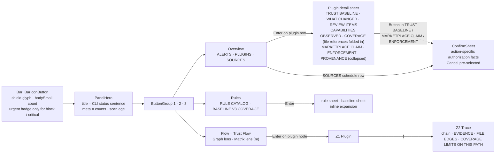

# OmaSafe plugin UI/UX overhaul — design deliverable

This folder is the complete design proposal for overhauling the OmaSafe Omarchy plugin (`io.github.tuthan.omasafe`, bar widget + review panel) so that it reads as a first-party Omarchy Quattro panel and gains an interactive trust graph, without weakening any of the product's fail-closed security rules. It is a proposal: nothing here is implemented, and nothing has been run in the live shell. This README is the index and executive summary; the seven numbered documents carry the research, principles, screens, graph specification, roadmap, decision record and verification ledger (with later errata and closure notes taking precedence over historical text).

## Contents

1. [What this folder is](#what-this-folder-is)
2. [The ask](#the-ask)
3. [Ground rules every document obeys](#ground-rules-every-document-obeys)
4. [Design thesis](#design-thesis)
5. [The decision](#the-decision)
6. [The result at a glance](#the-result-at-a-glance)
7. [Documents](#documents)
8. [How to read](#how-to-read)
9. [Status and versions](#status-and-versions)
10. [Sources and references](#sources-and-references)

## What this folder is

Eight Markdown files under `docs/design/`, written 2026-09-02 from a scouting brief, six research reports (UX audit, visual-kit audit, data model, QML feasibility, external UX research, Quattro ethos), three competing design drafts judged by three independent reviewers, and a binding decision record. The decision record is committed as [06](06-decision-record.md) because 01–04 cite its graft ids (`G<n>`) and conflict resolutions (`R<n>`) as normative anchors; [07](07-verification-findings.md) records the adversarial review and its post-finalization closure pass. The brief, drafts and research reports stay in the session scratchpad. Every kit component, token, signal, glyph codepoint, CLI command, JSON field, enum value and `Panel.qml` line number named in these documents was re-verified against the installed files (`/usr/share/omarchy/shell`, `omasafe-cli 0.2.1` output, the plugin source at the commit this folder was added). No HTML, no images; wireframes are 52-column ASCII and flows are Mermaid.

## The ask

From the brief (plugin maintainer, acting as product owner):

> "as a senior graphic designer, research, review and propose a UI/UX overhaul for this plugin. Make it modern and beautiful in the spirit of Omarchy Quattro. Also I want a nice, beautiful, interactive, easy-to-understand graph about what plugins the user has installed, what permissions/actions they can do, what findings or risks they bring, and a way to trace/find/understand the related rules or rulesets we cover. No artifact; document it in files in the project."

The graph the ask describes is `Plugin → capability class → review item → rule → Baseline V3 external rule`, sourced from `plugins inventory`, `plugins analyze`, `rules list` and `rules coverage`.

## Ground rules every document obeys

These are security-posture decisions from the brief, not taste. A proposal that breaks one is wrong regardless of how it looks.

- **GR1** No safety judgment of its own: no score, grade, verdict or "safe" badge. The bar badge is count and state only.
- **GR2** Marketplace verification is a claim attributed to the catalog snapshot (`registry_claim.verification_status`), never an OmaSafe verdict and never the same thing as a local trust baseline. Every verification claim is prefixed "Catalog says:" — the prefix applies to `registry_claim.verification_status` values only (`Catalog says: verified` / `unverified` / `not stated`); the CLI's correlation `status` (`listed`, `conflict`, `installed-differs`, `unlisted`, `incomplete`) renders as its `model/Labels.js` sentence without the prefix, and never as a bare enum word. The single rule and both label sets live in [02 §3.4](02-design-principles.md); every other document references it.
- **GR3** Missing, failed or stale data renders `unavailable`; unknown enum values render `unsupported`. Nothing ever defaults to clean or allowed (`decision: null` is "No decision has been recorded", never "allowed").
- **GR4** Review items (CLI `findings[]`) are evidence; `confidence` is evidence quality (`ast-backed` = parser-backed, `lexical-fallback` = text match only, `null` = no parser). `coverage_limitations` is always shown when non-empty; `parser == null` means lexical-only analysis and gets a persistent notice.
- **GR5** Argv-only CLI calls with 2 MiB output caps and 15/30/60 s timeouts; the panel lives inside a long-running shell, so rendering is cheap and nothing animates or polls while closed.
- **GR6** Every security-state mutation in scope is authorized against the exact thing it can change, and the CLI checks that authorization atomically before writing. Record/replace and enable bind plugin id + required current `content_digest` plus `head`/`tree` when present (null git fields remain visibly `unavailable`); remove binds plugin id + the recorded baseline digest being revoked; review update binds plugin id + catalog-claimed target commit and shows the current installed identity as context; schedule install binds the unit names + exact effective scan argv/policy (there is no plugin identity). Cancel is pre-selected, the button is the bare verb, and no key sequence bypasses the sheet. The current 0.2.1 CLI lacks the required expected-identity options for Enable and Remove, so those controls remain unavailable until a CLI release that provides them is both implemented and selected by `cliVersionMin`. Manual catalog refresh is an evidence-data fetch, not one of these authorization decisions; P5 defines its separate gate.

## Design thesis

The panel is a read-out, not a dashboard. It opens with one sentence in the CLI's own vocabulary that states what the last scan left outstanding (`No outstanding alerts`, `3 alerts to review`, `omasafe-cli not found`) — the user's question "am I okay" is the one the panel deliberately does not answer (GR1) — follows with the short list of what changed, and puts exactly one non-destructive next step on each row; everything else is evidence, disclosed one level at a time. It is built from the Quattro kit and nothing else (`PanelHero`, `ButtonGroup`, `PanelSectionHeader`, `PanelSeparator`, `CursorSurface`, `Button`, `PanelActionButton`, `ToggleSwitch`, `TextField`, `PanelToolTip`) so the theme, the text-size knob and the compositor own its look and it passes as the tailscale panel's sibling. Colour carries interaction state only: meaning travels in words, glyph shape and weight through three dim steps mixed toward the theme background (`dimStep`, [02 §2.3](02-design-principles.md)), and the hard-coded `#e5a50a` is deleted from all three files. `Color.urgent` is restricted to actual critical/error alerts, enforcement blocks, CLI failures, the active destructive confirmation, and the bar badge; multiple independent critical/block rows may retain their semantic emphasis. The graph, named **Trust Flow**, is the panel's own navigation model made visible: four fixed layers `PLUGINS → CAPABILITIES → RULES → BASELINE V3` drawn as the same `CursorSurface` rows the other views use, joined by Bézier edges in one `Shape`, inside the 420-unit popup. Nothing on any screen can be read as a grade, because no element exists whose only job is to look good or bad.

## The decision

Three directions were drafted and scored by three judges (end user, security designer, QML engineer): **A** "Evidence first, calm surface", **B** "Graph first", **C** "Keyboard-first, dense, terminal spirit". All three judges ranked A > B > C (80/79/67.5, 85/78/65, 82/76/66). A is the base: its shell, three-view information architecture (Overview / Flow / Rules), copy system and honesty machinery (one `NoticeRow` reason enum, `model/Labels.js` as the single closed-enum map, three authority sections `TRUST BASELINE` (no right value), `MARKETPLACE CLAIM | CATALOG <commit7> · <age>`, `ENFORCEMENT | EVALUATED / NOT EVALUATED / NO DECISION` — a recorded decision carries no advisory/hardened mode, [03 §5.4](03-ui-overhaul-proposal.md)) ship as drafted. Two graft families are merged into it. From B, the graph: Baseline V3 drawn as the fourth layer, dashed edges for text-match-only evidence, the Matrix lens (plugins × capability classes), the verified Nerd Font glyph table with ASCII fallback, no-bypass invariants written as code and acceptance checks, and an optional wide `panel`-kind window under B's IPC contract. From C, the keyboard mechanics: a global `/` finder over plugins, classes, rules and Baseline ids, a per-view depth stack with breadcrumb, `PanelKeyCatcher.blocked`-mode confirm wiring, analysis only on `a`/`A` (never on view open), ineligible verbs kept visible with the unmet condition named, and the `Panel.qml` range → fate table as the refactor checklist. Rejected from all drafts: a combined identity block, opacity or urgent-alpha severity ramps, `󰄬` as a trust-state glyph, five top-level views, letter accelerators for mutations, auto-analyze, a `Canvas` fallback (no first-party file instantiates one), and a second collector instance by default. Trust Flow lives inside the popup as its primary and complete home; the window is Phase 5, optional, never a dependency.

## The result at a glance

Depth is popped with `h` (in a vertical section), `-`, the back `PanelActionButton` or the breadcrumb; Esc closes the panel except when a sheet is open (cancel) or the finder is focused (clear). Data arrival never changes view, depth or cursor. The one product disclaimer sits at the foot of Overview: "OmaSafe reports changes and coverage limits. It does not declare plugins safe."

## Documents

| File | Contents | Size |
|---|---|---|
| [01-research-and-audit.md](01-research-and-audit.md) | Current IA map; audit findings with verified `Panel.qml` anchors (855 forced tab jump, 2421 non-modal scrim, 2923 undeduplicated capabilities, 3376 "complete" on missing data, 1310–2258 dead legacy component); kit-gap and token-misuse tables (`#e5a50a` ×3, 83 `Util.alpha`, 110 `caption`, 68 `AutoText`); the 14 Quattro ethos principles condensed; 12 adopted external patterns; data model (Mermaid erDiagram, field dictionary, real cardinalities); feasibility verdict and surface options. | 500–900 lines |
| [02-design-principles.md](02-design-principles.md) | 12 principles with review tests; the visual system (type roles, spacing, root colour block, semantic encodings, glyph table with codepoints, motion set, density, 9/12/16/20 scaling); the copy system (closed vocabulary, every status string, enum labels, tooltips, the confirmation template and its six variants); the review checklist with blocker items. | 700–900 lines |
| [03-ui-overhaul-proposal.md](03-ui-overhaul-proposal.md) | Bar states; panel shell; 52-column wireframes for Overview (attention drawn; quiet described in prose as a delta from it; unavailable / loading / error drawn), the plugin detail sheet (WHAT CHANGED is schematic — the fixture has no `changed` plugin), Rules, SOURCES, finder, breadcrumb, `NoticeRow` catalogue and the `ConfirmSheet` (two variants drawn — record, review update; remove, replace, enable and schedule tabulated with title, identity block, effect/caveat and destructive chrome — intentionally not drawn); states matrix; Mermaid task flows; keyboard map and cursor sections; accessibility. Flow appears only as its frame; its body is in 04. | 1400–1600 lines |
| [04-trust-graph-spec.md](04-trust-graph-spec.md) | Trust Flow: the four-layer model with evidence as the Z2 Trace zoom, Matrix lens, Baseline V3 coverage table, JS view-model shapes with worked examples (`lgse.sandman`, `io.github.tuthan.omasafe`), `graph/FlowLayout.js` algorithm and sizing math, verdict-free encodings, interactions, states, seven wireframes (Z0 default pair, Z0 slid to RULES | BASELINE V3, Z1, Z2 Trace, Matrix, Baseline V3 coverage table, Z0 with zero analyses) plus the remaining states as one-paragraph deltas, QML sketch (`EdgeLayer`, `FlowNode`, `TrustFlow`, `InspectorStrip`), text-only fallback, performance budget, acceptance checklist. | 1200–1400 lines |
| [05-implementation-roadmap.md](05-implementation-roadmap.md) | Phases 0–5 (correctness and contract gates → kit and tokens → IA → Trust Flow → polish → optional window) with files, components, CLI calls, risks, mitigations and acceptance checks; the `Panel.qml` range → fate table; component inventory and file split (`components/`, `views/`, `graph/`, `model/`); manifest changes conditional on Phase 5; validation commands; what never changes. | 700–900 lines |
| [06-decision-record.md](06-decision-record.md) | The binding decision record behind 01–05: verdict and judges' evidence (§0–1); grafts G1–G27 with source draft and landing file (§2); final IA, navigation, Trust Flow concept, visual system, copy vocabulary, keyboard map, component inventory, roadmap (§3–10); conflict resolutions R1–R24 (§11); the consistency contract every document obeys — view, section-header, state and colour names, spacing and motion sets, real-data numbers, verified line anchors (§12); the document plan (§13); and an errata table (§14) listing every point on which 01–05, after verification against source, supersede the record. Resolve any `G<n>` or `R<n>` citation in 01–04 here; where §14 lists a correction, the deliverable it names is binding. | 500–700 lines |
| [07-verification-findings.md](07-verification-findings.md) | Adversarial review record: 165 issues from two rounds and six lenses, fixer and consistency notes, and the open items left when the run was stopped during the round-2 consistency pass. Section 8 is the current-status ledger, including the implementation-readiness findings PF-08 – PF-10. |

The executable expansion of [05](05-implementation-roadmap.md) lives beside this folder in
[`docs/implementation/`](../implementation/README.md): one file per phase, each phase broken into numbered tasks with
the code sites they touch, their commit order and their per-task verification. This folder stays the authority on what
the panel shows and why; that folder is the authority on what to type, in what order, and when a task is done.

## How to read

Recommended order: this README → [02](02-design-principles.md) → [03](03-ui-overhaul-proposal.md) → [04](04-trust-graph-spec.md) → [05](05-implementation-roadmap.md) → [01](01-research-and-audit.md). Principles first so the wireframes read as consequences rather than choices; the research last, as the evidence trail for anyone who wants to challenge a decision.

- Implementing: [`docs/implementation/phase-0-correctness.md`](../implementation/phase-0-correctness.md) first, with [05](05-implementation-roadmap.md) §3 open beside it. Phase 0 closes the correctness and contract prerequisites and is pixel-identical except for explicitly listed truth/coverage strings; it does not claim to close visual or later-phase findings. Then use [03](03-ui-overhaul-proposal.md) and [04](04-trust-graph-spec.md) for the target and [02 §copy](02-design-principles.md) for every string.
- Reviewing honesty (GR1–GR4): [02](02-design-principles.md) encodings and copy tables, then the states matrix and `NoticeRow` catalogue in [03](03-ui-overhaul-proposal.md), then the "nothing encodes a verdict" rule in [04](04-trust-graph-spec.md).
- Reviewing the confirmation path (GR6): the `ConfirmSheet` wireframes and no-bypass invariants in [03](03-ui-overhaul-proposal.md), the Phase 0/1 acceptance checks in [05](05-implementation-roadmap.md).
- Checking a claim against the current code: [01](01-research-and-audit.md) carries every line anchor; all documents cite `Panel.qml:<n>`, `BW:<n>` (BarWidget.qml), `Icon:<n>` (OmaSafeStatusIcon.qml) and `Ui/<File>.qml:<n>` for the kit.
- Resolving a `G<n>` (graft) or `R<n>` (conflict resolution) citation in 01–04: [06 §2](06-decision-record.md) and [06 §11](06-decision-record.md); the names, numbers and anchors every document must share are [06 §12](06-decision-record.md).

## Status and versions

| Item | Value |
|---|---|
| Status | Proposal. Unimplemented. Runtime-unverified on a live Hyprland surface: probe QML is `qmllint`-clean and the `EdgeLayer` bucket pattern instantiates under `qml -platform offscreen` (Qt 6.11.2, exit 0); `Shape.CurveRenderer` under fractional scaling is the Phase 3 smoke test, with a text-only Matrix + Trace fallback if it fails. |
| Date | 2026-09-02 |
| Plugin | `io.github.tuthan.omasafe` 0.2.1 (`manifest.json`; current `cliVersionMin` default 0.2.1); the redesigned Enable/Remove mutation surface must raise that minimum to the first CLI release implementing the expected-identity contracts in GR6; `Panel.qml` 5174 lines, `BarWidget.qml` 541, `OmaSafeStatusIcon.qml` 51 |
| CLI | omasafe-cli 0.2.1 (rule catalog v7, 45 rules, 17 capability classes; Baseline V3 map version 2, `verified_at_commit` 964dc08) |
| Host | Omarchy 4.0.2 Quattro (`pacman -Q omarchy` → 4.0.2-1), Quickshell 0.3.1, Qt 6.11.2, JetBrainsMonoNerdFont |
| Real data used in the worked examples; verified against `cli-samples/` | 15 inventory rows = 8 live (6 Git checkouts, 2 installed without git) + 7 backup copies; 4 analyzed; 10 review items, all `low`, all `oma.qml.dynamic-reference`; 3 outstanding alerts, all `provenance-conflict`; marketplace snapshot 65b6385, `pinned-fetch`, 935 s old; schedule not installed; no overrides; every enforcement `decision: null` |

## Sources and references

Committed with this folder:

- Decision record (binding names, grafts G1–G27, conflict resolutions R1–R24, consistency contract): [06-decision-record.md](06-decision-record.md) — §0–§13 are the session's `.../scratchpad/decision-record.md` unchanged (so its line references still resolve); §14 is the errata table added at review

Working files from the design session (scratchpad, not committed):

- Brief: `/tmp/claude-1000/-home-hvo-Projects-omasafe-plugin/5147ee75-1bd3-428a-bf49-cffcc0cb46ab/scratchpad/brief.md`
- Design drafts: `.../scratchpad/designs/{A-evidence-first,B-graph-first,C-keyboard-dense}.md`
- Research: `.../scratchpad/research/{ux-audit,visual-kit-audit,data-model,qml-feasibility,ux-research,quattro-ethos}.md`
- Full CLI samples (2026-09-02, omasafe-cli 0.2.1): `.../scratchpad/cli-samples/` — `SUMMARY.md`, `inventory.json`, `scan.json`, `rules-list.json`, `rules-coverage.json`, `explain-process-execution.json`, `analyze-*.json`, `status-*.json`, `enforcement-*.json`, `schedule-status.json`, `override-list.json`. Their sanitized, review-relevant facts are committed in [`fixtures/verified-summary.json`](fixtures/verified-summary.json); it is the reproducible source for worked counts, while the full raw capture remains session-local.
- Mechanical document check: `bash docs/design/verify-docs.sh` validates fixture JSON, Markdown H1/fence structure, local links and heading anchors, stale cross-file phrases, and plain-fence wireframe width.

Repository and host files read for this README:

- `/home/hvo/Projects/omasafe-plugin/{manifest.json,Panel.qml,BarWidget.qml,OmaSafeStatusIcon.qml}`; `docs/cli-v0.2-plan.md`, `docs/cli-v0.2.1-plan.md`
- `/usr/share/omarchy/shell/Commons/{Style,Color,Util,Border}.qml`; `/usr/share/omarchy/shell/Ui/` (32 exported `qs.Ui` components, including `Button.qml:44 iconSpinning`, `PanelKeyCatcher.qml:36 blocked`, `ConfirmDialog.qml:23 handleKey`, `BorderOverlay.qml:51 PathSvg`); `/usr/share/omarchy/shell/shell.qml:426 isBarWidgetPanelPlugin`
- `/home/hvo/Projects/omasafe/crates` (`omasafe-report/src/{analysis,enforcement}.rs`, `omasafe-marketplace`, `omasafe-cli`) for the data contracts
- `omasafe-cli` usage line and `omasafe-cli/src/main.rs:141, 181` (subcommands `plugins inventory|status|diff|analyze|trust|review|enable|review-update|enforcement-status|override list`, `scan --include-analysis`, `marketplace refresh`, `rules list|coverage|explain`, `schedule install|status`). The current panel invokes six mutating commands: `plugins trust <id> --yes --note "trusted from OmaSafe panel" [--expected-head H] [--expected-tree T] [--expected-digest D]` (`Panel.qml:571–574`), `plugins review <id> --action untrust --reason "untrusted from OmaSafe panel" --yes` (593–597), `schedule install --policy <advisory|hardened>` (910), `plugins enable <id> --policy <advisory|hardened> --format json` (1260–1263), `plugins review-update <id> --expected-commit <sha> --policy <advisory|hardened> --yes` (1291–1295) and `marketplace refresh --latest` (3927, the only one without a confirmation today). In 0.2.1, Enable accepts no expected identity and the untrust path ignores the review parser's expected fields; both are implementation blockers under GR6, not approved target argv. [01 §2.4](01-research-and-audit.md) tabulates the current and target contracts and [05 §10](05-implementation-roadmap.md) owns the full argv matrix, process ids and timeouts; `pacman -Q omarchy quickshell qt6-base`
