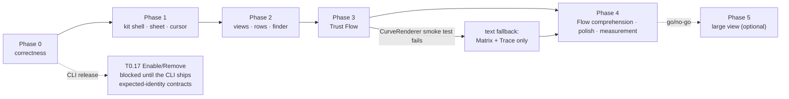

# OmaSafe plugin — implementation plan

This folder turns the design in [`docs/design/`](../design/README.md) into an ordered, executable plan: one file per
phase, each phase broken into numbered tasks with the files they touch, the code shape they replace, the change to
make, and the check that proves it landed. The design documents remain the authority on *what* the panel shows and
*why*; these documents are the authority on *what to type, in what order, and when a task is done*.

Nothing here is implemented. Every line anchor, property name, argv and count below was read from the working tree at
commit `de594d4` (`Panel.qml` 5174 lines, `BarWidget.qml` 541, `OmaSafeStatusIcon.qml` 51) against `omasafe-cli 0.2.1`,
Omarchy 4.0.2 Quattro, Quickshell 0.3.1, Qt 6.11.2.

## Contents

1. [Phase files](#1-phase-files)
2. [Sequencing](#2-sequencing)
3. [Conventions](#3-conventions)
4. [What never changes](#4-what-never-changes)
5. [Validation run in every phase](#5-validation-run-in-every-phase)
6. [Commits, versions, changelog](#6-commits-versions-changelog)
7. [Traceability](#7-traceability)
8. [Decisions that block tasks](#8-decisions-that-block-tasks)
9. [Sources](#9-sources)

## 1 Phase files

| Phase | File | Ships | Effort | Gate before starting |
|---|---|---|---|---|
| 0 | [phase-0-correctness.md](phase-0-correctness.md) | correctness and authorization fixes inside today's four-tab UI; ≈ 950 lines of dead code deleted | S · 2–3 d | none — start here |
| 1 | [phase-1-shell-and-confirmation.md](phase-1-shell-and-confirmation.md) | shell chrome from the kit: bar icon, hero, view chips, tokens, `ConfirmSheet`, cursor scaffold | M · 2–3 d | Phase 0 merged |
| 2 | [phase-2-information-architecture.md](phase-2-information-architecture.md) | four tabs → two views (Overview, Rules) + plugin detail sheet, finder, breadcrumb; every kit row written once | M · 5–6 d | Phase 1 merged; open decision 8 answered |
| 3 | [phase-3-trust-flow.md](phase-3-trust-flow.md) | Trust Flow: graph lens, Matrix, Trace, analysis queue, Flow chip | L · 8–12 d | Phase 2 merged; day-1 render smoke test |
| 4 | [phase-4-polish.md](phase-4-polish.md) | live Flow correctness, comprehension, tooltips, theme pass, residency measurement, screenshots, README | M · 4–6 d | Phase 3 merged (or its text fallback); live screenshot + journal interval captured |
| 5 | [phase-5-large-view.md](phase-5-large-view.md) | optional `panel`-kind `TrustFlowWindow.qml` with all four layers open | L · 5–8 d | explicit go/no-go after Phase 4 |

Phases 0–4 are the product; Phase 5 is optional and changes the plugin's IPC route, so it needs its own sign-off.
Every phase ships on its own, passes section 5, and leaves the panel usable.

## 2 Sequencing



Within a phase, the task table names each task's blockers. Two ordering rules hold across all phases:

- **Delete before refactor.** Phase 0 deletes the never-instantiated legacy block (T0.1) before touching confirmation
  state (T0.4), because that block contains a second copy of the confirmation UI bound to the same five booleans.
- **Convert rows once.** Phase 1 deliberately leaves the four tab bodies alone; Phase 2 deletes them and rebuilds their
  content on kit rows. Converting them in Phase 1 and deleting them in Phase 2 writes every row twice.

## 3 Conventions

- **Task ids.** `T<phase>.<n>`. Phase 0 ids match the roadmap's item numbers 1:1 (`T0.7` is roadmap item 0.7), so
  `05 §3` and this folder can be read side by side. `T0.0` and `T0.18` are additions; both say so in place.
- **Anchors.** `Panel.qml:2421`, `BW:532` (`BarWidget.qml`), `Icon:9` (`OmaSafeStatusIcon.qml`), `Ui/<File>.qml:<n>`
  (the installed kit at `/usr/share/omarchy/shell`). Bare numbers inside a task are `Panel.qml` lines at `de594d4`.
  Anchors move as soon as the first task lands: work top-down inside a phase, and re-`grep` rather than trusting a
  number after an edit.
- **"Today" blocks** quote the working tree verbatim. **"Change"** blocks are the target; QML in them is specified, not
  compiled, except where a task says otherwise.
- **Spec** names the design section that owns the decision. If a task and its spec disagree, the spec wins and the task
  is wrong — fix it here and note it in [`07-verification-findings.md`](../design/07-verification-findings.md) §8.
- **Effort** is one QML-fluent engineer, full time, with the fixtures of `05 §11.2` in place.
- **Done** means: the change is in, the task's own Verify step passes, and the phase's section 5 command block still
  exits 0. A task that cannot be verified is not done.

## 4 What never changes

The full list is [`05 §1.1`](../design/05-implementation-roadmap.md). A reviewer rejects any phase that touches:
argv-only invocation through `cliCommand()` and the `/usr/bin/false` gate until `cliVerified`; the bounded-process
pattern (`SplitParser`, 2 MiB cap, 15/30/60 s timeouts, SIGTERM → 3 s → SIGKILL, first-terminal latches, generation
guards); the schema checks and fail-closed enum gates; confirmation semantics; marketplace attribution; analysis
honesty and the analysis cache *key*; the count-only badge; and the 15 `Process` blocks, which move only when a phase
says so and then verbatim.

Two clarifications this plan leans on:

- The analysis cache **key** (`content_digest` + `tool_version` + `policy_identity`, 1099–1136) is invariant. Its
  **clearing policy** is not, and T0.16 changes it.
- Mutation **argv** changes only to carry action-specific expected values (`05 §10`), and only when the CLI implements
  them.

## 5 Validation run in every phase

```sh
cd /home/hvo/Projects/omasafe-plugin
bash docs/design/verify-docs.sh
omarchy plugin validate .
qmllint -I /usr/share/omarchy/shell -I /usr/lib/qt6/qml \
  BarWidget.qml Panel.qml OmaSafeShield.qml components/*.qml views/*.qml graph/*.qml   # exit 0
grep -rnE '#[0-9a-fA-F]{6}' --include='*.qml' --include='*.js' .                        # empty from Phase 1
grep -rn 'font.pixelSize:' --include='*.qml' . | grep -v 'Style.font\.'                  # empty from Phase 1
grep -rn 'Color.muted' --include='*.qml' .                                               # empty from Phase 1
grep -rn 'containsMouse' components/ views/ graph/                                       # empty (cursor contract)
grep -rnE 'layer.enabled|MultiEffect|Particles|Canvas' --include='*.qml' .               # empty
grep -rnE 'duration: [0-9]+' --include='*.qml' . | grep -vE 'duration: (60|120|140|900)\b'  # empty from Phase 4
```

The first three lines exit 0 against `de594d4` (the `qmllint` line with only the three existing files; the sub-directory
globs match nothing until Phase 1 creates them, so add each directory as it appears). No phase may regress them.

Fixtures: [`fixtures/verified-summary.json`](../design/fixtures/verified-summary.json) carries the worked counts every
acceptance check quotes; [`fixtures/contract-cases.json`](../design/fixtures/contract-cases.json) carries the synthetic
cases (lexical and mixed evidence, multiple blocks, stale catalog data, missing limitations, hostile text, unknown
enums, stale mutation authorization). View-model and layout tests read these files directly. The optional replay shim
for full-shell manual testing is specified in `05 §11.2`; it lives outside the repo and is removed after each pass.

## 6 Commits, versions, changelog

- **Commits.** Each phase file carries a commit plan. One commit per task where a task is self-contained; one commit for
  a group where the group is only coherent together (the Phase 0 confirmation cluster is the main example). Every commit
  leaves `qmllint` and `omarchy plugin validate .` at exit 0.
- **Versions.** `manifest.json` `version` → `0.3.0` when Phase 2 ships (the four-tab IA is gone); `0.4.0` if Phase 5 is
  taken (the `kinds` change alters the IPC route). `cliVersionMin` rises from `0.2.1` to the first CLI release
  implementing the `05 §10` target contracts, and only when that release exists — no version is guessed.
- **Changelog.** The repository has none. `CHANGELOG.md` is added with the Phase 0 fixes under "Fixed" (tab jump,
  non-modal confirmation, Esc during confirmation, ungated `r`, `Coverage: complete`, undeduplicated capabilities,
  unrendered trust result, unrendered inventory coverage limits, `rules explain` JSON, drifting authorization facts)
  and Phases 1–4 under "Changed".

## 7 Traceability

| Roadmap item (`05 §3`–`§8`) | Task | Audit finding (`01 §3`) |
|---|---|---|
| 0.1 – 0.17 | T0.1 – T0.17, same numbers | A1–A4, A6–A10, A13, A17, A21, A39 |
| — (added here) | T0.0 baseline capture | — |
| — (added here) | T0.18 pinned authorization facts | A2 · GR6 · `03 §10` invariant 8 |
| `05 §4`–`§5` Phases 1–2 | T1.1 – T1.9, T2.1 – T2.14 | the remaining High items — A5, A11, A12, A14–A16, A18–A20, A42 — plus A40 (`visible: !vertical`, T1.2/T1.7). `05 §3` names these as landing "in Phases 1–2" without splitting them, so treat the phase column here as the earliest phase that can close each, not a contract |
| `05 §6` Phase 3 (3a / 3b) | T3.1 – T3.7 / T3.8 – T3.13 | the ask's graph requirement |
| `05 §7` Phase 4 + post-Phase 3 live review | T4.0 – T4.7 | A41 (keys exist but only one tooltip hints at them); live delegate failure and Flow comprehension gap |
| `05 §8` Phase 5 | T5.1 – T5.6 | — |

`G<n>` (graft) and `R<n>` (conflict resolution) citations in the design documents resolve in
[`06-decision-record.md`](../design/06-decision-record.md) §2 and §11; where §14 of that file lists a correction, the
deliverable it names is binding.

## 8 Decisions that block tasks

From `05 §13`, with the task each one gates:

| # | Open point | Blocks | Default if unanswered |
|---|---|---|---|
| 1 | Does `Backspace` reach `PanelKeyCatcher.textKey` as `event.text === "\b"`? | T2.12 | bind only `h` / `-` / the back button |
| 2 | `Shape.CurveRenderer` under fractional scaling | T3.1 → all of 3a | text-only Matrix + Trace (T3.1 decides on day 1) |
| 4 | Accept a 16th bounded `Process` (`rulesListProcess`)? | T2.9 | ask the owner before writing the collector; 39 of 45 rules are unnamed without it |
| 5 | Is the `󰦖` node plus `Queued (n ahead)` enough `A`-sweep feedback? | T3.11 | ship without a hero progress fragment; revisit in Phase 4 |
| 6 | Phase 5 go/no-go | all of Phase 5 | do not build it |
| 7 | May the shell be relaunched with `QSG_RENDER_TIMING=1`? | T3.13 | check the budget by eye at 1.25 scale and record it as such |
| 8 | Move the 15 `Process` blocks verbatim into `Collectors.qml`? | T2.1 | leave them in `Panel.qml` (≈ 2900–3100 lines after Phase 2) |
| 9 | Screen-reader support | none — explicitly out of scope | claim nothing before an assistive-technology test passes |

Decision 3 (the `dimStep` ladder) is resolved in `02 §2.3` and lands in T1.3.

## 9 Sources

- Design deliverables: [`docs/design/README.md`](../design/README.md) and files 01–07 there. `05` is the summary
  roadmap these files expand; it stays the citable index because 01–04, 06 and 07 reference its sections.
- Working tree at `de594d4`: `Panel.qml`, `BarWidget.qml`, `OmaSafeStatusIcon.qml`, `manifest.json`, `README.md`,
  `docs/cli-v0.2-plan.md` (acceptance list 229–246), `docs/cli-v0.2.1-plan.md`.
- Installed kit: `/usr/share/omarchy/shell` (`Ui/`, `Commons/`, `shell.qml`, `plugins/`); Qt 6.11.2 QML modules at
  `/usr/lib/qt6/qml`.
